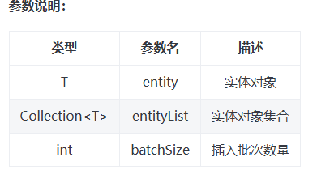
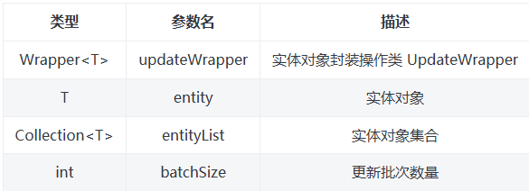

> 点击勘误[issues](https://github.com/webVueBlog/JavaPlusDoc/issues)，哪吒感谢大家的阅读


## 持久层接口

Service Interface

IService 是 MyBatis-Plus 提供的一个通用 Service 层接口，它封装了常见的 CRUD 操作，包括插入、删除、查询和分页等。通过继承 IService 接口，可以快速实现对数据库的基本操作，同时保持代码的简洁性和可维护性。

IService 接口中的方法命名遵循了一定的规范，如 get 用于查询单行，remove 用于删除，list 用于查询集合，page 用于分页查询，这样可以避免与 Mapper 层的方法混淆。

```
save
// 插入一条记录（选择字段，策略插入）
boolean save(T entity);
// 插入（批量）
boolean saveBatch(Collection<T> entityList);
// 插入（批量）
boolean saveBatch(Collection<T> entityList, int batchSize);
```

1. 功能描述： 插入记录，根据实体对象的字段进行策略性插入。
2. 返回值： boolean，表示插入操作是否成功。



```
示例（save）：

// 假设有一个 User 实体对象
User user = new User();
user.setName("John Doe");
user.setEmail("john.doe@example.com");
boolean result = userService.save(user); // 调用 save 方法
if (result) {
    System.out.println("User saved successfully.");
} else {
    System.out.println("Failed to save user.");
}
```

```
生成的 SQL:

INSERT INTO user (name, email) VALUES ('xx Doe', 'xx.doe@example.com')
```

```
示例（saveBatch）：

// 假设有一组 User 实体对象
List<User> users = Arrays.asList(
    new User("Alice", "alice@example.com"),
    new User("Bob", "bob@example.com"),
    new User("Charlie", "charlie@example.com")
);
// 使用默认批次大小进行批量插入
boolean result = userService.saveBatch(users); // 调用 saveBatch 方法，默认批次大小
if (result) {
    System.out.println("Users saved successfully.");
} else {
    System.out.println("Failed to save users.");
}
```

```
示例（saveBatch 指定批次大小）：

// 假设有一组 User 实体对象
List<User> users = Arrays.asList(
    new User("David", "david@example.com"),
    new User("Eve", "eve@example.com"),
    new User("Frank", "frank@example.com"),
    new User("Grace", "grace@example.com")
);
// 指定批次大小为 2进行批量插入
boolean result = userService.saveBatch(users, 2); // 调用 saveBatch 方法，指定批次大小
if (result) {
    System.out.println("Users saved successfully.");
} else {
    System.out.println("Failed to save users.");
}
```

```
saveOrUpdate
// TableId 注解属性值存在则更新记录，否插入一条记录
boolean saveOrUpdate(T entity);
// 根据updateWrapper尝试更新，否继续执行saveOrUpdate(T)方法
boolean saveOrUpdate(T entity, Wrapper<T> updateWrapper);
// 批量修改插入
boolean saveOrUpdateBatch(Collection<T> entityList);
// 批量修改插入
boolean saveOrUpdateBatch(Collection<T> entityList, int batchSize);
```


```
示例（saveOrUpdate）：

// 假设有一个 User 实体对象，其中 id 是 TableId 注解的属性
User user = new User();
user.setId(1);
user.setName("John Doe");
user.setEmail("john.doe@example.com");
boolean result = userService.saveOrUpdate(user); // 调用 saveOrUpdate 方法
if (result) {
    System.out.println("User updated or saved successfully.");
} else {
    System.out.println("Failed to update or save user.");
}
```

```
示例（saveOrUpdateBatch）：

// 假设有一组 User 实体对象，每个对象都有 id 属性
List<User> users = Arrays.asList(
    new User(1, "Alice", "alice@example.com"),
    new User(2, "Bob", "bob@example.com"),
    new User(3, "Charlie", "charlie@example.com")
);
// 使用默认批次大小进行批量修改插入
boolean result = userService.saveOrUpdateBatch(users); // 调用 saveOrUpdateBatch 方法，默认批次大小
if (result) {
    System.out.println("Users updated or saved successfully.");
} else {
    System.out.println("Failed to update or save users.");
}
```

```
示例（saveOrUpdateBatch 指定批次大小）：

// 假设有一组 User 实体对象
List<User> users = Arrays.asList(
    new User(4, "David", "david@example.com"),
    new User(5, "Eve", "eve@example.com"),
    new User(6, "Frank", "frank@example.com")
);
// 指定批次大小为 2进行批量修改插入
boolean result = userService.saveOrUpdateBatch(users, 2); // 调用 saveOrUpdateBatch 方法，指定批次大小
if (result) {
    System.out.println("Users updated or saved successfully.");
} else {
    System.out.println("Failed to update or save users.");
}
```

```
remove
// 根据 queryWrapper 设置的条件，删除记录
boolean remove(Wrapper<T> queryWrapper);
// 根据 ID 删除
boolean removeById(Serializable id);
// 根据 columnMap 条件，删除记录
boolean removeByMap(Map<String, Object> columnMap);
// 删除（根据ID 批量删除）
boolean removeByIds(Collection<? extends Serializable> idList);
```


```
示例（remove）：

// 假设有一个 QueryWrapper 对象，设置删除条件为 name = 'John Doe'
QueryWrapper<User> queryWrapper = new QueryWrapper<>();
queryWrapper.eq("name", "John Doe");
boolean result = userService.remove(queryWrapper); // 调用 remove 方法
if (result) {
    System.out.println("Record deleted successfully.");
} else {
    System.out.println("Failed to delete record.");
}
```

```
示例（removeById）：

// 假设要删除 ID 为 1 的用户
boolean result = userService.removeById(1); // 调用 removeById 方法
if (result) {
    System.out.println("User deleted successfully.");
} else {
    System.out.println("Failed to delete user.");
}
```

```
// 假设有一个 columnMap，设置删除条件为 age = 30
Map<String, Object> columnMap = new HashMap<>();
columnMap.put("age", 30);
boolean result = userService.removeByMap(columnMap); // 调用 removeByMap 方法
if (result) {
    System.out.println("Records deleted successfully.");
} else {
    System.out.println("Failed to delete records.");
}
```

```
// 假设有一组 ID 列表，批量删除用户
List<Integer> ids = Arrays.asList(1, 2, 3);
boolean result = userService.removeByIds(ids); // 调用 removeByIds 方法
if (result) {
    System.out.println("Users deleted successfully.");
} else {
    System.out.println("Failed to delete users.");
}
```

## update

```
// 根据 UpdateWrapper 条件，更新记录 需要设置sqlset
boolean update(Wrapper<T> updateWrapper);
// 根据 whereWrapper 条件，更新记录
boolean update(T updateEntity, Wrapper<T> whereWrapper);
// 根据 ID 选择修改
boolean updateById(T entity);
// 根据ID 批量更新
boolean updateBatchById(Collection<T> entityList);
// 根据ID 批量更新
boolean updateBatchById(Collection<T> entityList, int batchSize);
```

1. 功能描述： 通过指定条件更新符合条件的记录。
2. 返回值： boolean，表示更新操作是否成功。

参数说明：



```
// 假设有一个 UpdateWrapper 对象，设置更新条件为 name = 'John Doe'，更新字段为 email
UpdateWrapper<User> updateWrapper = new UpdateWrapper<>();
updateWrapper.eq("name", "John Doe").set("email", "john.doe@newdomain.com");
boolean result = userService.update(updateWrapper); // 调用 update 方法
if (result) {
    System.out.println("Record updated successfully.");
} else {
    System.out.println("Failed to update record.");
}
```

生成的 SQL:


```
UPDATE user SET email = 'john.doe@newdomain.com' WHERE name = 'John Doe'

```


```
// 假设有一个 User 实体对象，设置更新字段为 name，以及一个 whereWrapper 设置更新条件为 id = 1
User updateEntity = new User();
updateEntity.setName("Updated Name");
QueryWrapper<User> whereWrapper = new QueryWrapper<>();
whereWrapper.eq("id", 1);
boolean result = userService.update(updateEntity, whereWrapper); // 调用 update 方法
if (result) {
    System.out.println("Record updated successfully.");
} else {
    System.out.println("Failed to update record.");
}
```

生成的 SQL:

```
UPDATE user SET name = 'Updated Name' WHERE id = 1

```


```
// 假设有一组 User 实体对象，批量更新
List<User> users = Arrays.asList(
    new User(1, null, "new.email1@example.com"),
    new User(2, null, "new.email2@example.com")
);
boolean result = userService.updateBatchById(users); // 调用 updateBatchById 方法，默认批次大小
if (result) {
    System.out.println("Records updated successfully.");
} else {
    System.out.println("Failed to update records.");
}
```

生成的 SQL（假设默认批次大小为 2）:

```
UPDATE user SET email = 'new.email1@example.com' WHERE id = 1
UPDATE user SET email = 'new.email2@example.com' WHERE id = 2
```

示例（updateBatchById 指定批次大小）：

```
// 假设有一组 User 实体对象，批量更新，并指定批次大小为 1
List<User> users = Arrays.asList(
    new User(1, null, "new.email1@example.com"),
    new User(2, null, "new.email2@example.com")
);
boolean result = userService.updateBatchById(users, 1); // 调用 updateBatchById 方法，指定批次大小
if (result) {
    System.out.println("Records updated successfully.");
} else {
    System.out.println("Failed to update records.");
}
```

生成的 SQL（假设指定批次大小为 1）:

```
-- 第一批次
UPDATE user SET email = 'new.email1@example.com' WHERE id = 1
-- 第二批次
UPDATE user SET email = 'new.email2@example.com' WHERE id = 2
```

## get

```
// 根据 ID 查询
T getById(Serializable id);
// 根据 Wrapper，查询一条记录。结果集，如果是多个会抛出异常，随机取一条加上限制条件 wrapper.last("LIMIT 1")
T getOne(Wrapper<T> queryWrapper);
// 根据 Wrapper，查询一条记录
T getOne(Wrapper<T> queryWrapper, boolean throwEx);
// 根据 Wrapper，查询一条记录
Map<String, Object> getMap(Wrapper<T> queryWrapper);
// 根据 Wrapper，查询一条记录
<V> V getObj(Wrapper<T> queryWrapper, Function<? super Object, V> mapper);
```

示例（getById）：

```
// 假设要查询 ID 为 1 的用户
User user = userService.getById(1); // 调用 getById 方法
if (user != null) {
    System.out.println("User found: " + user);
} else {
    System.out.println("User not found.");
}
```

生成的 SQL:

```
SELECT * FROM user WHERE id = 1
```

示例（getOne）：

```
// 假设有一个 QueryWrapper 对象，设置查询条件为 name = 'John Doe'
QueryWrapper<User> queryWrapper = new QueryWrapper<>();
queryWrapper.eq("name", "John Doe");
User user = userService.getOne(queryWrapper); // 调用 getOne 方法
if (user != null) {
    System.out.println("User found: " + user);
} else {
    System.out.println("User not found.");
}
```

生成的 SQL:

```
SELECT * FROM user WHERE name = 'John Doe'

```

示例（getOne 不抛出异常）：

```
// 假设有一个 QueryWrapper 对象，设置查询条件为 name = 'John Doe'，并且不抛出异常
QueryWrapper<User> queryWrapper = new QueryWrapper<>();
queryWrapper.eq("name", "John Doe");
User user = userService.getOne(queryWrapper, false); // 调用 getOne 方法
if (user != null) {
    System.out.println("User found: " + user);
} else {
    System.out.println("User not found.");
}
```

生成的 SQL:

```
SELECT * FROM user WHERE name = 'John Doe'

```

```
// 假设有一个 QueryWrapper 对象，设置查询条件为 name = 'John Doe'，并将结果映射为 Map
QueryWrapper<User> queryWrapper = new QueryWrapper<>();
queryWrapper.eq("name", "John Doe");
Map<String, Object> userMap = userService.getMap(queryWrapper); // 调用 getMap 方法
if (userMap != null) {
    System.out.println("User found: " + userMap);
} else {
    System.out.println("User not found.");
}
```

生成的 SQL:

```
SELECT * FROM user WHERE name = 'John Doe'

```

示例（getObj）：

```
// 假设有一个 QueryWrapper 对象，设置查询条件为 name = 'John Doe'，并将结果转换为 String
QueryWrapper<User> queryWrapper = new QueryWrapper<>();
queryWrapper.eq("name", "John Doe");
String userName = userService.getObj(queryWrapper, obj -> ((User) obj).getName()); // 调用 getObj 方法
if (userName != null) {
    System.out.println("User name found: " + userName);
} else {
    System.out.println("User name not found.");
}
```

## list

```
// 查询所有
List<T> list();
// 查询列表
List<T> list(Wrapper<T> queryWrapper);
// 查询（根据ID 批量查询）
Collection<T> listByIds(Collection<? extends Serializable> idList);
// 查询（根据 columnMap 条件）
Collection<T> listByMap(Map<String, Object> columnMap);
// 查询所有列表
List<Map<String, Object>> listMaps();
// 查询列表
List<Map<String, Object>> listMaps(Wrapper<T> queryWrapper);
// 查询全部记录
List<Object> listObjs();
// 查询全部记录
<V> List<V> listObjs(Function<? super Object, V> mapper);
// 根据 Wrapper 条件，查询全部记录
List<Object> listObjs(Wrapper<T> queryWrapper);
// 根据 Wrapper 条件，查询全部记录
<V> List<V> listObjs(Wrapper<T> queryWrapper, Function<? super Object, V> mapper);
```

示例（list）：

```
// 查询所有用户
List<User> users = userService.list(); // 调用 list 方法
for (User user : users) {
    System.out.println("User: " + user);
}
```

生成的 SQL:

```
SELECT * FROM user
```

示例（list QueryWrapper 形式）：

```
// 假设有一个 QueryWrapper 对象，设置查询条件为 age > 25
QueryWrapper<User> queryWrapper = new QueryWrapper<>();
queryWrapper.gt("age", 25);
List<User> users = userService.list(queryWrapper); // 调用 list 方法
for (User user : users) {
    System.out.println("User: " + user);
}
```

生成的 SQL:

```
SELECT * FROM user WHERE age > 25

```

示例（listByIds）：

```
// 假设有一组 ID 列表，批量查询用户
List<Integer> ids = Arrays.asList(1, 2, 3);
Collection<User> users = userService.listByIds(ids); // 调用 listByIds 方法
for (User user : users) {
    System.out.println("User: " + user);
}
```

生成的 SQL:

```
SELECT * FROM user WHERE id IN (1, 2, 3)

```

示例（listByMap）：

```
// 假设有一个 columnMap，设置查询条件为 age = 30
Map<String, Object> columnMap = new HashMap<>();
columnMap.put("age", 30);
Collection<User> users = userService.listByMap(columnMap); // 调用 listByMap 方法
for (User user : users) {
    System.out.println("User: " + user);
}
```

生成的 SQL:

```
SELECT * FROM user WHERE age = 30

```

```
// 查询所有用户，并将结果映射为 Map
List<Map<String, Object>> userMaps = userService.listMaps(); // 调用 listMaps 方法
for (Map<String, Object> userMap : userMaps) {
    System.out.println("User Map: " + userMap);
}
```

```
// 假设有一个 QueryWrapper 对象，设置查询条件为 age > 25，并将结果映射为 Map
QueryWrapper<User> queryWrapper = new QueryWrapper<>();
queryWrapper.gt("age", 25);
List<Map<String, Object>> userMaps = userService.listMaps(queryWrapper); // 调用 listMaps 方法
for (Map<String, Object> userMap : userMaps) {
    System.out.println("User Map: " + userMap);
}
```

```
// 查询所有用户，并将结果转换为 String 列表
List<String> userNames = userService.listObjs(obj -> ((User) obj).getName()); // 调用 listObjs 方法
for (String userName : userNames) {
    System.out.println("User Name: " + userName);
}
```


```
生成的 SQL:

SELECT * FROM user
```


```
示例（listObjs QueryWrapper 形式）：

// 假设有一个 QueryWrapper 对象，设置查询条件为 age > 25，并将结果转换为 String 列表
QueryWrapper<User> queryWrapper = new QueryWrapper<>();
queryWrapper.gt("age", 25);
List<String> userNames = userService.listObjs(queryWrapper, obj -> ((User) obj).getName()); // 调用 listObjs 方法
for (String userName : userNames) {
    System.out.println("User Name: " + userName);
}
```

## page

```
// 无条件分页查询
IPage<T> page(IPage<T> page);
// 条件分页查询
IPage<T> page(IPage<T> page, Wrapper<T> queryWrapper);
// 无条件分页查询
IPage<Map<String, Object>> pageMaps(IPage<T> page);
// 条件分页查询
IPage<Map<String, Object>> pageMaps(IPage<T> page, Wrapper<T> queryWrapper);
```

示例（page）：

```
// 假设要进行无条件的分页查询，每页显示10条记录，查询第1页
IPage<User> page = new Page<>(1, 10);
IPage<User> userPage = userService.page(page); // 调用 page 方法
List<User> userList = userPage.getRecords();
long total = userPage.getTotal();
System.out.println("Total users: " + total);
for (User user : userList) {
    System.out.println("User: " + user);
}
```

示例（page QueryWrapper 形式）：

```
// 假设有一个 QueryWrapper 对象，设置查询条件为 age > 25，进行有条件的分页查询
IPage<User> page = new Page<>(1, 10);
QueryWrapper<User> queryWrapper = new QueryWrapper<>();
queryWrapper.gt("age", 25);
IPage<User> userPage = userService.page(page, queryWrapper); // 调用 page 方法
List<User> userList = userPage.getRecords();
long total = userPage.getTotal();
System.out.println("Total users (age > 25): " + total);
for (User user : userList) {
    System.out.println("User: " + user);
}
```

生成的 SQL:

```
SELECT * FROM user WHERE age > 25 LIMIT 10 OFFSET 0
```

示例（pageMaps）：

```
// 假设要进行无条件的分页查询，并将结果映射为 Map，每页显示10条记录，查询第1页
IPage<Map<String, Object>> page = new Page<>(1, 10);
IPage<Map<String, Object>> userPageMaps = userService.pageMaps(page); // 调用 pageMaps 方法
List<Map<String, Object>> userMapList = userPageMaps.getRecords();
long total = userPageMaps.getTotal();
System.out.println("Total users: " + total);
for (Map<String, Object> userMap : userMapList) {
    System.out.println("User Map: " + userMap);
}
```
生成的 SQL:


```
SELECT * FROM user LIMIT 10 OFFSET 0

```
示例（pageMaps QueryWrapper 形式）：

```
// 假设有一个 QueryWrapper 对象，设置查询条件为 age > 25，进行有条件的分页查询，并将结果映射为 Map
IPage<Map<String, Object>> page = new Page<>(1, 10);
QueryWrapper<User> queryWrapper = new QueryWrapper<>();
queryWrapper.gt("age", 25);
IPage<Map<String, Object>> userPageMaps = userService.pageMaps(page, queryWrapper); // 调用 pageMaps 方法
List<Map<String, Object>> userMapList = userPageMaps.getRecords();
long total = userPageMaps.getTotal();
System.out.println("Total users (age > 25): " + total);
for (Map<String, Object> userMap : userMapList) {
    System.out.println("User Map: " + userMap);
}
```

## count

```
// 查询总记录数
int count();
// 根据 Wrapper 条件，查询总记录数
int count(Wrapper<T> queryWrapper);

//自3.4.3.2开始,返回值修改为long
// 查询总记录数
long count();
// 根据 Wrapper 条件，查询总记录数
long count(Wrapper<T> queryWrapper);
```
示例（count）：
```
// 查询用户表中的总记录数
int totalUsers = userService.count(); // 调用 count 方法
System.out.println("Total users: " + totalUsers);
```

示例（count QueryWrapper 形式）：

```
// 假设有一个 QueryWrapper 对象，设置查询条件为 age > 25，查询满足条件的用户总数
QueryWrapper<User> queryWrapper = new QueryWrapper<>();
queryWrapper.gt("age", 25);
int totalUsers = userService.count(queryWrapper); // 调用 count 方法
System.out.println("Total users (age > 25): " + totalUsers);
```

## Mapper Interface

BaseMapper 是 Mybatis-Plus 提供的一个通用 Mapper 接口，它封装了一系列常用的数据库操作方法，包括增、删、改、查等。通过继承 BaseMapper，开发者可以快速地对数据库进行操作，而无需编写繁琐的 SQL 语句。

## insert
```
// 插入一条记录
int insert(T entity);
```
示例（insert）：
```
User user = new User();
user.setName("John Doe");
user.setEmail("john.doe@example.com");
int rows = userMapper.insert(user); // 调用 insert 方法
if (rows > 0) {
    System.out.println("User inserted successfully.");
} else {
    System.out.println("Failed to insert user.");
}
```
## delete
```
// 根据 entity 条件，删除记录
int delete(@Param(Constants.WRAPPER) Wrapper<T> wrapper);
// 删除（根据ID 批量删除）
int deleteBatchIds(@Param(Constants.COLLECTION) Collection<? extends Serializable> idList);
// 根据 ID 删除
int deleteById(Serializable id);
// 根据 columnMap 条件，删除记录
int deleteByMap(@Param(Constants.COLUMN_MAP) Map<String, Object> columnMap);
```
示例（delete）：
```
// 假设有一个 QueryWrapper 对象，设置查询条件为 age > 25，删除满足条件的用户
QueryWrapper<User> queryWrapper = new QueryWrapper<>();
queryWrapper.gt("age", 25);
int rows = userMapper.delete(queryWrapper); // 调用 delete 方法
if (rows > 0) {
    System.out.println("Users deleted successfully.");
} else {
    System.out.println("No users deleted.");
}
```
示例（deleteBatchIds）：
```
// 假设有一组 ID 列表，批量删除用户
List<Integer> ids = Arrays.asList(1, 2, 3);
int rows = userMapper.deleteBatchIds(ids); // 调用 deleteBatchIds 方法
if (rows > 0) {
    System.out.println("Users deleted successfully.");
} else {
    System.out.println("No users deleted.");
}
```
示例（deleteById）：
```
// 根据 ID 删除单个用户
int userId = 1;
int rows = userMapper.deleteById(userId); // 调用 deleteById 方法
if (rows > 0) {
    System.out.println("User deleted successfully.");
} else {
    System.out.println("No user deleted.");
}
```
示例（deleteByMap）：
```
// 假设有一个 columnMap，设置查询条件为 age = 30，删除满足条件的用户
Map<String, Object> columnMap = new HashMap<>();
columnMap.put("age", 30);
int rows = userMapper.deleteByMap(columnMap); // 调用 deleteByMap 方法
if (rows > 0) {
    System.out.println("Users deleted successfully.");
} else {
    System.out.println("No users deleted.");
}
```
## update
```
// 根据 whereWrapper 条件，更新记录
int update(@Param(Constants.ENTITY) T updateEntity, @Param(Constants.WRAPPER) Wrapper<T> whereWrapper);
// 根据 ID 修改
int updateById(@Param(Constants.ENTITY) T entity);
```
## 示例（update）：
```
// 假设有一个 UpdateWrapper 对象，设置查询条件为 age > 25，更新满足条件的用户的邮箱
UpdateWrapper<User> updateWrapper = new UpdateWrapper<>();
updateWrapper.gt("age", 25);
User updateUser = new User();
updateUser.setEmail("new.email@example.com");
int rows = userMapper.update(updateUser, updateWrapper); // 调用 update 方法
if (rows > 0) {
    System.out.println("Users updated successfully.");
} else {
    System.out.println("No users updated.");
}
```
## 示例（updateById）：
```
// 假设要更新 ID 为 1 的用户的邮箱
User updateUser = new User();
updateUser.setId(1);
updateUser.setEmail("new.email@example.com");
int rows = userMapper.updateById(updateUser); // 调用 updateById 方法
if (rows > 0) {
    System.out.println("User updated successfully.");
} else {
    System.out.println("No user updated.");
}
```
## select
```
// 根据 ID 查询
T selectById(Serializable id);
// 根据 entity 条件，查询一条记录
T selectOne(@Param(Constants.WRAPPER) Wrapper<T> queryWrapper);

// 查询（根据ID 批量查询）
List<T> selectBatchIds(@Param(Constants.COLLECTION) Collection<? extends Serializable> idList);
// 根据 entity 条件，查询全部记录
List<T> selectList(@Param(Constants.WRAPPER) Wrapper<T> queryWrapper);
// 查询（根据 columnMap 条件）
List<T> selectByMap(@Param(Constants.COLUMN_MAP) Map<String, Object> columnMap);
// 根据 Wrapper 条件，查询全部记录
List<Map<String, Object>> selectMaps(@Param(Constants.WRAPPER) Wrapper<T> queryWrapper);
// 根据 Wrapper 条件，查询全部记录。注意： 只返回第一个字段的值
List<Object> selectObjs(@Param(Constants.WRAPPER) Wrapper<T> queryWrapper);

// 根据 entity 条件，查询全部记录（并翻页）
IPage<T> selectPage(IPage<T> page, @Param(Constants.WRAPPER) Wrapper<T> queryWrapper);
// 根据 Wrapper 条件，查询全部记录（并翻页）
IPage<Map<String, Object>> selectMapsPage(IPage<T> page, @Param(Constants.WRAPPER) Wrapper<T> queryWrapper);
// 根据 Wrapper 条件，查询总记录数
Integer selectCount(@Param(Constants.WRAPPER) Wrapper<T> queryWrapper);
```
示例（selectById）：
```
// 根据 ID 查询单个用户
int userId = 1;
User user = userMapper.selectById(userId); // 调用 selectById 方法
System.out.println("User: " + user);
```
生成的 SQL:
```
SELECT * FROM user WHERE id = 1
```
示例（selectOne）：
```
// 假设有一个 QueryWrapper 对象，设置查询条件为 age > 25，查询一条满足条件的用户
QueryWrapper<User> queryWrapper = new QueryWrapper<>();
queryWrapper.gt("age", 25);
User user = userMapper.selectOne(queryWrapper); // 调用 selectOne 方法
System.out.println("User: " + user);
```
生成的 SQL:
```
SELECT * FROM user WHERE age > 25
```
示例（selectBatchIds）：

```
// 假设有一组 ID 列表，批量查询用户
List<Integer> ids = Arrays.asList(1, 2, 3);
List<User> users = userMapper.selectBatchIds(ids); // 调用 selectBatchIds 方法
for (User u : users) {
    System.out.println("User: " + u);
}
```
示例（selectList）：
```
// 假设有一个 QueryWrapper 对象，设置查询条件为 age > 25，查询所有满足条件的用户
QueryWrapper<User> queryWrapper = new QueryWrapper<>();
queryWrapper.gt("age", 25);
List<User> users = userMapper.selectList(queryWrapper); // 调用 selectList 方法
for (User u : users) {
    System.out.println("User: " + u);
}
```
示例（selectByMap）：
```
// 假设有一个 columnMap，设置查询条件为 age > 30，查询满足条件的用户
Map<String, Object> columnMap = new HashMap<>();
columnMap.put("age", 30);
List<User> users = userMapper.selectByMap(columnMap); // 调用 selectByMap 方法
for (User u : users) {
    System.out.println("User: " + u);
}
```
示例（selectMaps）：
```
// 假设有一个 QueryWrapper 对象，设置查询条件为 age > 25，查询所有满足条件的用户，并将结果映射为 Map
QueryWrapper<User> queryWrapper = new QueryWrapper<>();
queryWrapper.gt("age", 25);
List<Map<String, Object>> userMaps = userMapper.selectMaps(queryWrapper); // 调用 selectMaps 方法
for (Map<String, Object> userMap : userMaps) {
    System.out.println("User Map: " + userMap);
}
```
示例（selectObjs）：
```
// 假设有一个 QueryWrapper 对象，设置查询条件为 age > 25，查询所有满足条件的用户，但只返回每个记录的第一个字段的值
QueryWrapper<User> queryWrapper = new QueryWrapper<>();
queryWrapper.gt("age", 25);
List<Object> userIds = userMapper.selectObjs(queryWrapper); // 调用 selectObjs 方法
for (Object userId : userIds) {
    System.out.println("User ID: " + userId);
}
```
示例（selectPage）：
```
// 假设要进行分页查询，每页显示10条记录，查询第1页，查询条件为 age > 25
IPage<User> page = new Page<>(1, 10);
QueryWrapper<User> queryWrapper = new QueryWrapper<>();
queryWrapper.gt("age", 25);
IPage<User> userPage = userMapper.selectPage(page, queryWrapper); // 调用 selectPage 方法
List<User> userList = userPage.getRecords();
long total = userPage.getTotal();
System.out.println("Total users (age > 25): " + total);
for (User user : userList) {
    System.out.println("User: " + user);
}
```
示例（selectMapsPage）：
```
// 假设要进行分页查询，每页显示10条记录，查询第1页，查询条件为 age > 25，并将结果映射为 Map
IPage<Map<String, Object>> = new Page<>(1, 10);
QueryWrapper<User> queryWrapper = new QueryWrapper<>();
queryWrapper.gt("age", 25);
IPage<Map<String, Object>> userPageMaps = userMapper.selectMapsPage(page, queryWrapper); // 调用 selectMapsPage 方法
List<Map<String, Object>> userMapList = userPageMaps.getRecords();
long total = userPageMaps.getTotal();
System.out.println("Total users (age > 25): " + total);
for (Map<String, Object> userMap : userMapList) {
    System.out.println("User Map: " + userMap);
}
```
示例（selectCount）：
```
// 假设有一个 QueryWrapper 对象，设置查询条件为 age > 25，查询总记录数
QueryWrapper<User> queryWrapper = new QueryWrapper<>();
queryWrapper.gt("age", 25);
Integer totalUsers = userMapper.selectCount(queryWrapper); // 调用 selectCount 方法
System.out.println("Total users (age > 25): " + totalUsers);
```
## Mapper 层选装件

选装件是 Mybatis-Plus 提供的一些扩展方法，它们位于 com.baomidou.mybatisplus.extension.injector.methods 包下。这些方法需要配合Sql 注入器使用，以扩展 Mapper 接口的功能。

## 选装件说明

alwaysUpdateSomeColumnById

```
int alwaysUpdateSomeColumnById(T entity);
```

1. 功能：这个方法用于在更新操作时，无论实体对象的某些字段是否有变化，都会强制更新这些字段。这在某些业务场景下非常有用，比如更新时间戳字段，确保每次更新操作都会更新该字段。
2. 使用场景：当你需要在每次更新记录时，都更新某些特定的字段（如更新时间、版本号等），即使这些字段在实体对象中没有变化。

示例:

```
// 普通链式查询示例
query().eq("name", "John").list(); // 查询 name 为 "John" 的所有记录

// lambda 链式查询示例
lambdaQuery().eq(User::getAge, 30).one(); // 查询年龄为 30 的单条记录
```

## update

提供链式更新操作，可以连续调用方法来构建更新条件。

```
// 链式更改 普通
UpdateChainWrapper<T> update();
// 链式更改 lambda 式。注意：不支持 Kotlin
LambdaUpdateChainWrapper<T> lambdaUpdate();
```

```
// 普通链式更新示例
update().set("status", "inactive").eq("name", "John").update(); // 将 name 为 "John" 的记录 status 更新为 "inactive"

// lambda 链式更新示例
User updateUser = new User();
updateUser.setEmail("new.email@example.com");
lambdaUpdate().set(User::getEmail, updateUser.getEmail()).eq(User::getId, 1).update(); // 更新 ID 为 1 的用户的邮箱
```

## ActiveRecord

ActiveRecord 模式是一种设计模式，它允许实体类直接与数据库进行交互，实体类既是领域模型又是数据访问对象。在 Mybatis-Plus 中，实体类只需继承 Model 类即可获得强大的 CRUD 操作能力。

```
import com.baomidou.mybatisplus.extension.activerecord.Model;

public class User extends Model<User> {
    // 实体类的字段定义...
    private Long id;
    private String name;
    private Integer age;
    // ... 其他字段和 getter/setter 方法
}
```

```
// 创建新用户并插入数据库
User user = new User();
user.setName("John Doe");
user.setAge(30);
boolean isInserted = user.insert(); // 返回值表示操作是否成功

// 查询所有用户
List<User> allUsers = user.selectAll();

// 根据 ID 更新用户信息
user.setId(1L);
user.setName("Updated Name");
boolean isUpdated = user.updateById(); // 返回值表示操作是否成功

// 根据 ID 删除用户
boolean isDeleted = user.deleteById(); // 返回值表示操作是否成功
```

```
// 假设有一个 User 实体类和对应的 BaseMapper
LambdaQueryWrapper<User> queryWrapper = new LambdaQueryWrapper<>();
queryWrapper.eq(User::getStatus, "active"); // 查询状态为 "active" 的用户

// 使用 map 方法查询并封装结果
Map<String, Integer> userMap = SimpleQuery.map(
    queryWrapper, // 查询条件构造器
    User::getUsername, // 使用用户名作为键
    User::getAge, // 使用年龄作为值
    user -> System.out.println("Processing user: " + user.getUsername()) // 打印处理的用户名
);

// 遍历结果
for (Map.Entry<String, Integer> entry : userMap.entrySet()) {
    System.out.println("Username: " + entry.getKey() + ", Age: " + entry.getValue());
}
```
使用提示

1. map 方法适用于需要根据实体的某个属性快速查找另一个属性的场景。
2. 通过 keyFunc 和 valueFunc 参数，你可以指定任何实体属性作为 Map 的键和值，这使得查询结果的访问更加直观和高效。
3. peeks 参数允许你在处理查询结果时执行额外的副作用操作，这些操作不会影响最终的 Map 结果。
4. 当处理大量数据时，可以考虑将 isParallel 参数设置为 true 以启用并行流，从而提高查询效率。

## group

SimpleQuery 的 group 方法提供了一种便捷的方式来查询数据库，并将查询结果按照实体的某个属性进行分组，封装成一个 Map。这个方法还支持在处理查询结果时执行额外的副作用操作，如打印日志或更新缓存。此外，它还允许你使用 Collector 对分组后的集合进行进一步的处理。

方法签名

```
// 查询表内记录，封装返回为 Map<属性,List<实体>>
Map<K, List<T>> group(LambdaQueryWrapper<T> wrapper, SFunction<T, K> sFunction, Consumer<T>... peeks);

// 查询表内记录，封装返回为 Map<属性,List<实体>>，考虑了并行流的情况
Map<K, List<T>> group(LambdaQueryWrapper<T> wrapper, SFunction<T, K> sFunction, boolean isParallel, Consumer<T>... peeks);

// 查询表内记录，封装返回为 Map<属性,分组后对集合进行的下游收集器>
M group(LambdaQueryWrapper<T> wrapper, SFunction<T, K> sFunction, Collector<? super T, A, D> downstream, Consumer<T>... peeks);

// 查询表内记录，封装返回为 Map<属性,分组后对集合进行的下游收集器>，考虑了并行流的情况
M group(LambdaQueryWrapper<T> wrapper, SFunction<T, K> sFunction, Collector<? super T, A, D> downstream, boolean isParallel, Consumer<T>... peeks);
```

```
// 假设有一个 User 实体类和对应的 BaseMapper
LambdaQueryWrapper<User> queryWrapper = new LambdaQueryWrapper<>();
queryWrapper.eq(User::getStatus, "active"); // 查询状态为 "active" 的用户

// 使用 group 方法查询并封装结果，按照用户名分组
Map<String, List<User>> userGroup = SimpleQuery.group(
    queryWrapper, // 查询条件构造器
    User::getUsername, // 使用用户名作为分组键
    user -> System.out.println("Processing user: " + user.getUsername()) // 打印处理的用户名
);

// 遍历结果
for (Map.Entry<String, List<User>> entry : userGroup.entrySet()) {
    System.out.println("Username: " + entry.getKey());
    for (User user : entry.getValue()) {
        System.out.println(" - User: " + user);
    }
}
```
