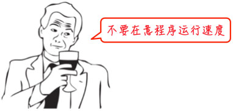
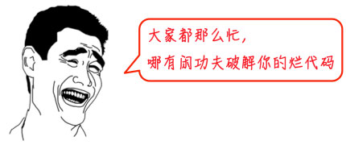

# 第1天-Python历史

## Python的诞生故事

Python是著名的"龟叔"Guido van Rossum在1989年圣诞节期间，为了打发无聊的圣诞节而编写的一个编程语言。

> **小白注解**：Guido van Rossum被称为"龟叔"，是因为他喜欢英国喜剧团体Monty Python，而不是因为Python这个名字来源于蟒蛇。

## Python vs C语言的区别

C语言是可以用来编写操作系统的贴近硬件的语言，所以，C语言适合开发那些追求运行速度、充分发挥硬件性能的程序。而Python是用来编写应用程序的高级编程语言。

> **通俗理解**：
> - C语言就像手动挡汽车，你需要自己控制每个细节，速度快但操作复杂
> - Python就像自动挡汽车，操作简单，虽然速度稍慢但足够日常使用

## Python的"内置电池"特性

Python为我们提供了非常完善的基础代码库，覆盖了网络、文件、GUI、数据库、文本等大量内容，被形象地称作"内置电池（batteries included）"。用Python开发，许多功能不必从零编写，直接使用现成的即可。

> **小白示例**：想要下载网页内容？Python内置的urllib库就能做到，不需要自己写复杂的网络代码。

## 丰富的第三方库生态

除了内置的库外，Python还有大量的第三方库，也就是别人开发的，供你直接使用的东西。当然，如果你开发的代码通过很好的封装，也可以作为第三方库给别人使用。

> **扩展知识**：
> - **PyPI**（Python Package Index）是Python的官方第三方库仓库
> - 截至2024年，PyPI上有超过50万个项目
> - 常用的第三方库：requests（网络请求）、pandas（数据分析）、numpy（科学计算）

## Python的应用领域

许多大型网站就是用Python开发的：

> **知名案例**：
> - **YouTube** - 世界最大的视频分享网站
> - **Instagram** - 知名图片社交平台
> - **Dropbox** - 云存储服务
> - **Reddit** - 知名社区论坛
> - **Netflix** - 流媒体巨头（推荐算法）
> - **Spotify** - 音乐流媒体（数据分析）

> **应用领域总结**：
> - 🌐 **Web开发**：Django、Flask框架
> - 📊 **数据科学**：pandas、numpy、matplotlib
> - 🤖 **人工智能**：TensorFlow、PyTorch
> - 🔬 **科学计算**：SciPy、SymPy
> - 🎮 **游戏开发**：Pygame
> - 📱 **移动开发**：Kivy、BeeWare
> - 🔧 **自动化脚本**：系统管理、测试自动化

## Python的缺点分析

### 缺点一：运行速度相对较慢

第一个缺点就是运行速度慢，和C程序相比非常慢，因为Python是解释型语言，你的代码在执行时会一行一行地翻译成CPU能理解的机器码，这个翻译过程非常耗时，所以很慢。而C程序是运行前直接编译成CPU能执行的机器码，所以非常快。

> **小白理解**：
> - **解释型语言**：像同声传译，边读边翻译执行
> - **编译型语言**：像提前翻译好的书，直接阅读

但是大量的应用程序不需要这么快的运行速度，因为用户根本感觉不出来。例如开发一个下载MP3的网络应用程序，C程序的运行时间需要0.001秒，而Python程序的运行时间需要0.1秒，慢了100倍，但由于网络更慢，需要等待1秒，你想，用户能感觉到1.001秒和1.1秒的区别吗？

> **生动比喻**：这就好比F1赛车和普通出租车在北京三环路上行驶，虽然F1赛车理论时速高达400公里，但由于三环路堵车的时速只有20公里，因此，作为乘客，你感觉的时速永远是20公里。

> **性能优化方案**：
> - 使用**PyPy**解释器（比CPython快2-10倍）
> - 使用**Cython**编写性能关键部分
> - 使用**NumPy**进行数值计算
> - 合理使用**多线程/多进程**

### 缺点二：源代码无法完全加密

第二个缺点就是代码不能加密。如果要发布你的Python程序，实际上就是发布源代码，这一点跟C语言不同，C语言不用发布源代码，只需要把编译后的机器码（也就是你在Windows上常见的xxx.exe文件）发布出去。要从机器码反推出C代码是不可能的，所以，凡是编译型的语言，都没有这个问题，而解释型的语言，则必须把源码发布出去。

> **解决方案**：
> - 使用**PyInstaller**打包成exe文件
> - 使用**py2exe**或**cx_Freeze**
> - 核心算法用C/C++编写，Python调用
> - 使用**代码混淆**工具

这个缺点仅限于你要编写的软件需要卖给别人挣钱的时候。好消息是目前的互联网时代，靠卖软件授权的商业模式越来越少了，靠网站和移动应用卖服务的模式越来越多了，后一种模式不需要把源码给别人。

## 总结

> **Python适合你吗？**
> 
> ✅ **适合的场景**：
> - 初学编程（语法简单）
> - 数据分析和科学计算
> - Web开发
> - 自动化脚本
> - 人工智能和机器学习
> 
> ❌ **不太适合的场景**：
> - 对性能要求极高的系统
> - 移动应用开发（虽然可以但不是主流）
> - 系统底层开发
> - 游戏引擎开发

> **学习建议**：Python是一门非常适合初学者的语言，即使你完全没有编程基础，也能在短时间内上手。它的设计哲学是"优雅、明确、简单"，让你能专注于解决问题而不是纠结于语法细节。

