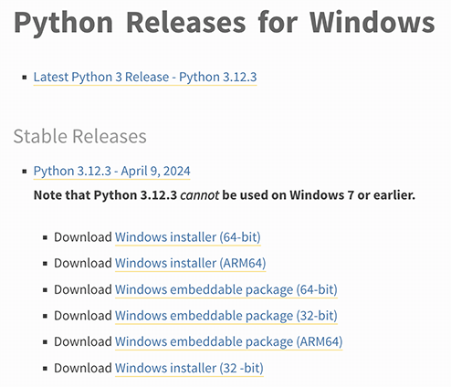

# 第2天-安装Python

## Python的跨平台特性

因为Python是跨平台的，它可以运行在Windows、Mac和各种Linux/Unix系统上。在Windows上写Python程序，放到Linux上也是能够运行的。

> **小白注解**：跨平台意味着"一次编写，到处运行"，这是Python的一大优势。你不需要为不同的操作系统重写代码。

## 安装Python能得到什么？

要开始学习Python编程，首先就得把Python安装到你的电脑里。安装后，你会得到：

> **安装包含的组件**：
> - 🐍 **Python解释器**：负责运行Python程序的核心引擎
> - 💻 **命令行交互环境**：可以直接输入Python代码并立即看到结果
> - 🛠️ **IDLE**：Python自带的简单集成开发环境
> - 📚 **标准库**：大量内置的功能模块
> - 📦 **pip**：Python包管理工具，用于安装第三方库

## Python版本选择

目前，Python有两个版本，一个是2.x版，一个是3.x版，这两个版本是不兼容的。由于3.x版越来越普及，教程将以最新的Python 3.x版本为基础。

> **版本说明**：
> - **Python 2.x**：已于2020年1月1日停止维护，不建议新项目使用
> - **Python 3.x**：当前主流版本，持续更新中
> - **推荐版本**：Python 3.8+ （支持最新特性，稳定性好）

> **小白提醒**：如果你是初学者，直接选择最新的Python 3.x版本就对了！

## 在Windows上安装Python

在Windows上安装Python，有两种方法：

### 方法一：官方安装包（推荐新手）

可以直接从Python的官方网站下载Python 3对应的Windows安装程序，推荐下载Windows installer (64-bit)，然后，运行下载的python-3.x-amd64.exe安装包：

> **下载地址**：https://www.python.org/downloads/windows/



> **⚠️ 重要提醒**：特别要注意勾上"Add Python 3.x to PATH"，这样你就可以在任何地方使用python命令了！

**安装步骤**：
1. 下载安装包
2. 双击运行安装程序
3. ✅ **务必勾选**"Add Python to PATH"
4. 点击"Install Now"
5. 等待安装完成

**验证安装**：
```bash
C:\Users\23979>python --version
Python 3.13.5
```

> **小白解释**：`python --version`命令用来查看Python版本，如果显示版本号说明安装成功！

### 方法二：包管理器安装（适合进阶用户）

先安装一个包管理器，推荐Scoop，然后在PowerShell中通过以下命令安装Python：

```powershell
# 首先安装Scoop（如果还没有的话）
Set-ExecutionPolicy RemoteSigned -Scope CurrentUser
irm get.scoop.sh | iex

# 然后安装Python
scoop install python
```

> **Scoop的优势**：
> - 自动管理PATH环境变量
> - 可以同时安装多个Python版本
> - 卸载干净，不留垃圾文件
> - 命令行操作，适合开发者

## 在macOS上安装Python

如果你正在使用Mac，那么系统自带的Python版本是2.x。要安装最新的Python 3.x，有两个方法：

### 方法一：官方安装包
从Python官网下载Python 3 macOS版的安装程序，下载后双击运行并安装。

> **下载地址**：https://www.python.org/downloads/macos/

### 方法二：Homebrew安装（推荐）
如果安装了包管理器Homebrew，直接通过命令安装：

```bash
# 安装Python 3
brew install python

# 验证安装
python3 --version
```

> **macOS注意事项**：
> - 系统自带的`python`命令指向Python 2.x
> - 新安装的Python 3使用`python3`命令
> - 建议创建别名：`alias python=python3`

## 在Linux上安装Python

大多数Linux发行版都预装了Python，但可能版本较旧。以下是常见发行版的安装方法：

### Ubuntu/Debian系统
```bash
# 更新包列表
sudo apt update

# 安装Python 3
sudo apt install python3 python3-pip

# 验证安装
python3 --version
```

### CentOS/RHEL系统
```bash
# 安装Python 3
sudo yum install python3 python3-pip
# 或者在较新版本中使用
sudo dnf install python3 python3-pip
```

### Arch Linux
```bash
# 安装Python 3
sudo pacman -S python python-pip
```

> **Linux小贴士**：如果你正在使用Linux，建议你有一定的系统管理经验。如果完全是新手，建议先从Windows开始学习Python。

## 测试Python交互环境

安装完成后，打开命令行输入`python`（Windows）或`python3`（macOS/Linux），你会看到类似这样的界面：

```python
C:\Users\23979>python
Python 3.13.5 (tags/v3.13.5:6cb20a2, Jun 11 2025, 16:15:46) [MSC v.1943 64 bit (AMD64)] on win32
Type "help", "copyright", "credits" or "license" for more information.
>>> 1+1
2
>>> print("Hello, Python!")
Hello, Python!
>>> exit()
```

> **交互环境说明**：
> - `>>>`是Python的提示符，表示等待你输入代码
> - 输入代码后按回车，立即看到结果
> - 输入`exit()`或按`Ctrl+Z`（Windows）/`Ctrl+D`（macOS/Linux）退出

## Python解释器详解

当我们编写Python代码时，我们得到的是一个包含Python代码的以.py为扩展名的文本文件。要运行代码，就需要Python解释器去执行.py文件。

> **小白理解**：解释器就像一个翻译官，把你写的Python代码翻译成计算机能理解的机器语言。

### 多种Python解释器

由于整个Python语言从规范到解释器都是开源的，所以理论上，只要水平够高，任何人都可以编写Python解释器来执行Python代码（当然难度很大）。事实上，确实存在多种Python解释器：

> **主要Python解释器**：
> 
> 🔥 **CPython**（官方，推荐）
> - 用C语言开发，最标准的实现
> - 使用最广泛，兼容性最好
> - 我们通常说的"Python"就是指CPython
> 
> ⚡ **PyPy**（高性能）
> - 用Python自己写的Python解释器
> - 执行速度比CPython快2-10倍
> - 适合计算密集型程序
> 
> ☕ **Jython**（Java平台）
> - 运行在Java虚拟机上
> - 可以调用Java类库
> - 适合Java环境集成
> 
> 🌐 **IronPython**（.NET平台）
> - 运行在.NET平台上
> - 可以调用.NET类库
> - 适合Windows/.NET环境

### CPython解释器

当我们从Python官方网站下载并安装好Python 3.x后，我们就直接获得了一个官方版本的解释器：CPython。这个解释器是用C语言开发的，所以叫CPython。在命令行下运行python就是启动CPython解释器。

CPython是使用最广的Python解释器。教程的所有代码也都在CPython下执行。

> **为什么选择CPython？**
> - ✅ 官方标准实现，最稳定可靠
> - ✅ 第三方库支持最完整
> - ✅ 文档和社区支持最好
> - ✅ 适合初学者和生产环境

## 常见问题解答

> **Q: 安装后找不到python命令怎么办？**
> 
> A: 检查是否勾选了"Add Python to PATH"。如果没有，可以：
> 1. 重新安装Python并勾选该选项
> 2. 手动添加Python安装目录到系统PATH
> 3. 使用完整路径运行：`C:\Python39\python.exe`

> **Q: python和python3命令有什么区别？**
> 
> A: 
> - **Windows**：通常都是`python`
> - **macOS/Linux**：`python`可能指向Python 2.x，`python3`指向Python 3.x
> - 建议在macOS/Linux上使用`python3`命令

> **Q: 如何同时安装多个Python版本？**
> 
> A: 
> - 使用**pyenv**（macOS/Linux）或**pyenv-win**（Windows）
> - 使用**Anaconda**管理多个环境
> - 手动安装到不同目录

## 下一步

恭喜！你已经成功安装了Python。现在你可以：
- 在命令行中使用Python交互环境
- 编写并运行你的第一个Python程序
- 开始学习Python语法

> **学习建议**：先熟悉Python交互环境，它是学习和测试代码的好工具。在交互环境中，你可以立即看到代码的执行结果，这对理解Python语法非常有帮助。


