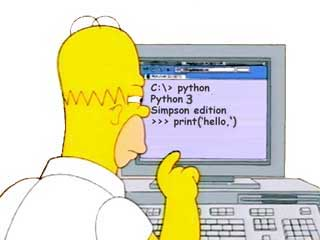

# 第3天-第一个程序

今天我们来学习如何编写和运行你的第一个Python程序！首先需要理解什么是命令行模式和Python交互模式。

## 两种重要模式的区别

> **模式对比**：
> 
> 🖥️ **命令行模式**
> - 操作系统提供的命令行界面
> - 可以运行各种系统命令
> - 提示符：`PS C:\>`（Windows）或`$`（macOS/Linux）
> 
> 🐍 **Python交互模式**
> - Python解释器提供的交互界面
> - 只能运行Python代码
> - 提示符：`>>>`

## 命令行模式详解

在Windows开始菜单选择"Terminal"，就进入到PowerShell命令行模式，它的提示符类似`PS C:\>`：

> **命令行模式的作用**：
> - 🔧 运行系统命令（如`dir`、`cd`等）
> - 🚀 启动Python解释器
> - 📁 管理文件和目录
> - 🏃 运行Python脚本文件

> **常用命令行操作**：
> ```bash
> # Windows PowerShell
> PS C:\> dir                    # 查看当前目录文件
> PS C:\> cd Desktop             # 切换到桌面目录
> PS C:\> python hello.py       # 运行Python文件
> PS C:\> python                # 启动Python交互模式
> 
> # macOS/Linux
> $ ls                          # 查看当前目录文件
> $ cd Desktop                  # 切换到桌面目录
> $ python3 hello.py           # 运行Python文件
> $ python3                    # 启动Python交互模式
> ```

## Python交互模式详解

在命令行模式下敲命令`python`，就看到类似如下的一堆文本输出，然后就进入到Python交互模式，它的提示符是`>>>`：



> **交互模式的特点**：
> - ⚡ **即时执行**：输入代码立即看到结果
> - 🧪 **测试代码**：适合测试小段代码
> - 📚 **学习工具**：初学者的最佳伙伴
> - 🔍 **调试助手**：快速验证想法

> **交互模式示例**：
> ```python
> >>> print("Hello, World!")
> Hello, World!
> >>> 2 + 3
> 5
> >>> name = "Python"
> >>> print(f"我正在学习{name}")
> 我正在学习Python
> >>> exit()  # 退出交互模式
> ```

## 编写你的第一个Python程序

### 方法一：在交互模式中编写

最简单的方式是在Python交互模式中直接输入代码：

```python
>>> print("Hello, Python!")
Hello, Python!
>>> print("这是我的第一个Python程序")
这是我的第一个Python程序
```

> **交互模式的优缺点**：
> - ✅ 立即看到结果，适合学习和测试
> - ❌ 代码无法保存，关闭后就丢失了

### 方法二：使用文本编辑器编写.py文件

更常用的方式是用文本编辑器写Python程序，然后保存为后缀为`.py`的文件：

**创建hello.py文件**：
```python
#!/usr/bin/env python3
# -*- coding: utf-8 -*-

# 这是我的第一个Python程序
print("Hello, World!")
print("欢迎来到Python的世界！")

# 简单的计算
result = 10 + 20
print(f"10 + 20 = {result}")

# 获取用户输入
name = input("请输入你的名字：")
print(f"你好，{name}！")
```

> **代码解释**：
> - `#!/usr/bin/env python3`：Shebang行，告诉系统用Python3执行
> - `# -*- coding: utf-8 -*-`：指定文件编码为UTF-8
> - `#`开头的是注释，不会被执行
> - `print()`函数用于输出内容
> - `input()`函数用于获取用户输入
> - `f"{变量}"`是格式化字符串的写法

**运行Python文件**：
```bash
# Windows
PS C:\> python hello.py

# macOS/Linux
$ python3 hello.py
```

> **运行效果**：
> ```
> Hello, World!
> 欢迎来到Python的世界！
> 10 + 20 = 30
> 请输入你的名字：张三
> 你好，张三！
> ```

### 方法三：直接运行.py文件（仅限macOS/Linux）

有同学问，能不能像.exe文件那样直接运行.py文件呢？在Windows上是不行的，但是，在Mac和Linux上是可以的，方法是在.py文件的第一行加上一个特殊的注释：

```python
#!/usr/bin/env python3

print('hello, world')
```

然后，通过命令给hello.py以执行权限：

```bash
$ chmod +x hello.py
```

就可以直接运行hello.py了，比如在Mac下运行：

```bash
$ ./hello.py
hello, world
```

> **Shebang详解**：
> - `#!/usr/bin/env python3`被称为"Shebang"或"Hashbang"
> - 它告诉系统使用哪个解释器来执行这个脚本
> - 只在Unix-like系统（macOS、Linux）中有效
> - Windows系统通过文件扩展名`.py`来识别Python文件

## 推荐的文本编辑器

> **初学者推荐**：
> 
> 🆓 **免费编辑器**：
> - **VS Code**：微软出品，功能强大，插件丰富
> - **PyCharm Community**：专业Python IDE的免费版
> - **Sublime Text**：轻量级，启动快速
> - **Notepad++**：Windows平台的轻量级编辑器
> 
> 💰 **付费编辑器**：
> - **PyCharm Professional**：最专业的Python IDE
> - **Sublime Text**：需要购买许可证
> 
> 🌐 **在线编辑器**：
> - **Replit**：在线Python环境，无需安装
> - **CodePen**：适合快速测试代码

## 交互模式 vs 脚本文件

Python的交互模式和直接运行.py文件有什么区别呢？

> **交互模式**：
> - 直接输入`python`进入交互模式
> - 相当于启动了Python解释器，等待你一行一行地输入源代码
> - 每输入一行就执行一行
> - 适合：学习、测试、调试
> 
> **脚本文件模式**：
> - 直接运行.py文件相当于启动了Python解释器
> - 然后一次性把.py文件的源代码给执行了
> - 你没有机会以交互的方式输入源代码
> - 适合：编写完整程序、自动化脚本

> **使用建议**：
> - 🧪 **学习阶段**：多使用交互模式，立即看到结果
> - 📝 **编写程序**：使用文本编辑器创建.py文件
> - 🔄 **开发流程**：在编辑器中写代码，在命令行中运行测试

## 小练习

现在试着完成这个小练习：

1. 创建一个名为`my_first_program.py`的文件
2. 在文件中写入以下内容：
   ```python
   # 我的第一个Python程序
   print("=" * 30)
   print("欢迎使用Python计算器")
   print("=" * 30)
   
   # 获取两个数字
   num1 = float(input("请输入第一个数字："))
   num2 = float(input("请输入第二个数字："))
   
   # 进行计算
   print(f"\n计算结果：")
   print(f"{num1} + {num2} = {num1 + num2}")
   print(f"{num1} - {num2} = {num1 - num2}")
   print(f"{num1} * {num2} = {num1 * num2}")
   if num2 != 0:
       print(f"{num1} / {num2} = {num1 / num2}")
   else:
       print("除数不能为0")
   ```
3. 保存文件并运行：`python my_first_program.py`

> **恭喜！** 如果程序成功运行，你已经完成了第一个有实际功能的Python程序！


