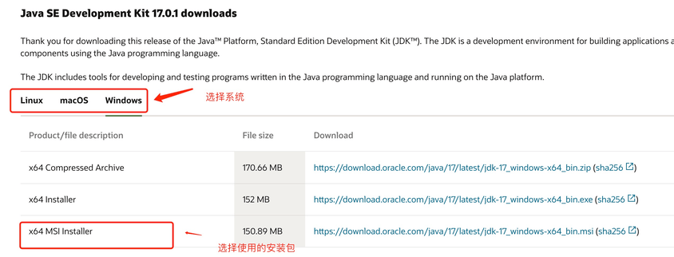
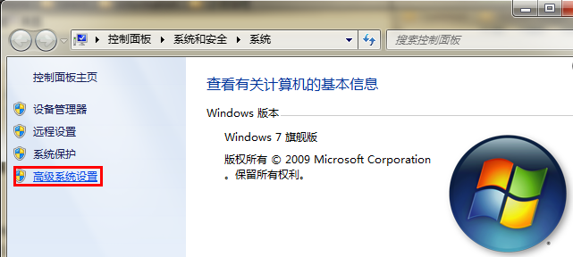
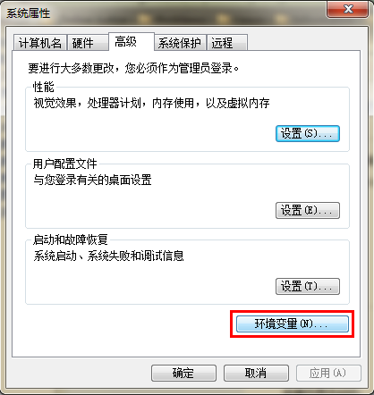
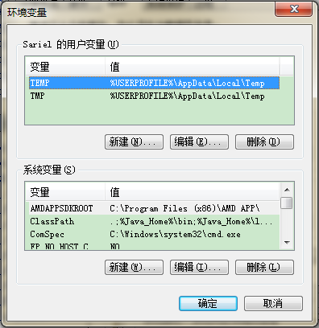
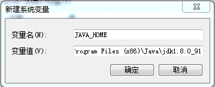
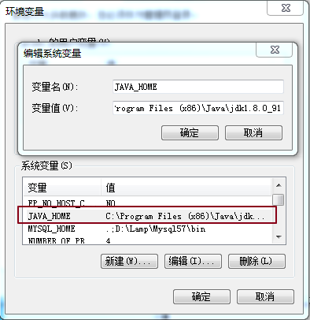
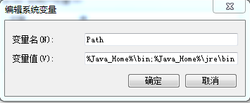
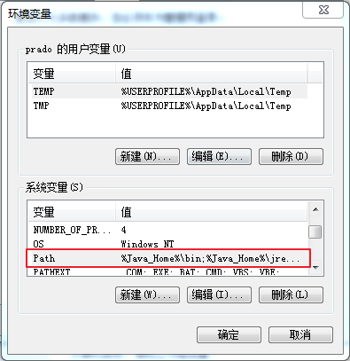
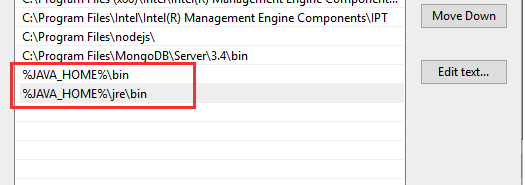
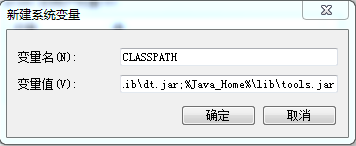

# 第1天

> 编程世界很精彩，但现实世界的你更重要

通过问答模式学会后端，继续看以下内容，过一遍，不行过几遍，直接实战。

## 1. 第一个 JAVA 程序

创建文件 HelloWorld.java(文件名需与类名一致)

```java
public class HelloWorld {
    public static void main(String[] args) {
        System.out.println("Hello World");
    }
}
```

注：String args[] 与 String[] args 都可以执行，但推荐使用 String[] args，这样可以避免歧义和误读。

运行以上实例，输出结果如下：

```java
$ javac HelloWorld.java
$ java HelloWorld
Hello World

```

### 1.1 程序分析

- `public class HelloWorld`：定义一个公共类 HelloWorld。
- `public static void main(String[] args)`：定义一个公共的静态方法 main，方法返回值为 void，方法参数为 String 数组 args。
- `System.out.println("Hello World")`：调用 System.out.println 方法，输出 Hello World。

### 1.2 程序执行

1. 打开命令行终端。
2. 导航到 HelloWorld.java 文件所在目录。
3. 执行 `javac HelloWorld.java` 命令进行编译。
4. 执行 `java HelloWorld` 命令运行程序。

### 1.3 程序输出

```java
Hello World
```

### 1.4 程序总结

- 程序通过 `public class HelloWorld` 定义了一个公共类。
- 程序通过 `public static void main(String[] args)` 定义了一个公共的静态方法 main。
- 程序通过 `System.out.println("Hello World")` 调用了 System.out.println 方法，输出了 Hello World。

## 执行命令解析

javac 后面跟着的是java文件的文件名，例如 HelloWorld.java。 该命令用于将 java 源文件编译为 class 字节码文件，如： javac HelloWorld.java。

运行javac命令后，如果成功编译没有错误的话，会出现一个 HelloWorld.class 的文件。

java 后面跟着的是java文件中的类名,例如 HelloWorld 就是类名，如: java HelloWorld。

注意：java命令后面不要加.class。

## Java 简介

Java 是由 Sun Microsystems 公司于 1995 年 5 月推出的 Java 面向对象程序设计语言和 Java 平台的总称。由 James Gosling和同事们共同研发，并在 1995 年正式推出。

后来 Sun 公司被 Oracle （甲骨文）公司收购，Java 也随之成为 Oracle 公司的产品。

Java分为三个体系：

- JavaSE（J2SE）（Java2 Platform Standard Edition，java平台标准版）
- JavaEE(J2EE)(Java 2 Platform,Enterprise Edition，java平台企业版)
- JavaME(J2ME)(Java 2 Platform Micro Edition，java平台微型版)。

2005 年 6 月，JavaOne 大会召开，SUN 公司公开 Java SE 6。此时，Java 的各种版本已经更名，以取消其中的数字 "2"：J2EE 更名为 Java EE，J2SE 更名为Java SE，J2ME 更名为 Java ME。

## 发展历史

- 1995 年 5 月 23 日，Java 语言诞生
- 1996 年 1 月，第一个 JDK-JDK1.0 诞生
- 1996 年 4 月，10 个最主要的操作系统供应商申明将在其产品中嵌入 JAVA 技术
- 1996 年 9 月，约 8.3 万个网页应用了 JAVA 技术来制作
- 1997 年 2 月 18 日，JDK1.1 发布
- 1997 年 4 月 2 日，JavaOne 会议召开，参与者逾一万人，创当时全球同类会议规模之纪录
- 1997 年 9 月，JavaDeveloperConnection 社区成员超过十万
- 1998 年 2 月，JDK1.1 被下载超过 2,000,000次
- 1998 年 12 月 8 日，JAVA2 企业平台 J2EE 发布
- 1999 年 6月，SUN 公司发布 Java 的三个版本：标准版（JavaSE, 以前是 J2SE）、企业版（JavaEE 以前是 J2EE）和微型版（JavaME，以前是 J2ME）
- 2000 年 5 月 8 日，JDK1.3 发布
- 2000 年 5 月 29 日，JDK1.4 发布
- 2001 年 6 月 5 日，NOKIA 宣布，到 2003 年将出售 1 亿部支持 Java 的手机
- 2001 年 9 月 24 日，J2EE1.3 发布
- 2002 年 2 月 26 日，J2SE1.4 发布，自此 Java 的计算能力有了大幅提升
- 2004 年 9 月 30 日 18:00PM，J2SE1.5 发布，成为 Java 语言发展史上的又一里程碑。为了表示该版本的重要性，J2SE1.5 更名为 Java SE 5.0
- 2005 年 6 月，JavaOne 大会召开，SUN 公司公开 Java SE 6。此时，Java 的各种版本已经更名，以取消其中的数字 "2"：J2EE 更名为 Java EE，J2SE 更名为 Java SE，J2ME 更名为 Java ME
- 2006 年 12 月，SUN 公司发布 JRE6.0
- 2009 年 04 月 20 日，甲骨文 74 亿美元收购 Sun，取得 Java 的版权。
- 2010 年 11 月，由于甲骨文对于 Java 社区的不友善，因此 Apache 扬言将退出 JCP。
- 2011 年 7 月 28 日，甲骨文发布 Java7.0 的正式版。
- 2014 年 3 月 18 日，Oracle 公司发表 Java SE 8。
- 2017 年 9 月 21 日，Oracle 公司发表 Java SE 9
- 2018 年 3 月 21 日，Oracle 公司发表 Java SE 10
- 2018 年 9 月 25 日，Java SE 11 发布
- 2019 年 3 月 20 日，Java SE 12 发布

## 主要特性

1. Java 语言是简单的
2. Java 语言是面向对象的
3. Java 语言是分布式的
4. Java 语言是健壮的
5. Java 语言是安全的
6. Java 语言是跨平台的
7. Java 语言是解释型的
8. Java 语言是动态的
9. Java 语言是多线程的
10. Java 语言是开源的
11. Java 语言是免费的
12. Java 语言是社区支持的
13. Java 语言是企业支持的
14. Java 语言是高性能的
15. Java 语言是高可靠的
16. Java 语言是高安全的
17. Java 语言是高扩展的
18. Java 语言是高并发的
19. Java 语言是高吞吐量的

## Java 开发工具

Java 语言尽量保证系统内存在 1G 以上

## Java 开发环境配置

如何搭建Java开发环境

1. windows安装
2. linux安装
3. mac安装

## 开发环境配置

1. 安装JDK
2. 配置环境变量
3. 测试安装

window系统安装java

下载JDK

首先我们需要下载 java 开发工具包 JDK，下载地址：https://www.oracle.com/java/technologies/downloads/，在下载页面中根据自己的系统选择对应的版本，本文以 Window 64位系统为例：



下载后 JDK 的安装根据提示进行，还有安装 JDK 的时候也会安装 JRE，一并安装就可以了。

安装JDK，安装过程中可以自定义安装目录等信息，例如我们选择安装目录为 C:\Program Files (x86)\Java\jdk1.8.0_91。

## 配置环境变量

1.安装完成后，右击"我的电脑"，点击"属性"，选择"高级系统设置"；



2.选择"高级"选项卡，点击"环境变量"；



然后就会出现如下图所示的画面：



在 "系统变量" 中设置 3 项属性，JAVA_HOME、PATH、CLASSPATH(大小写无所谓),若已存在则点击"编辑"，不存在则点击"新建"。

注意：如果使用 1.5 以上版本的 JDK，不用设置 CLASSPATH 环境变量，也可以正常编译和运行 Java 程序。

## 变量设置参数如下：

```java
- 变量名：JAVA_HOME
- 变量值：C:\Program Files (x86)\Java\jdk1.8.0_91        // 要根据自己的实际路径配置
- 变量名：CLASSPATH
- 变量值：.;%JAVA_HOME%\lib\dt.jar;%JAVA_HOME%\lib\tools.jar;         //记得前面有个"."
- 变量名：Path
- 变量值：%JAVA_HOME%\bin;%JAVA_HOME%\jre\bin;
```

## JAVA_HOME 设置





## PATH设置





```java
注意：在 Windows10 中，Path 变量里是分条显示的，我们需要将 %JAVA_HOME%\bin;%JAVA_HOME%\jre\bin; 分开添加，否则无法识别：

%JAVA_HOME%\bin;
%JAVA_HOME%\jre\bin;
```



## CLASSPATH 设置



这是 Java 的环境配置，配置完成后，你可以启动 Eclipse 来编写代码，它会自动完成java环境的配置。

## 测试JDK是否安装成功

1、"开始"->"运行"，键入"cmd"；

2、键入命令: java -version、java、javac 几个命令，出现以下信息，说明环境变量配置成功；


## 流行 Java 开发工具

JetBrains 的 IDEA， 现在很多人开始使用了，功能很强大，下载地址：https://www.jetbrains.com/idea/download/


---

> 恭喜你又完成了一个知识点！下一篇文章已经在向你招手了～