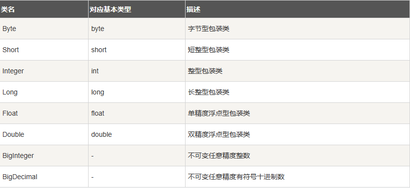
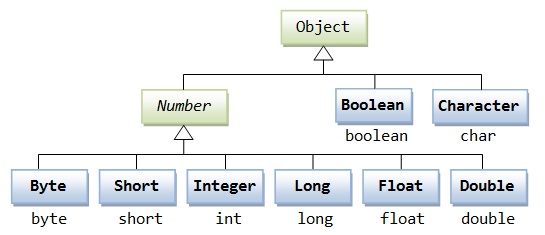
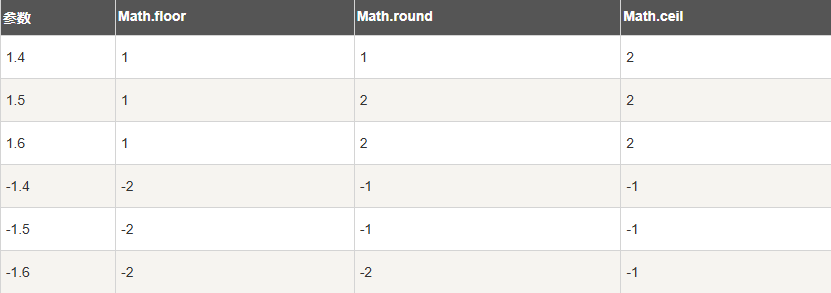

# 第12天

## Java Number & Math 类

今天认识 当需要使用数字的时候，我们通常使用内置数据类型，如：byte、int、long、double 等。

所有的包装类（Integer、Long、Byte、Double、Float、Short）都是抽象类 Number 的子类。



```java
int a = 5000;
float b = 13.65f;
byte c = 0x4a;
```



这种由编译器特别支持的包装称为装箱，所以当内置数据类型被当作对象使用的时候，编译器会把内置类型装箱为包装类。相似的，编译器也可以把一个对象拆箱为内置类型。

示例
```java
public abstract class Number implements Serializable {
    // 抽象方法
    public abstract int intValue();
    public abstract long longValue();
    public abstract float floatValue();
    public abstract double doubleValue();
    
    // Java 8 新增
    public byte byteValue() {
        return (byte)intValue();
    }
    public short shortValue() {
        return (short)intValue();
    }
}

public class Test{

    public static void main(String[] args){
        Integer x = 5;
        x =  x + 10;
        System.out.println(x);
    }
}


```

```java
Number num = 1234.56; // 实际是Double类型

System.out.println(num.intValue());    // 1234 (截断小数)
System.out.println(num.longValue());   // 1234
System.out.println(num.floatValue());  // 1234.56
System.out.println(num.doubleValue()); // 1234.56
```

```java
Integer x = 10;
Double y = 10.0;

// 正确比较方式：转换为同一类型后比较
System.out.println(x.doubleValue() == y.doubleValue()); // true
```

## 特殊数值处理

处理大数

```java
BigInteger bigInt = new BigInteger("12345678901234567890");
BigDecimal bigDec = new BigDecimal("1234567890.1234567890");

// 大数运算
BigInteger sum = bigInt.add(new BigInteger("1"));
BigDecimal product = bigDec.multiply(new BigDecimal("2"));
```

数值格式化

```java
NumberFormat nf = NumberFormat.getInstance();
nf.setMaximumFractionDigits(2);

System.out.println(nf.format(1234.5678)); // "1,234.57"
```

## 自动装箱与拆箱

```java
// 自动装箱
Integer autoBoxed = 42; // 编译器转换为 Integer.valueOf(42)

// 自动拆箱
int autoUnboxed = autoBoxed; // 编译器转换为 autoBoxed.intValue()
```

## Java Math 类

```java
public class Test {  
    public static void main (String []args)  
    {  
        System.out.println("90 度的正弦值：" + Math.sin(Math.PI/2));  
        System.out.println("0度的余弦值：" + Math.cos(0));  
        System.out.println("60度的正切值：" + Math.tan(Math.PI/3));  
        System.out.println("1的反正切值： " + Math.atan(1));  
        System.out.println("π/2的角度值：" + Math.toDegrees(Math.PI/2));  
        System.out.println(Math.PI);  
    }  
}
```

高级数学运算

1. 指数对数运算

```java
Math.exp(1);    // e^1 ≈ 2.718
Math.log(Math.E); // ln(e) = 1
Math.log10(100); // log10(100) = 2

// 生成[0.0, 1.0)之间的随机数
double random = Math.random();

// 生成[1, 100]的随机整数
int randomInt = (int)(Math.random() * 100) + 1;

Math.hypot(3, 4); // 计算sqrt(x²+y²) → 5.0
Math.IEEEremainder(10, 3); // IEEE余数 → 1.0

Math.PI;    // π ≈ 3.141592653589793
Math.E;     // 自然对数底数e ≈ 2.718281828459045
```

## Math 的 floor,round 和 ceil 方法实例比较




