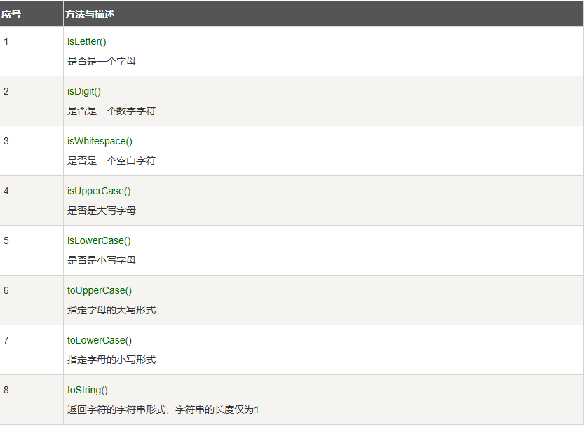

# 第13天

今天认识 Character 类

Character 类用于对单个字符进行操作。

Character 类在对象中包装一个基本类型 char 的值

## Character 类

`Character` 类是 Java 编程语言中的一个类，位于 `java.lang` 包中。它用于表示单个字符。这个类提供了许多方法来操作和检查字符，例如判断字符是否为字母、数字、空白字符等。

### 实现原理

`Character` 类内部使用一个 `char` 类型的变量来存储字符。`char` 类型在 Java 中占用 2 个字节（16 位），可以表示 Unicode 字符集中的字符。

### 主要方法

1. **判断字符类型的方法**：
    - `isDigit(char ch)`: 判断字符是否为数字。
    - `isLetter(char ch)`: 判断字符是否为字母。
    - `isLetterOrDigit(char ch)`: 判断字符是否为字母或数字。
    - `isWhitespace(char ch)`: 判断字符是否为空白字符（如空格、制表符、换行符等）。
    - `isUpperCase(char ch)`: 判断字符是否为大写字母。
    - `isLowerCase(char ch)`: 判断字符是否为小写字母。

2. **转换字符大小写的方法**：
    - `toUpperCase(char ch)`: 将字符转换为大写。
    - `toLowerCase(char ch)`: 将字符转换为小写。

3. **获取字符的 Unicode 编码**：
    - `charValue()`: 返回 `Character` 对象表示的 `char` 值。

4. **比较字符的方法**：
    - `compareTo(char anotherChar)`: 按字典顺序比较两个字符。
    - `equals(Object obj)`: 判断两个字符是否相等。

### 用途

`Character` 类在处理字符串和字符时非常有用，尤其是在需要判断字符类型、转换大小写、比较字符等操作时。例如，在用户输入验证、文本处理、数据加密等领域，`Character` 类提供的方法可以简化开发工作。

### 注意事项

1. **字符编码**：`char` 类型使用 Unicode 编码，可以表示全球范围内的字符。
2. **性能考虑**：对于大量字符的处理，直接使用 `char` 类型可能比使用 `Character` 类更高效，因为 `Character` 类的方法调用可能引入额外的开销。
3. **线程安全**：`Character` 类是线程安全的，因为它的实例是不可变的（immutable）。

```java
char ch = 'a';
 
// Unicode 字符表示形式
char uniChar = '\u039A'; 
 
// 字符数组
char[] charArray ={ 'a', 'b', 'c', 'd', 'e' };
```

Character类提供了一系列方法来操纵字符。可以使用Character的构造方法创建一个Character类对象，例如：

Character ch = new Character('a');

在某些情况下，Java编译器会自动创建一个Character对象。

例如，将一个char类型的参数传递给需要一个Character类型参数的方法时，那么编译器会自动地将char类型参数转换为Character对象。 这种特征称为装箱，反过来称为拆箱。

```java
// 原始字符 'a' 装箱到 Character 对象 ch 中
Character ch = 'a';
 
// 原始字符 'x' 用 test 方法装箱
// 返回拆箱的值到 'c'
char c = test('x');
```

如果 test 方法内部需要使用对象类型，可以通过调用 Character 类的静态方法 valueOf 来进行装箱操作

```java
public static char test(char c) {
    // 假设这里有一些操作
    return c;
}

//在这个方法中，参数 c 是一个原始字符类型。如果 test 方法内部需要使用对象类型，可以通过调用 Character 类的静态方法 valueOf 来进行装箱操作。
Character ch = Character.valueOf(c);

//如果 test 方法内部需要使用原始类型，可以通过调用 Character 对象的 charValue 方法来进行拆箱操作。例如：
char c = ch.charValue();

```


## 用途：

装箱和拆箱操作在Java中是常见的，特别是在需要将原始数据类型传递给需要对象类型的方法时。

装箱操作允许原始数据类型在集合框架中使用，因为集合框架中的元素必须是对象类型。

拆箱操作允许在需要原始数据类型的地方使用对象类型。

## 注意事项：

装箱和拆箱操作会带来一定的性能开销，因为它们涉及到对象的创建和销毁。

在性能敏感的应用中，应该尽量避免不必要的装箱和拆箱操作。

装箱和拆箱操作可能会引入空指针异常，如果尝试对一个 null 的 Character 对象进行拆箱操作，将会抛出 NullPointerException。




