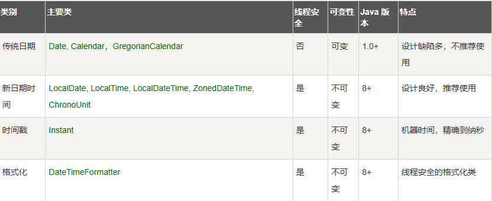

# 第17天

## Java 日期时间



## LocalDate/DateTimeFormatter

LocalDate/DateTimeFormatter 是 Java 8 引入的日期类，LocalDate 用于表示不带时间的日期（年-月-日），DateTimeFormatter 用于格式化和解析日期时间对象。

Java 日期时间处理是Java编程中一个重要的部分，它允许开发者处理日期和时间。Java提供了多种类和方法来处理日期和时间，包括`java.util.Date`、`java.util.Calendar`、`java.time`包等。下面是一些关键点和注意事项：

### 1. `java.util.Date` 类

`java.util.Date` 类是Java中最基础的日期时间类，它表示一个特定的瞬间，精确到毫秒。这个类提供了许多方法来获取和设置日期和时间，但它的设计已经过时，不推荐在新代码中使用。

```java
Date date = new Date();
System.out.println(date);
```

### 2. `java.util.Calendar` 类

`java.util.Calendar` 类是一个抽象类，它为特定时区和语言环境提供了一些方法来获取和设置日期和时间。这个类比`Date`类更灵活，但仍然存在一些问题，如线程不安全。

```java
Calendar calendar = Calendar.getInstance();
System.out.println(calendar.getTime());
```

### 3. `java.time` 包

Java 8引入了新的日期时间API，位于`java.time`包中，它解决了`Date`和`Calendar`类中的许多问题。这个API提供了`LocalDate`、`LocalTime`、`LocalDateTime`、`ZonedDateTime`等类来处理日期和时间。

```java
LocalDate today = LocalDate.now();
LocalTime timeNow = LocalTime.now();
LocalDateTime dateTimeNow = LocalDateTime.now();
ZonedDateTime zonedDateTimeNow = ZonedDateTime.now();

System.out.println(today);// 2023-06-15
System.out.println(timeNow);// 15:20:30.123456789
System.out.println(dateTimeNow);// 2023-06-15T15:20:30.123456789
System.out.println(zonedDateTimeNow);// 2023-06-15T15:20:30.123456789+08:00[Asia/Shanghai]
```

### 注意事项

1. **线程安全**：`java.util.Date`和`java.util.Calendar`不是线程安全的，如果多个线程同时访问和修改它们，可能会导致数据不一致。`java.time`包中的类是线程安全的。

2. **时区处理**：`java.time`包提供了更好的时区处理能力，而`java.util.Date`和`java.util.Calendar`在处理时区时较为复杂。

3. **国际化**：`java.time`包提供了更好的国际化支持，而`java.util.Date`和`java.util.Calendar`在国际化方面较为有限。

4. **可读性和可维护性**：`java.time`包中的类和方法名称更加直观和易于理解，有助于提高代码的可读性和可维护性。

总之，`java.time`包是处理Java日期和时间的推荐方式，它提供了更强大、更灵活和更安全的API。

不学太多，用的时候查一下，先看一下，了解了解。