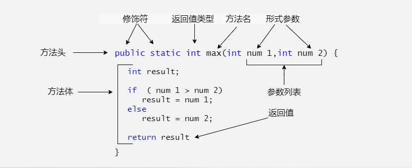

# 第19天

## Java 方法

了解有哪些，写代码更加轻松，哈哈哈



Java 方法（Method）是Java编程语言中的一个基本概念，用于将一组语句封装在一起，以便在程序中重复使用。方法可以接受参数并返回结果。Java中的方法分为两大类：实例方法和静态方法。

### 方法的基本结构

```java
修饰符 返回类型 方法名(参数列表) {
    // 方法体
    // 方法执行的操作
    return 返回值; // 如果有返回值
}
```

### 修饰符
- `public`：方法可以被任何其他类访问。
- `private`：方法只能在其定义的类内部访问。
- `protected`：方法可以在同一包内或不同包的子类中访问。
- `default`（无修饰符）：方法可以在同一包内访问。
- `static`：方法属于类本身，而不是类的实例。

### 返回类型
- 方法可以返回任何类型的数据，包括基本数据类型（如int、float等）和引用数据类型（如对象、数组等）。如果没有返回值，则使用`void`。

### 方法名
- 方法名应该是一个动词，并且遵循Java的命名规范，通常使用小写字母开头，如果方法名由多个单词组成，后面的每个单词首字母大写。

### 参数列表
- 参数列表是方法可以接受的一个或多个参数，参数由参数类型和参数名组成，多个参数之间用逗号分隔。如果没有参数，则参数列表为空。

### 方法体
- 方法体是方法执行的操作，可以包含任意数量的语句，包括变量声明、条件语句、循环语句等。

### 返回值
- 如果方法有返回值，则需要在方法体中使用`return`语句返回一个值。如果没有返回值，则方法体中不需要`return`语句。

### 方法重载
- 方法重载是指在同一个类中，可以定义多个方法，它们的方法名相同但参数列表不同（参数的数量、类型或顺序不同）。Java编译器根据调用方法时提供的参数来决定调用哪个方法。

### 注意事项
- 方法名应该具有描述性，能够清楚地表达方法的功能。
- 方法参数应该尽量少，过多的参数会使方法难以理解和维护。
- 方法应该尽可能短小，每个方法只做一件事，符合单一职责原则。
- 方法应该避免副作用，即方法不应该改变调用者传入的对象的状态。
- 方法应该有适当的注释，说明方法的用途、参数和返回值。

### 示例

```java
public class Example {
    // 静态方法，返回两个整数的和
    public static int add(int a, int b) {
        return a + b;
    }

    // 实例方法，返回一个字符串的长度
    public int getStringLength(String str) {
        return str.length();
    }

    public static void main(String[] args) {
        int sum = Example.add(3, 4);
        System.out.println("Sum: " + sum);

        Example example = new Example();
        int length = example.getStringLength("Hello, World!");
        System.out.println("Length: " + length);
    }
}

```

在这个示例中，`add`是一个静态方法，它接受两个整数作为参数并返回它们的和。`getStringLength`是一个实例方法，它接受一个字符串作为参数并返回其长度。在`main`方法中，我们调用了这两个方法并打印了它们的返回值。


