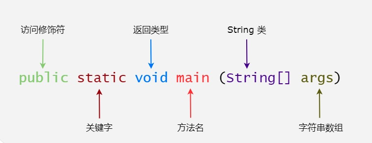
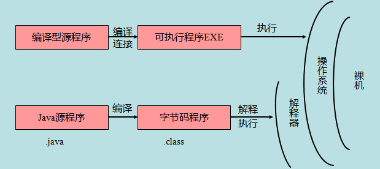

# 第2天

> 学习要循序渐进，不要给自己太大压力哦！


今天学基础语法，看看得了，很快，坚持一下，第二天就会java了，如果你继续学就直接会了

## Java 基础语法

一个 Java 程序可以认为是一系列对象的集合，而这些对象通过调用彼此的方法来协同工作。

对象：对象是类的一个实例，有状态和行为。例如，一条狗是一个对象，它的状态有：颜色、名字、品种；行为有：摇尾巴、叫、吃等。

类：类是一个模板，它描述一类对象的行为和状态。

方法：方法就是行为，一个类可以有很多方法。逻辑运算、数据修改以及所有动作都是在方法中完成的。

实例变量：每个对象都有独特的实例变量，对象的状态由这些实例变量的值决定。



```java
$ javac HelloWorld.java
$ java HelloWorld 
Hello World
        
如果遇到编码问题，我们可以使用 -encoding 选项设置 utf-8 来编译：

javac -encoding UTF-8 HelloWorld.java 
java HelloWorld 
```

## 基本语法

大小写敏感：Java 是大小写敏感的，这就意味着标识符 Hello 与 hello 是不同的。

类名：对于所有的类来说，类名的首字母应该大写。如果类名由若干单词组成，那么每个单词的首字母应该大写，例如 MyFirstJavaClass 。

方法名：所有的方法名都应该以小写字母开头。如果方法名含有若干单词，则后面的每个单词首字母大写。

源文件名：源文件名必须和类名相同。当保存文件的时候，你应该使用类名作为文件名保存（切记 Java 是大小写敏感的），文件名的后缀为 .java。（如果文件名和类名不相同则会导致编译错误）。

主方法入口：所有的 Java 程序由 public static void main(String[] args) 方法开始执行。

## Java 标识符

Java 所有的组成部分都需要名字。类名、变量名以及方法名都被称为标识符。

```java
所有的标识符都应该以字母（A-Z 或者 a-z）,美元符（$）、或者下划线（_）开始
首字符之后可以是字母（A-Z 或者 a-z）,美元符（$）、下划线（_）或数字的任何字符组合
关键字不能用作标识符
标识符是大小写敏感的
合法标识符举例：age、$salary、_value、__1_value
非法标识符举例：123abc、-salary
```

## Java修饰符

访问控制修饰符 : default, public , protected, private

非访问控制修饰符 : final, abstract, static, synchronized

## Java 变量

Java 中主要有如下几种类型的变量

1. 局部变量 
2. 类变量（静态变量） 
3. 成员变量（非静态变量）

## Java 

数组是储存在**堆上**的对象，可以保存多个同类型变量。 (数组名是引用，数组中的每个元素都是一个对象) 

```java
int[] a = new int[10]; // 声明并初始化数组
int[] b = {1, 2, 3, 4, 5}; // 声明并初始化数组
int[] c = new int[]{1, 2, 3, 4, 5}; // 声明并初始化数组
int[] d = new int[5]; // 声明数组，并指定数组大小
```

## Java 枚举

Java 5.0引入了枚举，枚举限制变量只能是预先设定好的值。使用枚举可以减少代码中的 bug。

例如，我们为果汁店设计一个程序，它将限制果汁为小杯、中杯、大杯。这就意味着它不允许顾客点除了这三种尺寸外的果汁。

```java
public class FreshJuice {
   enum FreshJuiceSize{ SMALL, MEDIUM , LARGE }
   FreshJuiceSize size;
}
```

## Java 关键字

过一下

```java
访问控制	

private	私有的
protected	受保护的
public	公共的
default	默认

类、方法和变量修饰符

abstract	声明抽象
class	类
        extends	扩充、继承
final	最终值、不可改变的
implements	实现（接口）
interface	接口
native	本地、原生方法（非 Java 实现）
        new	创建
static	静态
strictfp	严格浮点、精准浮点
synchronized	线程、同步
transient	短暂
volatile	易失

程序控制语句

break	跳出循环
case	定义一个值以供 switch 选择
continue	继续
do	运行
else	否则
for	循环
if	如果
instanceof	实例
return	返回
switch	根据值选择执行
while	循环

错误处理

assert	断言表达式是否为真
catch	捕捉异常
finally	有没有异常都执行
throw	抛出一个异常对象
throws	声明一个异常可能被抛出
try	捕获异常

包相关
        
import	引入
package	包

基本类型

boolean	布尔型
byte	字节型
char	字符型
double	双精度浮点
float	单精度浮点
int	整型
long	长整型
short	短整型

变量引用
        
super	父类、超类
this	本类
void	无返回值

保留关键字
        
goto	是关键字，但不能使用
const	是关键字，但不能使用


注意：Java 的 null 不是关键字，类似于 true 和 false，它是一个字面常量，不允许作为标识符使用。

```

## 继承

在 Java 中，一个类可以由其他类派生。如果你要创建一个类，而且已经存在一个类具有你所需要的属性或方法，那么你可以将新创建的类继承该类。

利用继承的方法，可以重用已存在类的方法和属性，而不用重写这些代码。被继承的类称为超类（super class），派生类称为子类（sub class）。

示例：

```java
class Animal{
  void eat(){
    System.out.println("eating...");
  }
}

class Dog extends Animal{
  void bark(){
    System.out.println("barking...");
  }
}

public class TestDog{
  public static void main(String args[]){
    Animal a = new Animal();
    a.eat();
    
    Dog d = new Dog();
    d.bark();
    d.eat();
  }
}
```

Animal类定义了一个名为eat的方法，该方法打印出“eating...”。

Dog类继承自Animal类，这意味着Dog类可以继承Animal类的所有方法和属性。

Dog类定义了一个名为bark的方法，该方法打印出“barking...”。

TestDog类是程序的入口点。

在main方法中，首先创建了一个Animal对象a，并调用了a.eat()方法，输出“eating...”。

然后创建了一个Dog对象d，并调用了d.bark()方法，输出“barking...”。

最后，调用了d.eat()方法，由于Dog类继承了Animal类，所以d.eat()方法实际上是调用了Animal类中的eat方法，输出“eating...”。

### 实现原理

继承：Dog类继承了Animal类，这意味着Dog类可以访问Animal类中的所有公共（public）和受保护（protected）成员，包括方法。

多态性：虽然Dog类继承了Animal类，但Dog类可以有自己的方法，如bark方法。当调用Dog对象的方法时，会根据实际的对象类型来决定调用哪个方法。例如，d.bark()调用的是Dog类中的bark方法，而d.eat()调用的是Animal类中的eat方法。

### 用途

这个程序展示了面向对象编程的基本概念，如继承和多态性，是学习Java面向对象编程的基础。

通过继承，可以重用代码，减少重复工作。

通过多态性，可以在运行时根据对象的实际类型来决定调用哪个方法，增加了程序的灵活性和可扩展性。

在Java中，类名和文件名应该一致，即TestDog类应该保存在名为TestDog.java的文件中。

继承是面向对象编程中的一个重要特性，但过度使用继承可能会导致代码结构复杂，难以维护。在设计类时，应该根据实际需求谨慎使用继承。

## 接口

在 Java 中，接口可理解为对象间相互通信的协议。接口在继承中扮演着很重要的角色。

接口只定义派生要用到的方法，但是方法的具体实现完全取决于派生类。

示例

演示了接口（interface）和继承（inheritance）的基本概念。

```java
// 接口是一个完全抽象的类，它包含了一系列未实现的方法。接口定义了类应该具有的方法，但不提供这些方法的具体实现。接口通过interface关键字定义。
interface Animal{
    void eat();
    void travel();
}
// Animal接口定义了两个方法：eat()和travel()。任何实现Animal接口的类都必须提供这两个方法的具体实现。

//类（Class）和实现（Implementation）
//类是对象的蓝图，它包含了数据和操作这些数据的方法。类通过class关键字定义。
//MammalAnimal类实现了Animal接口，这意味着它必须提供eat()和travel()方法的具体实现。
class MammalAnimal implements Animal {
    public void eat(){
      System.out.println("Mammal eat");
    }
    public void travel(){
      System.out.println("Mammal travel");
    }
}
//继承是面向对象编程中的一个基本概念，它允许一个类（子类）继承另一个类（父类）的属性和方法。子类可以扩展父类的功能，也可以重写父类的方法。
//Dog类继承了MammalAnimal类，这意味着Dog类不仅继承了MammalAnimal类的属性和方法，还可以添加自己的属性和方法。在这个例子中，Dog类添加了一个bark()方法。
class Dog extends MammalAnimal{
    public void bark(){
      System.out.println("dog barking");
    }
}
// 主类（Main Class） 主类是程序的入口点，它包含了main方法。
// 在main方法中，首先创建了一个MammalAnimal对象，并调用了它的eat()和travel()方法。然后创建了一个Dog对象，并调用了它的bark()和eat()方法。
public class TestInterface {
  public static void main(String args[]) {
      Animal a = new MammalAnimal();
      a.eat();
      a.travel();

      Dog d = new Dog();
      d.bark();
      d.eat();
  }
}
```

接口和类的区别：接口定义了方法，但不包含实现。类可以包含属性和方法，并且可以继承自其他类或实现一个或多个接口。

实现接口：类通过implements关键字实现一个或多个接口，并必须提供接口中所有方法的具体实现。

继承：类通过extends关键字继承自另一个类，子类可以继承父类的属性和方法，并且可以添加自己的属性和方法。

多态：在Java中，多态允许一个接口或父类的引用指向一个实现了该接口或继承了该父类的子类对象。这允许在运行时根据对象的实际类型调用相应的方法。

## Java 源程序与编译型运行区别



## 多态

多态是同一个行为具有多个不同表现形式或形态的能力。

多态就是同一个接口，使用不同的实例而执行不同操作。

示例

```java
//Shape 类是所有形状的父类，它有一个 draw() 方法，但这个方法没有具体实现。
class Shape {
   void draw() {}
}
//Circle、Square 和 Triangle 类都继承自 Shape 类，并重写了 draw() 方法，以实现各自独特的绘制逻辑。
class Circle extends Shape {
   void draw() {
     System.out.println("Circle.draw()");
   }
}
class Square extends Shape {
   void draw() {
     System.out.println("Square.draw()");
   }
}
class Triangle extends Shape {
   void draw() {
     System.out.println("Triangle.draw()");
   }
}
//在 main 方法中，创建了一个 Shape 类型的数组 shapes，长度为3。
public class Polymorphism {
   public static void main(String[] args) {
     Shape[] shapes = new Shape[3];
     shapes[0] = new Circle();
     shapes[1] = new Square();
     shapes[2] = new Triangle();
     for(int i=0; i<shapes.length; i++) {
       shapes[i].draw();
     }
   }
}
```

### 多态性应用：

通过父类引用 Shape 来创建子类对象，并将这些对象存储在数组中。例如，shapes[0] = new Circle(); 创建了一个 Circle 对象，并将其赋值给 Shape 类型的引用。

当通过数组中的引用调用 draw() 方法时，实际调用的是子类重写的方法。例如，shapes[0].draw(); 实际上调用的是 Circle 类的 draw() 方法。

### 遍历数组并调用方法：

使用 for 循环遍历数组中的每个元素，并调用 draw() 方法。由于多态性的存在，实际调用的方法是每个对象的子类实现。

### 用途

多态性在面向对象编程中非常有用，因为它允许我们编写更加通用和灵活的代码。通过使用父类引用来操作子类对象，我们可以在不改变代码结构的情况下，轻松地添加新的子类，并让它们与现有代码无缝协作。

## 注意事项

方法重写：

子类必须使用 @Override 注解来明确表示它重写了父类的方法。虽然这不是强制性的，但这是一个好的编程习惯，可以帮助我们在编译时发现错误。

父类引用指向子类对象：

在多态性中，父类引用可以指向任何子类对象，但只能调用父类中声明的方法。如果子类重写了这些方法，那么调用时将执行子类的实现。

类型转换：

如果需要调用子类特有的方法，可能需要进行类型转换。例如，如果需要调用 Circle 类特有的方法，需要将 Shape 类型的引用转换为 Circle 类型：((Circle) shapes[0]).someCircleSpecificMethod();。

运行时类型检查：

在进行类型转换之前，可以使用 instanceof 关键字来检查对象是否是特定类的实例，以避免 ClassCastException 异常。例如：if (shapes[0] instanceof Circle) { ((Circle) shapes[0]).someCircleSpecificMethod(); }。

---

> 学习编程就像搭积木，一块一块慢慢来，下一篇继续加油！