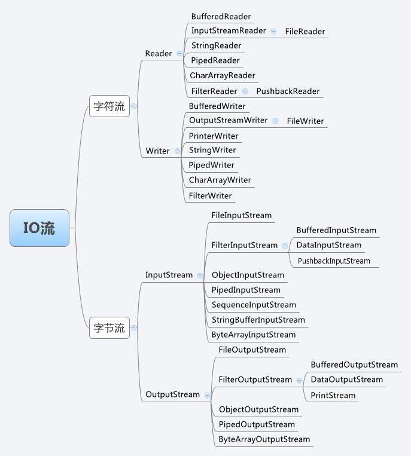
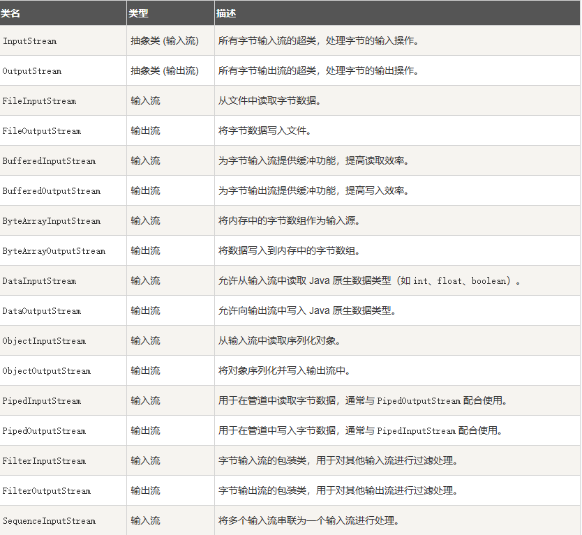
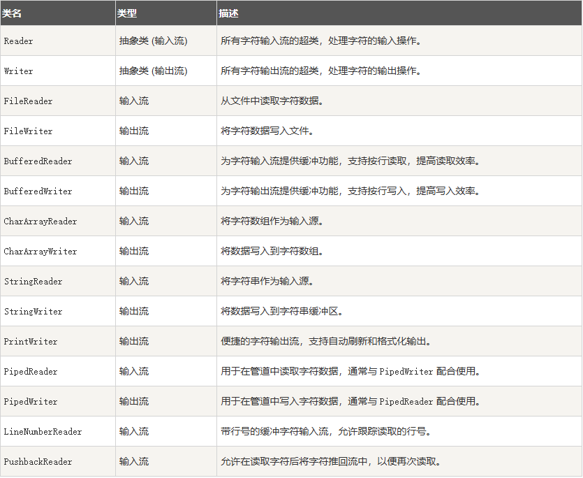
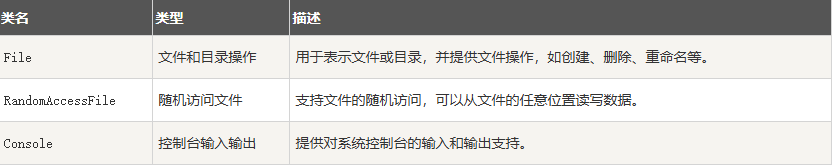
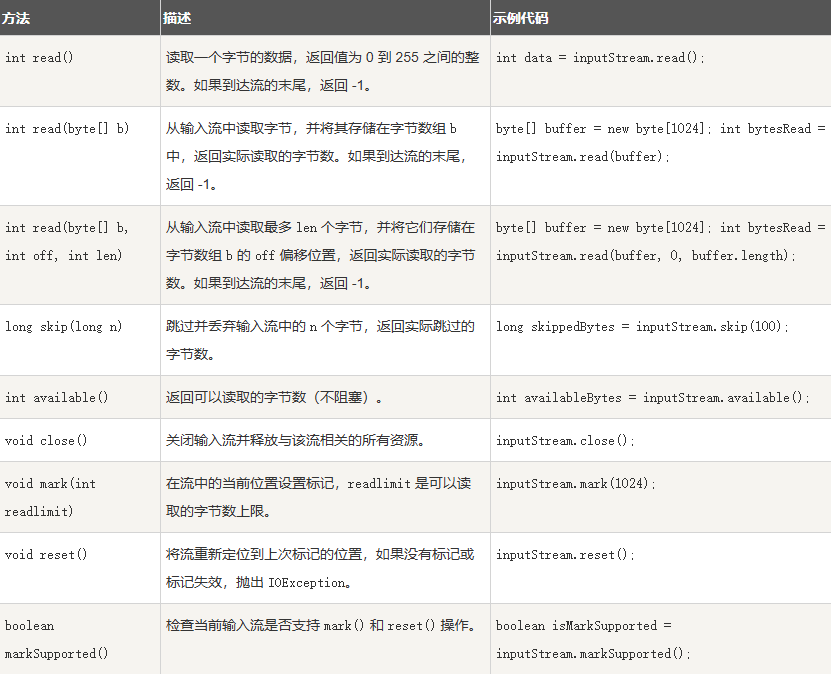
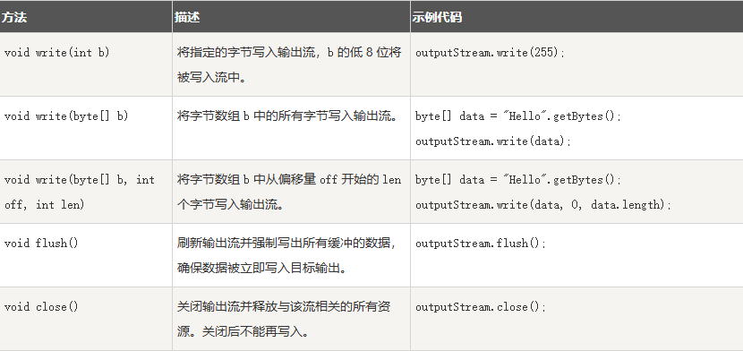

# 第21天

> 学习编程要劳逸结合哦，记得多喝水休息眼睛～


## Java 流(Stream)、文件(File)和IO

Java 中的流（Stream）、文件（File）和 IO（输入输出）是处理数据读取和写入的基础设施，它们允许程序与外部数据（如文件、网络、系统输入等）进行交互。

java.io 包是 Java 标准库中的一个核心包，提供了用于系统输入和输出的类，它包含了处理数据流（字节流和字符流）、文件读写、序列化以及数据格式化的工具。

java.io 是处理文件操作、流操作以及低级别 IO 操作的基础包。

java.io 包中的流支持很多种格式，比如：基本类型、对象、本地化字符集等等。

一个流可以理解为一个数据的序列。输入流表示从一个源读取数据，输出流表示向一个目标写数据。

Java 的控制台输入由 System.in 完成。

为了获得一个绑定到控制台的字符流，你可以把 System.in 包装在一个 BufferedReader 对象中来创建一个字符流。

下面是创建 BufferedReader 的基本语法：

```java
BufferedReader br = new BufferedReader(new 
                      InputStreamReader(System.in));
```

BufferedReader 对象创建后，我们便可以使用 read() 方法从控制台读取一个字符，或者用 readLine() 方法读取一行字符串。

## 读写文件














---

> 学习编程就像搭积木，一块一块慢慢来，下一篇继续加油！