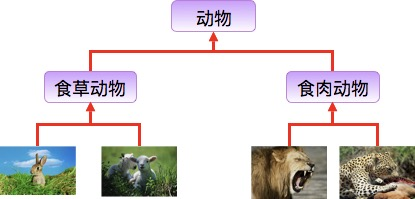
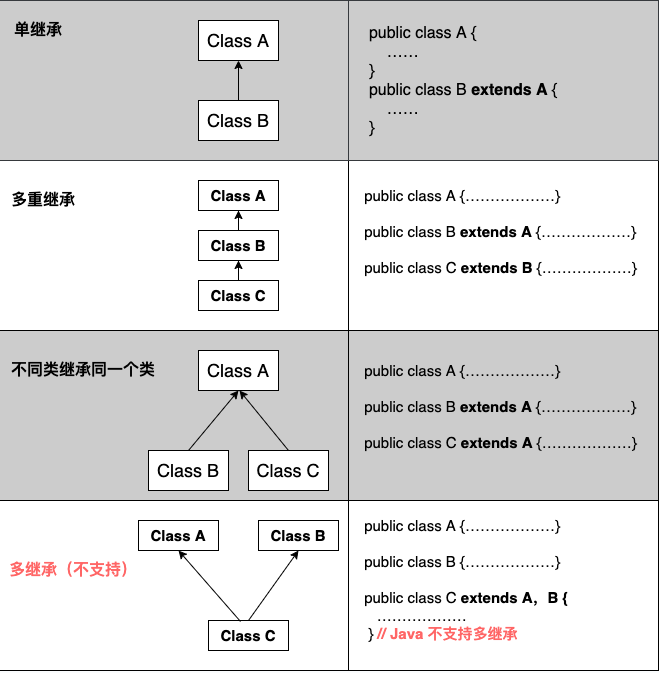

# 第23天

> 学习累了就休息一下，我会一直在这里等你～


继承的概念

继承就是子类继承父类的特征和行为，使得子类对象（实例）具有父类的实例域和方法，或子类从父类继承方法，使得子类具有父类相同的行为。

生活中的继承：



兔子和羊属于食草动物类，狮子和豹属于食肉动物类。

食草动物和食肉动物又是属于动物类。

虽然食草动物和食肉动物都是属于动物，但是两者的属性和行为上有差别，所以子类会具有父类的一般特性也会具有自身的特性。

## 类的继承格式

在 Java 中通过 extends 关键字可以申明一个类是从另外一个类继承而来的，一般形式如下：

```java
class 父类 {
}
 
class 子类 extends 父类 {
}
```

## 为什么需要继承

接下来我们通过实例来说明这个需求。

开发动物类，其中动物分别为企鹅以及老鼠，要求如下：

企鹅：属性（姓名，id），方法（吃，睡，自我介绍）

老鼠：属性（姓名，id），方法（吃，睡，自我介绍）

```java
public class Penguin { 
    private String name; 
    private int id; 
    public Penguin(String myName, int  myid) { 
        name = myName; 
        id = myid; 
    } 
    public void eat(){ 
        System.out.println(name+"正在吃"); 
    }
    public void sleep(){
        System.out.println(name+"正在睡");
    }
    public void introduction() { 
        System.out.println("大家好！我是"         + id + "号" + name + "."); 
    } 
}
```

```java
public class Mouse { 
    private String name; 
    private int id; 
    public Mouse(String myName, int  myid) { 
        name = myName; 
        id = myid; 
    } 
    public void eat(){ 
        System.out.println(name+"正在吃"); 
    }
    public void sleep(){
        System.out.println(name+"正在睡");
    }
    public void introduction() { 
        System.out.println("大家好！我是"         + id + "号" + name + "."); 
    } 
}
```

## 公共父类：

```java
public class Animal { 
    private String name;  
    private int id; 
    public Animal(String myName, int myid) { 
        name = myName; 
        id = myid;
    } 
    public void eat(){ 
        System.out.println(name+"正在吃"); 
    }
    public void sleep(){
        System.out.println(name+"正在睡");
    }
    public void introduction() { 
        System.out.println("大家好！我是"         + id + "号" + name + "."); 
    } 
}
```

## 企鹅类：

```java
public class Penguin extends Animal { 
    public Penguin(String myName, int myid) { 
        super(myName, myid); 
    } 
}
```

## 老鼠类：

```java
public class Mouse extends Animal { 
    public Mouse(String myName, int myid) { 
        super(myName, myid); 
    } 
}
```

## 继承类型

需要注意的是 Java 不支持多继承，但支持多重继承。



## 继承的特性

子类拥有父类非 private 的属性、方法。

子类可以拥有自己的属性和方法，即子类可以对父类进行扩展。

子类可以用自己的方式实现父类的方法。

Java 的继承是单继承，但是可以多重继承，单继承就是一个子类只能继承一个父类，多重继承就是，例如 B 类继承 A 类，C 类继承 B 类，所以按照关系就是 B 类是 C 类的父类，A 类是 B 类的父类，这是 Java 继承区别于 C++ 继承的一个特性。

提高了类之间的耦合性（继承的缺点，耦合度高就会造成代码之间的联系越紧密，代码独立性越差）。

## extends关键字

在 Java 中，类的继承是单一继承，也就是说，一个子类只能拥有一个父类，所以 extends 只能继承一个类。

```java
public class Animal { 
    private String name;   
    private int id; 
    public Animal(String myName, int myid) { 
        //初始化属性值
    } 
    public void eat() {  //吃东西方法的具体实现  } 
    public void sleep() { //睡觉方法的具体实现  } 
} 
 
public class Penguin  extends  Animal{
        
}
```

## implements关键字

使用 implements 关键字可以变相的使java具有多继承的特性，使用范围为类继承接口的情况，可以同时继承多个接口（接口跟接口之间采用逗号分隔）。

```java
public interface A {
    public void eat();
    public void sleep();
}
 
public interface B {
    public void show();
}
 
public class C implements A,B {
}
```

## super 与 this 关键字

super 关键字：我们可以通过 super 关键字来实现对父类成员的访问，用来引用当前对象的父类。

this 关键字：指向自己的引用，引用当前对象，即它所在的方法或构造函数所属的对象实例。。

实例

```java
class Animal {
    void eat() {
        System.out.println("animal : eat");
    }
}
 
class Dog extends Animal {
    void eat() {
        System.out.println("dog : eat");
    }
    void eatTest() {
        this.eat();   // this 调用自己的方法
        super.eat();  // super 调用父类方法
    }
}
 
public class Test {
    public static void main(String[] args) {
        Animal a = new Animal();
        a.eat();
        Dog d = new Dog();
        d.eatTest();
    }
}
```

## 构造器

子类是不继承父类的构造器（构造方法或者构造函数）的，它只是调用（隐式或显式）。如果父类的构造器带有参数，则必须在子类的构造器中显式地通过 super 关键字调用父类的构造器并配以适当的参数列表。

如果父类构造器没有参数，则在子类的构造器中不需要使用 super 关键字调用父类构造器，系统会自动调用父类的无参构造器。

```java
class SuperClass {
    private int n;
 
    // 无参数构造器
    public SuperClass() {
        System.out.println("SuperClass()");
    }
 
    // 带参数构造器
    public SuperClass(int n) {
        System.out.println("SuperClass(int n)");
        this.n = n;
    }
}
 
// SubClass 类继承
class SubClass extends SuperClass {
    private int n;
 
    // 无参数构造器，自动调用父类的无参数构造器
    public SubClass() {
        System.out.println("SubClass()");
    }
 
    // 带参数构造器，调用父类中带有参数的构造器
    public SubClass(int n) {
        super(300);
        System.out.println("SubClass(int n): " + n);
        this.n = n;
    }
}
 
// SubClass2 类继承
class SubClass2 extends SuperClass {
    private int n;
 
    // 无参数构造器，调用父类中带有参数的构造器
    public SubClass2() {
        super(300);
        System.out.println("SubClass2()");
    }
 
    // 带参数构造器，自动调用父类的无参数构造器
    public SubClass2(int n) {
        System.out.println("SubClass2(int n): " + n);
        this.n = n;
    }
}
 
public class TestSuperSub {
    public static void main(String[] args) {
        System.out.println("------SubClass 类继承------");
        SubClass sc1 = new SubClass();
        SubClass sc2 = new SubClass(100);
 
        System.out.println("------SubClass2 类继承------");
        SubClass2 sc3 = new SubClass2();
        SubClass2 sc4 = new SubClass2(200);
    }
}
```


---

> 又学会了新技能！继续保持这个学习节奏，下一篇见～