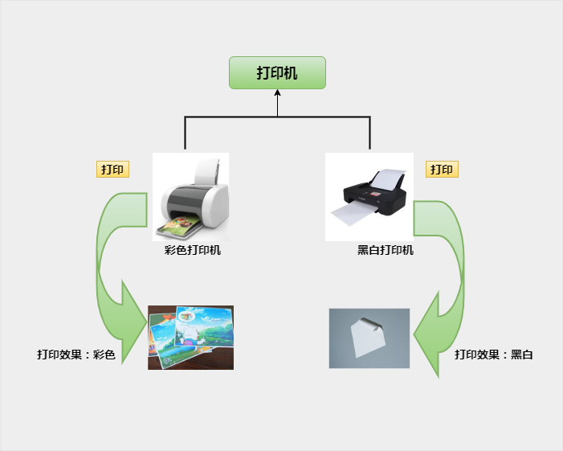
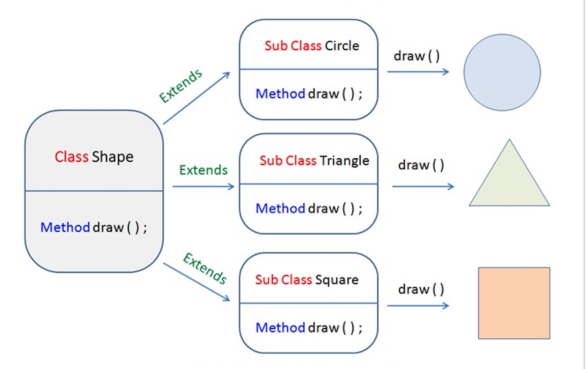

# 第25天

> 学习要循序渐进，不要给自己太大压力哦！


## Java 多态

多态是同一个行为具有多个不同表现形式或形态的能力。

多态就是同一个接口，使用不同的实例而执行不同操作，如图所示：



## 多态的优点

1. 消除类型之间的耦合关系
2. 可替换性
3. 可扩充性
4. 接口性
5. 灵活性
6. 简化性

## 多态存在的三个必要条件

- 继承
- 重写
- 父类引用指向子类对象：Parent p = new Child();



```java
class Shape {
    void draw() {}
}
  
class Circle extends Shape {
    void draw() {
        System.out.println("Circle.draw()");
    }
}
  
class Square extends Shape {
    void draw() {
        System.out.println("Square.draw()");
    }
}
  
class Triangle extends Shape {
    void draw() {
        System.out.println("Triangle.draw()");
    }
}
```


Java 多态是面向对象编程中的一个核心概念，它允许一个接口被多个不同的类实现，或者一个类继承自多个父类。多态的目的是为了实现代码的灵活性和可扩展性，使得程序能够根据运行时的具体对象类型来决定调用哪个方法。

### 实现原理

Java 多态主要通过以下两种方式实现：

1. **方法重载（Overloading）**：在同一个类中，方法名相同但参数列表不同。编译器根据调用时提供的参数类型和数量来决定调用哪个方法。

2. **方法重写（Overriding）**：子类重写父类的方法，使得子类对象在调用该方法时，会执行子类的方法实现。

### 用途

1. **代码复用**：通过方法重载，可以在同一个类中定义多个同名方法，但参数不同，从而实现代码的复用。

2. **灵活性和可扩展性**：通过方法重写，子类可以根据需要重写父类的方法，实现不同的行为。

3. **接口实现**：通过接口，可以定义一组方法，不同的类可以实现这个接口，从而实现多态。

### 注意事项

1. **编译时多态**：方法重载是在编译时确定的，即编译器根据参数类型和数量来决定调用哪个方法。

2. **运行时多态**：方法重写是在运行时确定的，即根据对象的实际类型来决定调用哪个方法。

3. **类型转换**：在多态中，需要使用类型转换来确保对象类型正确，否则可能会抛出 `ClassCastException` 异常。

4. **接口和抽象类**：在实现多态时，通常使用接口和抽象类，因为它们可以定义方法，但不提供具体实现，从而使得子类可以重写这些方法。

### 示例代码

```java
// 定义一个接口
interface Animal {
    void makeSound();
}

// 实现接口的类
class Dog implements Animal {
    public void makeSound() {
        System.out.println("汪汪汪");
    }
}

class Cat implements Animal {
    public void makeSound() {
        System.out.println("喵喵喵");
    }
}

public class Main {
    public static void main(String[] args) {
        Animal myDog = new Dog();
        Animal myCat = new Cat();

        // 多态调用
        myDog.makeSound(); // 输出：汪汪汪
        myCat.makeSound(); // 输出：喵喵喵
    }
}

```

在这个示例中，`Animal` 接口定义了一个 `makeSound` 方法，`Dog` 和 `Cat` 类分别实现了这个接口。在 `main` 方法中，通过多态的方式调用了 `makeSound` 方法，根据实际的对象类型，调用了不同的实现。这就是 Java 多态的一个典型应用。


---

> 这一章节掌握得怎么样？下一篇会更有趣哦，期待与你继续学习～