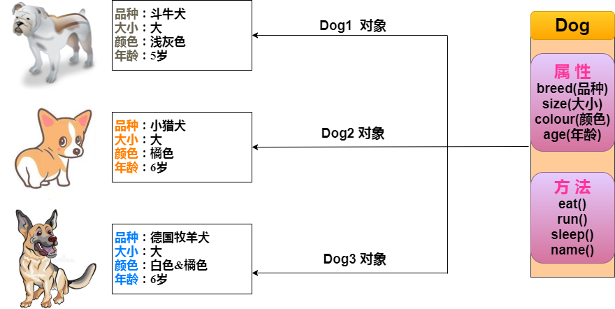

# 第3天

复习

Java 作为一种面向对象的编程语言，支持以下基本概念：

1、类（Class）：

定义对象的蓝图，包括属性和方法。

示例：public class Car { ... }

2、对象（Object）：

类的实例，具有状态和行为。

示例：Car myCar = new Car();

3、继承（Inheritance）：

一个类可以继承另一个类的属性和方法。

示例：public class Dog extends Animal { ... }

4、封装（Encapsulation）：

将对象的状态（字段）私有化，通过公共方法访问。

示例：

```java
private String name; 
public String getName() { return name; }
```

5、多态（Polymorphism）：

对象可以表现为多种形态，主要通过**方法重载**和**方法重写**实现。

示例：

方法重载：public int add(int a, int b) { ... } 和 public double add(double a, double b) { ... }

方法重写：@Override public void makeSound() { System.out.println("Meow"); }

6、抽象（Abstraction）：

使用抽象类和接口来定义必须实现的方法，不提供具体实现。

示例：

抽象类：public abstract class Shape { abstract void draw(); }

接口：public interface Animal { void eat(); }

7、接口（Interface）：

定义类必须实现的方法，支持多重继承。

示例：public interface Drivable { void drive(); }

8、方法（Method）：

定义类的行为，包含在类中的函数。

示例：public void displayInfo() { System.out.println("Info"); }

9、方法重载（Method Overloading）：

同一个类中可以有多个同名的方法，但参数不同。

示例：

```java
public class MathUtils {
    public int add(int a, int b) {
        return a + b;
    }

    public double add(double a, double b) {
        return a + b;
    }
}

```

对象：对象是类的一个实例（对象不是找个女朋友），有状态和行为。例如，一条狗是一个对象，它的状态有：颜色、名字、品种；行为有：摇尾巴、叫、吃等。

类：类是一个模板，它描述一类对象的行为和状态。

男孩（boy）、女孩（girl）为类（class），而具体的每个人为该类的对象（object）



一个类可以包含以下类型变量：
- 局部变量：在方法、构造方法或语句块中定义的变量。
- 成员变量：在类中定义的变量。
- 常量：使用 final 关键字声明的变量。
- 实例变量：在类中定义的变量，但在方法、构造方法或语句块之外。
- 类变量：使用 static 关键字声明的变量，类变量也称为静态变量，它们在类加载时初始化，并且在所有实例之间共享。

示例：

```java
public class MyClass {
    private int myPrivateVar; // 实例变量
    public static int myPublicStaticVar; // 类变量

    public MyClass(int value) {
        this.myPrivateVar = value;
    }

    public int getMyPrivateVar() {
        return myPrivateVar;
    }

    public static void setMyPublicStaticVar(int value) {
        myPublicStaticVar = value;
    }

    public static int getMyPublicStaticVar() {
        return myPublicStaticVar;
    }
}
```

局部变量，示例

```java
public class MyClass {
    public void myMethod() {
        int myLocalVar = 10; // 局部变量
        System.out.println(myLocalVar);
    }
}
```

常量，示例

```java
public class MyClass {
    public static final int MY_CONSTANT = 10; // 常量

    public static void main(String[] args) {
        System.out.println(MyClass.MY_CONSTANT);
    }
}
```

方法，示例

```java
public class MyClass {
    public void myMethod() {
        System.out.println("Hello, World!");
    }

    public int add(int a, int b) { // 方法
        return a + b;
    }
}
```

构造方法，示例

```java
public class MyClass {
    private int myVar;

    public MyClass(int value) {
        this.myVar = value;
    }

    public int getMyVar() {
        return myVar;
    }
}
```

访问修饰符，示例

```java
public class MyClass {
    private int myPrivateVar; // 私有变量
    public int myPublicVar; // 公共变量

    public void myMethod() {
        System.out.println("Hello, World!");
    }
}
```

成员变量，示例

```java
public class MyClass {
    private int myVar; // 成员变量

    public MyClass(int value) {
        this.myVar = value;
    }

    public int getMyVar() {
        return myVar;
    }
}
```

类变量，示例

```java
public class MyClass {
    public static int myVar; // 类变量

    public static void main(String[] args) {
        MyClass.myVar = 10;
        System.out.println(MyClass.myVar);
    }
}
```

## 构造方法

每个类都有构造方法。如果没有显式地为类定义构造方法，Java 编译器将会为该类提供一个默认构造方法。

在创建一个对象的时候，至少要调用一个构造方法。构造方法的名称必须与类同名，一个类可以有多个构造方法。

构造方法可以带有参数，也可以不带参数。构造方法的基本形式如下：

```java
public class MyClass {
    private int myVar;

    public MyClass(int value) {
        this.myVar = value;
    }

    public int getMyVar() {
        return myVar;
    }
}
```

```java
public class Puppy{
   public Puppy(String name){
      //这个构造器仅有一个参数：name
      System.out.println("名字是 : " + name ); 
   }
   public static void main(String[] args){
      // 下面的语句将创建一个Puppy对象
      Puppy myPuppy = new Puppy( "吃鱼不挑刺" );
   }
}
```

## 访问修饰符

Java 提供了以下四种访问修饰符：
- default：默认，不使用任何关键字。
- private：私有的，只能在当前类中访问。
- protected：受保护的，可以在当前类、同一个包中的类以及不同包中的子类中访问。
- public：公共的，可以在任何地方访问。

## 访问实例变量和方法

```java
/* 实例化对象 */
Object referenceVariable = new Constructor();
/* 访问类中的变量 */
referenceVariable.variableName;
/* 访问类中的方法 */
referenceVariable.methodName();
```

通过已创建的对象来访问成员变量和成员方法，示例

```java
public class MyClass {
    private int myVar;

    public MyClass(int value) {
        this.myVar = value;
    }

    public int getMyVar() {
        return myVar;
    }
}

public class Main {
    public static void main(String[] args) {
        MyClass myObject = new MyClass(10);
        System.out.println(myObject.getMyVar());
    }
}
```

## 继承

继承是面向对象编程的一个基本概念，它允许我们定义一个类（子类）继承另一个类（父类）的属性和方法。

继承的语法如下：

```java
public class 子类 extends 父类 {
    // 子类的代码
}
```

示例：

```java
public class Animal {
    public void eat() {
        System.out.println("Animal is eating");
    }
}

public class Dog extends Animal {
    public void bark() {
        System.out.println("Dog is barking");
    }
}

public class Main {
    public static void main(String[] args) {
        Dog myDog = new Dog();
        myDog.eat(); // 调用父类的方法
        myDog.bark(); // 调用子类的方法
    }
}
```

## 多态

多态是面向对象编程的一个基本概念，它允许我们定义一个类（子类）继承另一个类（父类）的属性和方法。

多态的语法如下：

```java
public class 子类 extends 父类 {
    // 子类的代码
}
```

示例：

```java
public class Animal {
    public void makeSound() {
        System.out.println("Animal is making a sound");
    }
}

public class Dog extends Animal {
    @Override
    public void makeSound() {
        System.out.println("Dog is barking");
    }
}

public class Cat extends Animal {
    @Override
    public void makeSound() {
        System.out.println("Cat is meowing");
    }
}

public class Main {
    public static void main(String[] args) {
        Animal myAnimal = new Animal();  // 创建一个Animal对象
        Animal myDog = new Dog();        // 创建一个Dog对象
        Animal myCat = new Cat();        // 创建一个Cat对象
        myAnimal.makeSound();            // 调用Animal的makeSound方法
        myDog.makeSound();               // 调用Dog的makeSound方法
        myCat.makeSound();               // 调用Cat的makeSound方法
    }
}
```

实例

下面的例子展示如何访问实例变量和调用成员方法：

```java
public class Puppy {
    private int age;
    private String name;
 
    // 构造器
    public Puppy(String name) {
        this.name = name;
        System.out.println("小狗的名字是 : " + name);
    }
 
    // 设置 age 的值
    public void setAge(int age) {
        this.age = age;
    }
 
    // 获取 age 的值
    public int getAge() {
        return age;
    }
 
    // 获取 name 的值
    public String getName() {
        return name;
    }
 
    // 主方法
    public static void main(String[] args) {
        // 创建对象
        Puppy myPuppy = new Puppy("Tommy");
 
        // 通过方法来设定 age
        myPuppy.setAge(2);
 
        // 调用另一个方法获取 age
        int age = myPuppy.getAge();
        System.out.println("小狗的年龄为 : " + age);
 
        // 也可以直接访问成员变量（通过 getter 方法）
        System.out.println("变量值 : " + myPuppy.getAge());
    }
}


```

编译并运行上面的程序，产生如下结果：

```java
小狗的名字是 : tommy
小狗的年龄为 : 2
变量值 : 2

```

## 源文件声明规则

- 一个源文件中只能有一个 public 类
- 源文件的名称应该和 public 类的类名保持一致。例如：源文件中 public 类的类名是 Employee，那么源文件应该命名为 Employee.java。
- 如果源文件中只有一个没有 public 修饰的类，那么源文件的名称可以是任意的，比如 MyEmployee.java。
- 一个源文件可以有多个非 public 类，也可以有 public 类。如果有 public 类，那么源文件的名称应该和 public 类的类名保持一致。
- 源文件中 public 类的访问修饰符只能是 public 或者默认的包访问权限，不能是 private 或者 protected。

## 规则

1. 一个源文件中只能有一个 public 类 
2. 一个源文件可以有多个非 public 类 
3. 源文件的名称应该和 public 类的类名保持一致。例如：源文件中 public 类的类名是 Employee，那么源文件应该命名为Employee.java。 
4. 如果一个类定义在某个包中，那么 package 语句应该在源文件的首行。 
5. 如果源文件包含 import 语句，那么应该放在 package 语句和类定义之间。如果没有 package 语句，那么 import 语句应该在源文件中最前面。 
6. import 语句和 package 语句对源文件中定义的所有类都有效。在同一源文件中，不能给不同的类不同的包声明。

## Java 包

包主要用来对类和接口进行分类。当开发 Java 程序时，可能编写成百上千的类，因此很有必要对类和接口进行分类。

## import 语句

在 Java 中，如果给出一个完整的限定名，包括包名、类名，那么 Java 编译器就可以很容易地定位到源代码或者类。import 语句就是用来提供一个合理的路径，使得编译器可以找到某个类。

例如，下面的命令行将会命令编译器载入 java_installation/java/io 路径下的所有类

```java
import java.io.*;
```

## 简单的例子

Employee.java 文件代码：

```java
import java.io.*;
 
public class Employee {
    private String name;
    private int age;
    private String designation;
    private double salary;
 
    // Employee 类的构造器
    public Employee(String name) {
        this.name = name;
    }
 
    // 设置 age 的值
    public void setAge(int age) {
        this.age = age;
    }
 
    // 获取 age 的值
    public int getAge() {
        return age;
    }
 
    // 设置 designation 的值
    public void setDesignation(String designation) {
        this.designation = designation;
    }
 
    // 获取 designation 的值
    public String getDesignation() {
        return designation;
    }
 
    // 设置 salary 的值
    public void setSalary(double salary) {
        this.salary = salary;
    }
 
    // 获取 salary 的值
    public double getSalary() {
        return salary;
    }
 
    // 打印信息
    public void printEmployee() {
        System.out.println(this);
    }
 
    // 重写 toString 方法
    @Override
    public String toString() {
        return "名字: " + name + "\n" +
               "年龄: " + age + "\n" +
               "职位: " + designation + "\n" +
               "薪水: " + salary;
    }
}
```

EmployeeTest.java 文件代码：

```java
import java.io.*;
 
public class EmployeeTest {
    public static void main(String[] args) {
        // 使用构造器创建两个对象
        Employee empOne = new Employee("RUNOOB1");
        Employee empTwo = new Employee("RUNOOB2");
 
        // 调用这两个对象的成员方法
        empOne.setAge(26);
        empOne.setDesignation("高级程序员");
        empOne.setSalary(1000);
        empOne.printEmployee();
 
        empTwo.setAge(21);
        empTwo.setDesignation("菜鸟程序员");
        empTwo.setSalary(500);
        empTwo.printEmployee();
    }
}
```
