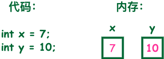

# 第4天

java中的基础数据类型，也就是数据，数据库存储数据类型，看看需要什么样的数据  无需强制去记忆

## 基本数据类型

变量就是申请内存来存储值。也就是说，当创建变量的时候，需要在内存中申请空间。

内存管理系统根据变量的类型为变量分配存储空间，分配的空间只能用来储存该类型数据。



因此，通过定义不同类型的变量，可以在内存中储存整数、小数或者字符。

## Java 的两大数据类型

内置数据类型

引用数据类型

## 内置数据类型

Java语言提供了八种基本类型。六种数字类型（四个整数型，两个浮点型），一种字符类型，还有一种布尔型。

byte：

```java
最小值是 -128（-2^7）；
最大值是 127（2^7-1）；
默认值是 0；
byte 类型用在大型数组中节约空间，主要代替整数，因为 byte 变量占用的空间只有 int 类型的四分之一；
例子：byte a = 100，byte b = -50。
```

byte 数据类型是8位、有符号的，以二进制补码表示的整数；

### 二进制补码是什么

二进制补码是一种用于表示有符号整数的方法，它允许我们使用二进制数来表示正数和负数。在二进制补码中，最高位（最左边的一位）被用作符号位，0表示正数，1表示负数。其余位用于表示数值的大小。

例如，假设我们有一个8位的二进制数，那么最高位就是符号位，其余7位用于表示数值。如果我们想要表示-5，我们可以使用二进制补码来表示它。首先，我们将5转换为二进制数，得到101。然后，我们将这个二进制数取反，得到010。最后，我们在取反后的结果上加1，得到011。因此，-5的二进制补码表示就是011。

二进制补码的一个重要特性是，它使得加法和减法操作可以统一处理。例如，如果我们想要计算5+（-3），我们可以将-3的二进制补码表示010转换为正数，得到3。然后，我们将5和3相加，得到8。因此，5+（-3）的结果就是8。

二进制补码的另一个重要特性是，它使得负数的表示是唯一的。例如，-5的二进制补码表示是011，而-6的二进制补码表示是100。因此，我们可以通过二进制补码来唯一地表示所有的负数。

总的来说，二进制补码是一种用于表示有符号整数的方法，它允许我们使用二进制数来表示正数和负数，并且使得加法和减法操作可以统一处理。

short：

```java
short 数据类型是 16 位、有符号的以二进制补码表示的整数
最小值是 -32768（-2^15）；
最大值是 32767（2^15 - 1）；
Short 数据类型也可以像 byte 那样节省空间。一个short变量是int型变量所占空间的二分之一；
默认值是 0；
例子：short s = 1000，short r = -20000。
```

int：

```java
int 数据类型是32位、有符号的以二进制补码表示的整数；
最小值是 -2,147,483,648（-2^31）；
最大值是 2,147,483,647（2^31 - 1）；
一般地整型变量默认为 int 类型；
默认值是 0 ；
例子：int a = 100000, int b = -200000。
```

long：

```java
long 数据类型是 64 位、有符号的以二进制补码表示的整数；
最小值是 -9,223,372,036,854,775,808（-2^63）；
最大值是 9,223,372,036,854,775,807（2^63 -1）；
这种类型主要使用在需要比较大整数的系统上；
默认值是 0L；
例子： long a = 100000L，long b = -200000L。
"L"理论上不分大小写，但是若写成"l"容易与数字"1"混淆，不容易分辩。所以最好大写。
```

float：

```java
float 数据类型是单精度、32位、符合IEEE 754标准的浮点数；
float 在储存大型浮点数组的时候可节省内存空间；
默认值是 0.0f；
浮点数不能用来表示精确的值，如货币；
例子：float f1 = 234.5f。
```

double：

```java
double 数据类型是双精度、64 位、符合 IEEE 754 标准的浮点数；
浮点数的默认类型为 double 类型；
double类型同样不能表示精确的值，如货币；
默认值是 0.0d；
```

boolean：

```java
boolean数据类型表示一位的信息；
只有两个取值：true 和 false；
这种类型只作为一种标志来记录 true/false 情况；
默认值是 false；
例子：boolean one = true。
```

char：

```java
char 类型是一个单一的 16 位 Unicode 字符；
最小值是 \u0000（十进制等效值为 0）；
最大值是 \uffff（即为 65535）；
char 数据类型可以储存任何字符；
例子：char letter = 'A';。
```

## 实例

```java
public class PrimitiveTypeTest {  
    public static void main(String[] args) {  
        // byte  
        System.out.println("基本类型：byte 二进制位数：" + Byte.SIZE);  
        System.out.println("包装类：java.lang.Byte");  
        System.out.println("最小值：Byte.MIN_VALUE=" + Byte.MIN_VALUE);  
        System.out.println("最大值：Byte.MAX_VALUE=" + Byte.MAX_VALUE);  
        System.out.println();  
  
        // short  
        System.out.println("基本类型：short 二进制位数：" + Short.SIZE);  
        System.out.println("包装类：java.lang.Short");  
        System.out.println("最小值：Short.MIN_VALUE=" + Short.MIN_VALUE);  
        System.out.println("最大值：Short.MAX_VALUE=" + Short.MAX_VALUE);  
        System.out.println();  
  
        // int  
        System.out.println("基本类型：int 二进制位数：" + Integer.SIZE);  
        System.out.println("包装类：java.lang.Integer");  
        System.out.println("最小值：Integer.MIN_VALUE=" + Integer.MIN_VALUE);  
        System.out.println("最大值：Integer.MAX_VALUE=" + Integer.MAX_VALUE);  
        System.out.println();  
  
        // long  
        System.out.println("基本类型：long 二进制位数：" + Long.SIZE);  
        System.out.println("包装类：java.lang.Long");  
        System.out.println("最小值：Long.MIN_VALUE=" + Long.MIN_VALUE);  
        System.out.println("最大值：Long.MAX_VALUE=" + Long.MAX_VALUE);  
        System.out.println();  
  
        // float  
        System.out.println("基本类型：float 二进制位数：" + Float.SIZE);  
        System.out.println("包装类：java.lang.Float");  
        System.out.println("最小值：Float.MIN_VALUE=" + Float.MIN_VALUE);  
        System.out.println("最大值：Float.MAX_VALUE=" + Float.MAX_VALUE);  
        System.out.println();  
  
        // double  
        System.out.println("基本类型：double 二进制位数：" + Double.SIZE);  
        System.out.println("包装类：java.lang.Double");  
        System.out.println("最小值：Double.MIN_VALUE=" + Double.MIN_VALUE);  
        System.out.println("最大值：Double.MAX_VALUE=" + Double.MAX_VALUE);  
        System.out.println();  
  
        // char  
        System.out.println("基本类型：char 二进制位数：" + Character.SIZE);  
        System.out.println("包装类：java.lang.Character");  
        // 以数值形式而不是字符形式将Character.MIN_VALUE输出到控制台  
        System.out.println("最小值：Character.MIN_VALUE="  
                + (int) Character.MIN_VALUE);  
        // 以数值形式而不是字符形式将Character.MAX_VALUE输出到控制台  
        System.out.println("最大值：Character.MAX_VALUE="  
                + (int) Character.MAX_VALUE);  
    }  
}
```

```java
基本类型：byte 二进制位数：8
包装类：java.lang.Byte
最小值：Byte.MIN_VALUE=-128
最大值：Byte.MAX_VALUE=127

基本类型：short 二进制位数：16
包装类：java.lang.Short
最小值：Short.MIN_VALUE=-32768
最大值：Short.MAX_VALUE=32767

基本类型：int 二进制位数：32
包装类：java.lang.Integer
最小值：Integer.MIN_VALUE=-2147483648
最大值：Integer.MAX_VALUE=2147483647

基本类型：long 二进制位数：64
包装类：java.lang.Long
最小值：Long.MIN_VALUE=-9223372036854775808
最大值：Long.MAX_VALUE=9223372036854775807

基本类型：float 二进制位数：32
包装类：java.lang.Float
最小值：Float.MIN_VALUE=1.4E-45
最大值：Float.MAX_VALUE=3.4028235E38

基本类型：double 二进制位数：64
包装类：java.lang.Double
最小值：Double.MIN_VALUE=4.9E-324
最大值：Double.MAX_VALUE=1.7976931348623157E308

基本类型：char 二进制位数：16
包装类：java.lang.Character
最小值：Character.MIN_VALUE=0
最大值：Character.MAX_VALUE=65535

```

## 类型默认值

```java
数据类型	默认值
int	0
long	0L
short	0
char	'\u0000'
byte	0
float	0.0f
double	0.0d
boolean	false
引用类型（类、接口、数组）	null
```

说明：

1. int, short, long, byte 的默认值是0。 
2. char 的默认值是 \u0000（空字符）。 
3. float 的默认值是 0.0f。 
4. double 的默认值是 0.0d。 
5. boolean 的默认值是 false。 
6. 引用类型（类、接口、数组）的默认值是 null。

### 实例

```java
public class Test {
    static boolean bool;
    static byte by;
    static char ch;
    static double d;
    static float f;
    static int i;
    static long l;
    static short sh;
    static String str;
 
    public static void main(String[] args) {
        System.out.println("Bool :" + bool);
        System.out.println("Byte :" + by);
        System.out.println("Character:" + ch);
        System.out.println("Double :" + d);
        System.out.println("Float :" + f);
        System.out.println("Integer :" + i);
        System.out.println("Long :" + l);
        System.out.println("Short :" + sh);
        System.out.println("String :" + str);
    }
}
```

实例输出结果为：

```java
Bool     :false
Byte     :0
Character:
Double   :0.0
Float    :0.0
Integer  :0
Long     :0
Short    :0
String   :null
```

## 引用类型

在Java中，引用类型的变量非常类似于C/C++的指针。引用类型指向一个对象，指向对象的变量是引用变量。这些变量在声明时被指定为一个特定的类型，比如 Employee、Puppy 等。变量一旦声明后，类型就不能被改变了。

对象、数组都是引用数据类型。

所有引用类型的默认值都是null。

一个引用变量可以用来引用任何与之兼容的类型。

例子：Site site = new Site("Runoob")。

## Java 常量

常量在程序运行时是不能被修改的。

在 Java 中使用 final 关键字来修饰常量，声明方式和变量类似：

```java
final double PI = 3.1415927;
```

## 自动类型转换

转换从低级到高级。

```java
低  ------------------------------------>  高

byte,short,char—> int —> long—> float —> double 

```

数据类型转换必须满足如下规则：

1. 不能对boolean类型进行类型转换。

2. 不能把对象类型转换成不相关类的对象。

3. 在把容量大的类型转换为容量小的类型时必须使用强制类型转换。

4. 转换过程中可能导致溢出或损失精度，例如：

```java
int i =128;   
byte b = (byte)i;

```

因为 byte 类型是 8 位，最大值为127，所以当 int 强制转换为 byte 类型时，值 128 时候就会导致溢出。

5. 浮点数到整数的转换是通过舍弃小数得到，而不是四舍五入，例如：

```java
(int)23.7 == 23;        
(int)-45.89f == -45

```

## 自动类型转换

必须满足转换前的数据类型的位数要低于转换后的数据类型，例如: short数据类型的位数为16位，就可以自动转换位数为32的int类型，同样float数据类型的位数为32，可以自动转换为64位的double类型。

### 强制类型转换

实例

```java
public class ForceTransform {
    public static void main(String[] args){
        int i1 = 123;
        byte b = (byte)i1;//强制类型转换为byte
        System.out.println("int强制类型转换为byte后的值等于"+b);
    }
}
```

## 隐含强制类型转换

1、 整数的默认类型是 int。

2、 小数默认是 double 类型浮点型，在定义 float 类型时必须在数字后面跟上 F 或者 f。

