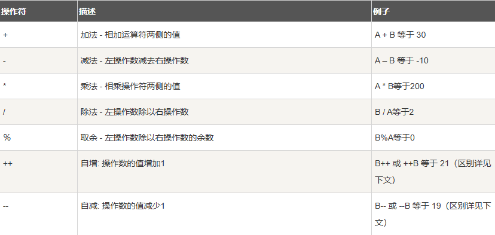
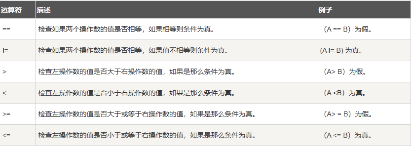
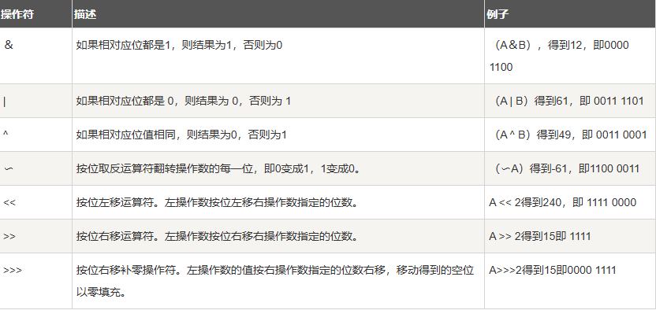
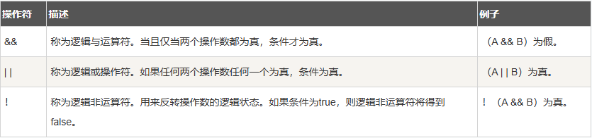
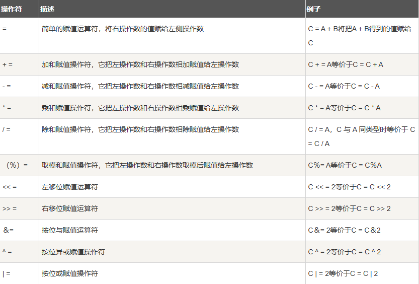
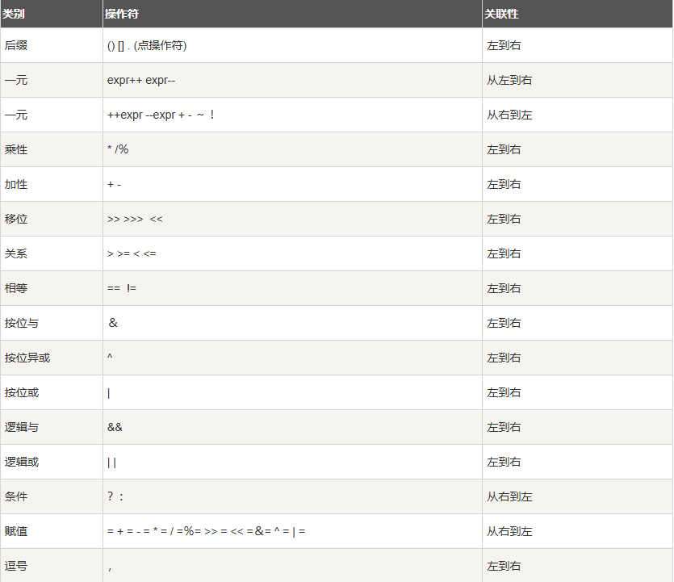

# 第8天

> 学习编程要劳逸结合哦，记得多喝水休息眼睛～

今天比较轻松，认识运算符

我们可以把运算符分成以下几组：

1. 算术运算符 
2. 关系运算符 
3. 位运算符 
4. 逻辑运算符 
5. 赋值运算符 
6. 其他运算符

也是一样用看的，不用记住，多敲多练就行

算术运算符

关系运算符

位运算符

逻辑运算符

赋值运算符

Java运算符优先级

---

> 又学会了新技能！继续保持这个学习节奏，下一篇见～