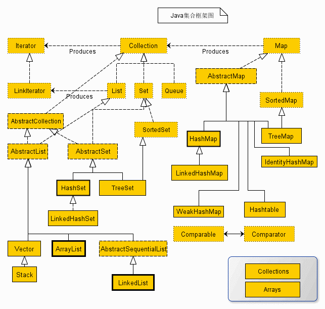
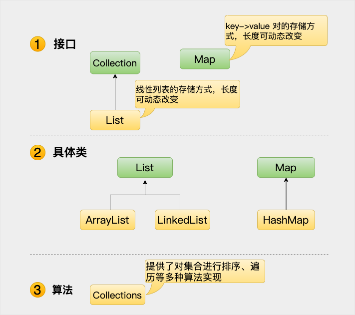

# 第32天


用来存储和操作对象组。 集合代表多，一个整体，一个教室里的学生集合

高效地处理数据

## Java 集合框架

整个集合框架就围绕一组标准接口而设计。你可以直接使用这些接口的标准实现，诸如： LinkedList, HashSet, 和 TreeSet 等,除此之外你也可以通过这些接口实现自己的集合。



## 集合框架体系如图所示



Java 集合框架是 Java 提供的一组接口和类，用于存储和操作一组对象。它提供了一套标准化的数据结构，使得开发者可以更方便地处理数据。Java 集合框架主要包括以下几个部分：

1. **接口（Interfaces）**：定义了集合的基本操作，如添加、删除、遍历等。常见的接口有 `Collection`、`List`、`Set`、`Map` 等。

2. **实现类（Classes）**：实现了上述接口的具体类，如 `ArrayList`、`LinkedList`、`HashSet`、`HashMap` 等。

3. **工具类（Utility Classes）**：提供了一些静态方法，用于操作集合，如 `Collections` 类。

4. **迭代器（Iterators）**：用于遍历集合中的元素。

### 实现原理

Java 集合框架的实现原理基于接口和实现类分离的设计模式。接口定义了集合的基本操作，而实现类则提供了这些操作的具体实现。通过使用接口，可以编写更加通用和灵活的代码，因为接口可以用于多种不同的实现类。

### 用途

Java 集合框架广泛应用于各种场景，如：

- 存储和操作一组对象。
- 实现数据结构，如栈、队列、树、图等。
- 提供高效的查找、插入和删除操作。

### 注意事项

1. **选择合适的集合类**：根据具体需求选择合适的集合类，如 `ArrayList`、`LinkedList`、`HashSet`、`HashMap` 等。

2. **线程安全**：如果需要在多线程环境下使用集合，需要考虑线程安全问题。可以使用 `Collections.synchronizedList()`、`Collections.synchronizedSet()`、`Collections.synchronizedMap()` 等方法来创建线程安全的集合。

3. **性能考虑**：不同的集合类在性能上有不同的特点，如 `ArrayList` 插入和删除操作在尾部性能较好，而 `LinkedList` 在头部性能较好。根据具体需求选择合适的集合类。

4. **泛型**：使用泛型可以避免类型转换，提高代码的安全性和可读性。

通过了解和使用 Java 集合框架，可以更高效地处理数据，提高代码的可维护性和可扩展性。

```java
import java.util.ArrayList;
import java.util.HashMap;
import java.util.HashSet;
import java.util.List;
import java.util.Map;
import java.util.Set;

public class CollectionExample {
    public static void main(String[] args) {
        // 使用 ArrayList 存储一组整数
        List<Integer> numbers = new ArrayList<>();
        numbers.add(1);
        numbers.add(2);
        numbers.add(3);
        System.out.println(numbers); // 输出: [1, 2, 3]

        // 使用 HashSet 存储一组不重复的字符串
        Set<String> words = new HashSet<>();
        words.add("apple");
        words.add("banana");
        words.add("orange");
        System.out.println(words); // 输出: [orange, apple, banana]

        // 使用 HashMap 存储一组键值对
        Map<String, Integer> scores = new HashMap<>();
        scores.put("Alice", 90);
        scores.put("Bob", 85);
        scores.put("Charlie", 95);
        System.out.println(scores); // 输出: {Charlie=95, Bob=85, Alice=90}
    }
}

```

使用了 Java 集合框架中的 `ArrayList`、`HashSet` 和 `HashMap` 来存储和操作一组对象。`ArrayList` 用于存储一组整数，`HashSet` 用于存储一组不重复的字符串，`HashMap` 用于存储一组键值对。通过这些示例，我们可以看到 Java 集合框架的灵活性和强大功能。

这段代码展示了Java中三种常用集合类的使用方法：ArrayList、HashSet和HashMap。

### 1. ArrayList
`ArrayList`是Java中的一个动态数组实现，可以存储一组有序的元素。它允许重复的元素，并且可以通过索引访问元素。

### 2. HashSet
`HashSet`是Java中的一个集合实现，用于存储一组不重复的元素。它不保证元素的顺序，但可以快速地添加、删除和查找元素。

### 3. HashMap
`HashMap`是Java中的一个键值对集合，用于存储一组键值对。键是唯一的，值可以是任何对象。它允许通过键快速查找值。

### 注意事项
- **ArrayList**适用于需要快速访问元素的场景，但插入和删除元素可能会比较慢。
- **HashSet**适用于需要存储不重复元素的场景，但无法保证元素的顺序。
- **HashMap**适用于需要存储键值对并快速通过键查找值的场景。

### 用途
这些集合类在Java编程中非常常用，用于存储和管理数据。根据不同的需求选择合适的集合类可以提高代码的效率和可读性。


---

> 学习编程就像搭积木，一块一块慢慢来，下一篇继续加油！