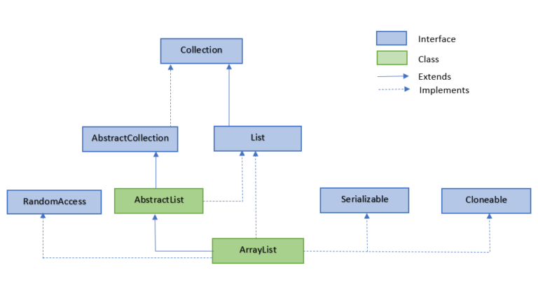

# 第33天

> 记得定时站起来活动活动～

## Java ArrayList

ArrayList 类是一个可以动态修改的数组，与普通数组的区别就是它是没有固定大小的限制，我们可以添加或删除元素。

ArrayList 继承了 AbstractList ，并实现了 List 接口。



ArrayList 类位于 java.util 包中，使用前需要引入它，语法格式如下：

```java
import java.util.ArrayList; // 引入 ArrayList 类

ArrayList<E> objectName =new ArrayList<>();　 // 初始化
```

`ArrayList` 是 Java 集合框架中的一个类，实现了 `List` 接口。它是一个动态数组，可以存储一组有序的元素。`ArrayList` 允许重复的元素，并且可以通过索引访问元素。

### 实现原理

`ArrayList` 内部使用一个数组来存储元素。当添加元素时，如果数组已满，会创建一个新的数组，其大小是原数组的1.5倍，并将原数组中的元素复制到新数组中。这种动态扩容机制使得 `ArrayList` 可以高效地添加元素。

### 主要方法

1. **创建 ArrayList**：

```java
List<String> list = new ArrayList<>();
```

2. **添加元素**：
```java
list.add("Hello");
list.add("World");
```

3. **获取元素**：
```java
String element = list.get(0); // 获取第一个元素
```

4. **修改元素**：
```java
list.set(0, "Hi"); // 将第一个元素修改为 "Hi"
```

5. **删除元素**：
```java
list.remove(0); // 删除第一个元素
```

6. **遍历 ArrayList**：
```java
for (String str : list) {
  System.out.println(str);
}
```

### 注意事项

1. **线程安全**：`ArrayList` 不是线程安全的，如果多个线程同时访问和修改 `ArrayList`，可能会导致数据不一致。如果需要在多线程环境下使用 `ArrayList`，可以使用 `Collections.synchronizedList()` 方法创建线程安全的 `ArrayList`。

2. **性能考虑**：`ArrayList` 插入和删除元素在尾部性能较好，但在头部性能较差。如果需要在头部频繁插入和删除元素，可以考虑使用 `LinkedList`。

3. **泛型**：使用泛型可以避免类型转换，提高代码的安全性和可读性。

### 示例代码

```java
import java.util.ArrayList;
import java.util.List;

public class ArrayListExample {
   public static void main(String[] args) {
      List<String> list = new ArrayList<>();
      list.add("Hello");
      list.add("World");
      System.out.println(list); // 输出: [Hello, World]

      String firstElement = list.get(0);
      System.out.println(firstElement); // 输出: Hello

      list.set(0, "Hi");
      System.out.println(list); // 输出: [Hi, World]

      list.remove(0);
      System.out.println(list); // 输出: [World]

      for (String str : list) {
         System.out.println(str);
      }
      // 输出:
      // World
   }
}

```

在这个示例中，我们创建了一个 `ArrayList`，并演示了如何添加、获取、修改、删除和遍历元素。

## Java ArrayList 方法

不用记太多，因为少用，没必要用太多。真实项目中，保证内存不溢出，保证变量被垃圾回收器回收。

Java ArrayList 常用方法列表如下：

方法	描述

add()	将元素插入到指定位置的 arraylist 中

addAll()	添加集合中的所有元素到 arraylist 中

clear()	删除 arraylist 中的所有元素

clone()	复制一份 arraylist

contains()	判断元素是否在 arraylist

get()	通过索引值获取 arraylist 中的元素

indexOf()	返回 arraylist 中元素的索引值

removeAll()	删除存在于指定集合中的 arraylist 里的所有元素

remove()	删除 arraylist 里的单个元素

size()	返回 arraylist 里元素数量

isEmpty()	判断 arraylist 是否为空

subList()	截取部分 arraylist 的元素

set()	替换 arraylist 中指定索引的元素

sort()	对 arraylist 元素进行排序

toArray()	将 arraylist 转换为数组

toString()	将 arraylist 转换为字符串

ensureCapacity()	设置指定容量大小的 arraylist

lastIndexOf()	返回指定元素在 arraylist 中最后一次出现的位置

retainAll()	保留 arraylist 中在指定集合中也存在的那些元素

containsAll()	查看 arraylist 是否包含指定集合中的所有元素

trimToSize()	将 arraylist 中的容量调整为数组中的元素个数

removeRange()	删除 arraylist 中指定索引之间存在的元素

replaceAll()	将给定的操作内容替换掉数组中每一个元素

removeIf()	删除所有满足特定条件的 arraylist 元素

forEach()	遍历 arraylist 中每一个元素并执行特定操作


---

> 学习路上每一步都很重要，下一篇继续深入探索编程世界吧！