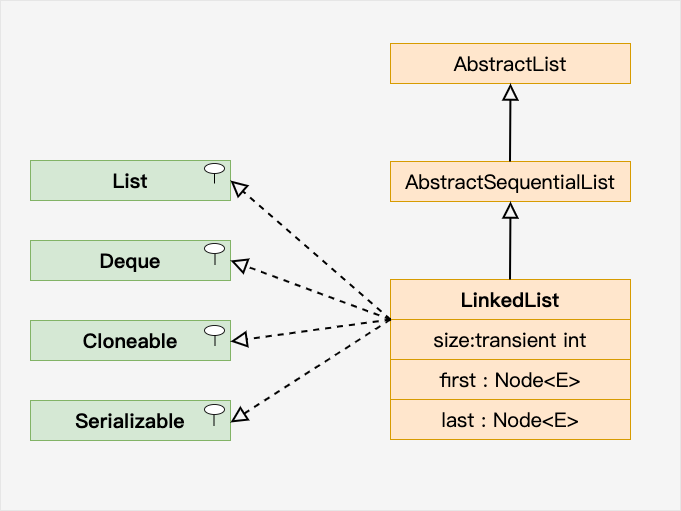

# 第34天

## Java LinkedList

链表（Linked list）是一种常见的基础数据结构，是一种线性表，但是并不会按线性的顺序存储数据，而是在每一个节点里存到下一个节点的地址。

链表可分为单向链表和双向链表。

一个单向链表包含两个值: 当前节点的值和一个指向下一个节点的链接。


一个双向链表有三个整数值: 数值、向后的节点链接、向前的节点链接。


ava LinkedList（链表） 类似于 ArrayList，是一种常用的数据容器。

与 ArrayList 相比，LinkedList 的增加和删除的操作效率更高，而查找和修改的操作效率较低。

### 以下情况使用 ArrayList :

1. 频繁访问列表中的某一个元素。 
2. 只需要在列表末尾进行添加和删除元素操作。

### 以下情况使用 LinkedList :

1. 你需要通过循环迭代来访问列表中的某些元素。
2. 需要频繁的在列表开头、中间、末尾等位置进行添加和删除元素操作。

LinkedList 继承了 AbstractSequentialList 类。

LinkedList 实现了 Queue 接口，可作为队列使用。

LinkedList 实现了 List 接口，可进行列表的相关操作。

LinkedList 实现了 Deque 接口，可作为队列使用。

LinkedList 实现了 Cloneable 接口，可实现克隆。

LinkedList 实现了 java.io.Serializable 接口，即可支持序列化，能通过序列化去传输。



`LinkedList` 是 Java 集合框架中的一个类，实现了 `List` 接口。它是一个双向链表，可以存储一组有序的元素。`LinkedList` 允许重复的元素，并且可以通过索引访问元素。

### 实现原理

`LinkedList` 内部使用一个双向链表来存储元素。每个节点包含一个元素和两个指针，分别指向前一个节点和后一个节点。这种结构使得 `LinkedList` 可以高效地在头部和尾部插入和删除元素。

### 主要方法

1. **创建 LinkedList**：
2. **添加元素**：
3. **获取元素**：
4. **修改元素**：
5. **删除元素**：
6. **遍历 LinkedList**：

### 注意事项

1. **线程安全**：`LinkedList` 不是线程安全的，如果多个线程同时访问和修改 `LinkedList`，可能会导致数据不一致。如果需要在多线程环境下使用 `LinkedList`，可以使用 `Collections.synchronizedList()` 方法创建线程安全的 `LinkedList`。

2. **性能考虑**：`LinkedList` 插入和删除元素在头部性能较好，但在尾部性能较差。如果需要在尾部频繁插入和删除元素，可以考虑使用 `ArrayList`。

3. **泛型**：使用泛型可以避免类型转换，提高代码的安全性和可读性。

```java
import java.util.LinkedList;
import java.util.List;

public class LinkedListExample {
    public static void main(String[] args) {
        // 创建 LinkedList
        List<String> list = new LinkedList<>();

        // 添加元素
        list.add("Hello");
        list.add("World");

        // 获取元素
        String firstElement = list.get(0);
        System.out.println(firstElement); // 输出: Hello

        // 修改元素
        list.set(0, "Hi");
        System.out.println(list); // 输出: [Hi, World]

        // 删除元素
        list.remove(0);
        System.out.println(list); // 输出: [World]

        // 遍历 LinkedList
        for (String str : list) {
            System.out.println(str);
        }
        // 输出:
        // World
    }
}

```

这段代码展示了如何创建、添加、获取、修改、删除和遍历 `LinkedList`。在 `main` 方法中，我们首先创建了一个 `LinkedList`，然后添加了两个元素。接着，我们获取了第一个元素，并修改了第一个元素。然后，我们删除了第一个元素，并遍历了 `LinkedList` 中的所有元素。最后，我们打印出了遍历结果。


