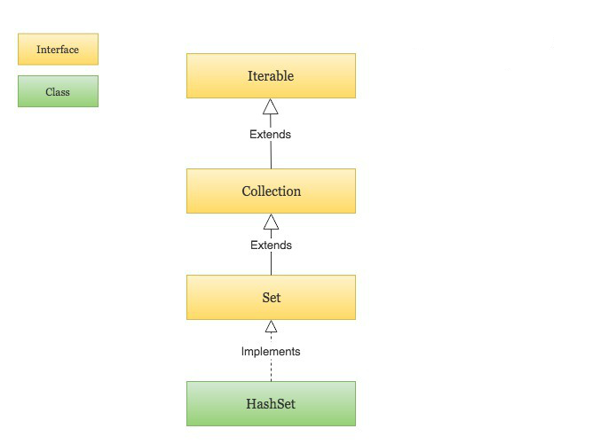
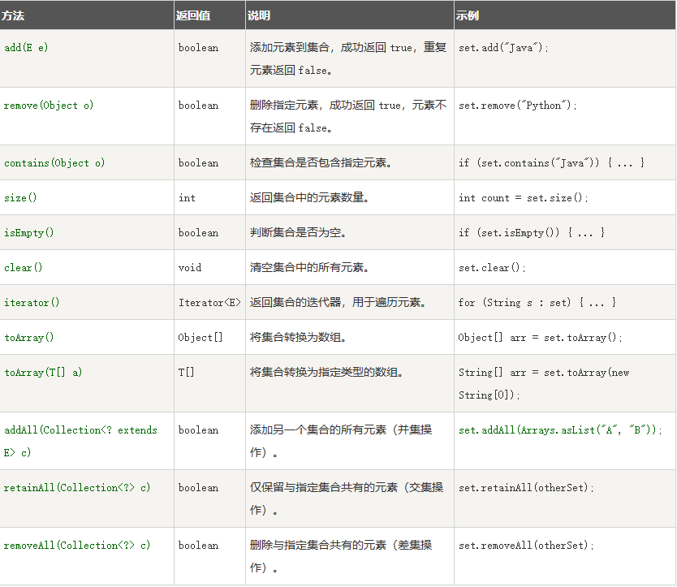

# 第35天

## Java HashSet

HashSet 基于 HashMap 来实现的，是一个不允许有重复元素的集合。

HashSet 允许有 null 值。

HashSet 是无序的，即不会记录插入的顺序。

HashSet 不是线程安全的， 如果多个线程尝试同时修改 HashSet，则最终结果是不确定的。 您必须在多线程访问时显式同步对 HashSet 的并发访问。

HashSet 实现了 Set 接口。



HashSet 是 Java 集合框架中的一个类，实现了 Set 接口。它是一个无序的集合，不允许存储重复的元素。HashSet 使用哈希表（Hash table）来存储元素，因此可以高效地进行添加、删除和查找操作。

## 实现原理

HashSet 内部使用一个哈希表来存储元素。哈希表是一种数据结构，它使用哈希函数将元素映射到一个索引位置，从而实现快速的查找、插入和删除操作。哈希函数将元素转换为哈希码，哈希码是一个整数，用于表示元素在哈希表中的位置。如果两个元素具有相同的哈希码，它们将被存储在同一个位置，这种现象称为哈希冲突。HashSet 使用链表来解决哈希冲突，即当多个元素具有相同的哈希码时，它们将被存储在同一个位置的链表中。

```java
import java.util.HashSet;
import java.util.Set;

public class HashSetExample {
    public static void main(String[] args) {
        // 创建 HashSet
        Setset = new HashSet();

        // 添加元素
        set.add("Hello");
        set.add("World");

        // 判断元素是否存在
        boolean contains = set.contains("Hello");
        System.out.println(contains); // 输出: true

        // 删除元素
        set.remove("Hello");

        // 遍历 HashSet
        for (String str : set) {
            System.out.println(str);
        }
        // 输出:
        // World
    }
}

```

## HashSet 常用方法


