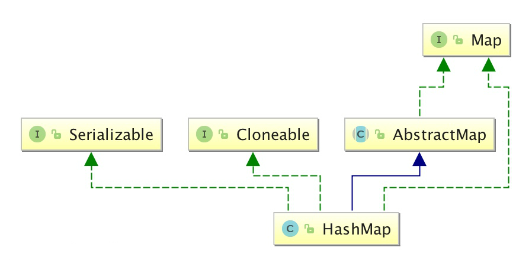
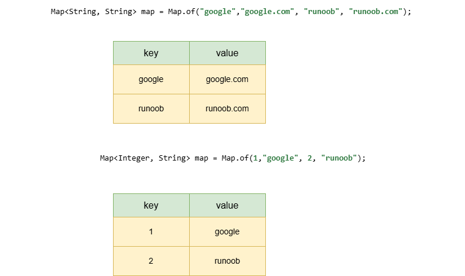

# 第36天

## Java HashMap

HashMap 是一个散列表，它存储的内容是键值对(key-value)映射。

HashMap 实现了 Map 接口，根据键的 HashCode 值存储数据，具有很快的访问速度，最多允许一条记录的键为 null，不支持线程同步。

HashMap 是无序的，即不会记录插入的顺序。

HashMap 继承于AbstractMap，实现了 Map、Cloneable、java.io.Serializable 接口。



HashMap 的 key 与 value 类型可以相同也可以不同，可以是字符串（String）类型的 key 和 value，也可以是整型（Integer）的 key 和字符串（String）类型的 value。



`HashMap` 是 Java 集合框架中的一个重要类，它实现了 `Map` 接口，用于存储键值对（key-value pairs）。`HashMap` 提供了高效的键值对存储和查找功能，并且允许使用 null 值和 null 键。

### 实现原理

`HashMap` 使用哈希表（Hash Table）数据结构来存储键值对。哈希表通过使用哈希函数将键转换为哈希码（hash code），然后根据哈希码将键值对存储在适当的桶（bucket）中。当需要查找某个键时，`HashMap` 会使用相同的哈希函数计算键的哈希码，然后直接定位到相应的桶中，从而实现快速的查找。

### 主要方法

- `put(Object key, Object value)`: 将指定的键值对插入到 `HashMap` 中。
- `get(Object key)`: 返回指定键所映射的值，如果此映射不包含该键的映射关系，则返回 `null`。
- `remove(Object key)`: 如果存在一个键的映射关系，则将其从此映射中移除。
- `containsKey(Object key)`: 如果此映射包含指定键的映射关系，则返回 `true`。
- `containsValue(Object value)`: 如果此映射将一个或多个键映射到指定值，则返回 `true`。
- `size()`: 返回此映射中的键值对数。
- `isEmpty()`: 如果此映射未包含键值对关系，则返回 `true`。

### 注意事项

1. **线程安全性**：`HashMap` 不是线程安全的。如果多个线程同时访问一个 `HashMap`，并且至少一个线程修改了该映射，则必须手动同步各个线程对 `HashMap` 的访问。
2. **null 值和 null 键**：`HashMap` 允许一个 null 键和多个 null 值。但是，如果使用 null 键，则无法通过 `get()` 方法准确判断该键是否真的存在，因为 `get(null)` 可能返回 null，也可能返回与 null 键关联的值。
3. **哈希冲突**：当两个不同的键产生相同的哈希码时，会发生哈希冲突。`HashMap` 使用链表和红黑树来处理哈希冲突，当链表长度超过一定阈值时，链表会转换为红黑树，以提高查找效率。
4. **性能**：`HashMap` 的性能主要取决于哈希函数的质量和桶的数量。如果哈希函数的质量较差，或者桶的数量不足，则可能导致哈希冲突频繁，从而降低 `HashMap` 的性能。
5. **遍历**：遍历 `HashMap` 时，键值对的顺序是不确定的，因此不能依赖于特定的顺序。

### 用途

`HashMap` 广泛用于需要快速查找和插入键值对的应用场景，例如缓存、数据库查询结果存储、配置参数存储等。由于其高效的性能和灵活性，`HashMap` 是 Java 编程中非常常用的数据结构之一。


```java
import java.util.HashMap;
import java.util.Map;

public class HashMapExample {
    public static void main(String[] args) {
        // 创建 HashMap
        Map<String, Integer> map = new HashMap<>();

        // 添加键值对
        map.put("Apple", 1);
        map.put("Banana", 2);
        map.put("Cherry", 3);

        // 获取值
        int value = map.get("Banana");
        System.out.println(value); // 输出: 2

        // 判断键是否存在
        boolean containsKey = map.containsKey("Apple");
        System.out.println(containsKey); // 输出: true

        // 判断值是否存在
        boolean containsValue = map.containsValue(3);
        System.out.println(containsValue); // 输出: true

        // 删除键值对
        map.remove("Cherry");

        // 遍历 HashMap
        for (Map.Entry<String, Integer> entry : map.entrySet()) {
            System.out.println(entry.getKey() + ": " + entry.getValue());
        }
        // 输出:
        // Apple: 1
        // Banana: 2
    }
}

```

这段代码展示了如何创建、添加、获取、判断键值对是否存在、删除和遍历 `HashMap`。在 `main` 方法中，我们首先创建了一个 `HashMap`，然后添加了三个键值对。接着，我们获取了键为 &quot;Banana&quot; 的值，并判断了键 &quot;Apple&quot; 和值 3 是否存在。然后，我们删除了键为 &quot;Cherry&quot; 的键值对。最后，我们遍历了 `HashMap` 中的所有键值对，并打印出了结果。


