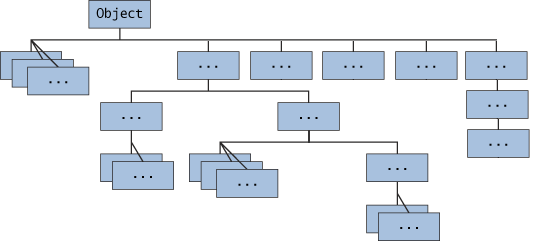

# 第38天


## Java Object 类

Java Object 类是所有类的父类，也就是说 Java 的所有类都继承了 Object，子类可以使用 Object 的所有方法。



Object 类位于 java.lang 包中，编译时会自动导入，我们创建一个类时，如果没有明确继承一个父类，那么它就会自动继承 Object，成为 Object 的子类。

Object 类可以显式继承，也可以隐式继承，以下两种方式是一样的：

显式继承:

```java
public class Da extends Object{

}
```

隐式继承:

```java
public class Da {

}
```

`Object` 类是 Java 中所有类的根类，即每个 Java 类都直接或间接继承自 `Object` 类。`Object` 类提供了一些通用的方法，这些方法可以被所有 Java 对象使用。

### 实现原理

`Object` 类是 Java 类层次结构的根类。每个 Java 类都直接或间接继承自 `Object` 类。`Object` 类提供了一些通用的方法，如 `equals()`、`hashCode()`、`toString()` 等。

### 主要方法

1. **`equals(Object obj)`**：比较两个对象是否相等。默认实现是使用 `==` 运算符比较两个对象的引用，通常需要重写该方法。
2. **`hashCode()`**：返回对象的哈希码值。默认实现是返回对象的内存地址的哈希码，通常需要重写该方法。
3. **`toString()`**：返回对象的字符串表示。默认实现是返回类名和对象的哈希码的十六进制表示，通常需要重写该方法。
4. **`clone()`**：创建并返回对象的一个副本。默认实现是浅复制，通常需要重写该方法。
5. **`getClass()`**：返回对象的运行时类。
6. **`notify()`、`notifyAll()`、`wait()`**：用于线程间的通信。

### 用途

`Object` 类的方法在 Java 编程中非常常用，如比较对象是否相等、获取对象的字符串表示、克隆对象等。

### 注意事项

1. **重写 `equals()` 和 `hashCode()`**：当重写 `equals()` 方法时，通常需要同时重写 `hashCode()` 方法，以确保两个相等的对象具有相同的哈希码。
2. **重写 `toString()`**：重写 `toString()` 方法可以提供对象的详细字符串表示，便于调试和日志记录。
3. **克隆对象**：`clone()` 方法用于创建对象的副本，但默认实现是浅复制，如果对象包含可变的成员变量，需要重写 `clone()` 方法实现深复制。
4. **线程安全**：`notify()`、`notifyAll()`、`wait()` 方法用于线程间的通信，使用时需要确保线程安全。

### 示例代码

```java
//private int value;
//这是一个私有成员变量，用于存储整数值。
//public MyClass(int value)
//这是一个公共构造方法，用于创建 MyClass 对象并初始化 value 成员变量。
//@Override
//这个注解表示该方法重写了父类 Object 中的 equals 方法。

public class MyClass extends Object {
    private int value;

    public MyClass(int value) {
        this.value = value;
    }

    //这个方法用于比较两个 MyClass 对象是否相等。
    //首先检查两个对象是否是同一个引用，如果是，则返回 true。
    //然后检查传入的对象是否为 null 或者是否与当前对象类型不同，如果是，则返回 false。
    //最后，将传入的对象强制转换为 MyClass 类型，并比较其 value 成员变量是否相等。
    @Override
    public boolean equals(Object obj) {
        if (this == obj) {
            return true;
        }
        if (obj == null || getClass() != obj.getClass()) {
            return false;
        }
        MyClass myClass = (MyClass) obj;
        return value == myClass.value;
    }

    //重写 hashCode 方法
    //这个方法用于返回对象的哈希码，通常用于哈希表结构（如 HashMap）。
    //使用 Objects.hash 方法生成哈希码，该方法会根据传入的参数生成一个哈希值。
    @Override
    public int hashCode() {
        return Objects.hash(value);
    }

    //这个方法用于返回对象的字符串表示形式。
    //返回的字符串格式为 MyClass{value=}，其中包含 value 成员变量的值。
    @Override
    public String toString() {
        return "MyClass{value=" + value + "}";
    }
}

```

在这个示例中，我们创建了一个 `MyClass` 类，它继承自 `Object` 类，并重写了 `equals()`、`hashCode()` 和 `toString()` 方法。

这个类可以用于需要自定义对象比较、哈希码生成和字符串表示的场景。

例如，可以将 MyClass 对象存储在哈希表中，并使用 equals 方法来比较对象是否相等。


---

> 这一章节掌握得怎么样？下一篇会更有趣哦，期待与你继续学习～