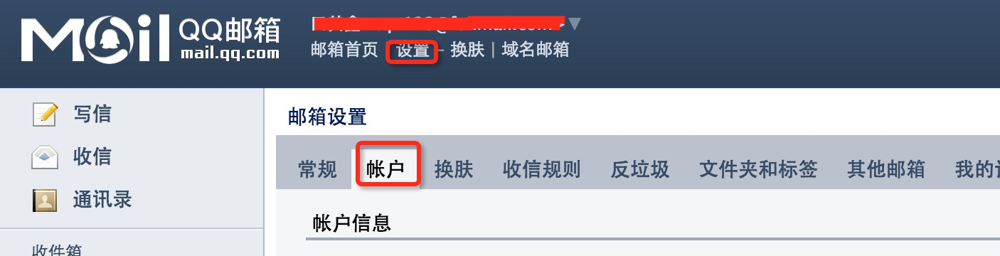
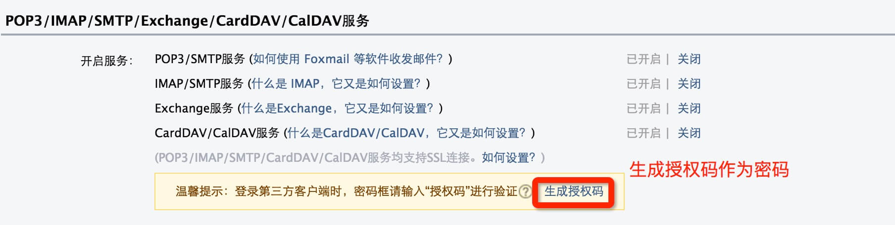

# 第43天


## Java 发送邮件

### 发送一封简单的 E-mail

SendEmail.java 文件代码：

```java
// 文件名 SendEmail.java
 
import java.util.*;
import javax.mail.*;
import javax.mail.internet.*;
import javax.activation.*;
 
public class SendEmail
{
   public static void main(String [] args)
   {   
      // 收件人电子邮箱
      String to = "abcd@gmail.com";
 
      // 发件人电子邮箱
      String from = "web@gmail.com";
 
      // 指定发送邮件的主机为 localhost
      String host = "localhost";
 
      // 获取系统属性
      Properties properties = System.getProperties();
 
      // 设置邮件服务器
      properties.setProperty("mail.smtp.host", host);
 
      // 获取默认session对象
      Session session = Session.getDefaultInstance(properties);
 
      try{
         // 创建默认的 MimeMessage 对象
         MimeMessage message = new MimeMessage(session);
 
         // Set From: 头部头字段
         message.setFrom(new InternetAddress(from));
 
         // Set To: 头部头字段
         message.addRecipient(Message.RecipientType.TO,
                                  new InternetAddress(to));
 
         // Set Subject: 头部头字段
         message.setSubject("This is the Subject Line!");
 
         // 设置消息体
         message.setText("This is actual message");
 
         // 发送消息
         Transport.send(message);
         System.out.println("Sent message successfully....");
      }catch (MessagingException mex) {
         mex.printStackTrace();
      }
   }
}
```


编译并运行这个程序来发送一封简单的E-mail：

```java
$ java SendEmail
Sent message successfully....

```

## 发送带有附件的 E-mail

```java
// 文件名 SendFileEmail.java
 
import java.util.*;
import javax.mail.*;
import javax.mail.internet.*;
import javax.activation.*;
 
public class SendFileEmail
{
   public static void main(String [] args)
   {
     
      // 收件人电子邮箱
      String to = "abcd@gmail.com";
 
      // 发件人电子邮箱
      String from = "web@gmail.com";
 
      // 指定发送邮件的主机为 localhost
      String host = "localhost";
 
      // 获取系统属性
      Properties properties = System.getProperties();
 
      // 设置邮件服务器
      properties.setProperty("mail.smtp.host", host);
 
      // 获取默认的 Session 对象。
      Session session = Session.getDefaultInstance(properties);
 
      try{
         // 创建默认的 MimeMessage 对象。
         MimeMessage message = new MimeMessage(session);
 
         // Set From: 头部头字段
         message.setFrom(new InternetAddress(from));
 
         // Set To: 头部头字段
         message.addRecipient(Message.RecipientType.TO,
                                  new InternetAddress(to));
 
         // Set Subject: 头字段
         message.setSubject("This is the Subject Line!");
 
         // 创建消息部分
         BodyPart messageBodyPart = new MimeBodyPart();
 
         // 消息
         messageBodyPart.setText("This is message body");
        
         // 创建多重消息
         Multipart multipart = new MimeMultipart();
 
         // 设置文本消息部分
         multipart.addBodyPart(messageBodyPart);
 
         // 附件部分
         messageBodyPart = new MimeBodyPart();
         String filename = "file.txt";
         DataSource source = new FileDataSource(filename);
         messageBodyPart.setDataHandler(new DataHandler(source));
         messageBodyPart.setFileName(filename);
         multipart.addBodyPart(messageBodyPart);
 
         // 发送完整消息
         message.setContent(multipart );
 
         //   发送消息
         Transport.send(message);
         System.out.println("Sent message successfully....");
      }catch (MessagingException mex) {
         mex.printStackTrace();
      }
   }
}
```

## 用户认证部分

如果需要提供用户名和密码给e-mail服务器来达到用户认证的目的，你可以通过如下设置来完成：

```java
props.put("mail.smtp.auth", "true");
props.setProperty("mail.user", "myuser");
props.setProperty("mail.password", "mypwd");
```

## 需要用户名密码验证邮件发送实例:

本实例以 QQ 邮件服务器为例，你需要在登录QQ邮箱后台在"设置"=》账号中开启POP3/SMTP服务 ，如下图所示：



QQ 邮箱通过生成授权码来设置密码：




## SendEmail2.java 文件代码：

```java
// 需要用户名密码邮件发送实例
//文件名 SendEmail2.java
//本实例以QQ邮箱为例，你需要在qq后台设置
 
import java.util.Properties;
 
import javax.mail.Authenticator;
import javax.mail.Message;
import javax.mail.MessagingException;
import javax.mail.PasswordAuthentication;
import javax.mail.Session;
import javax.mail.Transport;
import javax.mail.internet.InternetAddress;
import javax.mail.internet.MimeMessage;
 
public class SendEmail2
{
   public static void main(String [] args)
   {
      // 收件人电子邮箱
      String to = "xxx@qq.com";
 
      // 发件人电子邮箱
      String from = "xxx@qq.com";
 
      // 指定发送邮件的主机为 smtp.qq.com
      String host = "smtp.qq.com";  //QQ 邮件服务器
 
      // 获取系统属性
      Properties properties = System.getProperties();
 
      // 设置邮件服务器
      properties.setProperty("mail.smtp.host", host);
 
      properties.put("mail.smtp.auth", "true");
      // 获取默认session对象
      Session session = Session.getDefaultInstance(properties,new Authenticator(){
        public PasswordAuthentication getPasswordAuthentication()
        {
         return new PasswordAuthentication("xxx@qq.com", "qq邮箱授权码"); //发件人邮件用户名、授权码
        }
       });
 
      try{
         // 创建默认的 MimeMessage 对象
         MimeMessage message = new MimeMessage(session);
 
         // Set From: 头部头字段
         message.setFrom(new InternetAddress(from));
 
         // Set To: 头部头字段
         message.addRecipient(Message.RecipientType.TO,
                                  new InternetAddress(to));
 
         // Set Subject: 头部头字段
         message.setSubject("This is the Subject Line!");
 
         // 设置消息体
         message.setText("This is actual message");
 
         // 发送消息
         Transport.send(message);
         System.out.println("Sent message successfully....from runoob.com");
      }catch (MessagingException mex) {
         mex.printStackTrace();
      }
   }
}
```


