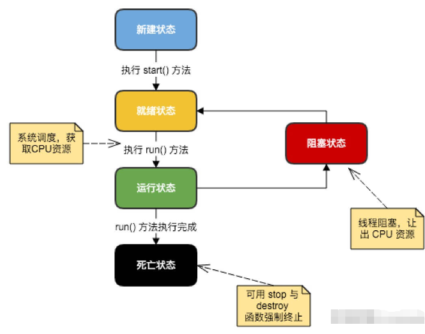

# 第44天

## Java 多线程编程

Java 给多线程编程提供了内置的支持。 一条线程指的是进程中一个单一顺序的控制流，一个进程中可以并发多个线程，每条线程并行执行不同的任务。

多线程是多任务的一种特别的形式，但多线程使用了更小的资源开销。

多线程能满足程序员编写高效率的程序来达到充分利用 CPU 的目的。

## 一个线程的生命周期

线程是一个动态执行的过程，它也有一个从产生到死亡的过程。

下图显示了一个线程完整的生命周期。



## 线程的优先级

每一个 Java 线程都有一个优先级，这样有助于操作系统确定线程的调度顺序。

## 创建一个线程

Java 提供了三种创建线程的方法：

通过实现 Runnable 接口；

通过继承 Thread 类本身；

通过 Callable 和 Future 创建线程。

## 通过实现 Runnable 接口来创建线程

```java
class RunnableDemo implements Runnable {
   private Thread t;
   private String threadName;
   
   RunnableDemo( String name) {
      threadName = name;
      System.out.println("Creating " +  threadName );
   }
   
   public void run() {
      System.out.println("Running " +  threadName );
      try {
         for(int i = 4; i > 0; i--) {
            System.out.println("Thread: " + threadName + ", " + i);
            // 让线程睡眠一会
            Thread.sleep(50);
         }
      }catch (InterruptedException e) {
         System.out.println("Thread " +  threadName + " interrupted.");
      }
      System.out.println("Thread " +  threadName + " exiting.");
   }
   
   public void start () {
      System.out.println("Starting " +  threadName );
      if (t == null) {
         t = new Thread (this, threadName);
         t.start ();
      }
   }
}
 
public class TestThread {
 
   public static void main(String args[]) {
      RunnableDemo R1 = new RunnableDemo( "Thread-1");
      R1.start();
      
      RunnableDemo R2 = new RunnableDemo( "Thread-2");
      R2.start();
   }   
}
```

编译以上程序运行结果如下：

```java
Creating Thread-1
Starting Thread-1
Creating Thread-2
Starting Thread-2
Running Thread-1
Thread: Thread-1, 4
Running Thread-2
Thread: Thread-2, 4
Thread: Thread-1, 3
Thread: Thread-2, 3
Thread: Thread-1, 2
Thread: Thread-2, 2
Thread: Thread-1, 1
Thread: Thread-2, 1
Thread Thread-1 exiting.
Thread Thread-2 exiting.

```

## 通过继承Thread来创建线程

```java
class ThreadDemo extends Thread {
   private Thread t;
   private String threadName;
   
   ThreadDemo( String name) {
      threadName = name;
      System.out.println("Creating " +  threadName );
   }
   
   public void run() {
      System.out.println("Running " +  threadName );
      try {
         for(int i = 4; i > 0; i--) {
            System.out.println("Thread: " + threadName + ", " + i);
            // 让线程睡眠一会
            Thread.sleep(50);
         }
      }catch (InterruptedException e) {
         System.out.println("Thread " +  threadName + " interrupted.");
      }
      System.out.println("Thread " +  threadName + " exiting.");
   }
   
   public void start () {
      System.out.println("Starting " +  threadName );
      if (t == null) {
         t = new Thread (this, threadName);
         t.start ();
      }
   }
}
 
public class TestThread {
 
   public static void main(String args[]) {
      ThreadDemo T1 = new ThreadDemo( "Thread-1");
      T1.start();
      
      ThreadDemo T2 = new ThreadDemo( "Thread-2");
      T2.start();
   }   
}
```

编译以上程序运行结果如下：

```java
Creating Thread-1
Starting Thread-1
Creating Thread-2
Starting Thread-2
Running Thread-1
Thread: Thread-1, 4
Running Thread-2
Thread: Thread-2, 4
Thread: Thread-1, 3
Thread: Thread-2, 3
Thread: Thread-1, 2
Thread: Thread-2, 2
Thread: Thread-1, 1
Thread: Thread-2, 1
Thread Thread-1 exiting.
Thread Thread-2 exiting.

```

