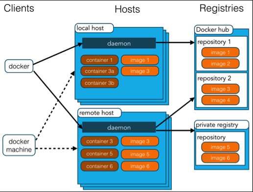

# docker架构

Docker 使用客户端-服务器 (C/S) 架构模式，使用远程API来管理和创建Docker容器。

Docker 容器通过 Docker 镜像来创建。

容器与镜像的关系类似于面向对象编程中的对象与类。

Docker 面向对象
容器 对象
镜像 类



Docker 镜像(Images)

Docker 镜像是用于创建 Docker 容器的模板。

Docker 容器(Container)

容器是独立运行的一个或一组应用。

Docker 客户端(Client)

Docker 客户端通过命令行或者其他工具使用 Docker API (https://docs.docker.com/reference/api/docker_remote_api) 与 Docker 的守护进程通信。

Docker 主机(Host)

一个物理或者虚拟的机器用于执行 Docker 守护进程和容器。

Docker 仓库(Registry)

Docker 仓库用来保存镜像，可以理解为代码控制中的代码仓库。

Docker Hub(https://hub.docker.com) 提供了庞大的镜像集合供使用。

Docker Machine

Docker Machine是一个简化Docker安装的命令行工具，通过一个简单的命令行即可在相应的平台上安装Docker，比如VirtualBox、 Digital Ocean、Microsoft Azure。

在docker容器中运行一个 Python Flask 应用来运行一个web应用。

```shell
Da@Da:~# docker run -d -P training/webapp python app.py
```

参数说明:

-d:让容器在后台运行。

-P:将容器内部使用的网络端口映射到我们使用的主机上。

查看 WEB 应用容器
使用 docker ps 来查看我们正在运行的容器

这里多了端口信息。

PORTS

```java
0.0.0.0:32769->5000/tcp
```

Docker 开放了 5000 端口（默认 Python Flask 端口）映射到主机端口 32769 上。

这时我们可以通过浏览器访问WEB应用

也可以指定 -p 标识来绑定指定端口。

```java
Da@Da:~$ docker run -d -p 5000:5000 training/webapp python app.py
```

docker ps查看正在运行的容器
