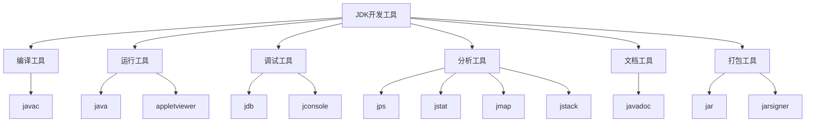
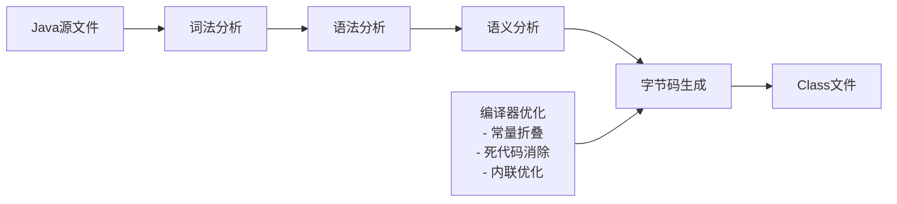
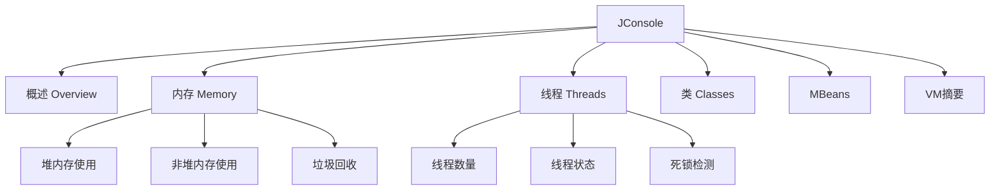

# JDK开发工具详解

## JDK工具概览

JDK（Java Development Kit）提供了丰富的开发工具，这些工具覆盖了Java开发的各个环节，从编译、运行到调试、分析。



## 核心编译工具

### javac - Java编译器

#### 基本用法

```bash
# 基本编译
javac HelloWorld.java

# 指定输出目录
javac -d ./classes HelloWorld.java

# 指定类路径
javac -cp ./lib/*:./classes HelloWorld.java

# 编译整个包
javac -d ./classes src/com/example/*.java
```

#### 常用参数

| 参数 | 功能 | 示例 |
|------|------|------|
| -d | 指定输出目录 | `javac -d ./classes *.java` |
| -cp/-classpath | 指定类路径 | `javac -cp ./lib/* Main.java` |
| -sourcepath | 指定源文件路径 | `javac -sourcepath ./src Main.java` |
| -encoding | 指定字符编码 | `javac -encoding UTF-8 *.java` |
| -g | 生成调试信息 | `javac -g *.java` |
| -verbose | 显示详细信息 | `javac -verbose *.java` |

#### 高级编译选项

```bash
# 指定Java版本
javac -source 11 -target 11 *.java

# 启用预览特性
javac --enable-preview --release 17 *.java

# 模块化编译
javac --module-path ./modules -d ./output *.java

# 注解处理
javac -processor com.example.MyProcessor *.java
```

### 编译过程详解



## 运行工具

### java - Java解释器

#### 基本用法

```bash
# 运行类文件
java HelloWorld

# 指定类路径运行
java -cp ./classes:./lib/* com.example.Main

# 运行JAR文件
java -jar application.jar

# 模块化运行
java --module-path ./modules -m mymodule/com.example.Main
```

#### JVM参数配置

```bash
# 内存设置
java -Xms512m -Xmx2g MyApp

# 垃圾收集器设置
java -XX:+UseG1GC -XX:MaxGCPauseMillis=200 MyApp

# 系统属性设置
java -Dfile.encoding=UTF-8 -Duser.timezone=Asia/Shanghai MyApp

# 启用JMX监控
java -Dcom.sun.management.jmxremote \
     -Dcom.sun.management.jmxremote.port=9999 \
     -Dcom.sun.management.jmxremote.authenticate=false \
     MyApp
```

### appletviewer - Applet查看器

```bash
# 运行Applet
appletviewer MyApplet.html

# 指定安全策略
appletviewer -J-Djava.security.policy=my.policy MyApplet.html
```

## 调试工具

### jdb - Java调试器

#### 基本调试流程

```bash
# 1. 编译时生成调试信息
javac -g *.java

# 2. 启动调试会话
jdb MyClass

# 3. 或者连接到运行中的JVM
java -agentlib:jdwp=transport=dt_socket,server=y,suspend=n,address=5005 MyClass
jdb -connect com.sun.jdi.SocketAttach:hostname=localhost,port=5005
```

#### 调试命令

```bash
# 设置断点
stop at MyClass:10
stop in MyClass.myMethod

# 执行控制
run                    # 开始执行
cont                   # 继续执行
step                   # 单步执行
step up                # 跳出当前方法
next                   # 执行下一行

# 查看信息
locals                 # 查看局部变量
print variable         # 打印变量值
dump object           # 查看对象状态
where                 # 查看调用栈
threads               # 查看线程信息
```

#### 调试示例

```java
// DebugExample.java
public class DebugExample {
    public static void main(String[] args) {
        int a = 10;
        int b = 20;
        int result = add(a, b);
        System.out.println("Result: " + result);
    }
    
    public static int add(int x, int y) {
        return x + y;
    }
}
```

```bash
# 调试会话
$ javac -g DebugExample.java
$ jdb DebugExample
> stop at DebugExample:6
> run
> locals
> print a
> print b
> step
> print result
```

### jconsole - JVM监控工具

```bash
# 启动JConsole
jconsole

# 连接到特定进程
jconsole <pid>

# 远程连接
jconsole service:jmx:rmi:///jndi/rmi://hostname:port/jmxrmi
```

#### JConsole功能面板



## 性能分析工具

### jps - Java进程状态工具

```bash
# 显示所有Java进程
jps

# 显示详细信息
jps -l          # 显示完整类名
jps -v          # 显示JVM参数
jps -m          # 显示main方法参数

# 示例输出
12345 com.example.MyApplication
12346 org.apache.catalina.startup.Bootstrap
```

### jstat - JVM统计信息工具

```bash
# 查看GC统计信息
jstat -gc <pid>              # 一次性查看
jstat -gc <pid> 1000         # 每秒查看一次
jstat -gc <pid> 1000 10      # 每秒查看一次，共10次

# 查看类加载统计
jstat -class <pid>

# 查看编译统计
jstat -compiler <pid>

# 查看堆内存统计
jstat -gccapacity <pid>
```

#### jstat输出解析

```bash
# jstat -gc 输出示例
 S0C    S1C    S0U    S1U      EC       EU        OC         OU       MC     MU    CCSC   CCSU   YGC     YGCT    FGC    FGCT     GCT
2048.0 2048.0  0.0   1024.0 16384.0  8192.0   32768.0    16384.0  21248.0 20480.0 2560.0 2304.0    10    0.150     2    0.200    0.350

# 字段说明：
# S0C/S1C: Survivor区容量
# S0U/S1U: Survivor区使用量
# EC: Eden区容量
# EU: Eden区使用量
# OC: 老年代容量
# OU: 老年代使用量
# YGC: 年轻代GC次数
# YGCT: 年轻代GC时间
```

### jmap - 内存映像工具

```bash
# 查看堆内存使用情况
jmap -heap <pid>

# 生成堆转储文件
jmap -dump:format=b,file=heap.hprof <pid>

# 查看类实例统计
jmap -histo <pid>

# 查看永久代使用情况
jmap -permstat <pid>  # JDK 7及以前
jmap -clstats <pid>   # JDK 8及以后
```

### jstack - 线程堆栈工具

```bash
# 打印线程堆栈
jstack <pid>

# 输出到文件
jstack <pid> > thread.dump

# 强制打印（进程无响应时）
jstack -F <pid>
```

#### 线程状态分析

```java
// 线程堆栈示例
"main" #1 prio=5 os_prio=0 tid=0x... nid=0x... runnable [0x...]
   java.lang.Thread.State: RUNNABLE
        at java.io.FileInputStream.readBytes(Native Method)
        at java.io.FileInputStream.read(FileInputStream.java:255)
        at com.example.MyClass.readFile(MyClass.java:25)
        at com.example.MyClass.main(MyClass.java:10)

// 线程状态说明：
// RUNNABLE: 运行中
// BLOCKED: 阻塞等待锁
// WAITING: 等待其他线程
// TIMED_WAITING: 限时等待
```

## 文档工具

### javadoc - 文档生成器

#### 基本用法

```bash
# 生成单个类的文档
javadoc MyClass.java

# 生成包文档
javadoc -d ./docs com.example.mypackage

# 生成项目文档
javadoc -d ./docs -sourcepath ./src -subpackages com.example
```

#### 高级选项

```bash
# 自定义文档
javadoc -d ./docs \
        -windowtitle "My API" \
        -doctitle "My Application API" \
        -header "<b>My App v1.0</b>" \
        -footer "Copyright 2024" \
        -author \
        -version \
        -use \
        -splitindex \
        com.example.mypackage
```

#### 文档注释规范

```java
/**
 * 计算两个数的和
 * <p>
 * 这个方法接受两个整数参数，返回它们的和。
 * 支持正数、负数和零。
 * </p>
 * 
 * @param a 第一个加数
 * @param b 第二个加数
 * @return 两个数的和
 * @throws ArithmeticException 当结果溢出时抛出
 * @since 1.0
 * @author John Doe
 * @version 1.2
 * @see #subtract(int, int)
 * @deprecated 使用 {@link #addLong(long, long)} 代替
 */
public int add(int a, int b) {
    return a + b;
}
```

## 打包工具

### jar - Java归档工具

#### 创建JAR文件

```bash
# 创建基本JAR文件
jar cf myapp.jar *.class

# 创建包含清单文件的JAR
jar cfm myapp.jar MANIFEST.MF *.class

# 创建可执行JAR
jar cfe myapp.jar com.example.Main *.class

# 递归打包目录
jar cf myapp.jar -C classes .
```

#### JAR文件操作

```bash
# 查看JAR内容
jar tf myapp.jar

# 详细查看JAR内容
jar tvf myapp.jar

# 提取JAR文件
jar xf myapp.jar

# 更新JAR文件
jar uf myapp.jar NewClass.class
```

#### MANIFEST.MF文件

```
Manifest-Version: 1.0
Main-Class: com.example.Main
Class-Path: lib/commons-lang3-3.12.0.jar lib/gson-2.8.8.jar
Implementation-Title: My Application
Implementation-Version: 1.0.0
Implementation-Vendor: My Company
Created-By: 11.0.2 (Eclipse OpenJ9)
```

### jarsigner - JAR签名工具

```bash
# 生成密钥对
keytool -genkeypair -alias mykey -keystore mykeystore.jks

# 签名JAR文件
jarsigner -keystore mykeystore.jks myapp.jar mykey

# 验证签名
jarsigner -verify myapp.jar

# 详细验证
jarsigner -verify -verbose myapp.jar
```

## 其他实用工具

### keytool - 密钥和证书管理

```bash
# 生成密钥对
keytool -genkeypair -alias mykey -keyalg RSA -keysize 2048 -keystore keystore.jks

# 导出证书
keytool -exportcert -alias mykey -keystore keystore.jks -file mycert.cer

# 导入证书
keytool -importcert -alias trustedcert -keystore truststore.jks -file mycert.cer

# 列出密钥库内容
keytool -list -keystore keystore.jks
```

### native2ascii - 字符编码转换

```bash
# 将中文转换为Unicode编码
native2ascii -encoding UTF-8 source.properties target.properties

# 反向转换
native2ascii -reverse target.properties source.properties
```

## 工具使用最佳实践

### 开发环境配置

```bash
# 设置JAVA_HOME
export JAVA_HOME=/path/to/jdk
export PATH=$JAVA_HOME/bin:$PATH

# 验证安装
java -version
javac -version
```

### 构建脚本示例

```bash
#!/bin/bash
# build.sh - 简单的构建脚本

# 清理输出目录
rm -rf classes docs
mkdir -p classes docs

# 编译源代码
echo "编译源代码..."
javac -d classes -sourcepath src src/com/example/*.java

# 生成文档
echo "生成文档..."
javadoc -d docs -sourcepath src -subpackages com.example

# 创建JAR文件
echo "创建JAR文件..."
jar cfe myapp.jar com.example.Main -C classes .

echo "构建完成！"
```

### 调试配置

```bash
# 开发环境调试配置
JAVA_OPTS="-Xdebug -Xrunjdwp:transport=dt_socket,server=y,suspend=n,address=5005"
java $JAVA_OPTS -cp classes com.example.Main
```

## 总结

JDK提供的开发工具覆盖了Java开发的全生命周期：

- **编译阶段**：javac进行源码编译
- **运行阶段**：java执行字节码
- **调试阶段**：jdb进行程序调试
- **分析阶段**：jps、jstat、jmap、jstack进行性能分析
- **文档阶段**：javadoc生成API文档
- **打包阶段**：jar创建分发包

熟练掌握这些工具的使用，能够显著提高Java开发效率和代码质量。