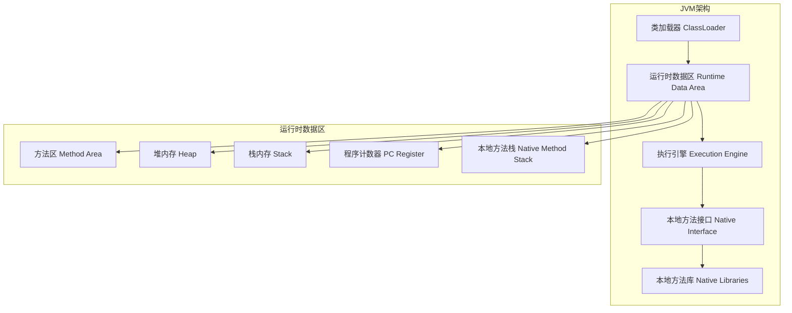
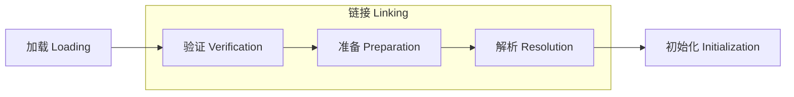
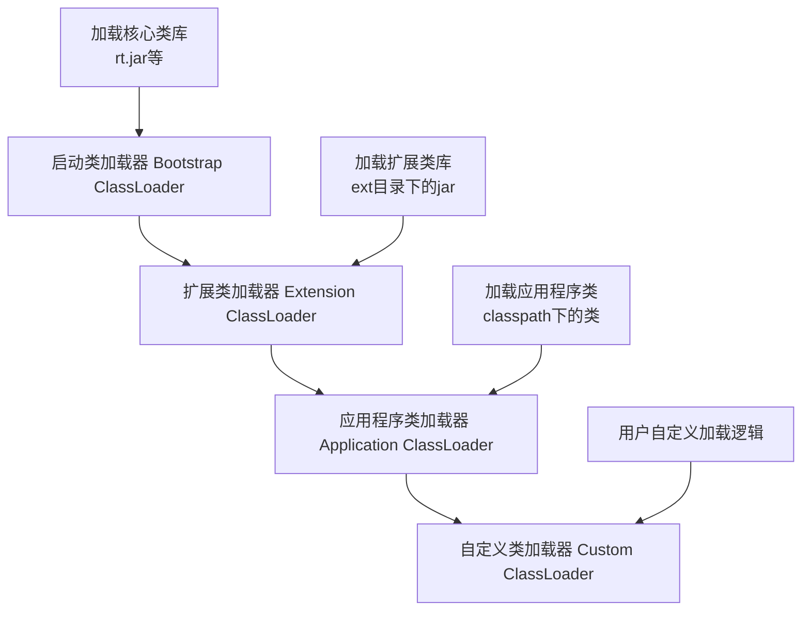
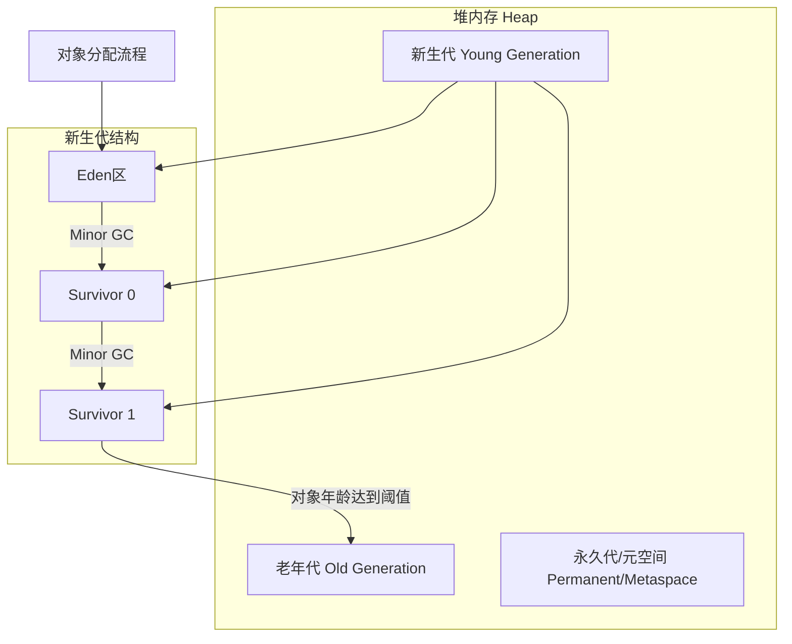
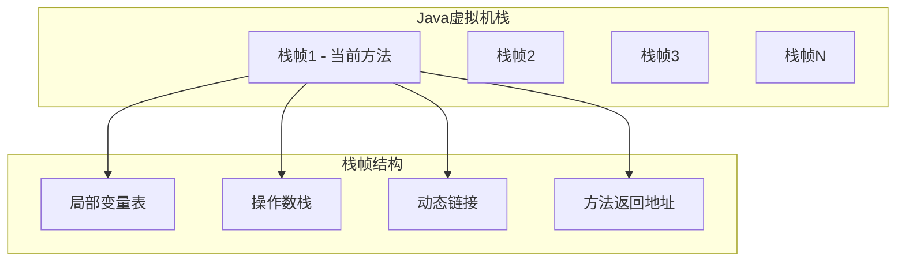
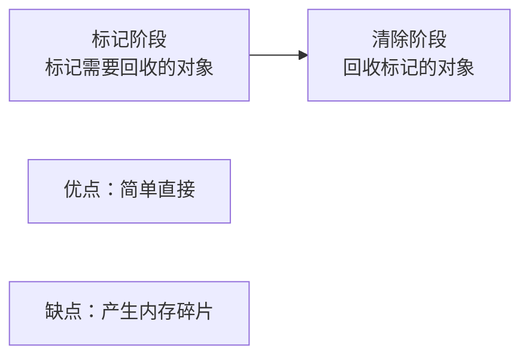
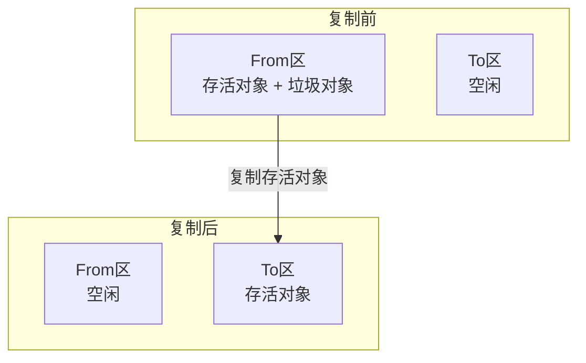
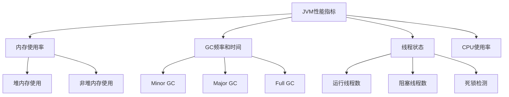
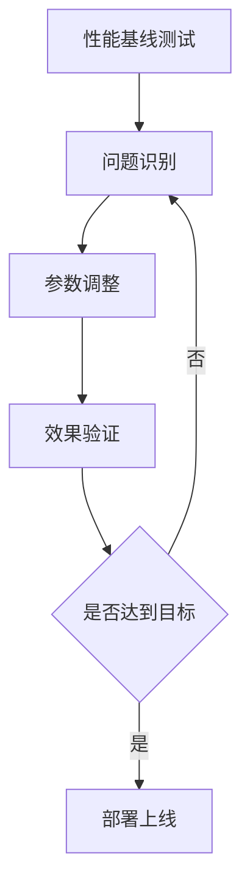

# JVM深入解析

## JVM架构详解

### JVM整体架构



## 类加载机制

### 类加载过程



### 类加载器层次结构



### 双亲委派模型

```java
// 双亲委派模型示例
protected Class<?> loadClass(String name, boolean resolve) {
    // 首先检查类是否已经被加载
    Class<?> c = findLoadedClass(name);
    if (c == null) {
        try {
            // 委派给父类加载器
            if (parent != null) {
                c = parent.loadClass(name, false);
            } else {
                c = findBootstrapClassOrNull(name);
            }
        } catch (ClassNotFoundException e) {
            // 父类加载器无法加载时，自己尝试加载
            c = findClass(name);
        }
    }
    return c;
}
```

## 内存区域详解

### 堆内存结构



### 内存分配策略

| 策略 | 描述 | 适用场景 |
|------|------|----------|
| 对象优先在Eden分配 | 新对象首先在Eden区分配 | 大部分对象 |
| 大对象直接进入老年代 | 超过阈值的大对象 | 大数组、大字符串 |
| 长期存活对象进入老年代 | 经过多次GC仍存活 | 缓存对象 |
| 动态年龄判定 | Survivor区相同年龄对象超过一半 | 自适应调整 |

### 栈内存结构



## 垃圾回收机制

### 垃圾回收算法

#### 1. 标记-清除算法



#### 2. 复制算法



#### 3. 标记-整理算法


### 垃圾收集器对比

| 收集器 | 类型 | 适用场景 | 特点 |
|--------|------|----------|------|
| Serial | 单线程 | 客户端应用 | 简单高效 |
| Parallel | 多线程 | 服务器应用 | 吞吐量优先 |
| CMS | 并发 | 响应时间敏感 | 低延迟 |
| G1 | 并发 | 大堆内存 | 可预测停顿 |
| ZGC | 并发 | 超大堆内存 | 超低延迟 |

### GC调优参数

```bash
# 堆内存设置
-Xms2g          # 初始堆大小
-Xmx4g          # 最大堆大小
-Xmn1g          # 新生代大小

# 垃圾收集器选择
-XX:+UseG1GC    # 使用G1收集器
-XX:+UseConcMarkSweepGC  # 使用CMS收集器

# GC日志
-XX:+PrintGC
-XX:+PrintGCDetails
-XX:+PrintGCTimeStamps
```

## JVM性能监控

### 监控工具

#### 1. 命令行工具

```bash
# jps - 查看Java进程
jps -l

# jstat - 查看GC统计信息
jstat -gc <pid> 1000

# jmap - 查看内存使用情况
jmap -heap <pid>

# jstack - 查看线程堆栈
jstack <pid>
```

#### 2. 可视化工具

| 工具 | 功能 | 特点 |
|------|------|------|
| JConsole | 基础监控 | JDK自带 |
| VisualVM | 全面分析 | 功能丰富 |
| JProfiler | 专业分析 | 商业工具 |
| Arthas | 在线诊断 | 阿里开源 |

### 性能分析指标



## JVM调优实践

### 调优流程



### 常见调优场景

#### 1. 内存溢出优化

```java
// OutOfMemoryError: Java heap space
// 解决方案：
// 1. 增加堆内存 -Xmx4g
// 2. 优化代码，减少内存使用
// 3. 分析内存泄漏

// 示例：内存泄漏检测
public class MemoryLeakExample {
    private static List<Object> list = new ArrayList<>();
    
    public void addObject() {
        // 潜在内存泄漏：对象一直被引用
        list.add(new Object());
    }
}
```

#### 2. GC停顿时间优化

```bash
# 使用G1收集器减少停顿时间
-XX:+UseG1GC
-XX:MaxGCPauseMillis=200
-XX:G1HeapRegionSize=16m

# 并行GC线程数调整
-XX:ParallelGCThreads=8
```

#### 3. 吞吐量优化

```bash
# 使用Parallel收集器提高吞吐量
-XX:+UseParallelGC
-XX:+UseParallelOldGC
-XX:ParallelGCThreads=8

# 调整新生代比例
-XX:NewRatio=3
-XX:SurvivorRatio=8
```

### 调优最佳实践

1. **监控先行**：建立完善的监控体系
2. **渐进调优**：逐步调整，避免大幅改动
3. **压力测试**：在测试环境验证效果
4. **文档记录**：记录调优过程和结果

## JVM故障排查

### 常见问题诊断

#### 1. 内存问题

```bash
# 生成堆转储文件
jmap -dump:format=b,file=heap.hprof <pid>

# 分析堆转储文件
jhat heap.hprof
# 或使用Eclipse MAT工具
```

#### 2. CPU问题

```bash
# 查看线程CPU使用情况
top -H -p <pid>

# 获取线程堆栈
jstack <pid> > thread.dump

# 分析热点方法
jprofiler或其他性能分析工具
```

#### 3. 死锁问题

```java
// 死锁示例
public class DeadlockExample {
    private static Object lock1 = new Object();
    private static Object lock2 = new Object();
    
    public static void main(String[] args) {
        Thread t1 = new Thread(() -> {
            synchronized (lock1) {
                synchronized (lock2) {
                    System.out.println("Thread 1");
                }
            }
        });
        
        Thread t2 = new Thread(() -> {
            synchronized (lock2) {
                synchronized (lock1) {
                    System.out.println("Thread 2");
                }
            }
        });
        
        t1.start();
        t2.start();
    }
}
```

```bash
# 检测死锁
jstack <pid> | grep -A 5 "Found Java-level deadlock"
```

## 总结

JVM是Java生态系统的核心，深入理解JVM的工作原理对于Java开发者来说至关重要。通过掌握：

- **内存管理机制**：了解内存分配和回收策略
- **垃圾回收原理**：选择合适的GC算法和收集器
- **性能监控方法**：使用工具进行性能分析
- **调优实践经验**：根据应用特点进行针对性优化

可以有效提升Java应用的性能和稳定性。