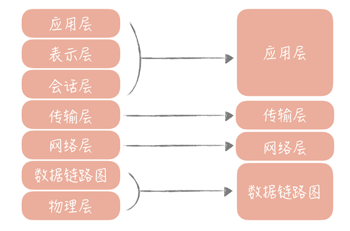

# 架构分层

什么是分层架构

软件架构分层在软件工程中是一种常见的设计方式，它是将整体系统拆分成 N 个层次，每个层次有独立的职责，多个层次协同提供完整的功能。

我们在刚刚成为程序员的时候，会被“教育”说系统的设计要是“MVC”（Model-View-Controller）架构。它将整体的系统分成了 Model（模型），View（视图）和 Controller（控制器）三个层次，也就是将用户视图和业务处理隔离开，并且通过控制器连接起来，很好地实现了表现和逻辑的解耦，是一种标准的软件分层架构。

另外一种常见的分层方式是将整体架构分为表现层、逻辑层和数据访问层：

表现层，顾名思义嘛，就是展示数据结果和接受用户指令的，是最靠近用户的一层；

逻辑层里面有复杂业务的具体实现；

数据访问层则是主要处理和存储之间的交互。

这是在架构上最简单的一种分层方式。其实，我们在不经意间已经按照三层架构来做系统分层设计了，比如在构建项目的时候，我们通常会建立三个目录：Web、Service 和 Dao，它们分别对应了表现层、逻辑层还有数据访问层。

除此之外，如果我们稍加留意，就可以发现很多的分层的例子。比如我们在大学中学到的 OSI 网络模型，它把整个网络分了七层，自下而上分别是物理层、数据链路层、网络层、传输层、会话层、表示层和应用层。

工作中经常能用到 TCP/IP 协议，它把网络简化成了四层，即链路层、网络层、传输层和应用层。每一层各司其职又互相帮助，网络层负责端到端的寻址和建立连接，传输层负责端到端的数据传输等，同时呢相邻两层还会有数据的交互。这样可以隔离关注点，让不同的层专注做不同的事情。

Linux 文件系统也是分层设计的，从下图你可以清晰地看出文件系统的层次。在文件系统的最上层是虚拟文件系统（VFS），用来屏蔽不同的文件系统之间的差异，提供统一的系统调用接口。虚拟文件系统的下层是 Ext3、Ext4 等各种文件系统，再向下是为了屏蔽不同硬件设备的实现细节，我们抽象出来的单独的一层——通用块设备层，然后就是不同类型的磁盘了。

我们可以看到，某些层次负责的是对下层不同实现的抽象，从而对上层屏蔽实现细节。比方说 VFS 对上层（系统调用层）来说提供了统一的调用接口，同时对下层中不同的文件系统规约了实现模型，当新增一种文件系统实现的时候，只需要按照这种模型来设计，就可以无缝插入到 Linux 文件系统中。

分层的设计可以简化系统设计，让不同的人专注做某一层次的事情。想象一下，如果你要设计一款网络程序却没有分层，该是一件多么痛苦的事情。

参照阿里发布的《阿里巴巴 Java 开发手册 v1.4.0（详尽版）》

终端显示层：各端模板渲染并执行显示的层。当前主要是 Velocity 渲染，JS 渲染， JSP 渲染，移动端展示等。

开放接口层：将 Service 层方法封装成开放接口，同时进行网关安全控制和流量控制等。

Web 层：主要是对访问控制进行转发，各类基本参数校验，或者不复用的业务简单处理等。

Service 层：业务逻辑层。

Manager 层：通用业务处理层。这一层主要有两个作用，其一，你可以将原先 Service 层的一些通用能力下沉到这一层，比如与缓存和存储交互策略，中间件的接入；其二，你也可以在这一层封装对第三方接口的调用，比如调用支付服务，调用审核服务等。

DAO 层：数据访问层，与底层 MySQL、Oracle、Hbase 等进行数据交互。

外部接口或第三方平台：包括其它部门 RPC 开放接口，基础平台，其它公司的 HTTP 接口。

