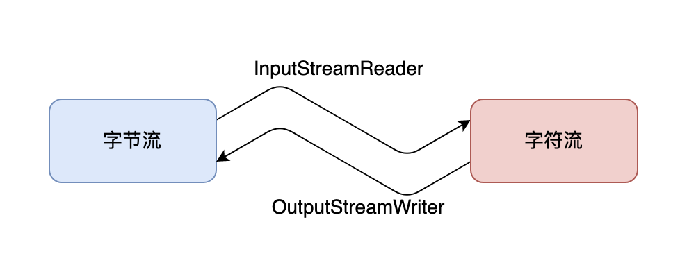

> 点击勘误[issues](https://github.com/webVueBlog/JavaPlusDoc/issues)，哪吒感谢大家的阅读

## 转换流

转换流可以将一个字节流包装成字符流，或者将一个字符流包装成字节流。这种转换通常用于处理文本数据，如读取文本文件或将数据从网络传输到应用程序。

转换流主要有两种类型：InputStreamReader 和 OutputStreamWriter。

InputStreamReader 将一个字节输入流转换为一个字符输入流，而 OutputStreamWriter 将一个字节输出流转换为一个字符输出流。它们使用指定的字符集将字节流和字符流之间进行转换。常用的字符集包括 UTF-8、GBK、ISO-8859-1 等。

InputStreamReader 和 OutputStreamWriter 是将字节流转换为字符流或者将字符流转换为字节流。通常用于解决字节流和字符流之间的转换问题，可以将字节流以指定的字符集编码方式转换为字符流，或者将字符流以指定的字符集编码方式转换为字节流。

InputStreamReader 类的常用方法包括：

1. read()：从输入流中读取一个字符的数据。
2. read(char[] cbuf, int off, int len)：从输入流中读取 len 个字符的数据到指定的字符数组 cbuf 中，从 off 位置开始存放。
3. ready()：返回此流是否已准备好读取。
4. close()：关闭输入流。

OutputStreamWriter 类的常用方法包括：

1. write(int c)：向输出流中写入一个字符的数据。
2. write(char[] cbuf, int off, int len)：向输出流中写入指定字符数组 cbuf 中的 len 个字符，从 off 位置开始。
3. flush()：将缓冲区的数据写入输出流中。
4. close()：关闭输出流。

在使用转换流时，需要指定正确的字符集编码方式，否则可能会导致数据读取或写入出现乱码。

