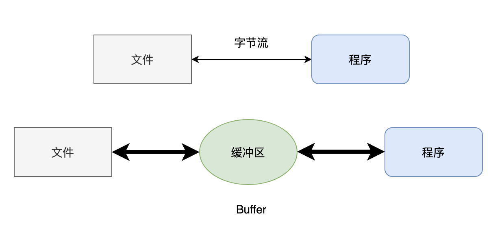

> 点击勘误[issues](https://github.com/webVueBlog/JavaPlusDoc/issues)，哪吒感谢大家的阅读


## JavaIO知识体系

### 初识 Java IO

IO，即in和out，也就是输入和输出，指应用程序和外部设备之间的数据传递，常见的外部设备包括文件、管道、网络连接。

Java 中是通过流处理IO 的，那么什么是流？

流（Stream），是一个抽象的概念，是指一连串的数据（字符或字节），是以先进先出的方式发送信息的通道。

当程序需要读取数据的时候，就会开启一个通向数据源的流，这个数据源可以是文件，内存，或是网络连接。类似的，当程序需要写入数据的时候，就会开启一个通向目的地的流。这时候你就可以想象数据好像在这其中“流”动一样。

一般来说关于流的特性有下面几点：

先进先出：最先写入输出流的数据最先被输入流读取到。
顺序存取：可以一个接一个地往流中写入一串字节，读出时也将按写入顺序读取一串字节，不能随机访问中间的数据。（RandomAccessFile除外）
只读或只写：每个流只能是输入流或输出流的一种，不能同时具备两个功能，输入流只能进行读操作，对输出流只能进行写操作。在一个数据传输通道中，如果既要写入数据，又要读取数据，则要分别提供两个流。

### 传输方式划分

传输方式有两种，字节和字符，那首先得搞明白字节和字符有什么区别，对吧？

字节（byte）是计算机中用来表示存储容量的一个计量单位，通常情况下，一个字节有 8 位（bit）。

字符（char）可以是计算机中使用的字母、数字、和符号，比如说 A 1 $ 这些。

通常来说，一个字母或者一个字符占用一个字节，一个汉字占用两个字节。

具体还要看字符编码，比如说在 UTF-8 编码下，一个英文字母（不分大小写）为一个字节，一个中文汉字为三个字节；在 Unicode 编码中，一个英文字母为一个字节，一个中文汉字为两个字节。

字节流用来处理二进制文件，比如说图片啊、MP3 啊、视频啊。

字符流用来处理文本文件，文本文件可以看作是一种特殊的二进制文件，只不过经过了编码，便于人们阅读。

换句话说就是，字节流可以处理一切文件，而字符流只能处理文本。

虽然 IO 类很多，但核心的就是 4 个抽象类：InputStream、OutputStream、Reader、Writer。

（抽象大法真好）

虽然 IO 类的方法也很多，但核心的也就 2 个：read 和 write。

### InputStream 类

1. int read()：读取数据
2. int read(byte b[], int off, int len)：从第 off 位置开始读，读取 len 长度的字节，然后放入数组 b 中
3. long skip(long n)：跳过指定个数的字节
4. int available()：返回可读的字节数
5. void close()：关闭流，释放资源

### OutputStream 类

1. void write(int b)： 写入一个字节，虽然参数是一个 int 类型，但只有低 8 位才会写入，高 24 位会舍弃（这块后面再讲）
2. void write(byte b[], int off, int len)： 将数组 b 中的从 off 位置开始，长度为 len 的字节写入
3. void flush()： 强制刷新，将缓冲区的数据写入
4. void close()：关闭流

### Reader 类

1. int read()：读取单个字符
2. int read(char cbuf[], int off, int len)：从第 off 位置开始读，读取 len 长度的字符，然后放入数组 b 中
3. long skip(long n)：跳过指定个数的字符
4. int ready()：是否可以读了
5. void close()：关闭流，释放资源

### Writer 类

1. void write(int c)： 写入一个字符
2. void write( char cbuf[], int off, int len)： 将数组 cbuf 中的从 off 位置开始，长度为 len 的字符写入
3. void flush()： 强制刷新，将缓冲区的数据写入
4. void close()：关闭流

### 字节流和字符流的区别：

1. 字节流一般用来处理图像、视频、音频、PPT、Word等类型的文件。字符流一般用于处理纯文本类型的文件，如TXT文件等，但不能处理图像视频等非文本文件。用一句话说就是：字节流可以处理一切文件，而字符流只能处理纯文本文件。
2. 字节流本身没有缓冲区，缓冲字节流相对于字节流，效率提升非常高。而字符流本身就带有缓冲区，缓冲字符流相对于字符流效率提升就不是那么大了。

字符流的源码

```
// 声明一个 char 类型的数组，用于写入输出流
private char[] writeBuffer;

// 定义 writeBuffer 数组的大小，必须 >= 1
private static final int WRITE_BUFFER_SIZE = 1024;

// 写入给定字符串中的一部分到输出流中
public void write(String str, int off, int len) throws IOException {
    // 使用 synchronized 关键字同步代码块，确保线程安全
    synchronized (lock) {
        char cbuf[];
        // 如果 len <= WRITE_BUFFER_SIZE，则使用 writeBuffer 数组进行写入
        if (len <= WRITE_BUFFER_SIZE) {
            // 如果 writeBuffer 为 null，则创建一个大小为 WRITE_BUFFER_SIZE 的新 char 数组
            if (writeBuffer == null) {
                writeBuffer = new char[WRITE_BUFFER_SIZE];
            }
            cbuf = writeBuffer;
        } else {    // 如果 len > WRITE_BUFFER_SIZE，则不永久分配非常大的缓冲区
            // 创建一个大小为 len 的新 char 数组
            cbuf = new char[len];
        }
        // 将 str 中的一部分（从 off 开始，长度为 len）拷贝到 cbuf 数组中
        str.getChars(off, (off + len), cbuf, 0);
        // 将 cbuf 数组中的数据写入输出流中
        write(cbuf, 0, len);
    }
}
```

这段代码是 Java IO 类库中的 OutputStreamWriter 类的 write 方法，可以看到缓冲区的大小是 1024 个 char。

```
// 字节流
try (FileInputStream fis = new FileInputStream("input.txt");
     FileOutputStream fos = new FileOutputStream("output.txt")) {
    byte[] buffer = new byte[1024];
    int len;
    while ((len = fis.read(buffer)) != -1) {
        fos.write(buffer, 0, len);
    }
} catch (IOException e) {
    e.printStackTrace();
}

// 字符流
try (FileReader fr = new FileReader("input.txt");
     FileWriter fw = new FileWriter("output.txt")) {
    char[] buffer = new char[1024];
    int len;
    while ((len = fr.read(buffer)) != -1) {
        fw.write(buffer, 0, len);
    }
} catch (IOException e) {
    e.printStackTrace();
}
```

### 操作对象划分

IO IO，不就是输入输出（Input/Output）嘛：

1. Input：将外部的数据读入内存，比如说把文件从硬盘读取到内存，从网络读取数据到内存等等
2. Output：将内存中的数据写入到外部，比如说把数据从内存写入到文件，把数据从内存输出到网络等等。

所有的程序，在执行的时候，都是在内存上进行的，一旦关机，内存中的数据就没了，那如果想要持久化，就需要把内存中的数据输出到外部，比如说文件。

文件操作算是 IO 中最典型的操作了，也是最频繁的操作。那其实你可以换个角度来思考，比如说按照 IO 的操作对象来思考，IO 就可以分类为：文件、数组、管道、基本数据类型、缓冲、打印、对象序列化/反序列化，以及转换等。


1）文件

文件流也就是直接操作文件的流，可以细分为字节流（FileInputStream 和 FileOuputStream）和字符流（FileReader 和 FileWriter）。

FileInputStream 的例子：

```
// 声明一个 int 类型的变量 b，用于存储读取到的字节
int b;
// 创建一个 FileInputStream 对象，用于读取文件 fis.txt 中的数据
FileInputStream fis1 = new FileInputStream("fis.txt");

// 循环读取文件中的数据
while ((b = fis1.read()) != -1) {
    // 将读取到的字节转换为对应的 ASCII 字符，并输出到控制台
    System.out.println((char)b);
}

// 关闭 FileInputStream 对象，释放资源
fis1.close();
```

FileOutputStream 的例子：

```
// 创建一个 FileOutputStream 对象，用于写入数据到文件 fos.txt 中
FileOutputStream fos = new FileOutputStream("fos.txt");

// 向文件中写入数据，这里写入的是字符串 "aa" 对应的字节数组
fos.write("aa".getBytes());

// 关闭 FileOutputStream 对象，释放资源
fos.close();
```

FileReader 的例子：

````
// 声明一个 int 类型的变量 b，用于存储读取到的字符
int b = 0;

// 创建一个 FileReader 对象，用于读取文件 read.txt 中的数据
FileReader fileReader = new FileReader("read.txt");

// 循环读取文件中的数据
while ((b = fileReader.read()) != -1) {
    // 将读取到的字符强制转换为 char 类型，并输出到控制台
    System.out.println((char)b);
}

// 关闭 FileReader 对象，释放资源
fileReader.close();
````

FileWriter 的例子：

```
// 创建一个 FileWriter 对象，用于写入数据到文件 fw.txt 中
FileWriter fileWriter = new FileWriter("fw.txt");

// 将字符串 "aa" 转换为字符数组
char[] chars = "aa".toCharArray();

// 向文件中写入数据，这里写入的是 chars 数组中的所有字符
fileWriter.write(chars, 0, chars.length);

// 关闭 FileWriter 对象，释放资源
fileWriter.close();
```

文件流还可以用于创建、删除、重命名文件等操作。FileOutputStream 和 FileWriter 构造函数的第二个参数可以指定是否追加数据到文件末尾。

```
// 创建文件
File file = new File("test.txt");
if (file.createNewFile()) {
    System.out.println("文件创建成功");
} else {
    System.out.println("文件已存在");
}

// 删除文件
if (file.delete()) {
    System.out.println("文件删除成功");
} else {
    System.out.println("文件删除失败");
}

// 重命名文件
File oldFile = new File("old.txt");
File newFile = new File("new.txt");
if (oldFile.renameTo(newFile)) {
    System.out.println("文件重命名成功");
} else {
    System.out.println("文件重命名失败");
}
```

### 2）数组（内存）

通常来说，针对文件的读写操作，使用文件流配合缓冲流就够用了，但为了提升效率，频繁地读写文件并不是太好，那么就出现了数组流，有时候也称为内存流。

ByteArrayInputStream 的例子：

```
// 创建一个 ByteArrayInputStream 对象，用于从字节数组中读取数据
InputStream is = new BufferedInputStream(
        new ByteArrayInputStream(
                "aa".getBytes(StandardCharsets.UTF_8)));

// 定义一个字节数组用于存储读取到的数据
byte[] flush = new byte[1024];

// 定义一个变量用于存储每次读取到的字节数
int len = 0;

// 循环读取字节数组中的数据，并输出到控制台
while (-1 != (len = is.read(flush))) {
    // 将读取到的字节转换为对应的字符串，并输出到控制台
    System.out.println(new String(flush, 0, len));
}

// 关闭输入流，释放资源
is.close();
```

ByteArrayOutputStream 的例子：

```
// 创建一个 ByteArrayOutputStream 对象，用于写入数据到内存缓冲区中
ByteArrayOutputStream bos = new ByteArrayOutputStream();

// 定义一个字节数组用于存储要写入内存缓冲区中的数据
byte[] info = "aa".getBytes();

// 向内存缓冲区中写入数据，这里写入的是 info 数组中的所有字节
bos.write(info, 0, info.length);

// 将内存缓冲区中的数据转换为字节数组
byte[] dest = bos.toByteArray();

// 关闭 ByteArrayOutputStream 对象，释放资源
bos.close();
```

数组流可以用于在内存中读写数据，比如将数据存储在字节数组中进行压缩、加密、序列化等操作。它的优点是不需要创建临时文件，可以提高程序的效率。但是，数组流也有缺点，它只能存储有限的数据量，如果存储的数据量过大，会导致内存溢出。

3）管道

Java 中的管道和 Unix/Linux 中的管道不同，在 Unix/Linux 中，不同的进程之间可以通过管道来通信，但 Java 中，通信的双方必须在同一个进程中，也就是在同一个 JVM 中，管道为线程之间的通信提供了通信能力。

一个线程通过 PipedOutputStream 写入的数据可以被另外一个线程通过相关联的 PipedInputStream 读取出来。

```
// 创建一个 PipedOutputStream 对象和一个 PipedInputStream 对象
final PipedOutputStream pipedOutputStream = new PipedOutputStream();
final PipedInputStream pipedInputStream = new PipedInputStream(pipedOutputStream);

// 创建一个线程，向 PipedOutputStream 中写入数据
Thread thread1 = new Thread(new Runnable() {
    @Override
    public void run() {
        try {
            // 将字符串 "aa" 转换为字节数组，并写入到 PipedOutputStream 中
            pipedOutputStream.write("aa".getBytes(StandardCharsets.UTF_8));
            // 关闭 PipedOutputStream，释放资源
            pipedOutputStream.close();
        } catch (IOException e) {
            e.printStackTrace();
        }
    }
});

// 创建一个线程，从 PipedInputStream 中读取数据并输出到控制台
Thread thread2 = new Thread(new Runnable() {
    @Override
    public void run() {
        try {
            // 定义一个字节数组用于存储读取到的数据
            byte[] flush = new byte[1024];
            // 定义一个变量用于存储每次读取到的字节数
            int len = 0;
            // 循环读取字节数组中的数据，并输出到控制台
            while (-1 != (len = pipedInputStream.read(flush))) {
                // 将读取到的字节转换为对应的字符串，并输出到控制台
                System.out.println(new String(flush, 0, len));
            }
            // 关闭 PipedInputStream，释放资源
            pipedInputStream.close();
        } catch (IOException e) {
            e.printStackTrace();
        }
    }
});

// 启动线程1和线程2
thread1.start();
thread2.start();
```

使用管道流可以实现不同线程之间的数据传输，可以用于线程间的通信、数据的传递等。但是，管道流也有一些局限性，比如只能在同一个 JVM 中的线程之间使用，不能跨越不同的 JVM 进程。

4）基本数据类型
基本数据类型输入输出流是一个字节流，该流不仅可以读写字节和字符，还可以读写基本数据类型。

DataInputStream 提供了一系列可以读基本数据类型的方法：

```
// 创建一个 DataInputStream 对象，用于从文件中读取数据
DataInputStream dis = new DataInputStream(new FileInputStream("das.txt"));

// 读取一个字节，将其转换为 byte 类型
byte b = dis.readByte();

// 读取两个字节，将其转换为 short 类型
short s = dis.readShort();

// 读取四个字节，将其转换为 int 类型
int i = dis.readInt();

// 读取八个字节，将其转换为 long 类型
long l = dis.readLong();

// 读取四个字节，将其转换为 float 类型
float f = dis.readFloat();

// 读取八个字节，将其转换为 double 类型
double d = dis.readDouble();

// 读取一个字节，将其转换为 boolean 类型
boolean bb = dis.readBoolean();

// 读取两个字节，将其转换为 char 类型
char ch = dis.readChar();

// 关闭 DataInputStream，释放资源
dis.close();
```

DataOutputStream 提供了一系列可以写基本数据类型的方法：

```
// 创建一个 DataOutputStream 对象，用于将数据写入到文件中
DataOutputStream das = new DataOutputStream(new FileOutputStream("das.txt"));

// 将一个 byte 类型的数据写入到文件中
das.writeByte(10);

// 将一个 short 类型的数据写入到文件中
das.writeShort(100);

// 将一个 int 类型的数据写入到文件中
das.writeInt(1000);

// 将一个 long 类型的数据写入到文件中
das.writeLong(10000L);

// 将一个 float 类型的数据写入到文件中
das.writeFloat(12.34F);

// 将一个 double 类型的数据写入到文件中
das.writeDouble(12.56);

// 将一个 boolean 类型的数据写入到文件中
das.writeBoolean(true);

// 将一个 char 类型的数据写入到文件中
das.writeChar('A');

// 关闭 DataOutputStream，释放资源
das.close();
```

除了 DataInputStream 和 DataOutputStream，Java IO 还提供了其他一些读写基本数据类型和字符串的流类，包括 ObjectInputStream 和 ObjectOutputStream（用于读写对象）。

示例代码：

```
public static void main(String[] args) {
    try (ObjectOutputStream oos = new ObjectOutputStream(new FileOutputStream("person.dat"))) {
        Person p = new Person("张三", 20);
        oos.writeObject(p);
    } catch (IOException e) {
        e.printStackTrace();
    }

    try (ObjectInputStream ois = new ObjectInputStream(new FileInputStream("person.dat"))) {
        Person p = (Person) ois.readObject();
        System.out.println(p);
    } catch (IOException | ClassNotFoundException e) {
        e.printStackTrace();
    }
}
```

以上代码创建了一个 Person 对象，将其写入文件中，然后从文件中读取该对象，并打印在控制台上。

5）缓冲

CPU 很快，它比内存快 100 倍，比磁盘快百万倍。那也就意味着，程序和内存交互会很快，和硬盘交互相对就很慢，这样就会导致性能问题。

为了减少程序和硬盘的交互，提升程序的效率，就引入了缓冲流，也就是类名前缀带有 Buffer 的那些，比如说 BufferedInputStream、BufferedOutputStream、BufferedReader、BufferedWriter。



缓冲流在内存中设置了一个缓冲区，只有缓冲区存储了足够多的带操作的数据后，才会和内存或者硬盘进行交互。简单来说，就是一次多读/写点，少读/写几次，这样程序的性能就会提高。

以下是一个使用 BufferedInputStream 读取文件的示例代码：

```
// 创建一个 BufferedInputStream 对象，用于从文件中读取数据
BufferedInputStream bis = new BufferedInputStream(new FileInputStream("data.txt"));

// 创建一个字节数组，作为缓存区
byte[] buffer = new byte[1024];

// 读取文件中的数据，并将其存储到缓存区中
int bytesRead;
while ((bytesRead = bis.read(buffer)) != -1) {
    // 对缓存区中的数据进行处理
    // 这里只是简单地将读取到的字节数组转换为字符串并打印出来
    System.out.println(new String(buffer, 0, bytesRead));
}

// 关闭 BufferedInputStream，释放资源
bis.close();
```

上述代码中，首先创建了一个 BufferedInputStream 对象，用于从文件中读取数据。然后创建了一个字节数组作为缓存区，每次读取数据时将数据存储到缓存区中。读取数据的过程是通过 while 循环实现的，每次读取数据后对缓存区中的数据进行处理。最后关闭 BufferedInputStream，释放资源。

以下是一个使用 BufferedOutputStream 写入文件的示例代码：

```
// 创建一个 BufferedOutputStream 对象，用于将数据写入到文件中
BufferedOutputStream bos = new BufferedOutputStream(new FileOutputStream("data.txt"));

// 创建一个字节数组，作为缓存区
byte[] buffer = new byte[1024];

// 将数据写入到文件中
String data = "aa是个大傻子!";
buffer = data.getBytes();
bos.write(buffer);

// 刷新缓存区，将缓存区中的数据写入到文件中
bos.flush();

// 关闭 BufferedOutputStream，释放资源
bos.close();
```

上述代码中，首先创建了一个 BufferedOutputStream 对象，用于将数据写入到文件中。然后创建了一个字节数组作为缓存区，将数据写入到缓存区中。写入数据的过程是通过 write() 方法实现的，将字节数组作为参数传递给 write() 方法即可。

最后，通过 flush() 方法将缓存区中的数据写入到文件中。在写入数据时，由于使用了 BufferedOutputStream，数据会先被写入到缓存区中，只有在缓存区被填满或者调用了 flush() 方法时才会将缓存区中的数据写入到文件中。

以下是一个使用 BufferedReader 读取文件的示例代码：

```
// 创建一个 BufferedReader 对象，用于从文件中读取数据
BufferedReader br = new BufferedReader(new FileReader("data.txt"));

// 读取文件中的数据，并将其存储到字符串中
String line;
while ((line = br.readLine()) != null) {
    // 对读取到的数据进行处理
    // 这里只是简单地将读取到的每一行字符串打印出来
    System.out.println(line);
}

// 关闭 BufferedReader，释放资源
br.close();
```

上述代码中，首先创建了一个 BufferedReader 对象，用于从文件中读取数据。然后使用 readLine() 方法读取文件中的数据，每次读取一行数据并将其存储到一个字符串中。读取数据的过程是通过 while 循环实现的。

以下是一个使用 BufferedWriter 写入文件的示例代码：

```
// 创建一个 BufferedWriter 对象，用于将数据写入到文件中
BufferedWriter bw = new BufferedWriter(new FileWriter("data.txt"));

// 将数据写入到文件中
String data = "aa，真帅气";
bw.write(data);

// 刷新缓存区，将缓存区中的数据写入到文件中
bw.flush();

// 关闭 BufferedWriter，释放资源
bw.close();
```

上述代码中，首先创建了一个 BufferedWriter 对象，用于将数据写入到文件中。然后使用 write() 方法将数据写入到缓存区中，写入数据的过程和使用 FileWriter 类似。需要注意的是，使用 BufferedWriter 写入数据时，数据会先被写入到缓存区中，只有在缓存区被填满或者调用了 flush() 方法时才会将缓存区中的数据写入到文件中。

最后，通过 flush() 方法将缓存区中的数据写入到文件中，并通过 close() 方法关闭 BufferedWriter，释放资源。

使用缓冲流可以提高读写效率，减少了频繁的读写磁盘或网络的次数，从而提高了程序的性能。但是，在使用缓冲流时需要注意缓冲区的大小和清空缓冲区的时机，以避免数据丢失或不完整的问题。

6）打印
Java 的打印流是一组用于打印输出数据的类，包括 PrintStream 和 PrintWriter 两个类。

恐怕 Java 程序员一生当中最常用的就是打印流了：System.out 其实返回的就是一个 PrintStream 对象，可以用来打印各式各样的对象。

```
System.out.println("aa是真的二！");
```

PrintStream 最终输出的是字节数据，而 PrintWriter 则是扩展了 Writer 接口，所以它的 print()/println() 方法最终输出的是字符数据。使用上几乎和 PrintStream 一模一样。

```
StringWriter buffer = new StringWriter();
try (PrintWriter pw = new PrintWriter(buffer)) {
    pw.println("aa");
}
System.out.println(buffer.toString());
```

7）对象序列化/反序列化

序列化本质上是将一个 Java 对象转成字节数组，然后可以将其保存到文件中，或者通过网络传输到远程。

```
// 创建一个 ByteArrayOutputStream 对象 buffer，用于存储数据
ByteArrayOutputStream buffer = new ByteArrayOutputStream();

// 使用 try-with-resources 语句创建一个 ObjectOutputStream 对象 output，并将其与 buffer 关联
try (ObjectOutputStream output = new ObjectOutputStream(buffer)) {
    
    // 使用 writeUTF() 方法将字符串 "aa" 写入到缓冲区中
    output.writeUTF("aa");
}

// 使用 toByteArray() 方法将缓冲区中的数据转换成字节数组，并输出到控制台
System.out.println(Arrays.toString(buffer.toByteArray()));
```

与其对应的，有序列化，就有反序列化，也就是再将字节数组转成 Java 对象的过程。

```
try (ObjectInputStream input = new ObjectInputStream(new FileInputStream(
        new File("Person.txt")))) {
    String s = input.readUTF();
}
```

这段代码主要使用了 Java 的 ByteArrayOutputStream 和 ObjectOutputStream 类，将字符串 "aa" 写入到一个字节数组缓冲区中，并将缓冲区中的数据转换成字节数组输出到控制台。

具体的执行过程如下：

1. 创建一个 ByteArrayOutputStream 对象 buffer，用于存储数据。
2. 使用 try-with-resources 语句创建一个 ObjectOutputStream 对象 output，并将其与 buffer 关联。
3. 使用 writeUTF() 方法将字符串 "aa" 写入到缓冲区中。
4. 当 try-with-resources 语句执行完毕时，会自动调用 output 的 close() 方法关闭输出流，释放资源。
5. 使用 toByteArray() 方法将缓冲区中的数据转换成字节数组。
6. 使用 Arrays.toString() 方法将字节数组转换成字符串，并输出到控制台。

8）转换

InputStreamReader 是从字节流到字符流的桥连接，它使用指定的字符集读取字节并将它们解码为字符。

```
// 创建一个 InputStreamReader 对象 isr，使用 FileInputStream 对象读取文件 demo.txt 的内容并将其转换为字符流
InputStreamReader isr = new InputStreamReader(new FileInputStream("demo.txt"));

// 创建一个字符数组 cha，用于存储读取的字符数据，其中 1024 表示数组的长度
char[] cha = new char[1024];

// 使用 read() 方法读取 isr 中的数据，并将读取的字符数据存储到 cha 数组中，返回值 len 表示读取的字符数
int len = isr.read(cha);

// 将 cha 数组中从下标 0 开始、长度为 len 的部分转换成字符串，并输出到控制台
System.out.println(new String(cha, 0, len));

// 关闭 InputStreamReader 对象 isr，释放资源
isr.close();
```

这段代码主要使用了 Java 的 InputStreamReader 和 FileInputStream 类，从文件 demo.txt 中读取数据并将其转换为字符流，然后将读取的字符数据存储到一个字符数组中，并输出转换成字符串后的结果到控制台。

OutputStreamWriter 将一个字符流的输出对象变为字节流的输出对象，是字符流通向字节流的桥梁。

```
// 创建一个 File 对象 f，表示文件 test.txt
File f = new File("test.txt");

// 创建一个 OutputStreamWriter 对象 out，使用 FileOutputStream 对象将数据写入到文件 f 中，并将字节流转换成字符流
Writer out = new OutputStreamWriter(new FileOutputStream(f));

// 使用 write() 方法将字符串 "aa!!" 写入到文件 f 中
out.write("aa!!");

// 关闭 Writer 对象 out，释放资源
out.close();
```

使用转换流可以方便地在字节流和字符流之间进行转换。在进行文本文件读写时，通常使用字符流进行操作，而在进行网络传输或与设备进行通信时，通常使用字节流进行操作。

另外，在使用转换流时需要注意字符编码的问题。如果不指定字符编码，则使用默认的字符编码，可能会出现乱码问题。因此，建议在使用转换流时，始终指定正确的字符编码，以避免出现乱码问题。


