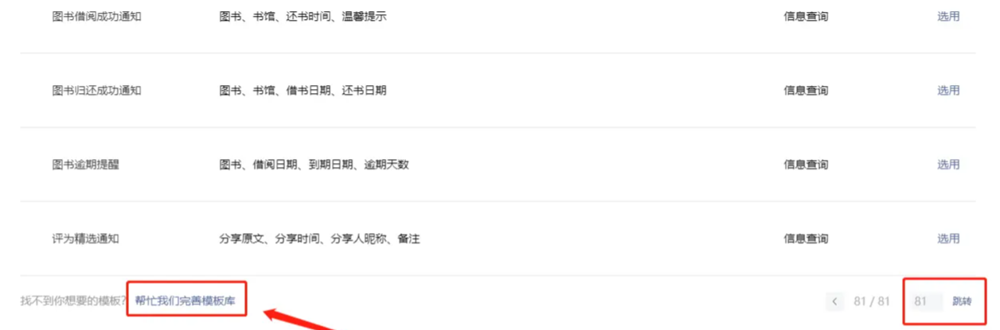
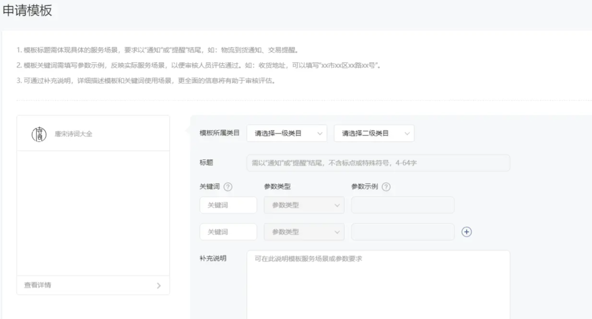
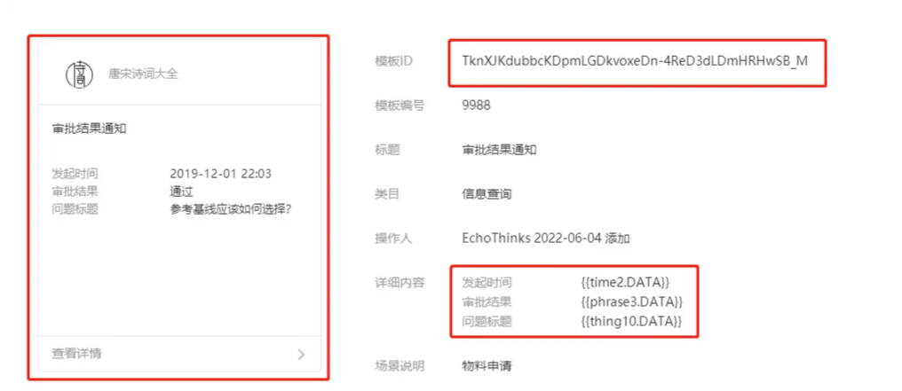
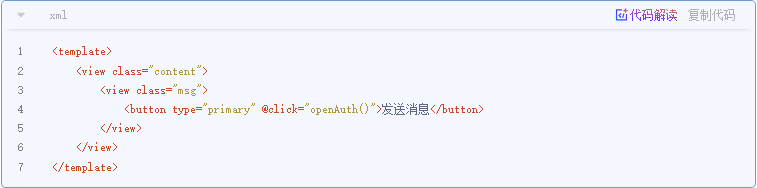
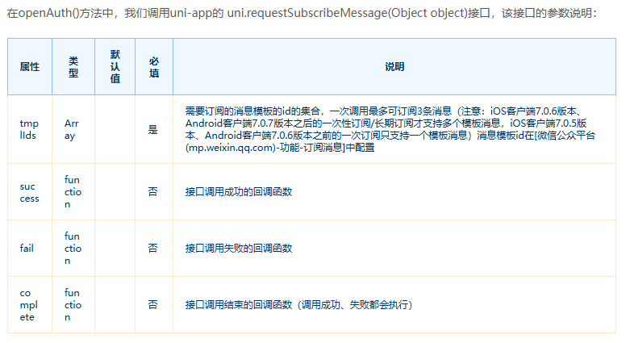
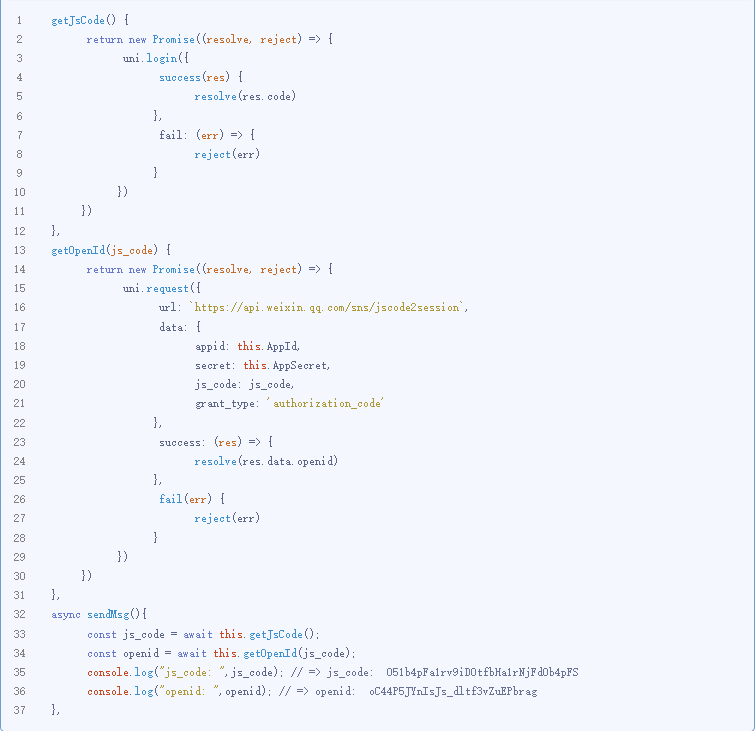
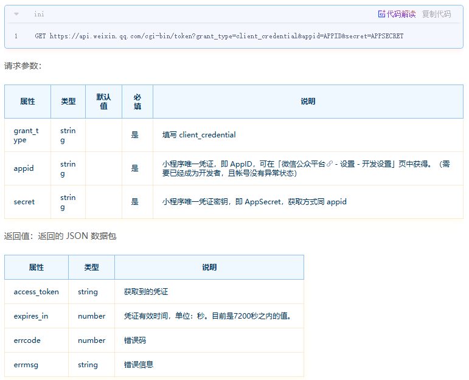
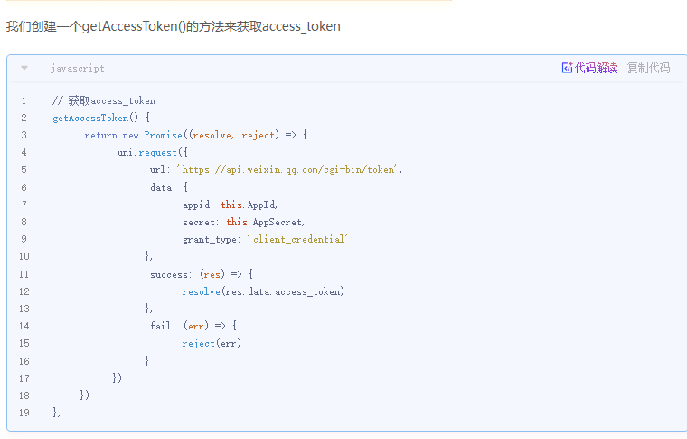
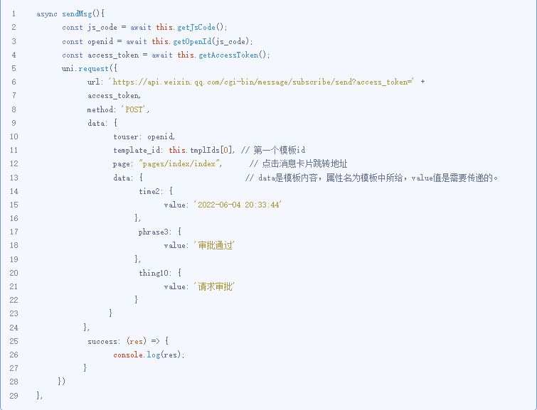
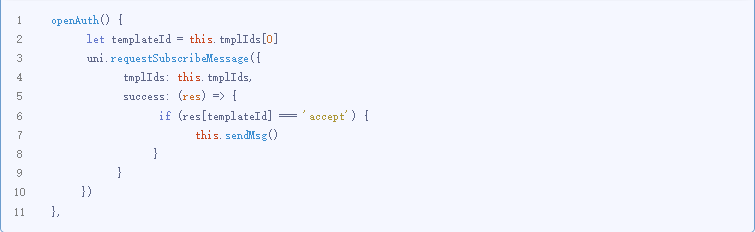

> 点击勘误[issues](https://github.com/webVueBlog/JavaPlusDoc/issues)，哪吒感谢大家的阅读

## uni-app微信小程序订阅消息推送实践

**微信小程序消息推送**是我们常见的业务开发场景，经研究实践，发送订阅消息可分成四个步骤：

1.  申请消息模板：生成消息模板ID,确定模板详情:标题、内容等；
1.  前端订阅消息：通过按钮或者支付回调向用户发起订阅消息的询问；
1.  后端进行推送：用户同意订阅后，后端请求微信消息推送接口携带模板ID、模板内容（可理解成数据字段）用户open_id、跳转地址等参数进行推送；
1.  用户收到消息：用户在服务通知中收到该模板消息的卡片，点击可转向小程序中的跳转地址,可传参。

通过设置->基本设置来修改小程序类目。Ps：每个月修改小程序类目有次数限制，且部分类目还需提供证明材料。

另，微信小程序订阅消息有三种订阅模式：一次性订阅、长期订阅和设备订阅，其中设备订阅主要接入设

一次性订阅和长期订阅的区别，简单来说是：

-   一次性订阅：需要用户接收该消息订阅后，开发者可**不限时间**地下发**一条对应的服务消息**；
-   长期订阅：用户**订阅一次**后，开发者可**长期**下发**多条**消息。

申请长期订阅呗，订阅一次，永久可用。但根据官方文档介绍，长期订阅消息仅向**政务民生、医疗、交通、金融、教育**等线下公共服务开放，企业或个人暂时无法正常申请。但看社区帖子，用户可通过微信社区向官方人员进行申请长期订阅消息，从而使自己的小程序使用长期订阅消息，具体方法可社区内搜索一下。

回到创建消息模板来，以此次示例的小程序类目：工具->消息查询这个来看，默认所列的公共模板库中有800多个消息模板，覆盖了较多业务应用场景，我们可以从中选取一个。此外，我们还可以**创建自定义模板**，其入口比较隐蔽，需要我们要手动跳转到公共模板库最后一页，页面左下方有“帮我们完善模板库”的链接。

根据自身业务需求，创建适合自己的模板，需等待微信官方审核通过后，方可使用。

选择了一个标题为审核结果通知的一次性订阅的公共模板，然后在详细内容中选择了三个数据：发起时间、审批结果和问题标题。

消息推送的前提是需用户点击按钮或支付回调里触发弹出授权消息框，Ps:仅此两种方式。用户同意后，服务器方可将消息推送该微信用户。

我们先在template中创建一个button按钮，用户点击按钮执行openAuth()方法，弹出授权消息框。

在data中定义一个数组tmplIds来存放模板id集(最多存放三个)，定义两个同名变量存放小程序的AppId和AppSecret。

当用户点击允许时，success返回值res中，会有一个键为TEMPLATE_ID，值为accept的属性。该操作即说明了用户**同意**订阅**一个**来自模板ID为TknXJKdubbcKDpmLGDkvoxeDn-4ReD3dLDmHRHwSB_M的模板消息。

## 后端进行推送

### 获取openid

用户openid的获取过程有以下两个步骤：

1.  通过uni-app的uni.login()来获得**js_code**；
1.  通过微信服务端登录接口auth.code2Session（[官网文档](https://link.juejin.cn?target=https%3A%2F%2Fdevelopers.weixin.qq.com%2Fminiprogram%2Fdev%2Fapi-backend%2Fopen-api%2Flogin%2Fauth.code2Session.html "https://developers.weixin.qq.com/miniprogram/dev/api-backend/open-api/login/auth.code2Session.html")），传递appid、secret、js_code等参数来拿到openid。

示例中创建了两个方法getJsCode()和getOpenId(),在sendMsg()方法中依次执行来获得openid。

### 获取access_token

access_token是小程序全局后台接口调用凭证，大部分的服务端接口都需要传递此鉴权凭证。在发送模板消息的接口中，也需此凭证，下面演示如何通过auth.getAccessToken（[官方文档](https://link.juejin.cn?target=https%3A%2F%2Fdevelopers.weixin.qq.com%2Fminiprogram%2Fdev%2Fapi-backend%2Fopen-api%2Faccess-token%2Fauth.getAccessToken.html "https://developers.weixin.qq.com/miniprogram/dev/api-backend/open-api/access-token/auth.getAccessToken.html")）来获取access_token。

请求地址：

### 发送模板消息

发送模板消息是通过微信subscribeMessage.send来实现，代码如下：

改造openAuth()，增加sendMsg()的调用,实现用户同意订阅消息模板后，发送模板消息。

## 用户收到消息

用户点击按钮，发起授权同意后，就会在微信的服务通知里收到如下消息，点击“进入小程序查看”，就会跳转到我们page属性的路径里。

