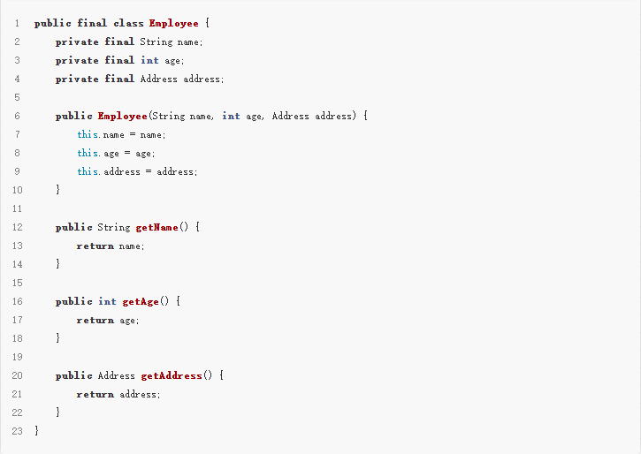
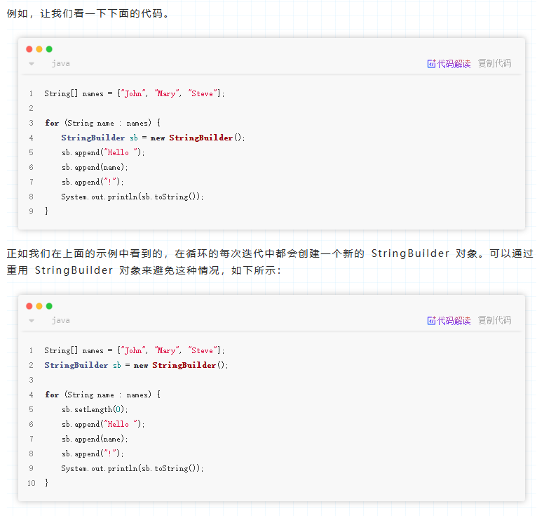
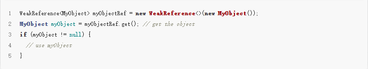

> 点击勘误[issues](https://github.com/webVueBlog/JavaPlusDoc/issues)，哪吒感谢大家的阅读


## 微信小程序支付功能全流程实践

微信小程序支付用户，下单，请求下单支付（商户系统），调用小程序登录API获取返回的openid()，生成商户订单，调用支付统一下单API，返回预订单信息（prepay_id），小程序端调用支付API，完成支付，商户系统接收支付结果通知，更新订单状态，用户端查看订单状态。返回支付参数用户确认支付，鉴权调启支付，返回支付结果，展示支付结果，推送支付结果，更新订单状态。


# 🛠 MongoDB 索引实操大全

## 1. 创建单字段索引

```
db.collection.createIndex({ fieldName: 1 }) 
```

-   `1` 是升序索引，`-1` 是降序索引。
-   升降序只对排序操作（sort）有影响，对查找（find）速度影响不大。

👉 例子：

```
db.user.createIndex({ username: 1 })
```

为 `user` 表里的 `username` 字段建升序索引。


## 2. 创建复合索引（联合索引）

```
db.collection.createIndex({ field1: 1, field2: -1 })
```

-   适用于多字段联合查询场景，比如 `WHERE name = 'a' AND age > 18`。

👉 例子：

```
db.user.createIndex({ username: 1, age: -1 })
```

**注意顺序很重要！** MongoDB复合索引遵循“最左前缀匹配原则”。


## 3. 创建唯一索引（防止重复）

```
db.collection.createIndex({ fieldName: 1 }, { unique: true })
```

👉 例子：

```
db.user.createIndex({ email: 1 }, { unique: true })
```

给 `email` 字段加唯一索引，自动防止用户注册重复邮箱。


## 4. 创建稀疏索引（sparse）

```
db.collection.createIndex({ fieldName: 1 }, { sparse: true })
```

-   只为**有该字段的文档**建立索引。
-   没有这个字段的文档不会占用索引空间。

👉 例子：

```
db.user.createIndex({ nickname: 1 }, { sparse: true })
```

如果有的用户没有填写 `nickname`，这时候可以节省索引空间。


## 5. 创建TTL索引（自动过期）

```
db.collection.createIndex({ createTime: 1 }, { expireAfterSeconds: 3600 })
```

-   **自动删除**插入超过 `3600秒`（1小时）的文档，非常适合缓存场景。

👉 例子：

```
db.session.createIndex({ createdAt: 1 }, { expireAfterSeconds: 1800 })
```

做Session管理，半小时后Session数据自动删。


## 6. 查看已有索引

```
db.collection.getIndexes()
```

👉 例子：

```
db.user.getIndexes()
```

可以看到所有的索引配置，包括主键索引 `_id_`。


## 7. 删除索引

```
db.collection.dropIndex("索引名")
```

-   索引名一般是字段名拼接过来的，比如 `username_1_age_-1`。

👉 例子：

```
db.user.dropIndex("username_1")
```

内存管理是编程的一个基本领域之一，尤其是在 Java 开发中。当不再需要的对象没有得到正确处理时，就会发生内存泄漏，导致内存使用量不断增长，最终导致性能问题和应用程序崩溃。因此深入了解如何在 Java 应用程序中有效使用内存并避免内存泄漏至关重要。

不可变对象是指创建后状态无法更改的对象。使用不可变对象可以帮助避免循环引用引起的内存泄漏。不可变对象还可以通过减少同步开销来提高性能。



在上面的示例中，Employee 类是不可变的，因为它的字段是 final 修饰，并且在对象创建后无法更改。



选择正确的数据结构可以帮助优化内存使用。例如使用 HashMap 代替 List 可以提高搜索特定元素时的性能。

文件句柄、数据库连接、网络套接字等资源在使用后正确关闭很重要，以避免内存泄漏。这可以使用 Java 中的 try-with-resources 语句来完成。

在 Java 中，弱引用是一种引用对象而不阻止其被垃圾收集的方法。使用弱引用进行缓存或其他需要短时间保留对象的场景。



Web前端性能优化——实践总结篇


-   使用 CDN 加速：利用CDN增加并发连接和长缓存的优势来加速下载静态资源

-   开启gzip压缩：使用 gzip 压缩编码技术，减小资源体积。

-   浏览器缓存：利用浏览器缓存(强缓存与协商缓存)与 Nginx 代理层缓存，缓存静态资源文件。

-   减少网络请求次数和体积：通过压缩文件及合并小文件为大文件，减少网络请求次数，但需要找到合理的平衡点。


