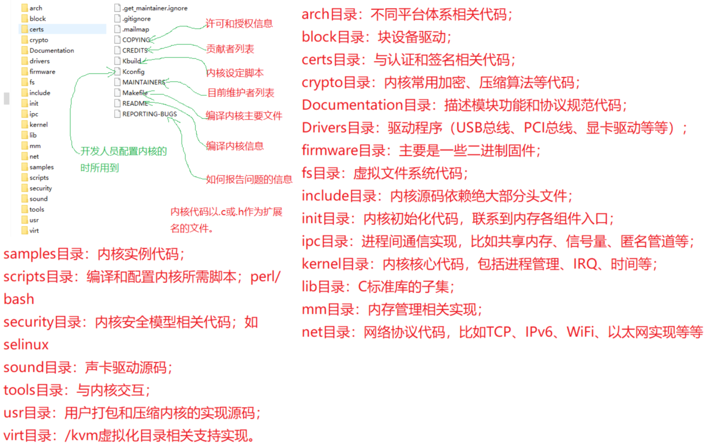
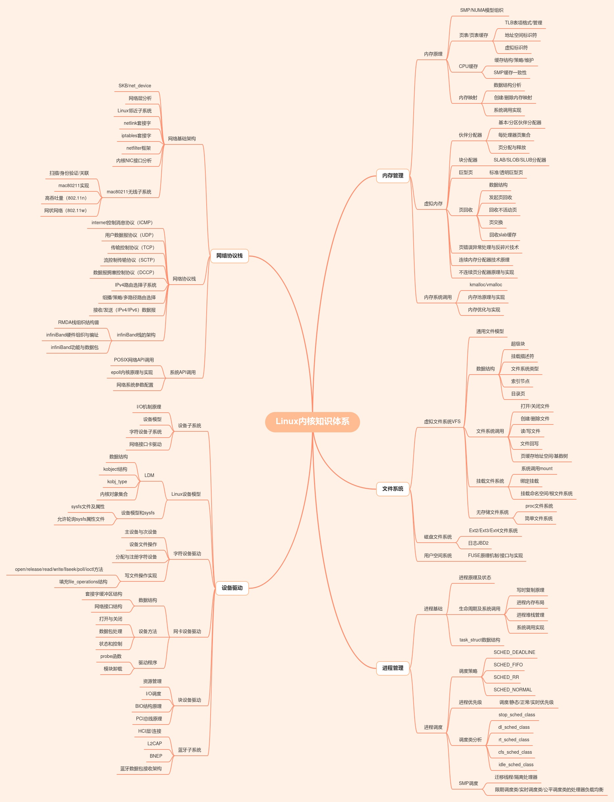

> 点击勘误[issues](https://github.com/webVueBlog/JavaPlusDoc/issues)，哪吒感谢大家的阅读


## 运维服务器6年经验

## ✅ 一、常用 Linux 命令分类（重点常见）：

### 🔹 系统资源监控

| 命令       | 作用                          |
| -------- | --------------------------- |
| `top`    | 实时查看 CPU、内存、进程占用等           |
| `htop`   | `top` 的增强版，图形化显示            |
| `ps`     | 查看当前系统进程状态                  |
| `uptime` | 查看系统运行时长与负载情况               |
| `vmstat` | 查看内存、CPU、IO 等系统性能           |
| `iostat` | 查看磁盘 IO 使用率（来自 `sysstat` 包） |
| `free`   | 查看内存使用情况                    |
| `sar`    | 收集系统性能历史（需安装 `sysstat`）     |

### 🔹 网络相关

| 命令             | 作用                        |
| -------------- | ------------------------- |
| `netstat`      | 查看网络连接、端口监听等（建议用 `ss` 替代） |
| `ss`           | 更快更准确的替代 `netstat`        |
| `ping`         | 测试网络连通性                   |
| `traceroute`   | 路由追踪                      |
| `dig/nslookup` | 域名解析工具                    |
| `curl/wget`    | 网络请求测试                    |
| `tcpdump`      | 抓包工具                      |
| `iftop`        | 实时网络带宽监控                  |

### 🔹 磁盘与文件系统

| 命令             | 作用          |
| -------------- | ----------- |
| `df`           | 查看磁盘挂载与剩余空间 |
| `du`           | 查看目录/文件占用大小 |
| `lsblk`        | 查看磁盘挂载结构    |
| `mount/umount` | 挂载/卸载磁盘     |

### 🔹 文件与系统操作

| 命令                                  | 作用       |
| ----------------------------------- | -------- |
| `ls`, `cd`, `cat`, `cp`, `mv`, `rm` | 文件操作     |
| `find`, `grep`, `awk`, `sed`        | 查找与文本处理  |
| `chmod`, `chown`                    | 修改权限与所有者 |
| `tar`, `zip`, `unzip`               | 压缩解压     |
| `systemctl`, `service`              | 服务管理     |
| `journalctl`                        | 查看系统日志   |
| `crontab`                           | 定时任务     |
| `kill`, `killall`, `xargs`          | 杀进程      |

* * *

## ✅ 二、你提到的命令详解

| 命令               | 用途说明                                       |
| ---------------- | ------------------------------------------ |
| `top`            | 实时查看 CPU、内存占用、各进程运行状态，常用于排查系统负载高的问题        |
| `ps aux`         | 快照方式查看所有进程状态，可结合 `grep` 找关键进程              |
| `netstat -tulnp` | 查看监听端口与绑定服务（被 `ss` 取代）                     |
| `df -h`          | 查看各挂载分区的剩余空间、使用率，判断磁盘是否满                   |
| `du -sh *`       | 查看当前目录下各子目录/文件大小，定位“谁占满了磁盘”                |
| `iostat -x 1`    | 查看磁盘读写速率、IO 等待情况，分析 IO 瓶颈问题（需安装 `sysstat`）


## ✅ 一、Linux 运维排查命令速查表（分类 + 场景）

| 分类              | 命令示例                                          | 使用场景说明              |
| --------------- | --------------------------------------------- | ------------------- |
| 🔧 **CPU/内存排查** | `top`, `htop`, `ps aux --sort=-%cpu`          | 查看高负载进程、内存泄漏、进程异常   |
| 🔧 **磁盘排查**     | `df -h`, `du -sh *`, `lsof`, `ncdu`           | 查看磁盘是否满、哪些文件占用最大空间  |
| 🔧 **IO 排查**    | `iostat -x 1`, `iotop`, `vmstat 1`            | 判断磁盘 IO 是否瓶颈、IO 等待高 |
| 🔧 **网络排查**     | `netstat -tulnp`, `ss -lntp`, `lsof -i:端口`    | 查看端口监听情况、网络连接状态     |
| 🌐 **连通性测试**    | `ping`, `traceroute`, `curl`, `dig`, `telnet` | 网络是否通，DNS 解析是否正常    |
| 📂 **文件定位**     | `find . -type f -name "*.log"`, `du -ah       | sort -rh`           |
| 🔍 **日志查看**     | `tail -f /var/log/messages`, `journalctl -xe` | 实时查看系统/服务日志，查启动失败   |
| 🔐 **权限排查**     | `ls -l`, `chmod`, `chown`                     | 文件/目录权限错误导致无法访问     |
| ⚙️ **进程控制**     | `ps`, `kill`, `killall`, `xargs`              | 查找并终止异常进程           |
| 📆 **定时任务**     | `crontab -l`, `systemctl list-timers`         | 定时脚本未触发或配置错误

### CPU 飙高排查

> 有一次线上系统 CPU 飙到 100%，我使用 `top` 查看是某个 Java 进程占满 CPU，再结合 `ps -ef` 确认 PID，之后用 `jstack` dump 栈分析是某个线程死循环。修复后 CPU 降回正常。

### 磁盘打满导致服务挂掉

> 某次服务突然挂掉，`df -h` 一看 `/var` 分区 100%，`du -sh *` 逐级定位，发现是日志文件打满了。用 `logrotate` 加了压缩与清理策略，避免再次发生。

### 数据库连接失败排查

> 应用连不上 MySQL，先用 `ping` 确认网络通，再 `telnet host 3306` 发现端口不通，用 `ss -lntp` 查服务未监听，原来是数据库未启动，`systemctl start mysql` 后恢复正常。

### Redis 多实例端口冲突

> 多 Redis 实例启动失败，`netstat -tulnp` 显示端口已被占用，`ps aux | grep redis` 查出是老进程未关闭，`kill` 后再重启成功。

### 磁盘 IO 性能瓶颈

> 某服务响应慢但 CPU 占用低，用 `iostat -x 1` 查看发现磁盘 `util` 长时间接近 100%，排查是频繁写入日志导致 IO 拥塞，优化后日志按级别写入，响应恢复。

| 命令             | 面试中简洁描述           |
| -------------- | ----------------- |
| `top`          | 实时监控进程 CPU、内存使用情况 |
| `ps aux`       | 查看所有进程的静态快照       |
| `netstat`/`ss` | 查看端口监听与网络连接       |
| `df -h`        | 查看磁盘分区使用情况        |
| `du -sh *`     | 查看目录大小，排查大文件      |
| `iostat`       | 查看磁盘 IO 使用与瓶颈     |
| `tail -f`      | 实时查看日志输出          |
| `ping`, `curl` | 检查网络连通性与服务是否在线    |
| `kill -9`      | 强制结束进程            |

## 一键安装工具建议（运维必备）

```
# IO 和网络工具合集（Debian/Ubuntu）
sudo apt install sysstat iotop iftop net-tools lsof

# CentOS/RHEL
sudo yum install sysstat iotop iftop net-tools lsof
```

| 排查场景             | 使用命令                                               | 目的                               | 实际作用 / 结果                            |                                    |                                  |
| ---------------- | -------------------------------------------------- | -------------------------------- | ------------------------------------ | ---------------------------------- | -------------------------------- |
| Java 进程 CPU 飙升   | `top` <br> `ps aux --sort=-%cpu` <br> `jstack PID` | 找出高 CPU 占用进程，并用 jstack 抓线程堆栈     | 确认是某线程死循环导致 CPU 占满，分析定位业务逻辑问题        |                                    |                                  |
| 磁盘写入异常           | `df -h`                                            | 查看分区是否已满                         | `/var` 分区 100%，服务日志无法写入，导致接口报错       |                                    |                                  |
| 大文件定位            | `du -sh *` <br> \`du -sh ./\*                      | sort -rh                         | head\`                               | 快速定位大目录 / 大日志文件                    | 找到某日志文件超过 5G，配合 logrotate 设定切割策略 |
| 磁盘 IO 性能瓶颈       | `iostat -x 1`                                      | 查看 IO 利用率、等待时间                   | `util` 长期 90%+，`await` 时间高，确认写入瓶颈在磁盘 |                                    |                                  |
| 端口冲突 / Redis 未监听 | `netstat -tulnp` <br> `ss -lntp`                   | 查看端口占用情况                         | 发现 Redis 配置监听端口未启动或端口被其他进程占用         |                                    |                                  |
| 进程是否存在 / 多开      | \`ps aux                                           | grep redis`<br>`pgrep -f redis\` | 确认进程是否已运行、是否重复启动                     | 避免重复启动 Redis 或 MySQL 实例，或确认是否未启动成功 |                                  |

有次线上系统响应变慢，我用 top 查到 Java 进程 CPU 99%，结合 jstack 抓取线程栈，确认某死循环逻辑导致占用；也遇到磁盘异常，df 发现 /var 分区满了，用 du 快速找到是日志爆量；另外还用 iostat 定位 IO 等待高，结合日志改写策略缓解了瓶颈。





mongo，

在 MongoDB 中，我们不会说“库”和“表”，而是使用以下术语：

| 通用数据库术语       | MongoDB 中的术语     |
| ------------- | ---------------- |
| 数据库（Database） | 数据库（Database） ✅  |
| 表（Table）      | 集合（Collection） ✅ |
| 行（Row）        | 文档（Document） ✅   |
| 列（Column）     | 字段（Field） ✅      |

---

## ✅ MongoDB 的基本结构：

```plaintext
MongoDB Server
 └── Database（数据库）
      └── Collection（集合，相当于表）
           └── Document（文档，相当于行）
                └── Field（字段，相当于列）
```

---

## ✅ 举例说明

### 创建数据库和集合（相当于“建库建表”）：

```js
use mydb              // 选择或创建数据库

db.createCollection("users")  // 创建集合，相当于创建表
```

---

### 插入文档（相当于插入一行）：

```js
db.users.insertOne({
  name: "张三",
  age: 28,
  email: "zhangsan@example.com"
})
```

---

### 查询文档：

```js
db.users.find({ age: { $gt: 25 } })
```

---

## ✅ MongoDB 特点 vs 关系型数据库

| MongoDB（文档型）      | MySQL / PostgreSQL（关系型） |
| ----------------- | ----------------------- |
| 无固定表结构            | 表结构需提前定义字段类型            |
| 支持嵌套文档、数组字段       | 不支持嵌套对象                 |
| 灵活写入，字段可不同        | 每行字段一致，强类型约束            |
| 使用 JSON/BSON 存储文档 | 使用行列式存储                 |

---

如果你想查看 Mongo 当前所有库/表（集合）：

### 查看所有数据库：

```js
show dbs
```

### 查看当前数据库所有集合（表）：

```js
show collections
```

---

下面是一个完整的 MongoDB 示例项目结构，模拟常见的 **用户（users）+ 订单（orders）** 模型，适合实际开发用作项目初始化：

---

## ✅ 项目结构说明

* 数据库：`demo_app`
* 集合：

    * `users`：用户信息
    * `orders`：用户订单（包含用户 ID 作为外键）

---

## ✅ 初始化脚本（Mongo Shell 语法）

你可以复制粘贴到 Mongo Shell / `mongosh` 中运行：

```js
// 1. 切换或创建数据库
use demo_app

// 2. 创建 users 集合并插入示例文档
db.createCollection("users")

db.users.insertMany([
  {
    _id: ObjectId(),
    username: "alice",
    email: "alice@example.com",
    phone: "1234567890",
    createdAt: new Date()
  },
  {
    _id: ObjectId(),
    username: "bob",
    email: "bob@example.com",
    phone: "9876543210",
    createdAt: new Date()
  }
])

// 3. 创建 orders 集合并插入示例文档
db.createCollection("orders")

db.orders.insertMany([
  {
    _id: ObjectId(),
    userId: db.users.findOne({username: "alice"})._id,
    item: "iPhone 15",
    price: 7999,
    status: "PAID",
    createdAt: new Date()
  },
  {
    _id: ObjectId(),
    userId: db.users.findOne({username: "bob"})._id,
    item: "MacBook Air",
    price: 9999,
    status: "SHIPPED",
    createdAt: new Date()
  }
])

// 4. 建立索引（如用户邮箱唯一）
db.users.createIndex({ email: 1 }, { unique: true })
db.orders.createIndex({ userId: 1 })
```

---

## ✅ 查询示例

### 查找某用户的订单：

```js
const user = db.users.findOne({ username: "alice" })
db.orders.find({ userId: user._id })
```

### 查询所有订单并带上用户信息（关联查询）：

```js
db.orders.aggregate([
  {
    $lookup: {
      from: "users",
      localField: "userId",
      foreignField: "_id",
      as: "userInfo"
    }
  },
  {
    $unwind: "$userInfo"
  },
  {
    $project: {
      item: 1,
      price: 1,
      status: 1,
      "userInfo.username": 1,
      "userInfo.email": 1
    }
  }
])
```

---

如果 MongoDB 中的订单集合（orders）超过 1000 万条数据，想要维持查询性能和系统可扩展性，必须从多个维度进行优化：

---

## ✅ 一、索引优化（最关键）

### 1️⃣ 建立**高命中率的组合索引**

例如常见查询条件：

```js
db.orders.find({ userId: xxx, status: "PAID" })
```

应建立：

```js
db.orders.createIndex({ userId: 1, status: 1 })
```

### 2️⃣ 常用字段如 `createdAt` 用于分页/范围查询：

```js
db.orders.find({ createdAt: { $gte: ISODate('2024-01-01') } }).sort({ createdAt: -1 }).limit(50)
```

应建立：

```js
db.orders.createIndex({ createdAt: -1 })
```

### 3️⃣ 查询慢时，用 `explain()` 分析索引命中：

```js
db.orders.find({ userId: xxx }).explain("executionStats")
```

---

## ✅ 二、分页优化（避免深度 skip）

> **不要使用 `skip` 深分页**，性能会指数下降。

### ❌ 不推荐：

```js
db.orders.find().skip(1000000).limit(10)
```

### ✅ 推荐：

使用 `createdAt` 或 `_id` 做游标分页（基于“上次最后一条”）：

```js
db.orders.find({ createdAt: { $lt: 上一页最后时间 } }).sort({ createdAt: -1 }).limit(10)
```

---

## ✅ 三、冷热分离 / 分表策略

### 🔹 1）**冷热数据拆分**

* **最近 6 个月**的数据保留在主 `orders` 表中
* **历史订单归档**到 `orders_history` 表（或另一个库）

使用脚本定期归档：

```js
db.orders.aggregate([
  { $match: { createdAt: { $lt: ISODate('2024-01-01') } } },
  { $merge: { into: "orders_history" } }
])
```

然后在 `orders` 中删除老数据。

---

### 🔹 2）**按时间/用户 ID 分表**

* `orders_2024`, `orders_2023`
* `orders_user_0`, `orders_user_1`（按 userId hash）

缺点：应用层需要动态路由查询逻辑。

---

## ✅ 四、压缩与数据精简

### 🔸 1）字段压缩（精简文档结构）

* 避免冗余嵌套字段
* 字段名用短名（如 `uid` 替代 `userId`）

### 🔸 2）关闭不必要字段索引

* 不查询的字段不要建索引（浪费写入性能 + 空间）

---

## ✅ 五、写入优化

### 批量写入：

```js
db.orders.insertMany([...])
```

### 合理设置 `_id`

使用自定义顺序生成 `_id`，可避免默认 ObjectId 带来的分布写入放大问题（但通常影响不大）。

---

## ✅ 六、监控与性能分析工具

* `db.orders.stats()` 查看集合大小
* `db.orders.totalIndexSize()` 查看索引空间
* `mongotop`, `mongostat`, `Atlas Profiler` 实时监控
* `explain()` 定位慢查询

---

## ✅ 七、架构层扩展（极端高并发）

如果数据量和并发再提升，可考虑：

* MongoDB 分片集群（Sharding）
* 热数据使用 Redis 缓存
* 历史数据归档到 ElasticSearch 用于检索

---

## ✅ 最终建议小结

| 优化方向 | 建议                      |
| ---- | ----------------------- |
| 索引   | 组合索引 + 创建时间索引           |
| 分页   | 游标分页代替 skip             |
| 分表   | 热/冷数据分离或按时间分表           |
| 结构优化 | 字段精简、去冗余、文档大小控制         |
| 查询优化 | 使用 explain 分析索引使用情况     |
| 扩展方案 | 数据分片 + Redis 缓存 + ES 检索 |

---

你提到的三种架构优化策略是构建**高并发 + 大数据量系统**的核心方式，适用于订单类系统、日志系统、交易系统等场景。下面是对：

* **MongoDB 分片集群（Sharding）**
* **Redis 缓存热数据**
* **ElasticSearch 归档历史数据**

三者的 **作用、原理、实现方式** 的详解：

---

## ✅ 一、MongoDB 分片集群（Sharding）

### 📌 作用：

将 **海量数据水平拆分** 到多个分片节点（shard）上，实现 **读写负载均衡 + 无限扩展容量**。

### 🧠 原理：

* 按照 `shard key` 将数据分发到不同分片
* 查询由 Mongos（路由器）根据 key 定向到正确 shard

### 📦 架构组成：

```
客户端
   │
 ┌─▼─┐
 │mongos 路由器│← 多个，可横向扩展
 └─▲─┘
   │
 ┌─┴────────────┐
 │     Config Servers     │ ← 配置元数据，3 个或以上
 └───────────────┘
   │
 ┌──────────────┬──────────────┐
 │    Shard1    │     Shard2   │  ... 可扩展
 └──────────────┴──────────────┘
```

### 🔧 示例配置步骤（简略）：

1. 配置分片集群：`mongod --shardsvr`
2. 配置 router：`mongos --configdb`
3. 添加分片：

```js
sh.addShard("shard1/host1:27017")
sh.addShard("shard2/host2:27017")
```

4. 启用分片：

```js
sh.enableSharding("demo_app")
sh.shardCollection("demo_app.orders", { userId: 1 }) // 或 createdAt
```

---

## ✅ 二、Redis 缓存热数据（读多写少）

### 📌 作用：

将**高频读的数据**（如用户最新订单、订单状态）缓存到 Redis，避免 MongoDB 频繁查询。

### 🧠 适合数据：

* 最近 24 小时的订单状态
* 用户常访问的订单详情
* 查询结果缓存（防止重复分页）

### 🛠️ 缓存策略建议：

| 项目     | 说明                                     |
| ------ | -------------------------------------- |
| Key 设计 | `order:{orderId}` 或 `user:{id}:orders` |
| 失效策略   | 热点数据设定 1h～12h TTL 或 LRU                |
| 一致性策略  | 写入 Mongo 后立即写入 Redis，或延迟一致性同步          |
| 使用方式   | 先查 Redis，无数据再查 Mongo                   |

```js
// 伪代码
let data = redis.get(`order:${orderId}`)
if (!data) {
  data = db.orders.findOne({ _id: orderId })
  redis.set(`order:${orderId}`, JSON.stringify(data), "EX", 3600)
}
```

---

## ✅ 三、ElasticSearch 归档历史数据（全文检索 + 聚合）

### 📌 作用：

将 **老订单数据（如 6 个月前）** 导入到 ES，支持快速搜索、分页、复杂统计分析，而不影响 Mongo 的读写压力。

### 🧠 为什么用 ES：

* 快速全文搜索（支持模糊匹配）
* 支持复杂聚合查询（如订单金额统计）
* 自带倒排索引，适合海量数据

### 🔧 实现方式：

1. 使用同步工具导入数据，如：

  * `mongo-connector`（已过时）
  * 自建同步程序
  * [Logstash + MongoDB input plugin](https://www.elastic.co/guide/en/logstash/current/plugins-inputs-mongodb.html)

2. 示例数据结构：

```json
{
  "orderId": "abc123",
  "userId": "u001",
  "item": "MacBook Air",
  "status": "PAID",
  "createdAt": "2023-05-01T12:00:00"
}
```

3. 查询示例（DSL）：

```json
{
  "query": {
    "bool": {
      "must": [
        { "match": { "status": "PAID" } },
        { "range": { "createdAt": { "lt": "2024-01-01" } } }
      ]
    }
  }
}
```

---

## ✅ 架构协同使用建议（生产实践）

| 场景            | 使用方案                |
| ------------- | ------------------- |
| 实时写入、读写分布式扩展  | MongoDB 分片集群        |
| 高频访问订单状态或最近列表 | Redis 缓存            |
| 历史订单模糊搜索、统计分析 | ElasticSearch 存档+查询 |

---

## ✅ 一张图总结：

```
                +------------------------+
                |      前端 / 接口       |
                +------------------------+
                           |
              +------------+------------+
              |                         |
     +--------▼--------+      +--------▼--------+
     |    Redis 缓存    |      |     MongoDB      |
     | 热点订单/状态    |      |   分片订单主库   |
     +--------+--------+      +--------+--------+
              |                         |
     +--------▼--------+      +--------▼--------+
     |    ElasticSearch |      |   Mongo Archive |
     | 历史订单检索/统计 |      | 历史数据冷存储  |
     +------------------+      +------------------+
```

---

你想要的 Java 实现方案，其目标是：

> 构建一个系统：使用 MongoDB 分片集群保存订单数据，Redis 缓存热数据，Elasticsearch 存储历史数据，并通过 Java 服务读写协调。

---

## ✅ 目录结构概览

我们将从以下 3 个核心点实现：

| 目标模块                | 技术方案                                                   |
| ------------------- | ------------------------------------------------------ |
| 🔹 MongoDB 分片读写     | 使用 `MongoTemplate` 或 `Spring Data Mongo`               |
| 🔹 Redis 缓存加速       | 使用 `Spring Cache` 或 `Redisson`                         |
| 🔹 ElasticSearch 查询 | 使用 `Spring Data Elasticsearch` 或 `RestHighLevelClient` |

---

## ✅ 一、MongoDB 分片集群连接与操作

### 📦 Maven 依赖（MongoDB）：

```xml
<dependency>
  <groupId>org.springframework.boot</groupId>
  <artifactId>spring-boot-starter-data-mongodb</artifactId>
</dependency>
```

### ⚙️ application.yml 配置连接（可带副本集）

```yaml
spring:
  data:
    mongodb:
      uri: mongodb://shard1:27017,shard2:27017,shard3:27017/demo_app?replicaSet=rs0
```

### ✅ 使用 `MongoTemplate` 操作：

```java
@Service
public class OrderService {

    @Autowired
    private MongoTemplate mongoTemplate;

    public void saveOrder(Order order) {
        mongoTemplate.save(order, "orders");
    }

    public List<Order> findOrdersByUser(String userId) {
        Query query = new Query(Criteria.where("userId").is(userId));
        return mongoTemplate.find(query, Order.class, "orders");
    }
}
```

---

## ✅ 二、Redis 缓存热点订单数据

### 📦 Maven 依赖：

```xml
<dependency>
  <groupId>org.springframework.boot</groupId>
  <artifactId>spring-boot-starter-data-redis</artifactId>
</dependency>
```

### ⚙️ application.yml 配置：

```yaml
spring:
  redis:
    host: localhost
    port: 6379
```

### ✅ 使用 RedisTemplate：

```java
@Autowired
private StringRedisTemplate redisTemplate;

public Order getOrderWithCache(String orderId) {
    String cacheKey = "order:" + orderId;
    String cached = redisTemplate.opsForValue().get(cacheKey);
    if (cached != null) {
        return JSON.parseObject(cached, Order.class);
    }

    // 查询 MongoDB
    Order order = mongoTemplate.findById(orderId, Order.class);
    if (order != null) {
        redisTemplate.opsForValue().set(cacheKey, JSON.toJSONString(order), Duration.ofHours(1));
    }
    return order;
}
```

---

## ✅ 三、Elasticsearch 查询历史订单

### 📦 Maven 依赖（Spring Boot 3 推荐用新客户端）：

```xml
<dependency>
  <groupId>co.elastic.clients</groupId>
  <artifactId>elasticsearch-java</artifactId>
  <version>8.11.3</version>
</dependency>
```

### ✅ 初始化 ES 客户端：

```java
@Configuration
public class EsConfig {
    @Bean
    public ElasticsearchClient elasticsearchClient() {
        RestClient restClient = RestClient.builder(
            new HttpHost("localhost", 9200)).build();

        ElasticsearchTransport transport = new RestClientTransport(
            restClient, new JacksonJsonpMapper());

        return new ElasticsearchClient(transport);
    }
}
```

### ✅ 查询历史订单（createdAt < 某时间）：

```java
public List<Order> searchOldOrders(String userId) throws IOException {
    LocalDateTime sixMonthsAgo = LocalDateTime.now().minusMonths(6);
    ElasticsearchClient client = elasticsearchClient;

    SearchResponse<Order> response = client.search(s -> s
        .index("orders")
        .query(q -> q
            .bool(b -> b
                .must(m -> m.term(t -> t.field("userId").value(userId)))
                .must(m -> m.range(r -> r.field("createdAt").lt(JsonData.of(sixMonthsAgo.toString()))))
            )
        ), Order.class);

    return response.hits().hits().stream().map(Hit::source).toList();
}
```

---

## ✅ 四、调度归档：Mongo → ElasticSearch

你可以在定时任务中，定期将 Mongo 中的老订单迁移到 ES：

```java
@Scheduled(cron = "0 0 2 * * ?")
public void archiveOldOrdersToES() {
    Query query = new Query(Criteria.where("createdAt").lt(LocalDateTime.now().minusMonths(6)));
    List<Order> oldOrders = mongoTemplate.find(query, Order.class, "orders");

    oldOrders.forEach(order -> {
        try {
            elasticsearchClient.index(i -> i
                .index("orders")
                .id(order.getId())
                .document(order));
        } catch (Exception e) {
            log.error("归档失败：{}", e.getMessage());
        }
    });
}
```

---

## ✅ 五、整体架构回顾

```plaintext
               +---------------------+
               |   Java SpringBoot   |
               +---------------------+
                   |     |       |
     Redis (缓存)  |     |       |  MongoDB (分片主库)
         热点订单  |     |       |  实时读写
                   ▼     ▼       ▼
               Elasticsearch       （归档）
             6月前老订单搜索、统计分析
```

---


使用 MongoDB 分片集群保存订单数据，Redis 缓存热数据，Elasticsearch 存储历史数据，并通过 Java 服务读写协调。


