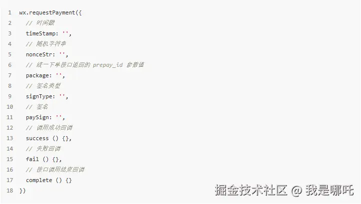

> 点击勘误[issues](https://github.com/webVueBlog/JavaPlusDoc/issues)，哪吒感谢大家的阅读


# 微信小程序开发完全指南：从入门到精通

## 目录

- [微信小程序开发完全指南：从入门到精通](#微信小程序开发完全指南从入门到精通)
  - [目录](#目录)
  - [1. 微信小程序基础](#1-微信小程序基础)
    - [1.1 什么是微信小程序](#11-什么是微信小程序)
    - [1.2 小程序与H5、原生App的对比](#12-小程序与h5原生app的对比)
    - [1.3 开发环境搭建](#13-开发环境搭建)
    - [1.4 小程序项目结构](#14-小程序项目结构)
  - [2. 小程序开发基础](#2-小程序开发基础)
    - [2.1 WXML与WXSS](#21-wxml与wxss)
    - [2.2 小程序生命周期](#22-小程序生命周期)
    - [2.3 数据绑定与事件处理](#23-数据绑定与事件处理)
    - [2.4 常用组件与API](#24-常用组件与api)
  - [3. 小程序登录与授权](#3-小程序登录与授权)
    - [3.1 登录流程详解](#31-登录流程详解)
    - [3.2 获取用户信息](#32-获取用户信息)
    - [3.3 授权最佳实践](#33-授权最佳实践)
  - [4. 小程序支付功能实现](#4-小程序支付功能实现)
    - [4.1 支付流程概述](#41-支付流程概述)
    - [4.2 后端接口开发](#42-后端接口开发)
    - [4.3 前端支付实现](#43-前端支付实现)
    - [4.4 支付结果处理](#44-支付结果处理)
  - [5. 订阅消息推送](#5-订阅消息推送)
    - [5.1 消息模板申请](#51-消息模板申请)
    - [5.2 前端订阅实现](#52-前端订阅实现)
    - [5.3 后端推送实现](#53-后端推送实现)
  - [6. 小程序发布与上线](#6-小程序发布与上线)
    - [6.1 代码审核与发布](#61-代码审核与发布)
    - [6.2 自动化部署CI](#62-自动化部署ci)
    - [6.3 版本管理策略](#63-版本管理策略)
  - [7. uni-app跨平台开发](#7-uni-app跨平台开发)
    - [7.1 uni-app简介](#71-uni-app简介)
    - [7.2 开发与打包流程](#72-开发与打包流程)
    - [7.3 多端适配策略](#73-多端适配策略)
  - [8. 小程序性能优化](#8-小程序性能优化)
    - [8.1 启动性能优化](#81-启动性能优化)
    - [8.2 渲染性能优化](#82-渲染性能优化)
    - [8.3 网络请求优化](#83-网络请求优化)
  - [9. 小程序安全最佳实践](#9-小程序安全最佳实践)
    - [9.1 数据安全](#91-数据安全)
    - [9.2 通信安全](#92-通信安全)
    - [9.3 敏感信息处理](#93-敏感信息处理)
  - [10. 高级开发技巧](#10-高级开发技巧)
    - [10.1 分包加载](#101-分包加载)
    - [10.2 自定义组件](#102-自定义组件)
    - [10.3 云开发应用](#103-云开发应用)
  - [总结](#总结)

## 1. 微信小程序基础

### 1.1 什么是微信小程序

微信小程序是一种不需要下载安装即可使用的应用，它实现了「触手可及」的梦想，用户扫一扫或搜一下即可打开应用。小程序提供了一个简单、高效的应用开发框架和丰富的组件及API，帮助开发者在微信中开发具有原生体验的应用。

**小程序的主要特点：**

- **无需安装**：用户无需下载安装，扫码即用
- **快速访问**：「用完即走」的理念，无需卸载
- **原生体验**：接近原生App的用户体验
- **微信生态**：可以直接调用微信的支付、登录、地图等能力
- **体积小**：单个小程序包大小限制为2MB（主包）

### 1.2 小程序与H5、原生App的对比

| 特性 | 微信小程序 | H5 | 原生App |
|-----|---------|-----|--------|
| **安装方式** | 无需安装 | 无需安装 | 需要安装 |
| **更新方式** | 自动更新 | 自动更新 | 需要手动更新 |
| **性能表现** | 接近原生 | 一般 | 最佳 |
| **设备能力** | 部分可用 | 有限 | 完全可用 |
| **开发成本** | 中等 | 低 | 高 |
| **跨平台** | 仅微信生态 | 全平台 | 需要分别开发 |
| **上架审核** | 需要审核 | 无需审核 | 需要审核 |
| **用户获取** | 微信生态内 | 全网可访问 | 应用商店 |

### 1.3 开发环境搭建

1. **安装微信开发者工具**
   - 访问[微信开发者工具官网](https://developers.weixin.qq.com/miniprogram/dev/devtools/download.html)下载最新版本
   - 根据操作系统选择对应版本（Windows/macOS）
   - 安装并启动开发者工具

2. **注册小程序账号**
   - 访问[微信公众平台](https://mp.weixin.qq.com/)注册小程序账号
   - 完成邮箱验证和身份认证
   - 获取AppID（小程序的唯一标识）

3. **创建小程序项目**
   - 打开微信开发者工具
   - 选择「项目」→「新建项目」
   - 填入AppID、项目名称和目录
   - 选择「建立普通快速启动模板」
   - 点击「确定」创建项目

### 1.4 小程序项目结构

一个典型的小程序项目结构如下：

```
├── app.js              // 小程序逻辑
├── app.json            // 小程序公共配置
├── app.wxss            // 小程序公共样式表
├── project.config.json // 项目配置文件
├── sitemap.json        // 微信索引配置文件
├── pages/              // 页面文件夹
│   └── index/          // index页面
│       ├── index.js    // 页面逻辑
│       ├── index.wxml  // 页面结构
│       ├── index.wxss  // 页面样式表
│       └── index.json  // 页面配置
├── utils/              // 工具函数
├── components/         // 自定义组件
├── images/             // 图片资源
└── miniprogram_npm/    // npm包目录
```

**核心文件说明：**

- **app.js**：小程序入口文件，包含全局的生命周期函数和全局数据
- **app.json**：全局配置，包括页面路径、窗口表现、网络超时、底部tab等
- **app.wxss**：全局样式，作用于每一个页面
- **pages目录**：存放所有页面，每个页面由四个文件组成（js、wxml、wxss、json）

## 2. 小程序开发基础

### 2.1 WXML与WXSS

WXML（WeiXin Markup Language）是微信小程序的标记语言，类似于HTML，但具有数据绑定等特性。WXSS（WeiXin Style Sheets）是小程序的样式语言，类似于CSS。

**WXML示例：**

```html
<view class="container">
  <text>{{message}}</text>
  <button bindtap="changeMessage">点击我</button>
</view>
```

**WXSS示例：**

```css
.container {
  display: flex;
  flex-direction: column;
  align-items: center;
  padding: 20rpx;
}

text {
  font-size: 18px;
  margin-bottom: 20rpx;
}
```

**WXML特点：**

- 数据绑定：使用 `{{变量}}` 语法
- 列表渲染：使用 `wx:for` 指令
- 条件渲染：使用 `wx:if`、`wx:elif`、`wx:else` 指令
- 模板引用：使用 `template` 和 `include` 标签

**WXSS特点：**

- 尺寸单位：rpx（responsive pixel）自适应单位
- 样式导入：使用 `@import` 语句
- 选择器：支持类选择器、ID选择器、元素选择器等
- 全局样式与局部样式：app.wxss为全局样式，页面wxss为局部样式

### 2.2 小程序生命周期

小程序有两种生命周期：应用生命周期和页面生命周期。

**应用生命周期（App）：**

```javascript
App({
  onLaunch: function(options) {
    // 小程序初始化完成时触发，全局只触发一次
    console.log('App onLaunch', options);
  },
  onShow: function(options) {
    // 小程序启动，或从后台进入前台显示时触发
    console.log('App onShow', options);
  },
  onHide: function() {
    // 小程序从前台进入后台时触发
    console.log('App onHide');
  },
  onError: function(msg) {
    // 小程序发生脚本错误或API调用报错时触发
    console.log('App onError', msg);
  },
  globalData: {
    // 全局数据
    userInfo: null
  }
});
```

**页面生命周期（Page）：**

```javascript
Page({
  data: {
    // 页面数据
    message: 'Hello World'
  },
  onLoad: function(options) {
    // 页面加载时触发，一个页面只会调用一次
    console.log('Page onLoad', options);
  },
  onShow: function() {
    // 页面显示/切入前台时触发
    console.log('Page onShow');
  },
  onReady: function() {
    // 页面初次渲染完成时触发，一个页面只会调用一次
    console.log('Page onReady');
  },
  onHide: function() {
    // 页面隐藏/切入后台时触发
    console.log('Page onHide');
  },
  onUnload: function() {
    // 页面卸载时触发
    console.log('Page onUnload');
  },
  onPullDownRefresh: function() {
    // 用户下拉刷新时触发
    console.log('Page onPullDownRefresh');
  },
  onReachBottom: function() {
    // 用户上拉触底时触发
    console.log('Page onReachBottom');
  },
  onShareAppMessage: function() {
    // 用户点击右上角分享时触发
    return {
      title: '自定义分享标题',
      path: '/pages/index/index'
    };
  },
  // 自定义方法
  changeMessage: function() {
    this.setData({
      message: 'Hello WeChat MiniProgram!'
    });
  }
});
```

### 2.3 数据绑定与事件处理

**数据绑定：**

小程序使用 `{{}}` 语法进行数据绑定，将JS中的数据展示在页面上。

```html
<!-- WXML -->
<view>{{message}}</view>
<view>{{user.name}}</view>
<view>{{a + b}} + {{c}} = {{a + b + c}}</view>
```

```javascript
// JS
Page({
  data: {
    message: 'Hello',
    user: { name: 'John' },
    a: 1,
    b: 2,
    c: 3
  }
});
```

**事件处理：**

小程序通过 `bind` 或 `catch` 前缀绑定事件处理函数。

```html
<!-- WXML -->
<button bindtap="handleTap">点击我</button>
<view bindtouchstart="handleTouchStart" catchtouchmove="handleTouchMove">触摸区域</view>
```

```javascript
// JS
Page({
  handleTap: function(e) {
    console.log('按钮被点击', e);
  },
  handleTouchStart: function(e) {
    console.log('触摸开始', e);
  },
  handleTouchMove: function(e) {
    console.log('触摸移动', e);
    // catch前缀会阻止事件冒泡
  }
});
```

**常用事件：**

- `tap`：点击事件
- `input`：输入事件
- `change`：改变事件
- `submit`：表单提交事件
- `touchstart/touchmove/touchend`：触摸事件

### 2.4 常用组件与API

**基础组件：**

- `view`：视图容器，类似div
- `text`：文本组件
- `button`：按钮组件
- `image`：图片组件
- `input`：输入框组件
- `scroll-view`：可滚动视图区域
- `swiper`：滑块视图容器
- `navigator`：页面链接

**常用API：**

- 路由导航：`wx.navigateTo`、`wx.redirectTo`、`wx.switchTab`
- 网络请求：`wx.request`
- 数据存储：`wx.setStorage`、`wx.getStorage`
- 界面交互：`wx.showToast`、`wx.showModal`、`wx.showLoading`
- 用户信息：`wx.getUserProfile`
- 支付功能：`wx.requestPayment`

**API使用示例：**

```javascript
// 发起网络请求
wx.request({
  url: 'https://api.example.com/data',
  method: 'GET',
  data: { id: 1 },
  success: function(res) {
    console.log('请求成功', res.data);
  },
  fail: function(err) {
    console.error('请求失败', err);
  }
});

// 显示提示框
wx.showToast({
  title: '操作成功',
  icon: 'success',
  duration: 2000
});

// 页面跳转
wx.navigateTo({
  url: '/pages/detail/detail?id=1'
});
```

## 3. 小程序登录与授权

### 3.1 登录流程详解

微信小程序的登录流程主要包括以下步骤：

1. **前端调用 `wx.login()` 获取临时登录凭证 code**
2. **将 code 发送到开发者服务器**
3. **开发者服务器通过 code 向微信接口服务获取 openid 和 session_key**
4. **开发者服务器自定义登录态，返回自定义登录态给小程序**
5. **小程序保存登录态，后续请求携带登录态**

**登录流程代码示例：**

```javascript
// 小程序端
wx.login({
  success: function(res) {
    if (res.code) {
      // 发送 res.code 到后端
      wx.request({
        url: 'https://api.example.com/login',
        method: 'POST',
        data: {
          code: res.code
        },
        success: function(result) {
          // 保存登录态
          wx.setStorageSync('token', result.data.token);
          console.log('登录成功');
        }
      });
    } else {
      console.error('登录失败：' + res.errMsg);
    }
  }
});
```

**后端处理流程（Node.js示例）：**

```javascript
const axios = require('axios');

async function login(code) {
  // 小程序 appId 和 appSecret
  const appId = 'your_appid';
  const appSecret = 'your_appsecret';
  
  try {
    // 请求微信接口获取 openid 和 session_key
    const result = await axios.get(
      `https://api.weixin.qq.com/sns/jscode2session?appid=${appId}&secret=${appSecret}&js_code=${code}&grant_type=authorization_code`
    );
    
    const { openid, session_key } = result.data;
    
    // 生成自定义登录态 token
    const token = generateToken(openid);
    
    // 保存用户信息和 session_key 到数据库
    await saveUserInfo(openid, session_key, token);
    
    return { token };
  } catch (error) {
    console.error('登录失败', error);
    throw error;
  }
}

// 生成 token 的函数
function generateToken(openid) {
  // 实际应用中应使用更安全的方式生成 token
  return `token_${openid}_${Date.now()}`;
}

// 保存用户信息到数据库
async function saveUserInfo(openid, session_key, token) {
  // 实现数据库存储逻辑
  // ...
}
```

### 3.2 获取用户信息

从2021年4月13日起，微信调整了获取用户信息的接口，废弃了 `wx.getUserInfo` 接口，改为使用 `wx.getUserProfile` 接口，且必须由用户主动触发。

**获取用户信息示例：**

```html
<!-- WXML -->
<button bindtap="getUserProfile">获取用户信息</button>
```

```javascript
// JS
Page({
  getUserProfile: function() {
    wx.getUserProfile({
      desc: '用于完善会员资料', // 声明获取用户个人信息后的用途
      success: (res) => {
        const userInfo = res.userInfo;
        console.log('用户信息', userInfo);
        
        // 保存用户信息
        this.setData({
          userInfo: userInfo,
          hasUserInfo: true
        });
        
        // 可以将用户信息发送到后端保存
        this.updateUserInfo(userInfo);
      },
      fail: (err) => {
        console.error('获取用户信息失败', err);
      }
    });
  },
  
  updateUserInfo: function(userInfo) {
    const token = wx.getStorageSync('token');
    
    wx.request({
      url: 'https://api.example.com/user/update',
      method: 'POST',
      header: {
        'Authorization': `Bearer ${token}`
      },
      data: userInfo,
      success: function(res) {
        console.log('用户信息更新成功');
      }
    });
  }
});
```

### 3.3 授权最佳实践

**授权策略：**

1. **分步授权**：根据功能需要逐步请求授权，避免一次性请求多个权限
2. **明确用途**：在请求授权时明确说明用途，提高用户接受度
3. **优雅降级**：用户拒绝授权时提供替代方案，不影响核心功能使用
4. **授权引导**：对于关键权限，提供图文并茂的引导说明

**授权状态检查：**

```javascript
wx.getSetting({
  success: function(res) {
    if (res.authSetting['scope.userInfo']) {
      // 已经授权获取用户信息
      console.log('已授权用户信息');
    }
    
    if (res.authSetting['scope.userLocation']) {
      // 已经授权获取位置信息
      console.log('已授权位置信息');
    }
  }
});
```

**打开设置页引导用户授权：**

```javascript
wx.showModal({
  title: '提示',
  content: '需要您的位置权限才能提供附近服务，是否前往设置？',
  success: function(res) {
    if (res.confirm) {
      wx.openSetting({
        success: function(settingRes) {
          console.log('设置页操作结果', settingRes);
        }
      });
    }
  }
});
```

## 4. 小程序支付功能实现

### 4.1 支付流程概述

微信小程序支付流程主要包括以下步骤：

1. **用户在小程序内选择商品下单**
2. **小程序调用后端接口创建订单**
3. **后端调用微信支付统一下单API获取支付参数**
4. **后端将支付参数返回给小程序**
5. **小程序调用 `wx.requestPayment()` 发起支付**
6. **用户完成支付操作**
7. **微信服务器通知商户支付结果**
8. **商户系统更新订单状态**



### 4.2 后端接口开发

**统一下单接口（Node.js示例）：**

```javascript
const crypto = require('crypto');
const axios = require('axios');

async function createOrder(req, res) {
  try {
    const { openid, totalFee, body, orderId } = req.body;
    
    // 微信支付参数
    const appid = 'your_appid';
    const mchid = 'your_mchid'; // 商户号
    const mchKey = 'your_mch_key'; // 商户密钥
    const notifyUrl = 'https://api.example.com/pay/notify'; // 支付结果通知地址
    const nonceStr = generateNonceStr();
    const timestamp = Math.floor(Date.now() / 1000).toString();
    
    // 构建统一下单请求参数
    const params = {
      appid,
      mch_id: mchid,
      nonce_str: nonceStr,
      body,
      out_trade_no: orderId,
      total_fee: totalFee, // 单位：分
      spbill_create_ip: req.ip,
      notify_url: notifyUrl,
      trade_type: 'JSAPI',
      openid
    };
    
    // 签名
    const sign = generateSign(params, mchKey);
    params.sign = sign;
    
    // 将参数转为XML格式
    const xmlData = jsonToXml(params);
    
    // 调用微信统一下单接口
    const result = await axios.post(
      'https://api.mch.weixin.qq.com/pay/unifiedorder',
      xmlData,
      { headers: { 'Content-Type': 'text/xml' } }
    );
    
    // 解析XML响应
    const responseData = xmlToJson(result.data);
    
    if (responseData.return_code === 'SUCCESS' && responseData.result_code === 'SUCCESS') {
      // 生成小程序调用支付需要的参数
      const payParams = {
        appId: appid,
        timeStamp: timestamp,
        nonceStr,
        package: `prepay_id=${responseData.prepay_id}`,
        signType: 'MD5'
      };
      
      // 再次签名
      payParams.paySign = generateSign(payParams, mchKey);
      
      // 删除appId，避免小程序端签名校验失败
      delete payParams.appId;
      
      res.json({
        code: 0,
        message: '创建订单成功',
        data: payParams
      });
    } else {
      throw new Error(responseData.return_msg || responseData.err_code_des || '创建订单失败');
    }
  } catch (error) {
    console.error('创建订单失败', error);
    res.json({
      code: -1,
      message: error.message || '创建订单失败'
    });
  }
}

// 生成随机字符串
function generateNonceStr() {
  return Math.random().toString(36).substr(2, 15);
}

// 生成签名
function generateSign(params, key) {
  // 按字典序排序参数
  const sortedParams = Object.keys(params).sort().reduce((result, key) => {
    result[key] = params[key];
    return result;
  }, {});
  
  // 拼接参数字符串
  let stringA = '';
  for (const k in sortedParams) {
    if (sortedParams[k] !== '' && sortedParams[k] !== undefined) {
      stringA += `${k}=${sortedParams[k]}&`;
    }
  }
  
  // 拼接key
  const stringSignTemp = stringA + `key=${key}`;
  
  // MD5加密并转为大写
  return crypto.createHash('md5').update(stringSignTemp).digest('hex').toUpperCase();
}

// 支付结果通知处理
async function handlePayNotify(req, res) {
  try {
    // 解析微信支付结果通知
    const notifyData = xmlToJson(req.body);
    
    // 验证签名
    const sign = notifyData.sign;
    delete notifyData.sign;
    const calculatedSign = generateSign(notifyData, 'your_mch_key');
    
    if (calculatedSign !== sign) {
      throw new Error('签名验证失败');
    }
    
    if (notifyData.return_code === 'SUCCESS' && notifyData.result_code === 'SUCCESS') {
      // 支付成功，更新订单状态
      const orderId = notifyData.out_trade_no;
      const transactionId = notifyData.transaction_id;
      
      // 更新订单状态逻辑
      await updateOrderStatus(orderId, transactionId);
      
      // 返回成功响应
      res.send('<xml><return_code><![CDATA[SUCCESS]]></return_code><return_msg><![CDATA[OK]]></return_msg></xml>');
    } else {
      throw new Error('支付失败');
    }
  } catch (error) {
    console.error('处理支付通知失败', error);
    res.send('<xml><return_code><![CDATA[FAIL]]></return_code><return_msg><![CDATA[处理失败]]></return_msg></xml>');
  }
}

// 更新订单状态
async function updateOrderStatus(orderId, transactionId) {
  // 实现数据库更新逻辑
  // ...
}
```

### 4.3 前端支付实现

**小程序端发起支付：**

```javascript
Page({
  data: {
    goodsId: '',
    goodsName: '',
    price: 0
  },
  
  onLoad: function(options) {
    this.setData({
      goodsId: options.id
    });
    
    // 获取商品详情
    this.getGoodsDetail(options.id);
  },
  
  getGoodsDetail: function(goodsId) {
    wx.request({
      url: `https://api.example.com/goods/${goodsId}`,
      success: (res) => {
        this.setData({
          goodsName: res.data.name,
          price: res.data.price
        });
      }
    });
  },
  
  // 创建订单并发起支付
  createOrder: function() {
    // 显示加载中
    wx.showLoading({
      title: '正在创建订单'
    });
    
    // 获取用户openid（假设已经在登录时保存）
    const openid = wx.getStorageSync('openid');
    const token = wx.getStorageSync('token');
    
    // 创建订单参数
    const orderParams = {
      openid,
      goodsId: this.data.goodsId,
      totalFee: this.data.price * 100, // 转为分
      body: this.data.goodsName,
      orderId: `ORDER_${Date.now()}` // 实际应用中应由后端生成
    };
    
    // 请求后端创建订单
    wx.request({
      url: 'https://api.example.com/order/create',
      method: 'POST',
      header: {
        'Authorization': `Bearer ${token}`
      },
      data: orderParams,
      success: (res) => {
        wx.hideLoading();
        
        if (res.data.code === 0) {
          // 获取支付参数
          const payParams = res.data.data;
          
          // 调起微信支付
          this.requestPayment(payParams);
        } else {
          wx.showToast({
            title: res.data.message || '创建订单失败',
            icon: 'none'
          });
        }
      },
      fail: () => {
        wx.hideLoading();
        wx.showToast({
          title: '网络错误，请重试',
          icon: 'none'
        });
      }
    });
  },
  
  // 发起微信支付
  requestPayment: function(params) {
    wx.requestPayment({
      timeStamp: params.timeStamp,
      nonceStr: params.nonceStr,
      package: params.package,
      signType: params.signType,
      paySign: params.paySign,
      success: (res) => {
        console.log('支付成功', res);
        wx.showToast({
          title: '支付成功'
        });
        
        // 跳转到订单详情页
        setTimeout(() => {
          wx.navigateTo({
            url: '/pages/order/detail?id=' + orderParams.orderId
          });
        }, 1500);
      },
      fail: (err) => {
        console.log('支付失败', err);
        if (err.errMsg === 'requestPayment:fail cancel') {
          wx.showToast({
            title: '支付已取消',
            icon: 'none'
          });
        } else {
          wx.showToast({
            title: '支付失败，请重试',
            icon: 'none'
          });
        }
      }
    });
  }
});
```

### 4.4 支付结果处理

**支付成功后的业务处理：**

1. **前端处理**：
   - 显示支付成功提示
   - 跳转到订单详情页
   - 更新本地订单状态

2. **后端处理**：
   - 接收微信支付结果通知
   - 验证签名和支付状态
   - 更新订单状态
   - 触发后续业务流程（发货、记录等）

**订单查询接口（用于前端主动查询订单状态）：**

```javascript
// 后端实现
async function queryOrder(req, res) {
  try {
    const { orderId } = req.params;
    
    // 从数据库查询订单
    const order = await Order.findOne({ orderId });
    
    if (!order) {
      return res.json({
        code: -1,
        message: '订单不存在'
      });
    }
    
    res.json({
      code: 0,
      data: {
        orderId: order.orderId,
        status: order.status,
        payTime: order.payTime,
        amount: order.amount
      }
    });
  } catch (error) {
    console.error('查询订单失败', error);
    res.json({
      code: -1,
      message: '查询订单失败'
    });
  }
}

// 小程序端实现
Page({
  data: {
    orderId: '',
    orderStatus: '',
    orderAmount: 0,
    payTime: ''
  },
  
  onLoad: function(options) {
    this.setData({
      orderId: options.id
    });
    
    this.queryOrderStatus();
  },
  
  queryOrderStatus: function() {
    const token = wx.getStorageSync('token');
    
    wx.request({
      url: `https://api.example.com/order/${this.data.orderId}`,
      header: {
        'Authorization': `Bearer ${token}`
      },
      success: (res) => {
        if (res.data.code === 0) {
          this.setData({
            orderStatus: res.data.data.status,
            orderAmount: res.data.data.amount / 100, // 转为元
            payTime: res.data.data.payTime
          });
        }
      }
    });
  }
});
```

## 5. 订阅消息推送

### 5.1 消息模板申请

微信小程序订阅消息需要先申请消息模板，步骤如下：

1. **登录微信公众平台**
2. **进入「功能」→「订阅消息」**
3. **选择「公共模板库」或「自定义模板」**
4. **选择合适的模板并提交申请**
5. **审核通过后获取模板ID**


**订阅消息类型：**

- **一次性订阅消息**：用户订阅后，开发者可在不限时间内下发一条消息
- **长期订阅消息**：用户订阅一次后，开发者可长期下发多条消息（仅向特定类目开放）

### 5.2 前端订阅实现

**订阅消息前端实现：**

```html
<!-- WXML -->
<button bindtap="subscribeMessage">订阅消息通知</button>
```

```javascript
// JS
Page({
  data: {
    tmplIds: ['模板ID1', '模板ID2', '模板ID3'] // 最多可添加3个模板ID
  },
  
  // 订阅消息
  subscribeMessage: function() {
    wx.requestSubscribeMessage({
      tmplIds: this.data.tmplIds,
      success: (res) => {
        console.log('订阅结果', res);
        
        // 检查订阅结果
        let acceptedTemplates = [];
        this.data.tmplIds.forEach(tmplId => {
          if (res[tmplId] === 'accept') {
            acceptedTemplates.push(tmplId);
          }
        });
        
        if (acceptedTemplates.length > 0) {
          // 将接受的模板ID发送到后端保存
          this.saveSubscription(acceptedTemplates);
          
          wx.showToast({
            title: '订阅成功',
            icon: 'success'
          });
        } else {
          wx.showToast({
            title: '您拒绝了订阅',
            icon: 'none'
          });
        }
      },
      fail: (err) => {
        console.error('订阅失败', err);
        wx.showToast({
          title: '订阅失败，请重试',
          icon: 'none'
        });
      }
    });
  },
  
  // 保存订阅信息到后端
  saveSubscription: function(acceptedTemplates) {
    const token = wx.getStorageSync('token');
    
    wx.request({
      url: 'https://api.example.com/subscription/save',
      method: 'POST',
      header: {
        'Authorization': `Bearer ${token}`
      },
      data: {
        templateIds: acceptedTemplates
      },
      success: (res) => {
        console.log('订阅信息保存成功', res.data);
      }
    });
  }
});
```

### 5.3 后端推送实现

**发送订阅消息（Node.js示例）：**

```javascript
async function sendSubscribeMessage(req, res) {
  try {
    const { openid, templateId, data, page } = req.body;
    
    // 获取接口调用凭证
    const accessToken = await getAccessToken();
    
    // 构建请求参数
    const params = {
      touser: openid,
      template_id: templateId,
      page, // 可选，点击消息卡片后跳转的页面
      data // 模板数据
    };
    
    // 调用发送订阅消息接口
    const result = await axios.post(
      `https://api.weixin.qq.com/cgi-bin/message/subscribe/send?access_token=${accessToken}`,
      params
    );
    
    if (result.data.errcode === 0) {
      res.json({
        code: 0,
        message: '发送成功'
      });
    } else {
      throw new Error(`发送失败：${result.data.errmsg}`);
    }
  } catch (error) {
    console.error('发送订阅消息失败', error);
    res.json({
      code: -1,
      message: error.message || '发送失败'
    });
  }
}

// 获取接口调用凭证
async function getAccessToken() {
  const appId = 'your_appid';
  const appSecret = 'your_appsecret';
  
  try {
    const result = await axios.get(
      `https://api.weixin.qq.com/cgi-bin/token?grant_type=client_credential&appid=${appId}&secret=${appSecret}`
    );
    
    if (result.data.access_token) {
      return result.data.access_token;
    } else {
      throw new Error('获取access_token失败');
    }
  } catch (error) {
    console.error('获取access_token失败', error);
    throw error;
  }
}

// 使用示例
// 审核结果通知
app.post('/notify/audit-result', async (req, res) => {
  try {
    const { userId, auditResult, auditTime, title } = req.body;
    
    // 获取用户openid
    const user = await User.findById(userId);
    
    if (!user || !user.openid) {
      return res.json({
        code: -1,
        message: '用户不存在或未绑定openid'
      });
    }
    
    // 发送订阅消息
    await sendSubscribeMessage({
      body: {
        openid: user.openid,
        templateId: 'TknXJKdubbcKDpmLGDkvoxeDn-4ReD3dLDmHRHwSB_M', // 审核结果通知模板ID
        page: 'pages/audit/detail?id=123',
        data: {
          thing1: { value: title }, // 问题标题
          phrase2: { value: auditResult }, // 审批结果
          time3: { value: auditTime } // 发起时间
        }
      }
    }, res);
  } catch (error) {
    console.error('发送审核结果通知失败', error);
    res.json({
      code: -1,
      message: '发送通知失败'
    });
  }
});
```

## 6. 小程序发布与上线

### 6.1 代码审核与发布

**小程序发布流程：**

1. **代码上传**：在开发者工具中点击「上传」按钮
2. **填写版本信息**：版本号、项目备注等
3. **提交审核**：在微信公众平台提交代码审核
4. **等待审核**：审核时间通常为1-3个工作日
5. **发布上线**：审核通过后点击「发布」按钮

**版本管理最佳实践：**

- **版本号规范**：采用语义化版本号（Semantic Versioning）
- **灰度发布**：先发布给部分用户，确认稳定后再全量发布
- **版本日志**：详细记录每个版本的变更内容
- **回滚机制**：保留回滚到之前版本的能力

### 6.2 自动化部署CI

微信小程序支持使用 `miniprogram-ci` 工具实现自动化部署，可以集成到 CI/CD 流程中。

**安装 miniprogram-ci：**

```bash
npm install --save-dev miniprogram-ci
```

**创建上传脚本（upload.js）：**

```javascript
const ci = require('miniprogram-ci');
const path = require('path');

// 读取命令行参数
const version = process.argv[2] || '1.0.0';
const desc = process.argv[3] || '自动化部署';

(async () => {
  try {
    // 创建项目对象
    const project = new ci.Project({
      appid: 'your_appid',
      type: 'miniProgram',
      projectPath: path.resolve('./'), // 项目路径
      privateKeyPath: path.resolve('./private.key'), // 密钥路径
      ignores: ['node_modules/**/*']
    });
    
    // 上传代码
    const uploadResult = await ci.upload({
      project,
      version,
      desc,
      setting: {
        es6: true,
        minify: true,
        autoPrefixWXSS: true
      },
      onProgressUpdate: console.log
    });
    
    console.log('上传成功', uploadResult);
  } catch (error) {
    console.error('上传失败', error);
    process.exit(1);
  }
})();
```

**集成到 package.json：**

```json
{
  "scripts": {
    "upload": "node upload.js",
    "upload:prod": "node upload.js 1.0.0 '正式版发布'",
    "upload:test": "node upload.js 1.0.0-beta '测试版发布'"
  }
}
```

**集成到 GitHub Actions：**

```yaml
# .github/workflows/deploy.yml
name: Deploy MiniProgram

on:
  push:
    branches: [main]
  workflow_dispatch:

jobs:
  deploy:
    runs-on: ubuntu-latest
    steps:
      - uses: actions/checkout@v2
      
      - name: Setup Node.js
        uses: actions/setup-node@v2
        with:
          node-version: '14'
      
      - name: Install dependencies
        run: npm install
      
      - name: Create private key file
        run: echo "${{ secrets.PRIVATE_KEY }}" > private.key
      
      - name: Upload to WeChat
        run: npm run upload:prod
```

### 6.3 版本管理策略

**版本号规范：**

- **主版本号**：不兼容的API修改
- **次版本号**：向下兼容的功能性新增
- **修订号**：向下兼容的问题修正

**发布策略：**

1. **体验版**：内部测试使用
2. **开发版**：开发过程中的版本
3. **审核版**：提交审核的版本
4. **线上版**：正式发布的版本

**多环境配置：**

```javascript
// config.js
const env = wx.getAccountInfoSync().miniProgram.envVersion;

const config = {
  development: {
    apiBaseUrl: 'https://dev-api.example.com',
    debug: true
  },
  trial: {
    apiBaseUrl: 'https://test-api.example.com',
    debug: true
  },
  release: {
    apiBaseUrl: 'https://api.example.com',
    debug: false
  }
};

// 根据环境选择配置
const currentConfig = {
  development: config.development, // 开发版
  trial: config.trial, // 体验版
  release: config.release // 正式版
}[env] || config.development;

export default currentConfig;
```

## 7. uni-app跨平台开发

### 7.1 uni-app简介

uni-app是一个使用Vue.js开发所有前端应用的框架，开发者编写一套代码，可发布到iOS、Android、Web（响应式）、以及各种小程序（微信/支付宝/百度/头条/飞书/QQ/快手/钉钉/淘宝）等多个平台。

**uni-app优势：**

- **跨平台**：一套代码，多端发布
- **高性能**：基于原生渲染，性能体验接近原生App
- **生态丰富**：支持NPM、支持小程序组件和SDK
- **开发效率**：HBuilderX内置相关环境，开箱即用

### 7.2 开发与打包流程

**环境准备：**

1. **安装HBuilderX**：
   - 下载并安装最新版HBuilderX：https://www.dcloud.io/hbuilderx.html

2. **创建uni-app项目**：
   - 打开HBuilderX → 文件 → 新建 → 项目
   - 选择uni-app模板
   - 填写项目名称和存储路径
   - 选择Vue版本和默认模板

**配置manifest.json：**

```json
{
  "name": "应用名称",
  "appid": "__UNI__XXXXXXX",
  "description": "应用描述",
  "versionName": "1.0.0",
  "versionCode": "100",
  "transformPx": false,
  "app-plus": {
    "usingComponents": true,
    "nvueCompiler": "uni-app",
    "compilerVersion": 3,
    "splashscreen": {
      "alwaysShowBeforeRender": true,
      "waiting": true,
      "autoclose": true,
      "delay": 0
    },
    "modules": {},
    "distribute": {
      "android": {
        "permissions": [],
        "abiFilters": ["armeabi-v7a", "arm64-v8a"]
      },
      "ios": {
        "dSYMs": false
      },
      "sdkConfigs": {}
    }
  },
  "quickapp": {},
  "mp-weixin": {
    "appid": "wx开头的微信小程序appid",
    "setting": {
      "urlCheck": false
    },
    "usingComponents": true
  },
  "mp-alipay": {
    "usingComponents": true
  },
  "mp-baidu": {
    "usingComponents": true
  },
  "mp-toutiao": {
    "usingComponents": true
  },
  "uniStatistics": {
    "enable": false
  }
}
```

**打包发布流程：**

1. **微信小程序打包**：
   - HBuilderX → 发行 → 小程序-微信
   - 填写小程序名称和AppID
   - 点击发行
   - 使用微信开发者工具上传代码

2. **Android打包**：
   - HBuilderX → 发行 → 原生App-云打包
   - 选择Android平台
   - 配置证书信息
   - 点击发行

3. **iOS打包**：
   - HBuilderX → 发行 → 原生App-云打包
   - 选择iOS平台
   - 配置证书和描述文件
   - 点击发行

### 7.3 多端适配策略

**条件编译：**

uni-app提供了条件编译功能，可以根据不同平台编写特定代码。

```vue
<template>
  <view>
    <!-- 所有平台通用 -->
    <view>所有平台都显示的内容</view>
    
    <!-- 仅在微信小程序显示 -->
    <view v-if="mpPlatform === 'mp-weixin'">仅微信小程序显示</view>
    
    <!-- #ifdef MP-WEIXIN -->
    <view>仅微信小程序显示（条件编译）</view>
    <!-- #endif -->
    
    <!-- #ifdef APP-PLUS -->
    <view>仅App显示（条件编译）</view>
    <!-- #endif -->
  </view>
</template>

<script>
export default {
  data() {
    return {
      mpPlatform: ''
    }
  },
  onLoad() {
    // 获取当前平台
    // #ifdef MP-WEIXIN
    this.mpPlatform = 'mp-weixin';
    // #endif
    
    // #ifdef MP-ALIPAY
    this.mpPlatform = 'mp-alipay';
    // #endif
    
    // #ifdef APP-PLUS
    this.mpPlatform = 'app-plus';
    // #endif
  },
  methods: {
    // 条件编译示例
    platformSpecificMethod() {
      // #ifdef MP-WEIXIN
      // 微信小程序特有代码
      wx.showShareMenu({
        withShareTicket: true
      });
      // #endif
      
      // #ifdef APP-PLUS
      // App特有代码
      plus.device.vibrate(100);
      // #endif
    }
  }
}
</script>

<style>
/* 所有平台通用样式 */
view {
  padding: 10px;
}

/* #ifdef MP-WEIXIN */
/* 微信小程序特有样式 */
.wx-only {
  color: #07C160;
}
/* #endif */

/* #ifdef APP-PLUS */
/* App特有样式 */
.app-only {
  color: #007AFF;
}
/* #endif */
</style>
```

**API差异处理：**

```javascript
// 封装平台差异的API
const platform = {
  // 获取位置信息
  getLocation() {
    return new Promise((resolve, reject) => {
      uni.getLocation({
        type: 'gcj02',
        success: res => {
          resolve(res);
        },
        fail: err => {
          reject(err);
        }
      });
    });
  },
  
  // 分享功能
  share(options) {
    // #ifdef MP-WEIXIN
    wx.showShareMenu({
      withShareTicket: true,
      menus: ['shareAppMessage', 'shareTimeline']
    });
    // #endif
    
    // #ifdef APP-PLUS
    plus.share.sendWithSystem({
      type: 'text',
      content: options.title,
      href: options.path
    });
    // #endif
  }
};

export default platform;
```

**样式适配：**

```css
/* 样式适配示例 */

/* 通用样式 */
.container {
  padding: 20rpx;
}

/* 小程序样式 */
/* #ifdef MP */
.container {
  background-color: #f8f8f8;
}
/* #endif */

/* App样式 */
/* #ifdef APP-PLUS */
.container {
  background-color: #ffffff;
}
/* #endif */

/* iOS样式 */
/* #ifdef APP-PLUS-IOS */
.safe-area-inset {
  padding-bottom: constant(safe-area-inset-bottom);
  padding-bottom: env(safe-area-inset-bottom);
}
/* #endif */

/* Android样式 */
/* #ifdef APP-PLUS-ANDROID */
.android-only {
  margin-top: 10rpx;
}
/* #endif */
```

## 8. 小程序性能优化

### 8.1 启动性能优化

**减少启动时间的策略：**

1. **控制代码包大小**：
   - 分包加载
   - 压缩图片资源
   - 移除未使用的代码和资源

2. **优化app.js**：
   - 减少app.js中的同步代码
   - 将非必要的初始化逻辑延迟执行
   - 使用异步API代替同步API

3. **预加载策略**：
   - 使用预加载接口提前下载分包
   - 使用周期性更新机制保持本地数据最新

**代码示例：**

```javascript
// app.js 优化示例
App({
  onLaunch: function() {
    // 只保留必要的初始化逻辑
    this.initUserInfo();
    
    // 延迟执行非关键任务
    setTimeout(() => {
      this.initNonCriticalTasks();
    }, 2000);
    
    // 预加载分包
    wx.loadSubpackage({
      name: 'packageA',
      success: function() {
        console.log('分包预加载成功');
      },
      fail: function() {
        console.log('分包预加载失败');
      }
    });
  },
  
  initUserInfo: function() {
    // 用户信息初始化（关键任务）
    const token = wx.getStorageSync('token');
    if (token) {
      this.globalData.isLoggedIn = true;
    }
  },
  
  initNonCriticalTasks: function() {
    // 非关键任务初始化
    this.checkForUpdates();
    this.initAnalytics();
    this.loadRemoteConfig();
  },
  
  globalData: {
    isLoggedIn: false
  }
});
```

### 8.2 渲染性能优化

**提升渲染性能的策略：**

1. **避免频繁setData**：
   - 合并多次setData操作
   - 只传输必要数据
   - 避免传输大量数据

2. **使用懒加载**：
   - 图片懒加载
   - 列表分页加载

3. **优化WXML结构**：
   - 减少节点层级和数量
   - 使用block标签包裹
   - 适当使用wx:if和wx:for

**代码示例：**

```javascript
// 优化前
Page({
  updateUI: function() {
    this.setData({ a: 1 });
    this.setData({ b: 2 });
    this.setData({ c: 3 });
  }
});

// 优化后
Page({
  updateUI: function() {
    this.setData({
      a: 1,
      b: 2,
      c: 3
    });
  }
});
```

```html
<!-- 优化前 -->
<view wx:for="{{list}}" wx:key="id">
  <view class="item">
    <view class="title">{{item.title}}</view>
    <view class="desc">{{item.desc}}</view>
    <view class="footer">
      <view class="time">{{item.time}}</view>
      <view class="author">{{item.author}}</view>
    </view>
  </view>
</view>

<!-- 优化后 -->
<block wx:for="{{list}}" wx:key="id">
  <view class="item">
    <text class="title">{{item.title}}</text>
    <text class="desc">{{item.desc}}</text>
    <view class="footer">
      <text class="time">{{item.time}}</text>
      <text class="author">{{item.author}}</text>
    </view>
  </view>
</block>
```

### 8.3 网络请求优化

**网络请求优化策略：**

1. **请求合并**：
   - 合并多个相关请求
   - 使用批量接口

2. **缓存策略**：
   - 缓存不常变化的数据
   - 使用Storage存储API响应
   - 设置合理的缓存过期时间

3. **预加载数据**：
   - 提前请求可能需要的数据
   - 页面切换时预加载下一页数据

**代码示例：**

```javascript
// 网络请求封装（带缓存）
const request = (options) => {
  return new Promise((resolve, reject) => {
    // 缓存key
    const cacheKey = `cache_${options.url}_${JSON.stringify(options.data || {})}`;
    
    // 缓存过期时间（毫秒）
    const expireTime = options.cache ? (options.expireTime || 5 * 60 * 1000) : 0;
    
    // 检查是否有缓存
    if (options.cache) {
      const cacheData = wx.getStorageSync(cacheKey);
      if (cacheData && cacheData.expire > Date.now()) {
        resolve(cacheData.data);
        return;
      }
    }
    
    // 发起请求
    wx.request({
      url: options.url,
      method: options.method || 'GET',
      data: options.data,
      header: options.header || {},
      success: (res) => {
        // 缓存结果
        if (options.cache && res.statusCode === 200) {
          wx.setStorageSync(cacheKey, {
            data: res.data,
            expire: Date.now() + expireTime
          });
        }
        resolve(res.data);
      },
      fail: (err) => {
        reject(err);
      }
    });
  });
};

// 使用示例
Page({
  onLoad: function() {
    // 带缓存的请求，缓存5分钟
    request({
      url: 'https://api.example.com/data',
      cache: true,
      expireTime: 5 * 60 * 1000
    }).then(data => {
      this.setData({ list: data });
    });
  }
});
```

## 9. 小程序安全最佳实践

### 9.1 数据安全

**保护数据安全的策略：**

1. **敏感数据处理**：
   - 避免在本地存储敏感信息
   - 使用加密存储必要的敏感数据
   - 及时清理不需要的数据

2. **数据传输安全**：
   - 使用HTTPS进行网络通信
   - 对敏感数据进行加密传输
   - 实现请求签名机制

3. **防止数据泄露**：
   - 避免在日志中打印敏感信息
   - 控制数据访问权限
   - 定期审计数据访问记录

**代码示例：**

```javascript
// 数据加密存储
const CryptoJS = require('crypto-js');

// 加密函数
function encrypt(data, key) {
  return CryptoJS.AES.encrypt(JSON.stringify(data), key).toString();
}

// 解密函数
function decrypt(ciphertext, key) {
  const bytes = CryptoJS.AES.decrypt(ciphertext, key);
  return JSON.parse(bytes.toString(CryptoJS.enc.Utf8));
}

// 安全存储敏感数据
function secureStorage(key, data) {
  const encryptionKey = 'your-secret-key'; // 实际应用中应使用更安全的密钥管理
  const encryptedData = encrypt(data, encryptionKey);
  wx.setStorageSync(key, encryptedData);
}

// 安全读取敏感数据
function secureRead(key) {
  const encryptionKey = 'your-secret-key';
  const encryptedData = wx.getStorageSync(key);
  if (!encryptedData) return null;
  return decrypt(encryptedData, encryptionKey);
}

// 使用示例
Page({
  saveUserData: function(userData) {
    secureStorage('userData', userData);
  },
  
  getUserData: function() {
    return secureRead('userData');
  },
  
  clearUserData: function() {
    wx.removeStorageSync('userData');
  }
});
```

### 9.2 通信安全

**保障通信安全的策略：**

1. **请求签名**：
   - 对请求参数进行签名
   - 验证请求来源和完整性
   - 防止请求被篡改

2. **防重放攻击**：
   - 请求添加时间戳
   - 实现请求有效期机制
   - 使用一次性nonce值

3. **传输加密**：
   - 使用HTTPS协议
   - 敏感字段单独加密
   - 使用安全的加密算法

**代码示例：**

```javascript
// 请求签名实现
function generateSignature(params, secretKey) {
  // 1. 按字典序排序参数
  const sortedKeys = Object.keys(params).sort();
  
  // 2. 拼接参数字符串
  let signStr = '';
  sortedKeys.forEach(key => {
    if (key !== 'sign' && params[key] !== undefined && params[key] !== null) {
      signStr += `${key}=${params[key]}&`;
    }
  });
  
  // 3. 添加密钥
  signStr += `key=${secretKey}`;
  
  // 4. MD5加密并转大写
  return CryptoJS.MD5(signStr).toString().toUpperCase();
}

// 发送带签名的请求
function secureRequest(url, params, method = 'GET') {
  // 添加公共参数
  const requestParams = {
    ...params,
    timestamp: Date.now(),
    nonce: Math.random().toString(36).substr(2, 10),
    appId: 'your-app-id'
  };
  
  // 生成签名
  const secretKey = 'your-secret-key'; // 实际应用中应使用更安全的密钥管理
  requestParams.sign = generateSignature(requestParams, secretKey);
  
  // 发送请求
  return new Promise((resolve, reject) => {
    wx.request({
      url,
      method,
      data: requestParams,
      success: res => {
        if (res.statusCode === 200) {
          resolve(res.data);
        } else {
          reject(new Error(`请求失败：${res.statusCode}`));
        }
      },
      fail: err => {
        reject(err);
      }
    });
  });
}

// 使用示例
Page({
  getData: function() {
    secureRequest('https://api.example.com/data', {
      userId: '123',
      action: 'query'
    }).then(data => {
      console.log('请求成功', data);
    }).catch(err => {
      console.error('请求失败', err);
    });
  }
});
```

### 9.3 敏感信息处理

**敏感信息处理策略：**

1. **最小化收集**：
   - 只收集必要的敏感信息
   - 明确告知用户收集目的
   - 提供隐私政策说明

2. **安全展示**：
   - 敏感信息脱敏显示
   - 提供查看完整信息的选项
   - 避免截屏泄露风险

3. **安全传输与存储**：
   - 传输过程加密
   - 存储时加密
   - 使用后及时清除

**代码示例：**

```javascript
// 信息脱敏工具函数
const maskUtil = {
  // 手机号脱敏
  maskPhone: function(phone) {
    if (!phone) return '';
    return phone.replace(/^(\d{3})\d{4}(\d{4})$/, '$1****$2');
  },
  
  // 身份证号脱敏
  maskIdCard: function(idCard) {
    if (!idCard) return '';
    return idCard.replace(/^(\d{4})\d{10}(\d{4})$/, '$1**********$2');
  },
  
  // 姓名脱敏
  maskName: function(name) {
    if (!name) return '';
    if (name.length <= 1) return name;
    if (name.length === 2) return name.substr(0, 1) + '*';
    return name.substr(0, 1) + '*'.repeat(name.length - 2) + name.substr(-1);
  },
  
  // 银行卡号脱敏
  maskBankCard: function(cardNo) {
    if (!cardNo) return '';
    return cardNo.replace(/^(\d{4})\d+(\d{4})$/, '$1 **** **** $2');
  },
  
  // 邮箱脱敏
  maskEmail: function(email) {
    if (!email) return '';
    const parts = email.split('@');
    if (parts.length !== 2) return email;
    
    const name = parts[0];
    const domain = parts[1];
    
    let maskedName = '';
    if (name.length <= 2) {
      maskedName = name.substr(0, 1) + '*';
    } else {
      maskedName = name.substr(0, 2) + '*'.repeat(name.length - 2);
    }
    
    return `${maskedName}@${domain}`;
  }
};

// 使用示例
Page({
  data: {
    userInfo: {
      name: '张三',
      phone: '13812345678',
      idCard: '110101199001011234',
      email: 'zhangsan@example.com',
      bankCard: '6222021234567890123'
    },
    showFullInfo: false
  },
  
  onLoad: function() {
    this.updateDisplayInfo();
  },
  
  updateDisplayInfo: function() {
    if (this.data.showFullInfo) {
      this.setData({
        displayInfo: this.data.userInfo
      });
    } else {
      this.setData({
        displayInfo: {
          name: maskUtil.maskName(this.data.userInfo.name),
          phone: maskUtil.maskPhone(this.data.userInfo.phone),
          idCard: maskUtil.maskIdCard(this.data.userInfo.idCard),
          email: maskUtil.maskEmail(this.data.userInfo.email),
          bankCard: maskUtil.maskBankCard(this.data.userInfo.bankCard)
        }
      });
    }
  },
  
  toggleInfoDisplay: function() {
    this.setData({
      showFullInfo: !this.data.showFullInfo
    }, () => {
      this.updateDisplayInfo();
    });
  }
});
```

## 10. 高级开发技巧

### 10.1 分包加载

分包加载是优化小程序启动速度的重要手段，可以将小程序划分为多个子包，在需要时按需加载。

**分包配置示例：**

```json
// app.json
{
  "pages": [
    "pages/index/index",
    "pages/logs/logs"
  ],
  "subpackages": [
    {
      "root": "packageA",
      "pages": [
        "pages/cat/cat",
        "pages/dog/dog"
      ]
    },
    {
      "root": "packageB",
      "name": "pack2",
      "pages": [
        "pages/apple/apple",
        "pages/banana/banana"
      ]
    }
  ],
  "preloadRule": {
    "pages/index/index": {
      "network": "all",
      "packages": ["packageA"]
    }
  }
}
```

**分包策略：**

1. **按功能模块分包**：将不同功能模块划分到不同分包
2. **按访问频率分包**：高频功能放主包，低频功能放分包
3. **按加载时机分包**：启动必需的放主包，其他放分包

**分包预加载：**

```javascript
// 手动预加载分包
Page({
  onLoad: function() {
    // 预加载分包
    wx.loadSubpackage({
      name: 'packageB', // 分包的name
      success: function() {
        console.log('分包加载成功');
      },
      fail: function() {
        console.log('分包加载失败');
      }
    });
  }
});
```

### 10.2 自定义组件

自定义组件可以提高代码复用性和可维护性，是小程序开发中的重要技术。

**组件定义示例：**

```javascript
// components/custom-card/custom-card.js
Component({
  properties: {
    title: {
      type: String,
      value: '默认标题'
    },
    content: {
      type: String,
      value: ''
    },
    imageUrl: {
      type: String,
      value: ''
    }
  },
  data: {
    isExpanded: false
  },
  methods: {
    toggleExpand: function() {
      this.setData({
        isExpanded: !this.data.isExpanded
      });
      
      // 触发自定义事件
      this.triggerEvent('expand', { isExpanded: this.data.isExpanded });
    }
  },
  lifetimes: {
    attached: function() {
      // 组件被添加到页面时执行
      console.log('组件attached');
    },
    detached: function() {
      // 组件从页面中移除时执行
      console.log('组件detached');
    }
  },
  pageLifetimes: {
    show: function() {
      // 页面被展示时执行
      console.log('页面show');
    },
    hide: function() {
      // 页面被隐藏时执行
      console.log('页面hide');
    }
  }
});
```

```html
<!-- components/custom-card/custom-card.wxml -->
<view class="card {{isExpanded ? 'expanded' : ''}}">
  <view class="card-header" bindtap="toggleExpand">
    <text class="card-title">{{title}}</text>
    <view class="card-icon">{{isExpanded ? '↑' : '↓'}}</view>
  </view>
  
  <view class="card-body" wx:if="{{isExpanded}}">
    <image wx:if="{{imageUrl}}" src="{{imageUrl}}" mode="aspectFill" class="card-image"></image>
    <text class="card-content">{{content}}</text>
    <slot></slot>
  </view>
</view>
```

```css
/* components/custom-card/custom-card.wxss */
.card {
  margin: 20rpx;
  border-radius: 10rpx;
  background-color: #fff;
  box-shadow: 0 2rpx 10rpx rgba(0, 0, 0, 0.1);
  overflow: hidden;
}

.card-header {
  display: flex;
  justify-content: space-between;
  align-items: center;
  padding: 20rpx;
  border-bottom: 1rpx solid #eee;
}

.card-title {
  font-size: 32rpx;
  font-weight: bold;
}

.card-icon {
  font-size: 24rpx;
  color: #999;
}

.card-body {
  padding: 20rpx;
}

.card-image {
  width: 100%;
  height: 300rpx;
  margin-bottom: 20rpx;
}

.card-content {
  font-size: 28rpx;
  color: #666;
  line-height: 1.5;
}

.expanded {
  box-shadow: 0 4rpx 20rpx rgba(0, 0, 0, 0.15);
}
```

**组件使用示例：**

```json
// pages/index/index.json
{
  "usingComponents": {
    "custom-card": "/components/custom-card/custom-card"
  }
}
```

```html
<!-- pages/index/index.wxml -->
<view class="container">
  <custom-card 
    title="自定义卡片" 
    content="这是一个自定义卡片组件示例" 
    image-url="/images/example.jpg"
    bind:expand="onCardExpand"
  >
    <view class="custom-content">这是通过slot插入的内容</view>
  </custom-card>
</view>
```

```javascript
// pages/index/index.js
Page({
  onCardExpand: function(e) {
    console.log('卡片展开状态:', e.detail.isExpanded);
  }
});
```

### 10.3 云开发应用

微信小程序云开发提供了数据库、存储、云函数等能力，可以大幅简化后端开发。

**云开发初始化：**

```javascript
// app.js
App({
  onLaunch: function() {
    if (!wx.cloud) {
      console.error('请使用 2.2.3 或以上的基础库以使用云能力');
    } else {
      wx.cloud.init({
        env: 'your-env-id', // 云开发环境ID
        traceUser: true // 是否将用户访问记录到云开发控制台
      });
    }
  }
});
```

**云数据库操作：**

```javascript
// 添加数据
function addData() {
  const db = wx.cloud.database();
  db.collection('todos').add({
    data: {
      title: '新的待办事项',
      description: '这是一个示例待办事项',
      done: false,
      createTime: db.serverDate()
    },
    success: function(res) {
      console.log('添加成功，记录ID:', res._id);
    },
    fail: function(err) {
      console.error('添加失败', err);
    }
  });
}

// 查询数据
function queryData() {
  const db = wx.cloud.database();
  db.collection('todos')
    .where({
      done: false
    })
    .orderBy('createTime', 'desc')
    .limit(10)
    .get()
    .then(res => {
      console.log('查询结果', res.data);
    })
    .catch(err => {
      console.error('查询失败', err);
    });
}

// 更新数据
function updateData(id) {
  const db = wx.cloud.database();
  db.collection('todos').doc(id).update({
    data: {
      done: true,
      updateTime: db.serverDate()
    },
    success: function() {
      console.log('更新成功');
    },
    fail: function(err) {
      console.error('更新失败', err);
    }
  });
}

// 删除数据
function deleteData(id) {
  const db = wx.cloud.database();
  db.collection('todos').doc(id).remove({
    success: function() {
      console.log('删除成功');
    },
    fail: function(err) {
      console.error('删除失败', err);
    }
  });
}
```

**云存储操作：**

```javascript
// 上传文件
function uploadFile() {
  wx.chooseImage({
    count: 1,
    sizeType: ['compressed'],
    sourceType: ['album', 'camera'],
    success: function(res) {
      const filePath = res.tempFilePaths[0];
      
      // 上传至云存储
      wx.cloud.uploadFile({
        cloudPath: `images/${Date.now()}-${Math.floor(Math.random() * 1000)}.png`, // 云存储路径
        filePath: filePath, // 本地文件路径
        success: res => {
          console.log('上传成功', res);
          const fileID = res.fileID;
          
          // 可以将fileID保存到数据库
          saveFileInfo(fileID, filePath);
        },
        fail: err => {
          console.error('上传失败', err);
        }
      });
    }
  });
}

// 保存文件信息到数据库
function saveFileInfo(fileID, filePath) {
  const db = wx.cloud.database();
  db.collection('files').add({
    data: {
      fileID: fileID,
      uploadTime: db.serverDate()
    },
    success: function(res) {
      console.log('文件信息保存成功');
    }
  });
}

// 获取文件临时链接
function getTempFileURL(fileID) {
  wx.cloud.getTempFileURL({
    fileList: [fileID],
    success: res => {
      console.log('文件下载链接', res.fileList[0].tempFileURL);
    },
    fail: err => {
      console.error('获取链接失败', err);
    }
  });
}

// 删除文件
function deleteFile(fileID) {
  wx.cloud.deleteFile({
    fileList: [fileID],
    success: res => {
      console.log('删除成功', res);
    },
    fail: err => {
      console.error('删除失败', err);
    }
  });
}
```

**云函数调用：**

```javascript
// 调用云函数
function callCloudFunction() {
  wx.cloud.callFunction({
    name: 'login', // 云函数名称
    data: {}, // 传递给云函数的参数
    success: res => {
      console.log('云函数调用成功', res);
    },
    fail: err => {
      console.error('云函数调用失败', err);
    }
  });
}
```

**云函数定义示例（login函数）：**

```javascript
// 云函数 login/index.js
const cloud = require('wx-server-sdk');

cloud.init({
  env: cloud.DYNAMIC_CURRENT_ENV
});

exports.main = async (event, context) => {
  // 获取用户OpenID
  const wxContext = cloud.getWXContext();
  
  // 可以在这里进行用户注册、登录等逻辑
  const db = cloud.database();
  
  // 查询用户是否已存在
  const userCollection = db.collection('users');
  const user = await userCollection.where({
    openid: wxContext.OPENID
  }).get();
  
  // 用户不存在则创建新用户
  if (user.data.length === 0) {
    await userCollection.add({
      data: {
        openid: wxContext.OPENID,
        createTime: db.serverDate(),
        lastLoginTime: db.serverDate()
      }
    });
  } else {
    // 更新登录时间
    await userCollection.where({
      openid: wxContext.OPENID
    }).update({
      data: {
        lastLoginTime: db.serverDate()
      }
    });
  }
  
  return {
    openid: wxContext.OPENID,
    appid: wxContext.APPID,
    unionid: wxContext.UNIONID,
    env: cloud.DYNAMIC_CURRENT_ENV
  };
};
```

## 总结

本指南全面介绍了微信小程序开发的各个方面，从基础知识到高级技巧，涵盖了小程序开发的完整生命周期。通过学习本指南，开发者可以掌握小程序开发的核心技能，包括基础组件使用、登录授权、支付功能、订阅消息、性能优化、安全实践等。

对于跨平台开发需求，uni-app提供了一套代码多端发布的解决方案，可以大幅提高开发效率。而对于后端服务需求，微信云开发则提供了简单易用的云服务能力，让开发者可以专注于业务逻辑实现。

希望本指南能够帮助开发者快速上手微信小程序开发，构建出高质量、高性能的小程序应用。