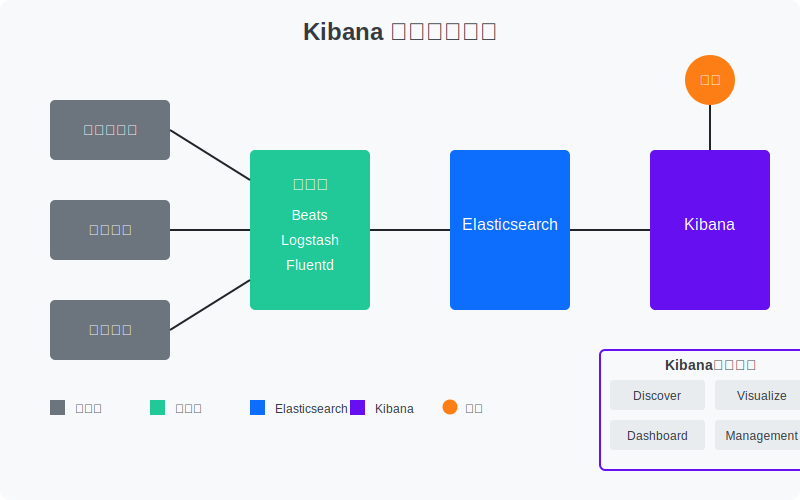

> 点击勘误[issues](https://github.com/webVueBlog/JavaPlusDoc/issues)，哪吒感谢大家的阅读


# Linux环境下Kibana安装与使用教程

## 1. Kibana简介

Kibana是Elastic Stack的一部分，是一个开源的分析和可视化平台，设计用于和Elasticsearch一起工作。Kibana可以搜索、查看和与存储在Elasticsearch索引中的数据进行交互，并且能够轻松地执行高级数据分析，以及在各种图表、表格和地图中可视化数据。



主要功能包括：

- **数据探索与可视化**：通过直观的界面查询和过滤数据
- **仪表板创建**：组合多个可视化组件创建综合仪表板
- **日志分析**：实时监控和分析日志数据
- **指标监控**：监控应用和基础设施的性能指标
- **安全分析**：检测和分析安全威胁

## 2. 环境准备

### 2.1 系统要求

- Linux操作系统（CentOS 7/8、Ubuntu 18.04/20.04等）
- 已安装并运行的Elasticsearch（建议版本与Kibana保持一致）
- 至少2GB RAM（生产环境建议4GB以上）
- 现代网络浏览器

### 2.2 安装方式选择

本教程将介绍三种安装方式：

1. 使用RPM/DEB包安装
2. 使用压缩包安装
3. 使用Docker安装

## 3. 使用RPM/DEB包安装

### 3.1 CentOS/RHEL系统（RPM包）

#### 导入Elastic公钥

```bash
rpm --import https://artifacts.elastic.co/GPG-KEY-elasticsearch
```

#### 创建仓库文件

```bash
cat > /etc/yum.repos.d/kibana.repo << EOF
[kibana]
name=Kibana repository
baseurl=https://artifacts.elastic.co/packages/7.x/yum
gpgcheck=1
gpgkey=https://artifacts.elastic.co/GPG-KEY-elasticsearch
enabled=1
autorefresh=1
type=rpm-md
EOF
```

#### 安装Kibana

```bash
yum install kibana -y
```

### 3.2 Ubuntu/Debian系统（DEB包）

#### 导入Elastic公钥

```bash
wget -qO - https://artifacts.elastic.co/GPG-KEY-elasticsearch | sudo apt-key add -
```

#### 安装apt-transport-https

```bash
apt-get install apt-transport-https -y
```

#### 添加仓库

```bash
echo "deb https://artifacts.elastic.co/packages/7.x/apt stable main" | sudo tee /etc/apt/sources.list.d/kibana.list
```

#### 更新仓库并安装Kibana

```bash
apt-get update && apt-get install kibana -y
```

## 4. 使用压缩包安装

### 4.1 下载Kibana

```bash
wget https://artifacts.elastic.co/downloads/kibana/kibana-7.17.0-linux-x86_64.tar.gz
```

### 4.2 解压文件

```bash
tar -xzf kibana-7.17.0-linux-x86_64.tar.gz
cd kibana-7.17.0-linux-x86_64/
```

## 5. 使用Docker安装

### 5.1 拉取Kibana镜像

```bash
docker pull docker.elastic.co/kibana/kibana:7.17.0
```

### 5.2 创建配置目录

```bash
mkdir -p /data/elk/kibana/config
```

### 5.3 创建docker-compose.yml文件

```bash
cat > docker-compose.yml << EOF
version: '3'
services:
  kibana:
    image: docker.elastic.co/kibana/kibana:7.17.0
    container_name: kibana
    volumes:
      - /etc/localtime:/etc/localtime
      - /data/elk/kibana/config:/usr/share/kibana/config:rw
    environment:
      ELASTICSEARCH_HOSTS: http://elasticsearch:9200
      I18N_LOCALE: zh-CN
    ports:
      - 5601:5601
    networks:
      - elastic

networks:
  elastic:
    external: true
EOF
```

### 5.4 启动Kibana容器

```bash
docker-compose up -d
```

## 6. Kibana配置

### 6.1 基本配置

编辑Kibana配置文件：

- RPM/DEB安装：`/etc/kibana/kibana.yml`
- 压缩包安装：`config/kibana.yml`
- Docker安装：`/data/elk/kibana/config/kibana.yml`

基本配置示例：

```yaml
# 服务器主机名，设置为0.0.0.0可以允许远程访问
server.host: "0.0.0.0"

# Kibana服务端口
server.port: 5601

# Kibana服务名称
server.name: "kibana"

# ElasticSearch连接设置
elasticsearch.hosts: ["http://localhost:9200"]

# 设置中文界面
i18n.locale: "zh-CN"
```

### 6.2 安全配置

如果Elasticsearch启用了安全功能，需要配置Kibana连接凭证：

```yaml
elasticsearch.username: "kibana_system"
elasticsearch.password: "your_password"
```

对于HTTPS连接：

```yaml
elasticsearch.ssl.verificationMode: certificate
elasticsearch.ssl.certificateAuthorities: ["/path/to/ca.crt"]
```

## 7. 启动Kibana服务

### 7.1 使用systemd启动（RPM/DEB安装）

```bash
systemctl daemon-reload
systemctl enable kibana
systemctl start kibana
```

### 7.2 使用二进制文件启动（压缩包安装）

```bash
./bin/kibana &
```

### 7.3 检查服务状态

```bash
# 对于systemd
systemctl status kibana

# 查看日志
journalctl -u kibana.service

# 对于Docker
docker logs kibana
```

## 8. 访问Kibana

在浏览器中访问：`http://your-server-ip:5601`

首次访问时，Kibana会要求创建索引模式。如果已经有数据在Elasticsearch中，可以按照界面提示创建索引模式。

## 9. Kibana基本使用

### 9.1 创建索引模式

1. 导航到 Management > Stack Management > Kibana > Index Patterns
2. 点击 "Create index pattern"
3. 输入索引模式，例如 "logstash-*"
4. 选择时间字段，通常是 "@timestamp"
5. 点击 "Create index pattern"

### 9.2 使用Discover探索数据

1. 点击左侧导航栏的 "Discover"
2. 选择刚才创建的索引模式
3. 使用搜索栏输入查询条件
4. 使用时间选择器选择时间范围
5. 查看和分析返回的文档

### 9.3 创建可视化

1. 点击左侧导航栏的 "Visualize"
2. 点击 "Create new visualization"
3. 选择可视化类型（饼图、柱状图、折线图等）
4. 选择数据源（索引模式）
5. 配置可视化设置（指标、分组等）
6. 保存可视化

### 9.4 创建仪表板

1. 点击左侧导航栏的 "Dashboard"
2. 点击 "Create new dashboard"
3. 点击 "Add" 添加已保存的可视化
4. 调整可视化大小和位置
5. 保存仪表板

## 10. 高级配置

### 10.1 配置空间（Spaces）

空间允许将Kibana对象（如仪表板、可视化等）分组到有意义的类别中：

1. 导航到 Management > Stack Management > Kibana > Spaces
2. 点击 "Create space"
3. 输入空间名称和描述
4. 选择功能权限
5. 点击 "Create space"

### 10.2 配置告警

1. 导航到 Management > Stack Management > Alerts and Insights > Rules
2. 点击 "Create rule"
3. 选择规则类型
4. 配置规则条件和操作
5. 保存规则

### 10.3 配置报表

1. 在仪表板或可视化页面
2. 点击 "Share" > "PDF Reports"
3. 配置报表选项
4. 点击 "Generate PDF"

## 11. 常见问题解决

### 11.1 Kibana无法连接到Elasticsearch

检查以下几点：

1. Elasticsearch是否正在运行：`curl http://localhost:9200`
2. Kibana配置中的Elasticsearch地址是否正确
3. 如果启用了安全功能，检查用户名和密码是否正确
4. 检查网络连接和防火墙设置

### 11.2 Kibana启动失败

检查日志文件：

- RPM/DEB安装：`/var/log/kibana/kibana.log`
- 压缩包安装：`logs/kibana.log`
- Docker安装：`docker logs kibana`

常见原因：

1. 配置文件语法错误
2. 端口冲突
3. 内存不足

### 11.3 Kibana加载缓慢

优化建议：

1. 增加Kibana服务器内存
2. 优化Elasticsearch查询
3. 减少仪表板中的可视化数量
4. 使用更精确的时间范围和查询

## 12. 总结

本教程详细介绍了在Linux环境下安装和使用Kibana的方法，包括三种不同的安装方式、基本配置、安全设置、基本使用方法以及常见问题解决方案。Kibana作为Elastic Stack的重要组成部分，为Elasticsearch中的数据提供了强大的可视化和分析能力，是日志分析、应用监控和数据可视化的理想工具。

在生产环境中，建议结合Elasticsearch、Logstash和Filebeat等组件一起使用，构建完整的日志收集、处理和分析系统。同时，根据实际需求调整配置参数，确保系统的性能和安全性。