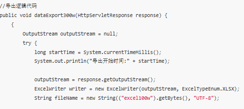
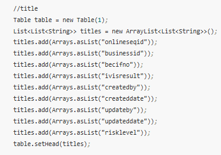
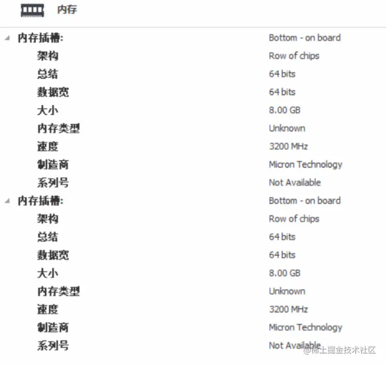

> 点击勘误[issues](https://github.com/webVueBlog/JavaPlusDoc/issues)，哪吒感谢大家的阅读

## 300万数据导入导出优化方案，从80s优化到8s

大数据（300 万数据）导入导出的优化方案。先对比了 POI 不同 Workbook 版本的优缺点，然后根据情况选择使用方式。重点介绍了 300 万数据的导入导出解决思路，导出时使用 EasyExcel 分批查询和写入，导入时使用 EasyExcel 分批读取结合 JDBC 分批插入和事务。还给出了代码示例、测试结果及总结，包括测试机状态、数据库版本等信息。

在项目开发中往往需要使用到数据的导入和导出，导入就是从Excel中导入到DB中,而导出就是从DB中查询数据然后使用POI写到Excel上。

写本文的背景是因为在工作中遇到了大数据的导入和导出，问题既然来了逃跑不如干掉它！！！

只要这一次解决了，后期遇到同样的问题就好解决了。

废话不多说，开始撸起来！！！

## 1.传统POI的的版本优缺点比较

其实想到数据的导入导出，理所当然的会想到apache的poi技术，以及Excel的版本问题。

既然要做导入导出，那么我们就先来大致看一下传统poi技术的版本以及优缺点对比吧！

首先我们知道POI中我们最熟悉的莫过于WorkBook这样一个接口，我们的POI版本也在更新的同时对这个几口的实现类做了更新：

### HSSFWorkbook :

这个实现类是我们早期使用最多的对象，它可以操作Excel2003以前（包含2003）的所有Excel版本。在2003以前Excel的版本后缀还是.xls

### XSSFWorkbook :

这个实现类现在在很多公司都可以发现还在使用，它是操作的Excel2003--Excel2007之间的版本，Excel的扩展名是.xlsx

### SXSSFWorkbook :

这个实现类是POI3.8之后的版本才有的,它可以操作Excel2007以后的所有版本Excel,扩展名是.xlsx

大致知道了我们在导入导出操作的时候会用到这样三个实现类以及他们可以操作的Excel版本和后缀之后,我们就要从优缺点分析他们了

### HSSFWorkbook

它是POI版本中最常用的方式，不过:

它的缺点是 最多只能导出 65535行，也就是导出的数据函数超过这个数据就会报错;

它的优点是 不会报内存溢出。（因为数据量还不到7w所以内存一般都够用，首先你得明确知道这种方式是将数据先读取到内存中，然后再操作）

### XSSFWorkbook

1. 优点：这种形式的出现是为了突破HSSFWorkbook的65535行局限，是为了针对Excel2007版本的1048576行，16384列，最多可以导出104w条数据；
2. 缺点：伴随的问题来了，虽然导出数据行数增加了好多倍，但是随之而来的内存溢出问题也成了噩梦。因为你所创建的book，Sheet，row，cell等在写入到Excel之前，都是存放在内存中的（这还没有算Excel的一些样式格式等等），可想而知，内存不溢出就有点不科学了！！！

### SXSSFWorkbook

从POI 3.8版本开始，提供了一种基于XSSF的低内存占用的SXSSF方式：

优点：

1. 这种方式不会一般不会出现内存溢出（它使用了硬盘来换取内存空间，
2. 也就是当内存中数据达到一定程度这些数据会被持久化到硬盘中存储起来，而内存中存的都是最新的数据），
3. 并且支持大型Excel文件的创建（存储百万条数据绰绰有余）。

缺点：

1. 既然一部分数据持久化到了硬盘中，且不能被查看和访问那么就会导致，
2. 在同一时间点我们只能访问一定数量的数据，也就是内存中存储的数据;
3. sheet.clone()方法将不再支持,还是因为持久化的原因;
4. 不再支持对公式的求值，还是因为持久化的原因，在硬盘中的数据没法读取到内存中进行计算；
5. 在使用模板方式下载数据的时候，不能改动表头，还是因为持久化的问题，写到了硬盘里就不能改变了；

2.使用方式哪种看情况

经过了解也知道了这三种Workbook的优点和缺点，那么具体使用哪种方式还是需要看情况的：

我一般会根据这样几种情况做分析选择：

* 1、当我们经常导入导出的数据不超过7w的情况下，可以使用 HSSFWorkbook 或者 XSSFWorkbook都行；
* 2、当数据量查过7w并且导出的Excel中不牵扯对Excel的样式，公式，格式等操作的情况下，推荐使用SXSSFWorkbook;
* 3、当数据量查过7w，并且我们需要操做Excel中的表头，样式，公式等，这时候我们可以使用 XSSFWorkbook 配合进行分批查询，分批写入Excel的方式来做；

想要解决问题我们首先要明白自己遇到的问题是什么？

* 1、 我遇到的数据量超级大，使用传统的POI方式来完成导入导出很明显会内存溢出，并且效率会非常低；
* 2、 数据量大直接使用select * from tableName肯定不行，一下子查出来300w条数据肯定会很慢；
* 3、 300w 数据导出到Excel时肯定不能都写在一个Sheet中，这样效率会非常低；估计打开都得几分钟；
* 4、 300w数据导出到Excel中肯定不能一行一行的导出到Excel中。频繁IO操作绝对不行；
* 5、 导入时300万数据存储到DB如果循环一条条插入也肯定不行；
* 6、导入时300w数据如果使用Mybatis的批量插入肯定不行，因为Mybatis的批量插入其实就是SQL的循环；一样很慢。

## 解决思路：

针对1 ：

其实问题所在就是内存溢出，我们只要使用对上面介绍的POI方式即可，主要问题就是原生的POI解决起来相当麻烦。
经过查阅资料翻看到阿里的一款POI封装工具EasyExcel，上面问题等到解决；

针对2：

不能一次性查询出全部数据，我们可以分批进行查询，只不过时多查询几次的问题，况且市面上分页插件很多。此问题好解决。

针对3：

可以将300w条数据写到不同的Sheet中，每一个Sheet写一百万即可。

针对4：

不能一行一行的写入到Excel上，我们可以将分批查询的数据分批写入到Excel中。

针对5：

导入到DB时我们可以将Excel中读取的数据存储到集合中，到了一定数量，直接批量插入到DB中。

针对6：

不能使用Mybatis的批量插入，我们可以使用JDBC的批量插入，配合事务来完成批量插入到DB。即 Excel读取分批+JDBC分批插入+事务。

## 300w数据导出

EasyExcel完成300w数据的导出。技术难点已经知道了，接下来就是针对这一难点提供自己的解决思路即可。
300w数据的导出解决思路：

1. 首先在查询数据库层面，需要分批进行查询（我使用的是每次查询20w）
2. 每查询一次结束，就使用EasyExcel工具将这些数据写入一次；
3. 当一个Sheet写满了100w条数据，开始将查询的数据写入到另一个Sheet中；
4. 如此循环直到数据全部导出到Excel完毕。

注意：

1、我们需要计算Sheet个数，以及循环写入次数。特别是最后一个Sheet的写入次数

> 因为你不知道最后一个Sheet选哟写入多少数据，可能是100w，也可能是25w因为我们这里的300w只是模拟数据，有可能导出的数据比300w多也可能少

2、我们需要计算写入次数，因为我们使用的分页查询，所以需要注意写入的次数。

> 其实查询数据库多少次就是写入多少次

