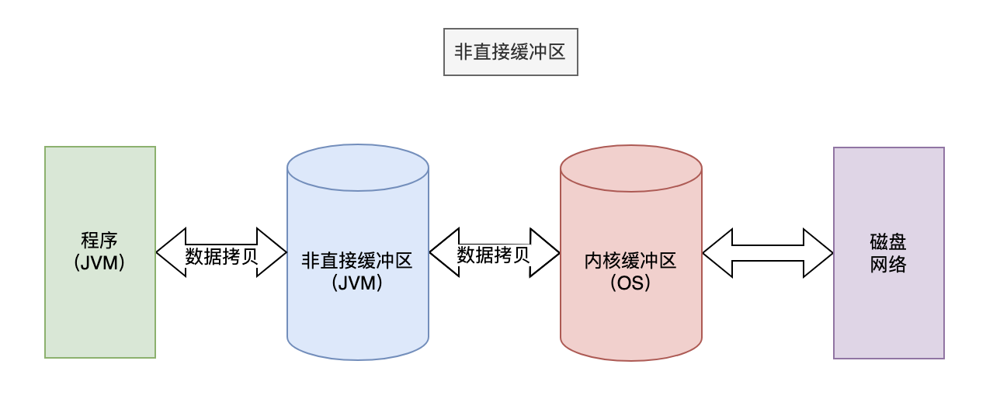

> 点击勘误[issues](https://github.com/webVueBlog/JavaPlusDoc/issues)，哪吒感谢大家的阅读

## IO模型

阻塞 I/O（Blocking I/O）：在这种模型中，I/O 操作是阻塞的，即执行 I/O 操作时，线程会被阻塞，直到操作完成。在阻塞 I/O 模型中，每个连接都需要一个线程来处理。因此，对于大量并发连接的场景，阻塞 I/O 模型的性能较差。

非阻塞 I/O（Non-blocking I/O）：在这种模型中，I/O 操作不会阻塞线程。当数据尚未准备好时，I/O 调用会立即返回。线程可以继续执行其他任务，然后在适当的时候再次尝试执行 I/O 操作。非阻塞 I/O 模型允许单个线程同时处理多个连接，但可能需要在应用程序级别进行复杂的调度和管理。

## 内核空间和用户空间

