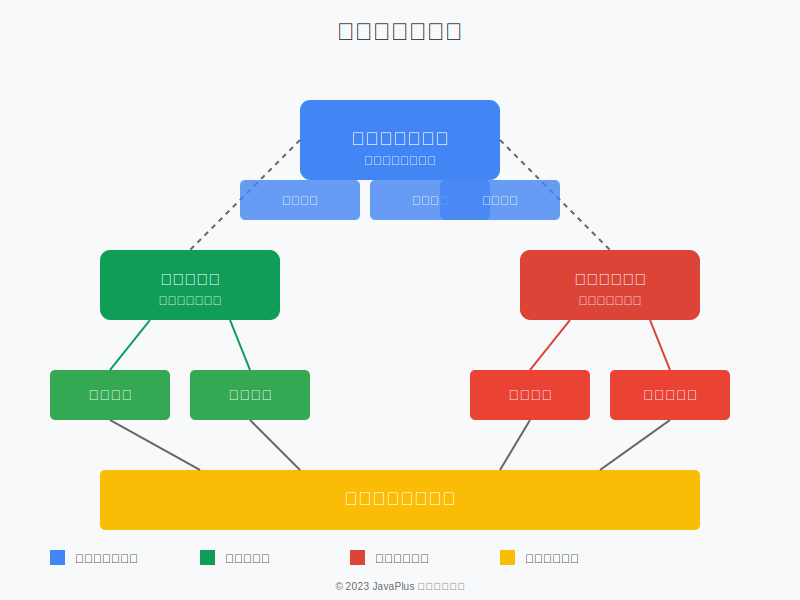

# 产品系列文档

## 概述

本节包含了我们的产品系列相关文档，提供了产品的详细介绍、技术规格、使用指南和最佳实践。这些文档旨在帮助用户全面了解产品功能，快速上手使用，并在实际应用中获得最佳体验。

## 产品架构

下图展示了我们产品系列的整体架构和关系：

## 文档结构

产品系列文档按照以下结构组织：

- **产品概述**：介绍产品的核心功能、适用场景和主要特点
- **技术规格**：详细的技术参数、系统要求和兼容性信息
- **快速入门**：帮助新用户快速上手的指南和教程
- **用户手册**：全面的功能使用说明和操作指南
- **API参考**：面向开发者的API文档和集成指南
- **最佳实践**：优化使用体验和解决常见问题的建议
- **常见问题**：用户常见问题的解答和故障排除指南

## 产品系列

我们的产品系列包括：

- [企业级应用平台](./enterprise-platform.md)：面向大型企业的综合业务应用平台
- [微服务框架](./microservice-framework.md)：轻量级、高性能的微服务开发框架
- [数据分析套件](./data-analytics-suite.md)：强大的数据处理和分析工具集

## 文档更新

产品文档将定期更新，以反映产品的最新功能和改进。请定期查看以获取最新信息。

我们的技术支持团队将竭诚为您提供帮助。
