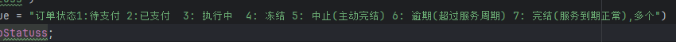

> 点击勘误[issues](https://github.com/webVueBlog/JavaPlusDoc/issues)，哪吒感谢大家的阅读


## 用户登录认证



```java
//loginT 登录类型：1： 微信 2：阿里（支付宝）
@ApiOperation(value = "快捷登录（目前支持支付宝、微信）")
public RestRetO quickLogin(@RequestBody LoginReq loginReq, HttpServletRequest request) {
    
}

@ApiOperation(value = "手机验证码登录", notes = "手机验证码登录")
public RestRetO verifyCodeLogin(@RequestBody LoginReq loginReq, HttpServletRequest request) {
    // 1. 校验手机号是否注册
}

@ApiOperation(value = "用户登出", notes = "用户登出")
@RequestMapping(value = "/logout", method = RequestMethod.POST)
public RestRetO logout(HttpServletRequest request) {
    
}

@ApiOperation(value = "获取手机号验证码", notes = "获取手机号验证码")
public RestRetO getVerifyCode(@RequestBody LoginReq loginReq, HttpServletRequest request) {
    //如果验证码发送成功，则将验证码存入 Redis 中，并设置其过期时间为5分钟
}
```


