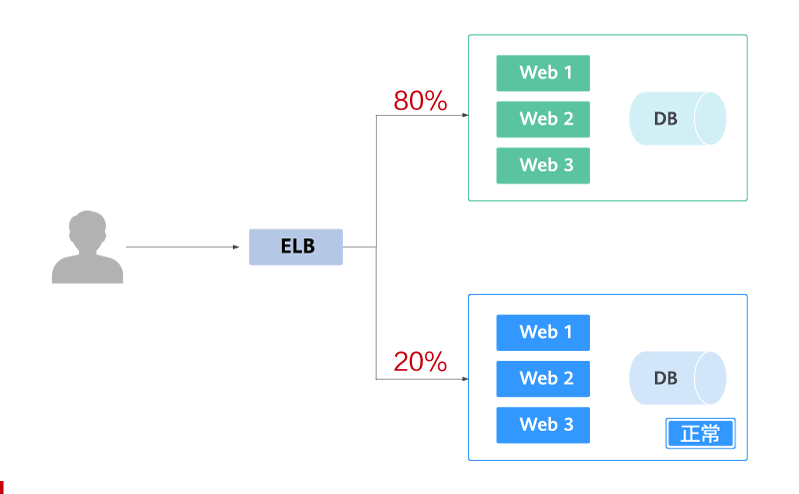
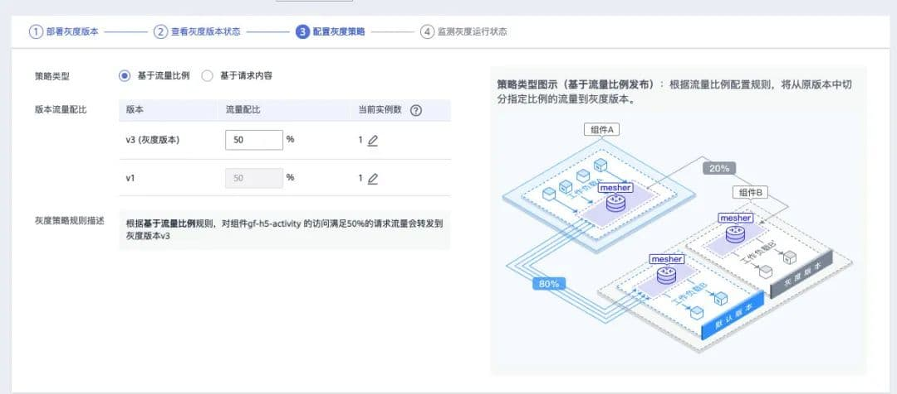

> 点击勘误[issues](https://github.com/webVueBlog/JavaPlusDoc/issues)，哪吒感谢大家的阅读

## 滚动部署

### 滚动部署

在滚动部署中，应用新版本逐步替换旧版。实际发布过程中会有新旧版本共存的情况，不影响功能和用户体验。

一下图片中 蓝色表示旧版本，绿色表示新版本

滚动部署有一个比较严重的问题，在滚动发布后，新版本就开始接收请求，这个时候服务不一定可用，我们需要做流量的控制

### 蓝绿部署

零宕机模式，不停老版本，确认OK将流量更新到新版本，生产环境会一直有两个版本存在，随时可以切换版本

这种方式需要2倍的资源，比如正常提供服务的是10台服务，需要20服务器

### 蓝绿部署的优点

1. 当发现问题可以快速切换回原来的版本
2. 所有节点全部发布才切流量过来，新集群规模与原先规模一致，能扛大流量
3. 不存在中间状态时接收请求，减少了很多不确定性

### 金丝雀发布

为什么叫金丝雀发布？ 金丝雀对毒气比较敏感，在矿上开工之前，一般工人会用金丝雀对矿井测试是否有毒气存在，这便是金丝雀部署的由来。

金丝雀发布的特点 : 在线上运行的服务中，加入少量的新版本服务快速获取反馈，根据反绝对最后的交付形态

华为云的发布界面

### 金丝雀的步骤

1. 摘除流量，将节点更新为新版本代码，该节点成为金丝雀节点
2. 选择不同的策略，将流量引入金丝雀节点
3. 验证通过后，重发 步骤1，步骤2 ，直到所有节点为金丝雀节点。 金丝雀部署与蓝绿部署方式类似，但是更能规避风险，不用一次性更新所以节点。

### 灰度发布

### AB TEST

A/B测试时效果测试，同一时间有多个版本对外提供服务 根据用户对多个版本的反馈给产品运营提供决策方案，选择用户反馈最好的方案。

