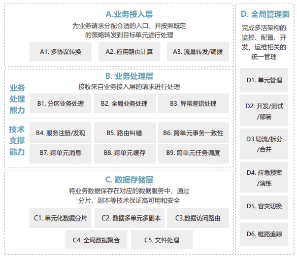
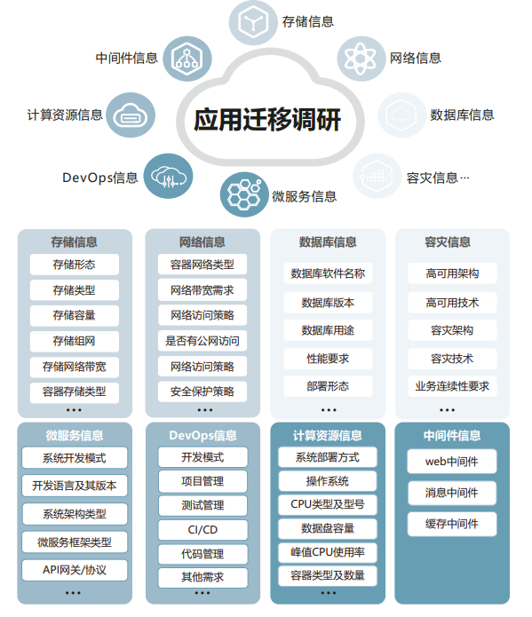
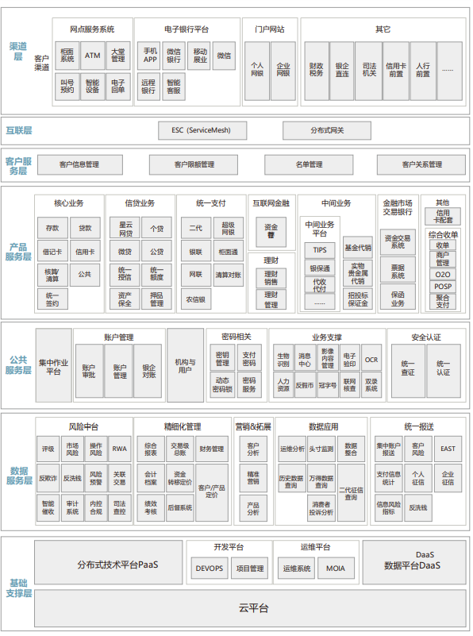
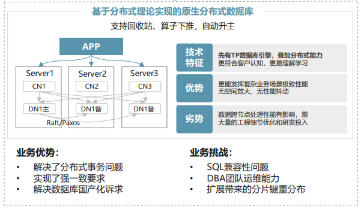
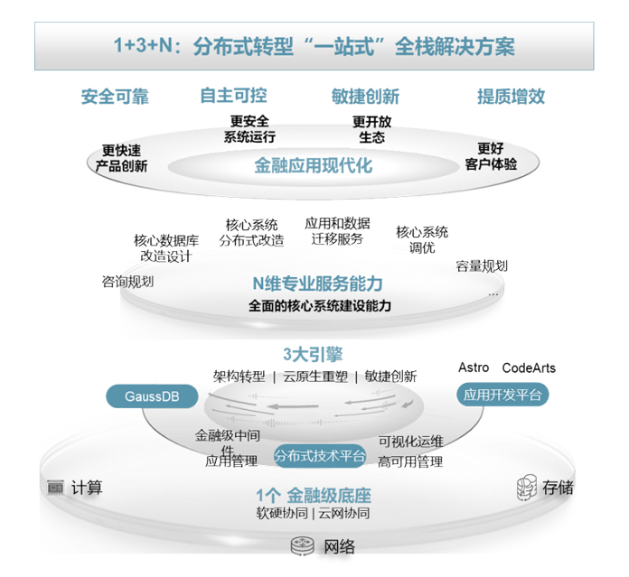
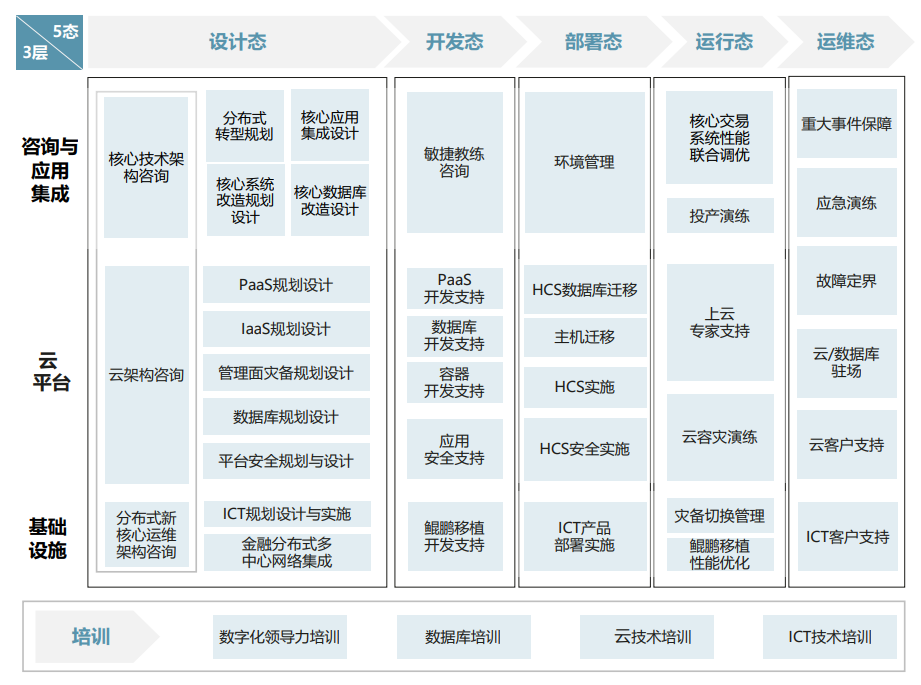
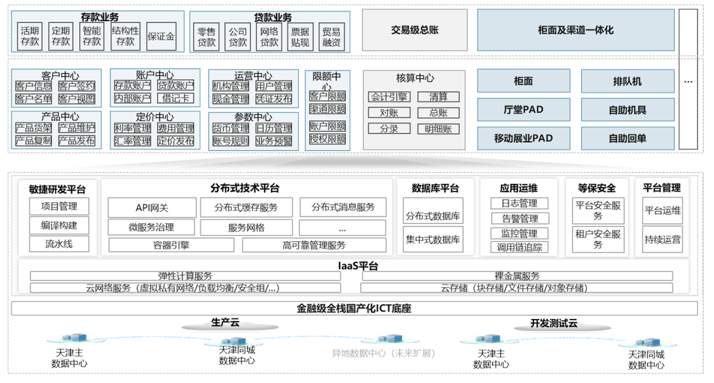

> 点击勘误[issues](https://github.com/webVueBlog/JavaPlusDoc/issues)，哪吒感谢大家的阅读

## 现代化金融核心系统白皮书

### 1.1 深化数字化转型，核心面临新挑战

1、架构侧：无法敏捷协同数字金融经营模式转型。

2、需求侧：业务需求传导低效始终困扰金融机构。

3、开发侧：创新产品上市速度低于期望。

4、运维侧：传统面向资源型监控体系难以支撑现代化核心。

5、监管侧：对业务连续性导向趋严趋细。

6、成本侧：单客核心的运营成本逐渐走高。

### 1.2 重塑现代化核心，科技引领新趋势

1、新理念：重构行业差异化竞争力的服务体系。

2、新架构：构建面向开放型金融的现代化泛核心。

3、新科技：加强多维数据服务与核心交易融合创新。

4、新运维：推动业务链路一体化运维体系建设。

5、新韧性：探索多地多活的业务连续性保障。

随着系统可用性、故障影响半径
等业务连续性水平要求不断提升，核心
系统从经典的“两地三中心、一主多
备”向“多地多中心、多活多副本”架
构演进，但跨中心事务、数据一致性管
理，全局交易查询，批量拆分聚合等问
题依然是技术难点，需要持续探索解决
方案并充分验证，真正实现“令行即切、
切即可用、用可持久”的保障目标。

6、新工艺：选择企业架构建模最优之路。

### 2.1 现代化金融核心建设目标

> 现代化金融核心系统的目标架构是一个集基础设施现代化、技术架构现代化、数
据架构与应用架构现代化、安全与合规性以及创新与灵活性于一体的综合体系。这一
体系旨在帮助金融机构实现业务的韧性智能、极致体验、敏捷创新、降本增效、业务
连续性、安全合规等需求，提升金融机构的竞争力和整体能力，为客户提供更加安全、
高效、便捷的金融服务。

2.1.1 业务架构

金融机构业务架构主要包括：

1、业务目标：明确业务的核心目标、
愿景和战略方向。

2、业务流程：详细分析业务流程，
包括关键活动、输入输出、参与者等。

3、业务规则：识别并理解业务运作
中必须遵守的规则和约束。

4、组织结构：了解企业的组织结构，
包括部门、角色和职责分配。

5、客户与利益相关者：识别并分析
客户需求、期望以及利益相关者的关注点。

> 现代化核心系统作为金融机构各类业
务账务系统，需要满足数字渠道生态层、
数字产品/服务层、业务中台层、数据中
台层、科技支撑层等各层需求，实现以
下能力：

1、产品管理：建设参数管理平台，
通过参数模板、流程引擎、向导式跨业
务部门流转处理能够扩展为全行级参数
管理平台。

2、产品创新： 统一产品工厂行业最
领先并落地实施，跨产品进行产品部件
复用，通过产品工厂引擎快速组装产品。
3、差异化定价：通过规则引擎实现
利率、费率、汇率、税率的差异化设置，
能够通过新增浮动因子设置快速扩展影
响定价的浮动维度。

4、清算模式：零级清算、多级清算
等。

5、账户管理：灵活的账户结构，满
足银行线上线下母虚子实、母实子虚、
母实子实的多层账户管理要求。

6、核算分离：实现交易与核算完全
分离，建设全行会计核算引擎，多账套
支持，实现全行账务一致性保障。

7、敏捷能力：业务建模、AI辅助开
发、高低代码开发。

8、韧性可靠：高安全、高性能、高
扩展、高可用/容灾、易运维、平台化、
服务化等能力。

2.1.2 技术架构

在数字化转型下，金融机构目标业务
架构主要包括数字渠道生态层、数字产
品/服务层、业务中台层、数据中台层、
科技支撑层共五层。其中，数字产品/服
务层包括创新业务域、产业金融域、金
融市场域、中间业务域、基础业务域等。
业务中台域包括数字用户域、数字产品
域、数字运营域、数字风控域、数字员
工域、数字治理域等。数据中台层包括
数字服务域。科技支撑层包括数据中心、
云平台、开发平台、测试平台、智能运
维等科技支撑与IT治理。

> 理解业务架构，技术架构应满足业务
系统运行的功能需求、非功能需求、数
据需求以及AI需求，技术架构总体目标
是韧性、可信、敏捷、智能，以平台化、
服务化、组件化等原则设计目标技术架
构，共性能力沉淀到技术平台，实现技
术架构高安全、高性能、高扩展、高可
用/容灾、易运维等要求。随着技术的进
步，云计算、分布式、云原生、大数据、
AI等新技术已经在技术架构中普遍采用。

1、系统分层：将系统划分为不同的
逻辑层次，如业务应用层、技术平台层、
数据访问层等。

2、组件划分：根据功能需求，将系
统进一步细分为可独立开发、测试和维
护的组件。

3、技术选型：根据业务需求和非功
能需求，选择微服务框架、数据库、中
间件、开发测试平台等技术栈。

4、应用集成：定义组件之间、系
统之间以及系统与外部系统之间的访问
模式。

5、数据架构：设计数据模型、数据
流向、数据应用和存储策略。

6、安全架构：考虑系统的安全需求，
设计相应的安全机制等。

7、性能与可扩展性：设计系统以
支持高并发、低延迟、高可用性和可扩
展性。

8、数据中心容灾：同城双活、两地
三中心、多地多活等。

### 2.2 现代化核心深化转型十大挑战

近年来，国内金融机构对于核心系统从集中式架构向分布式架构转型已形成行业
共识。基于开放硬件、云计算平台、分布式数据库和分布式技术中台等产品构建分布
式核心的技术架构逐渐成为主流选择。

挑战一：分布式架构下如何开展核心
架构规划

由于核心项目规模大、周期长、涉及
业务面广，金融机构在启动新核心建设
前通常会选择开展核心架构咨询项目，
以梳理和明确新核心建设所需要的方方
面面。相比上一代集中式核心，分布式
核心的架构规划范围已明显扩大，从业
务架构、应用架构、数据架构、技术架
构和项目实施方案扩展到分布式技术中
台架构、基础设施架构和多活高可用架
构。这些新增范围通常不是传统咨询关
注的重点，如何完成这些新内容的规划
设计以及由谁来做，是摆在新核心建设
面前的第一个挑战。

挑战二：如何解答业务建模难题

是否开展业务建模是金融机构在开展
新核心建设之前常常会探讨的问题。业
务建模具有成本高和周期长的特点，表
面上看仅大型金融机构能够承担这样的
投入。但业务建模是新核心进行领域化
微服务拆分的源头，同时业务建模所包
含的流程建模本身也是对业务流程的梳
理和优化，即使是对于采购核心厂商产
品的金融机构，业务建模也能够提供较
大的价值。因此如何能够既享受到业务
建模的好处，又合理的控制周期成本成
为金融机构仍有待解答的难题。

挑战三：如何解决核心厂商和云厂商
的技术集成难题

分布式核心有别于过往集中式核心的
瀑布开发流程，各家核心供应商也在同
步构建自己的应用开发平台，各自划定
了不同的范围边界，比如Z核心供应商的
应用开发平台除了应用开发功能之外还
包含了中间件，甚至容器平台，这就和
云厂商提供的PaaS平台形成了重叠。
虽然看似提供了更多的选择，但实则
对于开展核心建设的金融机构来说反倒
造成了很多困扰：如何合理划分核心供
应商应用开发平台和云厂商PaaS平台的
边界；如何在充分利用各自优势的基础
上减少技术集成成本等。同时从行业上
来看，能否形成有一条行业共识的边界
线，减少无谓的消耗势在必行。

挑战四：如何构建核心领域的分布式
技术规范和最佳实践

从传统集中式核心转型到分布式核心，
中间件也从功能相对集中的CICS、
TUXEDO、MQ改变为功能更为专一的
分布式中间件，比如注册中心、RPC框
架、分布式事务、分布式数据访问等。
金融机构建设新核心要根据自身情况，
确定分布式环境下中间件在不同核心业
务场景下如何应用和组合，比如服务注
册采用一层注册还是两层注册、分布式
事务在什么场景使用SAGA模式或者
TCC模式等。因此，分布式核心建设需
要构建基于分布式技术的工程工艺，才
能高质量完成核心项目交付。

挑战五：如何选择最适合的高可用
架构

是否采用单元化架构是金融机构在新
建分布式核心系统时普遍面临的问题。
从国内金融机构实践来看，国有银行和
股份制银行基本都选择单元化架构作为
支撑高可用的基础架构，并且在进一步
探索异地多活单元化架构的落地方案。
单元化架构会增加资源投入成本和应用
改造成本，而同城双活架构具有成本较
低、运维成熟度较高等优势。对于地理
分布较广、资产规模差异较大的区域性
金融机构，高可用架构的选择需要进行
系统性的分析和设计，开展包括但不限
于高可用架构优劣对比、基础设施环境
评估、高可用架构选择和适配等方案设
计。

挑战六：如何构建从应用到基础设
施的端到端运维

相对于集中式核心系统，分布式微服
务架构会导致部署节点成量级增加、版
本更新频率速度显著加快、网状调用链
路提升问题定位复杂度等难题，亟需升
级其对应的运维体系，以保障分布式核
心系统的稳定运行。面向应用、多场景、
支持应用到基础软硬设施逐层下钻的一
体化运维体系是当前国内金融机构针对
分布式核心系统运维的重点建设方向。
同时，金融机构应充分认识到分布式架
构下一体化运维的复杂性，尤其是第一
次使用云平台、分布式数据库、容器等
分布式技术，所以需要制定一体化运维
体系分阶段建设的方案，比如首先构建
并打通云、数据库、容器、PaaS等平台
的自身运维能力，然后优先从可观测性
开始逐步建设核心应用的不同场景的运
维能力。

挑战七：如何应对微服务拆分后的
性能优化难题

核心系统基于分布式技术栈构建，在
任何一层的性能问题都会导致应用全局
性能受到影响。同时由于微服务拆分导
致交易调用链路延长，链路上微小的网
络时延增加也会导致最终交易时延翻倍
的增长。因此分布式核心系统的性能调
优需要覆盖从应用、中间件、数据库、
云虚机、物理服务器、存储以及网络的
全部技术栈，整体调优难度较高，单一
厂商难以完成全部工作。如何组织协调
多家厂商开展性能调优，采用哪些性能
调优方法，是金融机构需要解答的难题。

挑战八：如何选择最优的数据库部
署架构

核心系统落地分布式架构，数据库毫
无疑问是最关键的基础软件之一。随着
25GE网络、RDMA、无损网络、无阻
塞转发网络大量被应用，以及高性能计
算、存储能力的不断发展，分布式数据
库的计算存储架构再次从存算一体走向
存算分离的架构，这也给数据的高可用
能力带来更多的选择。金融机构选择何
种数据库部署架构，需要结合自身的高
可用目标、投入成本预算以及数据库供
应商的产品能力进行综合评估后，制定
相应的方案。

挑战九：容器/虚拟化/裸金属多种
部署模式如何选择

金融机构对于核心系统是否使用容器
存在疑虑，主要原因是核心应用供应商
的容器化实施案例不够，以及自身对容
器的掌握能力不够。随着行业案例逐渐
增多，核心系统使用容器已基本成为行
业共识，但由于容器本身具备分层解耦
能力，容器下的部署选择有多个分支选
项，包括容器+物理机、容器+虚拟化服
务器、容器+云上虚机以及容器+云上裸
金属。选择哪种容器部署架构，需要综
合考虑系统性能目标、高可用目标、容

### 2.3 构筑现代化核心六大新质体系

国内核心系统集中式架构的时代虽然
逐渐落幕，但集中式架构在过去近30年
中积累了大量的产品能力、技术规范和
解决方案，仍需要在分布式架构领域持
续进行改造和补充，仅仅靠数个分布式
平台产品的堆叠难以建成高质量的现代
化核心系统。

> 在历经多个不同类型金融机构的分布
式核心建设之后，我们得以完整视角审
视核心系统建设的全生命周期，在实践
中构筑出支撑现代化核心高质量建设的
六大新质体系，分别是：韧性架构体系、
全栈可信体系、开放集成体系、工程工
艺体系、平滑迁移体系和敏捷智能体系。

六大新质体系全面覆盖了分布式核心
在架构设计、开发测试、迁移切换、运
营运维等阶段的主要解决方案，同时也
为分布式核心建设的10大挑战提供解决
思路参考：

1、核心架构规划挑战

升级分布式核心规划设计，扩充基础
设施规划和高可用架构规划，补完架构
规划缺失的环节。

2、业务建模挑战

探索基于大模型技术的敏捷智能建模
方案，降低人力成本，缩减时间周期，
实现提质提效。

3、技术集成挑战

建立生态集成方案和生态集成实验室，
提前完成应用厂商和云厂商的技术集成，
使技术分层解耦和集成达到最佳平衡点。

4、分布式技术规范挑战

在项目实践中不断积累补充高质量的
工程工艺方案，落地核心领域的分布式
技术规范和最佳实践。

5、高可用架构选择挑战

开发从两地三中心到多地多中心的多
种高可用方案，为不同类型金融机构提
供最合适的高可用架构选择。

6、核心应用运维挑战

构建面向应用的一体化运维方案，实
现从应用到基础设施的端到端运维。

7、核心性能优化挑战

以软硬协同的7层性能优化方法和服
务，实现厂商间联合完成核心性能调优。

8、数据库部署架构选择挑战

提供数据库存算分离+分布式的多种
组合方案，应对不同金融机构的数据部
署架构要求。

9、部署架构迁移挑战

分别定制存量核心的应用服务器迁移、
数据库迁移、容器化迁移的方案，满足
金融机构不同类型迁移需求。

10、安全合规挑战

通过一体化的等保、密评方案和服务
体系，帮助金融机构满足安全合规要求。

2.3.1 韧性架构体系

> 韧性架构体系是指在分布式核心建设
中横跨多个技术栈层次，需要通盘进行
方案的韧性架构能力设计，包括：单元
化高可用架构、软硬协同性能优化和一
体化应用运维。

2.3.1.1 单元化高可用架构

提升高可用容灾能力，构建高度韧性
的核心系统是大多数金融机构分布式核
心的建设目标之一。

由于不同类型、不 同体量金融机构的高可用容灾目标存在
差异，所以需选择符合自身的高可用容
灾架构，比如同城双活架构或单元化多
活架构等。总体来说，无论选择哪种高
可用架构都需要充分考量自身容灾的关
键目标并制定对应解决方案。

金融机构在构建高可用架构时，目前
主要的关注点在选择何种架构以及选择
原因评估，却容易忽视更为基础的东西，
即高可用能力框架的梳理。高可用能力
框架是针对容灾、演练、调拨以及伸缩
等能力的体系化框架，该框架并不绑定
某一特定的容灾架构，有助于防漏补缺，
提升核心整体的高可用能力。

金融机构在构建高可用架构时，除了
关注选择何种架构以及优劣评估，还需
梳理高可用能力框架。

总结出高可用
能力3+1框架如下：

2.3.1.2 软硬协同性能优化

核心系统软硬协同性能优化是指针对
整个技术栈（从应用程序到基础设施）
进行全面的性能优化，以提高系统的响
应速度、吞吐量和资源利用率。全栈性
能调优需要综合考虑多个层面的因素，
包括但不限于网络、服务器、数据库、
中间件和应用程序等。基于核心关键接
口业务流程，分解关键子系统，识别关
键瓶颈点，从应用层精简优化、平台层
提速增效两个方面对7层技术栈进行专项
调优，达成性能目标。

2.3.2 全栈可信体系

2.3.3 开放集成体系

> 分布式技术栈还存在IaaS
（基础设施即服务）、CaaS（容器平台
即服务）、iPaaS（集成平台即服务）、
aPaaS（应用平台即服务）以及分布式
数据库的纵向分层集成，由于每层技术
产品的供应商众多且相互存在重叠，如
何开展分层技术栈的解耦和整合是开展
分布式新核心建设需要解答的难题之一。

异构服务集成

与核心系统有服务调用关系的外围系
统数量众多，细化到具体接口更是数以
千计，核心系统同外围系统的集成也是
核心系统建设中的难点。新核心基于分
布式和微服务技术重构，过往基于ESB
的SOA服务集成架构已经不再适用。但
大量外围系统不会短时间进行替换，因
此，金融机构的IT环境会存在两种不同
的服务集成区域，既传统SOA集成区和
微服务集成区，同时两个区域间存在大
量的服务集成。由于金融机构将微服务
化的分布式核心部署在云平台，两个区
域的服务集成也被称为云上云下服务
集成。

目前业界对云上云下服务集成主要有
两种集成模式：API网关集成模式和服务
图：一站式合规可信方案 网格集成模式

2.3.4 工程工艺体系

2.3.5 平滑迁移体系

国内金融机构由于地域分布广泛、IT
建设能力差别大，核心系统作为金融领域
最复杂的IT系统，呈现出多样化的演进方
式。除了采用重构方式建设分布式核心，
在满足技术可控能力的要求下，如何低成
本稳步开展存量核心的技术平台迁移也是
重要的核心演进路径。目前，金融机构存
量核心系统的技术平台构成主要包括服务
器平台和数据库平台，所以其平滑迁移主
要针对应用和数据库。

2.3.5.1 基础设施迁移

目前核心系统的服务器迁移主要是从
物理机或虚拟化平台迁移到云上的虚拟
化服务器，由于国内核心系统除了主流
的JAVA语言开发外，还存在少量C语言
和COBOL语言开发的核心系统，对于
核心系统的上云迁移，需要从多个方面
进行资源和应用的全面调研评估和规划。
结合多个平台迁移项目的经验，总结了
核心系统迁移在资源调研规划的5图两表
和在应用调研规划的7图4表，全面覆盖
核心平台的迁移。

2.3.6 敏捷智能体系

2.3.5.2 应用迁移

在核心系统的应用迁移需要需要定制
化的对核心系统进行调研分析，开展全
面信息收集，包括部署架构信息、计算
资源信息、网络资源信息、存储资源信
息、数据库信息、中间件信息、容器资
源信息、微服务信息、容灾信息、
DevOps信息等，并在此基础上，规划
各项资源的迁移方案。

此外因为核心系统涉及到和外围系统
的大量交易调用，还需要全面的分析核
心业务覆盖的各种交易链路情况。同时
为实现迁移后对外围系统无影响，需制
定对应的网络访问、存储访问和服务集
成方案。

数据库迁移

数据库迁移主要是从集中式商用数据
库到分布式数据库的迁移，并实现迁移
过程自动化、可校验化、可并行化，同
时保持迁移前后数据库表结构不变以及
应用无感的数据库分片处理。完整的数
据库迁移应包括语法迁移、数据迁移、
数据校验、流量回放等过程，并支持持
续采集SQL，实施同步数据对比等能力。

规划设计升级

核心系统的架构规划设计普遍受到金
融机构重视，核心分布式架构转型需要
扩充两方面的架构规划设计。一是对基
础架构的规划设计，传统集中式架构在
基础软件和硬件设备的架构相对固定且
解耦性较高，而对基础架构的关注较少。
采用分布式架构后，分布式和微服务带
来更多的应用部署、更多样的分布式形
式和更高的容灾能力，核心系统对基础
架构的适配要求越来越高，因此基础架
构的规划设计越来越重要。二是对多活
高可用的规划设计，传统技术栈各层负
责自身的容灾高可用，而单元化新容灾
架构横跨了多层技术栈，并需要每层针
对性的开展适配，建议提前开展多活高
可用架构的规划，避免容灾方式后面决
定而导致返工。

### 3.1 规划设计，清晰整体目标，承接战略蓝图

3.1.1 业务规划

业务规划主要包括市场定位与差异化
战略、业务拓展与产品创新、风险管理
与合规经营、数字化转型与科技创新、
服务实体经济与助力地方发展等内容。
其中，数字化转型与科技创新是提升金
融机构创新能力、产品能力、服务能力、
风控能力、管理能力以及提升客户满意
度和自身竞争力的必然驱动力。数字化
转型与科技创新通常包括五个方面：

一是结合自身特点和市场环境制定差
异化的数字化战略，明确数字化转型的
目标、路径和优先级，确保转型工作的
有序开展。

二是加强基础设施建设，完善云计算、
大数据等基础设施平台，提升数据处理与
分析能力，为数字化转型提供有力支撑。

三是推动业务创新，利用数字技术推
动金融产品和服务的创新，满足客户的
多元化需求，探索开放银行模式，与第
三方平台合作拓展服务渠道。

四是优化组织架构和流程，建立适应
数字化转型的组织模式和决策机制，优
化业务流程，实现业务流程的标准化、
智能化。

五是加强人才队伍建设，引进和培养
数字化人才，建立健全激励机制，提升
员工的数字化素养和技能水平，激发员
工的创新活力和工作积极性。

3.1.2 科技规划

科技赋能主要包括渠道一体化、企业
级业务中台、企业级数据中台、敏捷的
全生命周期管理的产品体系、数据治理、
数字化服务体系、场景化数据应用、数
据驱动的客户经营模式、智能化的业务
支撑能力、数字化智能化风险控制体系、
业财一体的经营决策、机控代替人控的
流程优化能力等。

技术体系建设主要内容包括两地三中
心、基础设施与云平台、技术平台（微
服务框架、中间件、分布式数据库、数
据湖仓、AI平台、开发平台、研发效能
平台）的收敛与统一、以及安全架构、
自动化测试体系、智能化运维体系等。

科技规划的实施需要明确每个阶段的
具体目标和计划，并配套高效的组织架
构、资源投入、业务驱动创新、科技治
理等综合保障。

3.1.3 技术验证

> 现代化金融核心系统往往应用多项新
技术，需要对虚拟化、云计算、分布式、
中间件、数据库、数据湖仓、模型推理
与训练等关键技术进行验证，具体包括
资源、高性能、可拓展、高可用、容灾、
一致性、安全性、难易度、可维护性等
多个方面。金融机构应选择适合自身的
关键技术，特别要考虑从原应用系统到
新技术的迁移路径是否可行，并通过同
业实施案例评估和自行搭建环境进行验
证。

3.1.4 架构规划

3.1.5 实施方案

### 3.2 平台搭建，构筑韧性平台，沉淀共性能力

平台搭建包含多活基础设施、技术平
台、业务中台、数据中台、分布式数据
库等建设项目，是实现业务服务化、组
件化、快速敏捷，以及系统高可靠、高
性能、高可用、高安全、高可维等目标
的基础。平台化有利于架构管控，实现
应用系统共享平台的能力，并实现最终
的架构管控目标。平台化还有利于开发
人员仅需关注业务逻辑的实现，降低开
发人员工作量。

3.2.1 多活基础设施

多活的关键点就是指不同地理位置上
的系统都能够提供业务服务，“活”是
指实时提供服务的意思。与“活”对应
的是“备”，备是备份，正常情况下对
外不提供服务，如果需要备系统提供服
务，需要大量的人工干预和操作，花费
大量时间才能让“备”变成“活“。随
着业务规模和容灾级别的提升，多活方
案会给业务系统设计带来更大复杂度，
也会增加耗时和成本。但对于重要的业
务系统有必要做双活或多活。

3.2.2 数字化底座（IaaS）

3.2.3 技术平台（PaaS）

PaaS平台通过将应用系统共性的能
力抽象下沉，提供具备完全自主创新的
微服务平台（包括微服务框架、注册中
心、配置中心、服务治理中心等）、API
网关组件、容器平台、服务网格、分布
式缓存组件（如Redis）、RocketMQ
消息队列组件、Kafka消息队列组件、分
布式事务组件、分布式调度组件、
DevOps软件研发工具链、日志平台、
应用运维与全链路可观测平台等能力。

技术平台应提供应用多地多活高可靠管
理方案，提供从流量、应用层、平台层
到数据层的端到端方案，支持自定义跨
中心流量调拨、流量路由，提供完整的
故障注入及容灾演练能力。

微服务框架支撑金融机构应用架构微
服务化改造升级，通过灵活的应用架构
来适配业务的敏捷，支持业务快速增长。

通过建设统一服务注册发现、配置中心、
网关、服务治理平台等微服务组件，并
进行统一运维，实现系统的高可用管理。

从微服务的可观测、可追踪和可运维三
个维度入手，构建微服务治理体系，并
且通过分布式部署保证系统高性能、高
可靠、高拓展能力，实现系统安全稳定
运行。

技术平台建设伴随核心应用全生命周
期，其规范化和标准化也是核心应用现
代化实现过程。构筑应用全生命周期管
理能力，对应用开发、运行和发布进行
抽象建模以满足跨环境可扩展的应用管
理需要。

云厂商从应用的开发态、运行
态、运维态都提供了丰富的云组件实现，
确保应用现代化建设落地。在开发态上，
提供自主创新、研发工具链，支撑应用
研发流程敏捷升级，全方位提升研发效
能；在运行态上，以云服务形式提供容
器管理、微服务管理、中间件管理等关
键技术组件，保证云上应用稳定可靠运
行；在运维态上，统一日志归集分析、
全链路监测、性能指标实时采集等在线
化运维能力，支撑应用本地高可用、同
城双活的高可用与容灾管理能力。

3.2.4 分布式数据库

从数据库发展来看，云原生应用推动
金融机构引入云数据库，选择企业级云
数据库将成为核心系统等关键应用数据
持久化的最优选择。

分布式数据库灵活
的架构适合提高核心系统构建高并发、
高性能、高可靠、高可用、易扩展的能
力，且应用无需关注数据的分片以及数
据一致性，适合中小金融机构核心系统
从小型机集中架构向分布式架构迁移。

分布式数据库的数据分片是将全局数
据按照一定的规则划分成多个片段，并
将片段分布到不同的节点（服务器）上
进行存储和处理的过程。

以下是分布式
数据库数据分片的详细步骤和常见方法。

1、数据分片步骤

1）确定分片策略：根据业务需求、
数据访问模式、系统架构等因素，选择
合适的分片策略，包括Hash分片、范围
分片（Range分片）、列表分片（List
分片）等。

2）选择分片键：确定用于分片的字
段（即分片键），分片键的选择对数据
分布和查询性能有重要影响，通常选择
数据分布均匀、查询频繁的字段作为分
片键。

3）划分数据片段：根据选定的分片
策略和分片键，将全局数据划分成多个
片段，每个片段包含全局数据的一部分，
并且每个片段的数据在逻辑上是独立的。

4）分配数据片段：将划分好的数据
片段分配到不同的节点上进行存储，分
配时需要考虑负载均衡、数据冗余等因
素，以确保系统的可用性和可靠性。

5）管理元数据：维护分片数据的元
数据，包括分片键、分片规则、节点映
射等信息，元数据的管理对于数据查询、
数据迁移等操作至关重要。

2、分片原则

在设计分布式数据库时，分片应遵循
以下原则：

1）完备性：所有全局数据都要映射
到某个片段上；

2）可重构性：所有片段必须可以重
新构成全局数据；

3）不相交性：划分的各个片段所包
含的数据无交集；

4）负载均衡：尽量使各个节点的数
据量和查询负载保持均衡；

5）可扩展性：系统应能够方便地增
加或减少节点以适应数据量的变化。

分布式数据库一般支持Hash、
Range、List等多种分片方式，用户可
以根据实际需求选择合适的分片策略。
同时，分布式数据还提供了丰富的数据
分区功能，如时间分区等，以进一步满
足复杂业务需求。

### 3.3 应用上云，规范上云流程，敏捷业务创新

3.3.1 应用上云评估

3.3.2 应用上云架构和规范

3.3.3 应用上云整体规划

3.3.4 应用集成与服务治理

3.3.5 敏捷业务创新

3.3.6 数据迁移实施

### 3.4 运行维护，建设运维体系，保障业务连续

### 4.1 分布式新核心解决方案

### 4.2 全周期的咨询与应用集成卓悦服务助力核心转型

### 现代化金融核心实践案例

