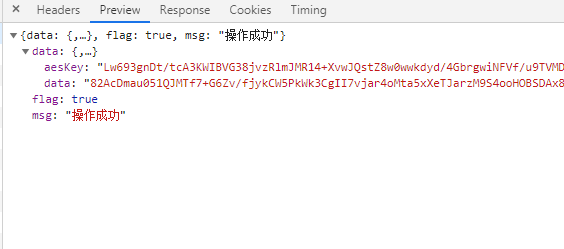

> 点击勘误[issues](https://github.com/webVueBlog/JavaPlusDoc/issues)，哪吒感谢大家的阅读


## 前后端API交互数据加密AES与RSA混合加密

利用RSA来加密传输AES的秘钥


后端加、解密
　　
从网上查找工具类，再进行改造

先引入Base64工具类

```
        <!-- Base64编码需要  -->
        <dependency>
            <groupId>org.apache.directory.studio</groupId>
            <artifactId>org.apache.commons.codec</artifactId>
            <version>1.8</version>
        </dependency>
```

aes

```
package cn.huanzi.ims.util;

import org.apache.tomcat.util.codec.binary.Base64;
import org.bouncycastle.jce.provider.BouncyCastleProvider;

import javax.crypto.Cipher;
import javax.crypto.spec.SecretKeySpec;
import java.nio.charset.StandardCharsets;
import java.security.SecureRandom;
import java.util.Random;

/**
 * AES加、解密算法工具类
 */
public class AesUtil {
    /**
     * 加密算法AES
     */
    private static final String KEY_ALGORITHM = "AES";

    /**
     * key的长度，Wrong key size: must be equal to 128, 192 or 256
     * 传入时需要16、24、36
     */
    private static final Integer KEY_LENGTH = 16 * 8;

    /**
     * 算法名称/加密模式/数据填充方式
     * 默认：AES/ECB/PKCS5Padding
     */
    private static final String ALGORITHMS = "AES/ECB/PKCS5Padding";

    /**
     * 后端AES的key，由静态代码块赋值
     */
    public static String key;

    static {
        key = getKey();
    }

    /**
     * 获取key
     */
    public static String getKey() {
        StringBuilder uid = new StringBuilder();
        //产生16位的强随机数
        Random rd = new SecureRandom();
        for (int i = 0; i < KEY_LENGTH / 8; i++) {
            //产生0-2的3位随机数
            int type = rd.nextInt(3);
            switch (type) {
                case 0:
                    //0-9的随机数
                    uid.append(rd.nextInt(10));
                    break;
                case 1:
                    //ASCII在65-90之间为大写,获取大写随机
                    uid.append((char) (rd.nextInt(25) + 65));
                    break;
                case 2:
                    //ASCII在97-122之间为小写，获取小写随机
                    uid.append((char) (rd.nextInt(25) + 97));
                    break;
                default:
                    break;
            }
        }
        return uid.toString();
    }

    /**
     * 加密
     *
     * @param content    加密的字符串
     * @param encryptKey key值
     */
    public static String encrypt(String content, String encryptKey) throws Exception {
        //设置Cipher对象
        Cipher cipher = Cipher.getInstance(ALGORITHMS,new BouncyCastleProvider());
        cipher.init(Cipher.ENCRYPT_MODE, new SecretKeySpec(encryptKey.getBytes(), KEY_ALGORITHM));

        //调用doFinal
        byte[] b = cipher.doFinal(content.getBytes(StandardCharsets.UTF_8));

        // 转base64
        return Base64.encodeBase64String(b);

    }

    /**
     * 解密
     *
     * @param encryptStr 解密的字符串
     * @param decryptKey 解密的key值
     */
    public static String decrypt(String encryptStr, String decryptKey) throws Exception {
        //base64格式的key字符串转byte
        byte[] decodeBase64 = Base64.decodeBase64(encryptStr);

        //设置Cipher对象
        Cipher cipher = Cipher.getInstance(ALGORITHMS,new BouncyCastleProvider());
        cipher.init(Cipher.DECRYPT_MODE, new SecretKeySpec(decryptKey.getBytes(), KEY_ALGORITHM));

        //调用doFinal解密
        byte[] decryptBytes = cipher.doFinal(decodeBase64);
        return new String(decryptBytes);
    }

}

AesUtil
```

rsa

```
package cn.huanzi.ims.util;


import org.apache.commons.codec.binary.Base64;

import javax.crypto.Cipher;
import java.io.ByteArrayOutputStream;
import java.security.Key;
import java.security.KeyFactory;
import java.security.KeyPair;
import java.security.KeyPairGenerator;
import java.security.interfaces.RSAPrivateKey;
import java.security.interfaces.RSAPublicKey;
import java.security.spec.PKCS8EncodedKeySpec;
import java.security.spec.X509EncodedKeySpec;
import java.util.HashMap;
import java.util.Map;

/**
 * RSA加、解密算法工具类
 */
public class RsaUtil {

    /**
     * 加密算法AES
     */
    private static final String KEY_ALGORITHM = "RSA";

    /**
     * 算法名称/加密模式/数据填充方式
     * 默认：RSA/ECB/PKCS1Padding
     */
    private static final String ALGORITHMS = "RSA/ECB/PKCS1Padding";

    /**
     * Map获取公钥的key
     */
    private static final String PUBLIC_KEY = "publicKey";

    /**
     * Map获取私钥的key
     */
    private static final String PRIVATE_KEY = "privateKey";

    /**
     * RSA最大加密明文大小
     */
    private static final int MAX_ENCRYPT_BLOCK = 117;

    /**
     * RSA最大解密密文大小
     */
    private static final int MAX_DECRYPT_BLOCK = 128;

    /**
     * RSA 位数 如果采用2048 上面最大加密和最大解密则须填写:  245 256
     */
    private static final int INITIALIZE_LENGTH = 1024;

    /**
     * 后端RSA的密钥对(公钥和私钥)Map，由静态代码块赋值
     */
    private static Map<String, Object> genKeyPair = new HashMap<>();

    static {
        try {
            genKeyPair.putAll(genKeyPair());
        } catch (Exception e) {
            e.printStackTrace();
        }
    }

    /**
     * 生成密钥对(公钥和私钥)
     */
    private static Map<String, Object> genKeyPair() throws Exception {
        KeyPairGenerator keyPairGen = KeyPairGenerator.getInstance(KEY_ALGORITHM);
        keyPairGen.initialize(INITIALIZE_LENGTH);
        KeyPair keyPair = keyPairGen.generateKeyPair();
        RSAPublicKey publicKey = (RSAPublicKey) keyPair.getPublic();
        RSAPrivateKey privateKey = (RSAPrivateKey) keyPair.getPrivate();
        Map<String, Object> keyMap = new HashMap<String, Object>(2);
        //公钥
        keyMap.put(PUBLIC_KEY, publicKey);
        //私钥
        keyMap.put(PRIVATE_KEY, privateKey);
        return keyMap;
    }

    /**
     * 私钥解密
     *
     * @param encryptedData 已加密数据
     * @param privateKey    私钥(BASE64编码)
     */
    public static byte[] decryptByPrivateKey(byte[] encryptedData, String privateKey) throws Exception {
        //base64格式的key字符串转Key对象
        byte[] keyBytes = Base64.decodeBase64(privateKey);
        PKCS8EncodedKeySpec pkcs8KeySpec = new PKCS8EncodedKeySpec(keyBytes);
        KeyFactory keyFactory = KeyFactory.getInstance(KEY_ALGORITHM);
        Key privateK = keyFactory.generatePrivate(pkcs8KeySpec);

        //设置加密、填充方式
        /*
            如需使用更多加密、填充方式，引入
            <dependency>
                <groupId>org.bouncycastle</groupId>
                <artifactId>bcprov-jdk16</artifactId>
                <version>1.46</version>
            </dependency>
            并改成
            Cipher cipher = Cipher.getInstance(ALGORITHMS ,new BouncyCastleProvider());
         */
        Cipher cipher = Cipher.getInstance(ALGORITHMS);
        cipher.init(Cipher.DECRYPT_MODE, privateK);

        //分段进行解密操作
        return encryptAndDecryptOfSubsection(encryptedData, cipher, MAX_DECRYPT_BLOCK);
    }

    /**
     * 公钥加密
     *
     * @param data      源数据
     * @param publicKey 公钥(BASE64编码)
     */
    public static byte[] encryptByPublicKey(byte[] data, String publicKey) throws Exception {
        //base64格式的key字符串转Key对象
        byte[] keyBytes = Base64.decodeBase64(publicKey);
        X509EncodedKeySpec x509KeySpec = new X509EncodedKeySpec(keyBytes);
        KeyFactory keyFactory = KeyFactory.getInstance(KEY_ALGORITHM);
        Key publicK = keyFactory.generatePublic(x509KeySpec);

        //设置加密、填充方式
        /*
            如需使用更多加密、填充方式，引入
            <dependency>
                <groupId>org.bouncycastle</groupId>
                <artifactId>bcprov-jdk16</artifactId>
                <version>1.46</version>
            </dependency>
            并改成
            Cipher cipher = Cipher.getInstance(ALGORITHMS ,new BouncyCastleProvider());
         */
        Cipher cipher = Cipher.getInstance(ALGORITHMS);
        cipher.init(Cipher.ENCRYPT_MODE, publicK);

        //分段进行加密操作
        return encryptAndDecryptOfSubsection(data, cipher, MAX_ENCRYPT_BLOCK);
    }

    /**
     * 获取私钥
     */
    public static String getPrivateKey() {
        Key key = (Key) genKeyPair.get(PRIVATE_KEY);
        return Base64.encodeBase64String(key.getEncoded());
    }

    /**
     * 获取公钥
     */
    public static String getPublicKey() {
        Key key = (Key) genKeyPair.get(PUBLIC_KEY);
        return Base64.encodeBase64String(key.getEncoded());
    }

    /**
     * 分段进行加密、解密操作
     */
    private static byte[] encryptAndDecryptOfSubsection(byte[] data, Cipher cipher, int encryptBlock) throws Exception {
        int inputLen = data.length;
        ByteArrayOutputStream out = new ByteArrayOutputStream();
        int offSet = 0;
        byte[] cache;
        int i = 0;
        // 对数据分段加密
        while (inputLen - offSet > 0) {
            if (inputLen - offSet > encryptBlock) {
                cache = cipher.doFinal(data, offSet, encryptBlock);
            } else {
                cache = cipher.doFinal(data, offSet, inputLen - offSet);
            }
            out.write(cache, 0, cache.length);
            i++;
            offSet = i * encryptBlock;
        }
        byte[] toByteArray = out.toByteArray();
        out.close();
        return toByteArray;
    }
}

RsaUtil
```

## AES对称加密、解密简单测试

1、字符串

```java
public static void main(String[] args) {
    //16位
    String key = "MIGfMA0GCSqGSIb3";

    //字符串
    String str = "xxx.xxx@qq.xx:xxx";
    try {
        //加密
        String encrypt = AesUtil.encrypt(str, key);
        //解密
        String decrypt = AesUtil.decrypt(encrypt, key);

        System.out.println("加密前：" + str);
        System.out.println("加密后：" + encrypt);
        System.out.println("解密后：" + decrypt);
    } catch (Exception e) {
        e.printStackTrace();
    }
}
```

```java
public static void main(String[] args) {
        //16位
        String key = "MIGfMA0GCSqGSIb3";

        //复杂对象
        ImsUserVo userVo = new ImsUserVo();
        userVo.setUserName("123456");
        userVo.setPassword("111111");
        try {
            //加密
            String encrypt = AesUtil.encrypt(userVo.toString(), key);
            //解密
            String decrypt = AesUtil.decrypt(encrypt, key);
            System.out.println("加密前：" + userVo.toString());
            System.out.println("加密后：" + encrypt);
            System.out.println("解密后：" + decrypt);
        } catch (Exception e) {
            e.printStackTrace();
        }
    }
```

## RAS非对称加密、解密简单测试

1、字符串的RSA公钥加密、私钥解密

```java
public static void main(String[] args) {
        //字符串
        String str = "xxx.xx@qq.com:xxx";
        try {
            System.out.println("私钥：" + RsaUtil.getPrivateKey());
            System.out.println("公钥：" + RsaUtil.getPublicKey());

            //公钥加密
            byte[] ciphertext = RsaUtil.encryptByPublicKey(str.getBytes(), RsaUtil.getPublicKey());
            //私钥解密
            byte[] plaintext = RsaUtil.decryptByPrivateKey(ciphertext, RsaUtil.getPrivateKey());

            System.out.println("公钥加密前：" + str);
            System.out.println("公钥加密后：" + Base64.encodeBase64String(ciphertext));
            System.out.println("私钥解密后：" + new String(plaintext));
        } catch (Exception e) {
            e.printStackTrace();
        }
    }
```

2、复杂对象的RSA公钥加密、私钥解密

```java
public static void main(String[] args) {
        //复杂对象
        ImsUserVo userVo = new ImsUserVo();
        userVo.setUserName("123456");
        userVo.setPassword("111111");
        try {
            System.out.println("私钥：" + RsaUtil.getPrivateKey());
            System.out.println("公钥：" + RsaUtil.getPublicKey());

            //公钥加密
            byte[] ciphertext = RsaUtil.encryptByPublicKey(userVo.toString().getBytes(), RsaUtil.getPublicKey());
            //私钥解密
            byte[] plaintext = RsaUtil.decryptByPrivateKey(ciphertext, RsaUtil.getPrivateKey());

            System.out.println("公钥加密前：" + userVo.toString());
            System.out.println("公钥加密后：" + Base64.encodeBase64String(ciphertext));
            System.out.println("私钥解密后：" + new String(plaintext));
        } catch (Exception e) {
            e.printStackTrace();
        }
    }
```


## 前端加、解密

```js
/**
 * 简单封装一下
 */
var aesUtil = {

    //获取key，
    genKey : function (length = 16) {
        let random = "ABCDEFGHIJKLMNOPQRSTUVWXYZabcdefghijklmnopqrstuvwxyz0123456789";
        let str = "";
        for (let i = 0; i < length; i++) {
            str  = str + random.charAt(Math.random() * random.length)
        }
        return str;
    },

    //加密
    encrypt : function (plaintext,key) {
        if (plaintext instanceof Object) {
            //JSON.stringify
            plaintext = JSON.stringify(plaintext)
        }
        let encrypted = CryptoJS.AES.encrypt(CryptoJS.enc.Utf8.parse(plaintext), CryptoJS.enc.Utf8.parse(key), {mode:CryptoJS.mode.ECB,padding: CryptoJS.pad.Pkcs7});
        return encrypted.toString();
    },

    //解密
    decrypt : function (ciphertext,key) {
        let decrypt = CryptoJS.AES.decrypt(ciphertext, CryptoJS.enc.Utf8.parse(key), {mode:CryptoJS.mode.ECB,padding: CryptoJS.pad.Pkcs7});
        let decString = CryptoJS.enc.Utf8.stringify(decrypt).toString();
        if(decString.charAt(0) === "{" || decString.charAt(0) === "[" ){
            //JSON.parse
            decString = JSON.parse(decString);
        }
        return decString;
    }
};

aesUtil
```

```js
/**
 * 简单封装一下
 */
var rsaUtil = {
    //RSA 位数，这里要跟后端对应
    bits: 1024,

    //当前JSEncrypted对象
    thisKeyPair: {},

    //生成密钥对(公钥和私钥)
    genKeyPair: function (bits = rsaUtil.bits) {
        let genKeyPair = {};
        rsaUtil.thisKeyPair = new JSEncrypt({default_key_size: bits});

        //获取私钥
        genKeyPair.privateKey = rsaUtil.thisKeyPair.getPrivateKey();

        //获取公钥
        genKeyPair.publicKey = rsaUtil.thisKeyPair.getPublicKey();

        return genKeyPair;
    },

    //公钥加密
    encrypt: function (plaintext, publicKey) {
        if (plaintext instanceof Object) {
            //1、JSON.stringify
            plaintext = JSON.stringify(plaintext)
        }
        publicKey && rsaUtil.thisKeyPair.setPublicKey(publicKey);
        return rsaUtil.thisKeyPair.encrypt(plaintext);
    },

    //私钥解密
    decrypt: function (ciphertext, privateKey) {
        privateKey && rsaUtil.thisKeyPair.setPrivateKey(privateKey);
        let decString = rsaUtil.thisKeyPair.decrypt(ciphertext);
        if(decString.charAt(0) === "{" || decString.charAt(0) === "[" ){
            //JSON.parse
            decString = JSON.parse(decString);
        }
        return decString;
    }
};

rsaUtil
```

AES与RSA混合加密之后的效果

http数据包中传输的是密文





