> 点击勘误[issues](https://github.com/webVueBlog/JavaPlusDoc/issues)，哪吒感谢大家的阅读


## Docker+Jenkins+Nginx+阿里云服务器实现前端自动化部署

搭建Docker+Nginx+Jenkins环境，用于实现前端自动化部署的流程。push提交代码到指定分支，自动触发jenkins进行持续集成和自动化部署。

部署完成后通过钉钉通知，部署的成功与否，成功后会将打包后的文件上传到服务器，通过nginx反向代理展现页面，失败则会打印相关的错误日志。

云服务器ECS

注意安全组配置TCP端口问题

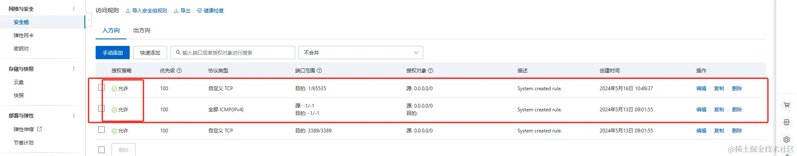

进入实战，连接远程数据库


## CentOS Docker 安装

Docker 支持以下的 64 位 CentOS 版本：

CentOS 9 (stream)

更高版本...

必须启用 centos-extras 仓库，该仓库默认启用，如果您禁用了它，需要重新启用。

使用官方安装脚本自动安装

安装命令如下：

```
$ curl -fsSL https://get.docker.com -o install-docker.sh
$ sudo sh install-docker.sh
```

手动安装

卸载旧版本

较旧的 Docker 版本称为 docker 或 docker-engine，如果已安装这些程序，请卸载它们以及相关的依赖项。

运行以下命令卸载旧版本：

```
sudo dnf remove docker \
docker-client \
docker-client-latest \
docker-common \
docker-latest \
docker-latest-logrotate \
docker-logrotate \
docker-engine
```

安装

使用 Docker 仓库进行安装

在新主机上首次安装 Docker 之前，需要设置 Docker 仓库。之后，您可以从仓库安装和更新 Docker。

设置仓库

安装 dnf-plugins-core 包（提供管理 DNF 仓库的命令），并设置仓库。

```
sudo dnf -y install dnf-plugins-core
```

使用以下命令来设置稳定的仓库。

使用官方源地址（比较慢）

```
sudo dnf config-manager --add-repo https://download.docker.com/linux/centos/docker-ce.repo
```

可以执行以下命令换成清华大学的镜像源：

清华大学镜像源

```
sed -i 's+https://download.docker.com+https://mirrors.tuna.tsinghua.edu.cn/docker-ce+' /etc/yum.repos.d/docker-ce.repo
```

参考地址：https://mirrors.tuna.tsinghua.edu.cn/help/docker-ce/

安装

运行以下命令安装Docker：：

```
sudo dnf install docker-ce docker-ce-cli containerd.io docker-buildx-plugin docker-compose-plugin
```

如果提示接受 GPG 密钥，验证指纹是否与 060A 61C5 1B55 8A7F 742B 77AA C52F EB6B 621E 9F35 匹配，如果匹配则接受。

安装成功后，启动 Docker 引擎：

sudo systemctl start docker

如果希望 Docker 在系统启动时也启动可以使用以下命令：

sudo systemctl enable --now docker

以上命令会配置 Docker 的 systemd 服务，在系统启动时自动启动 Docker。

Docker 安装完默认未启动。并且已经创建好 docker 用户组，但该用户组下没有用户。

运行以下命令来验证安装是否成功：

sudo docker run hello-world

此命令会下载一个测试镜像，并在容器中运行，当容器运行时，会打印确认消息并退出。

卸载 docker

删除安装包：

yum remove docker-ce

删除镜像、容器、配置文件等内容：

rm -rf /var/lib/docker

```
sudo yum remove docker \
                  docker-client \
                  docker-client-latest \
                  docker-common \
                  docker-latest \
                  docker-latest-logrotate \
                  docker-logrotate \
                  docker-engine

```

1. 安装Docker的依赖库。

安装需要依赖库。yum-utils 提供了 yum-config-manager ，并且 device mapper 存储驱动程序需要 device-mapper-persistent-data 和 lvm2。

CentOS内并没有Docker相关的软件包，如果不执行下面命令，使用 yum安装Docker时，则找不到软件包。

```
yum install -y yum-utils device-mapper-persistent-data lvm2

```

2. 添加Docker CE的软件源信息

下面两个软件源，选择一个使用

这个是官方软件源，但是比较慢。

```
sudo yum-config-manager \
    --add-repo \
    https://download.docker.com/linux/centos/docker-ce.repo

```

这个是阿里云软件源，国内的话推荐使用这个。


```
sudo yum-config-manager \
    --add-repo \
    https://mirrors.aliyun.com/docker-ce/linux/centos/docker-ce.repo

```

3. 安装Docker CE。
   
注意：这里会自动安装相关的docker-ce、containerd.io、docker-ce-cli 和 docker-ce-rootless-extras 依赖，如果有询问直接 y 即可

```
sudo yum install docker-ce

```

4. 启动Docker服务。

```
// 设置开机自启
sudo systemctl enable docker 

//  启动docker
sudo systemctl start docker 

```

通过执行测试映像验证是否安装正确

```
sudo docker run hello-world

```

Docker相关命令

```
sudo systemctl restart docker  // 重启Docker
sudo docker version // 查看版本
sudo docker info    // 查看相关信息
sudo docker iamges  // 查看安装镜像

```

## Docker安装docker-compose

docker-compose 是用于定义和运行多容器 Docker 应用程序的工具。通过 Compose，您可以使用 YML 文件来配置应用程序需要的所有服务。然后，使用一个命令，就可以从 YML 文件配置中创建并启动所有服务。下载docker-compose:

注意：请先看完所有安装方法再操作

Compose 简介

Compose 是用于定义和运行多容器 Docker 应用程序的工具。通过 Compose，您可以使用 YML 文件来配置应用程序需要的所有服务。然后，使用一个命令，就可以从 YML 文件配置中创建并启动所有服务。

如果你还不了解 YML 文件配置，可以先阅读 YAML 入门教程。

Compose 使用的三个步骤：

使用 Dockerfile 定义应用程序的环境。

使用 docker-compose.yml 定义构成应用程序的服务，这样它们可以在隔离环境中一起运行。

最后，执行 docker-compose up 命令来启动并运行整个应用程序。

docker-compose.yml 的配置案例如下（配置参数参考下文）：

```
# yaml 配置实例
version: '3'
services:
  web:
    build: .
    ports:
    - "5000:5000"
    volumes:
    - .:/code
    - logvolume01:/var/log
    links:
    - redis
  redis:
    image: redis
volumes:
  logvolume01: {}
```

## Compose 安装

Linux 上我们可以从 Github 上下载它的二进制包来使用，最新发行的版本地址：`https://github.com/docker/compose/releases。`

运行以下命令以下载 Docker Compose 的当前稳定版本：

```
$ sudo curl -L "https://github.com/docker/compose/releases/download/v2.2.2/docker-compose-$(uname -s)-$(uname -m)" -o /usr/local/bin/docker-compose

```

要安装其他版本的 Compose，请替换 v2.2.2。

Docker Compose 存放在 GitHub，不太稳定。

你可以也通过执行下面的命令，高速安装 Docker Compose。

```
curl -L https://get.daocloud.io/docker/compose/releases/download/v2.4.1/docker-compose-`uname -s`-`uname -m` > /usr/local/bin/docker-compose
```

将可执行权限应用于二进制文件：

```
$ sudo chmod +x /usr/local/bin/docker-compose
```

创建软链：

```
$ sudo ln -s /usr/local/bin/docker-compose /usr/bin/docker-compose
```

测试是否安装成功：

```
$ docker-compose version
cker-compose version 1.24.1, build 4667896b
```

注意： 对于 alpine，需要以下依赖包： py-pip，python-dev，libffi-dev，openssl-dev，gcc，libc-dev，和 make。

## macOS

Mac 的 Docker 桌面版和 Docker Toolbox 已经包括 Compose 和其他 Docker 应用程序，因此 Mac 用户不需要单独安装 Compose。Docker 安装说明可以参阅 MacOS Docker 安装。

## windows PC

Windows 的 Docker 桌面版和 Docker Toolbox 已经包括 Compose 和其他 Docker 应用程序，因此 Windows 用户不需要单独安装 Compose。Docker 安装说明可以参阅 Windows Docker 安装。

使用

1、准备

创建一个测试目录：

```
$ mkdir composetest
$ cd composetest
```

在测试目录中创建一个名为 app.py 的文件，并复制粘贴以下内容：

composetest/app.py 文件代码

```
import time

import redis
from flask import Flask

app = Flask(__name__)
cache = redis.Redis(host='redis', port=6379)


def get_hit_count():
    retries = 5
    while True:
        try:
            return cache.incr('hits')
        except redis.exceptions.ConnectionError as exc:
            if retries == 0:
                raise exc
            retries -= 1
            time.sleep(0.5)


@app.route('/')
def hello():
    count = get_hit_count()
    return 'Hello World! I have been seen {} times.\n'.format(count)
```

在此示例中，redis 是应用程序网络上的 redis 容器的主机名，该主机使用的端口为 6379。

在 composetest 目录中创建另一个名为 requirements.txt 的文件，内容如下：

```
flask
redis
```

2、创建 Dockerfile 文件

在 composetest 目录中，创建一个名为 Dockerfile 的文件，内容如下：

```
FROM python:3.7-alpine
WORKDIR /code
ENV FLASK_APP app.py
ENV FLASK_RUN_HOST 0.0.0.0
RUN apk add --no-cache gcc musl-dev linux-headers
COPY requirements.txt requirements.txt
RUN pip install -r requirements.txt
COPY . .
CMD ["flask", "run"]
```

Dockerfile 内容解释：

FROM python:3.7-alpine: 从 Python 3.7 映像开始构建镜像。

WORKDIR /code: 将工作目录设置为 /code。

```
ENV FLASK_APP app.py
ENV FLASK_RUN_HOST 0.0.0.0
```

设置 flask 命令使用的环境变量。

RUN apk add --no-cache gcc musl-dev linux-headers: 安装 gcc，以便诸如 MarkupSafe 和 SQLAlchemy 之类的 Python 包可以编译加速。

```
COPY requirements.txt requirements.txt
RUN pip install -r requirements.txt
```

复制 requirements.txt 并安装 Python 依赖项。

COPY . .: 将 . 项目中的当前目录复制到 . 镜像中的工作目录。

CMD `["flask", "run"]`: 容器提供默认的执行命令为：flask run。

3、创建 docker-compose.yml

在测试目录中创建一个名为 docker-compose.yml 的文件，然后粘贴以下内容：

docker-compose.yml 配置文件

```
# yaml 配置
version: '3'
services:
  web:
    build: .
    ports:
      - "5000:5000"
  redis:
    image: "redis:alpine"
```

该 Compose 文件定义了两个服务：web 和 redis。

web：该 web 服务使用从 Dockerfile 当前目录中构建的镜像。然后，它将容器和主机绑定到暴露的端口 5000。此示例服务使用 Flask Web 服务器的默认端口 5000 。

redis：该 redis 服务使用 Docker Hub 的公共 Redis 映像。

4、使用 Compose 命令构建和运行您的应用

在测试目录中，执行以下命令来启动应用程序：

```
docker-compose up
```

如果你想在后台执行该服务可以加上 -d 参数：

```
docker-compose up -d
```

## yml 配置指令参考

version

指定本 yml 依从的 compose 哪个版本制定的。

build

指定为构建镜像上下文路径：

例如 webapp 服务，指定为从上下文路径 ./dir/Dockerfile 所构建的镜像：

```
version: "3.7"
services:
  webapp:
    build: ./dir
```

或者，作为具有在上下文指定的路径的对象，以及可选的 Dockerfile 和 args：

```
version: "3.7"
services:
  webapp:
    build:
      context: ./dir
      dockerfile: Dockerfile-alternate
      args:
        buildno: 1
      labels:
        - "com.example.description=Accounting webapp"
        - "com.example.department=Finance"
        - "com.example.label-with-empty-value"
      target: prod
```

context：上下文路径。

dockerfile：指定构建镜像的 Dockerfile 文件名。

args：添加构建参数，这是只能在构建过程中访问的环境变量。

labels：设置构建镜像的标签。

target：多层构建，可以指定构建哪一层。

## cap_add，cap_drop

添加或删除容器拥有的宿主机的内核功能。

```
cap_add:
  - ALL # 开启全部权限

cap_drop:
  - SYS_PTRACE # 关闭 ptrace权限
```

cgroup_parent

为容器指定父 cgroup 组，意味着将继承该组的资源限制。

```
cgroup_parent: m-executor-abcd
```

command

覆盖容器启动的默认命令。

```
command: ["bundle", "exec", "thin", "-p", "3000"]
```

container_name

指定自定义容器名称，而不是生成的默认名称。

```
container_name: my-web-container
```

## depends_on

设置依赖关系。

docker-compose up ：以依赖性顺序启动服务。在以下示例中，先启动 db 和 redis ，才会启动 web。

docker-compose up SERVICE ：自动包含 SERVICE 的依赖项。在以下示例中，docker-compose up web 还将创建并启动 db 和 redis。

docker-compose stop ：按依赖关系顺序停止服务。在以下示例中，web 在 db 和 redis 之前停止。

```
version: "3.7"
services:
  web:
    build: .
    depends_on:
      - db
      - redis
  redis:
    image: redis
  db:
    image: postgres
```

注意：web 服务不会等待 redis db 完全启动 之后才启动。

deploy

指定与服务的部署和运行有关的配置。只在 swarm 模式下才会有用。

```
version: "3.7"
services:
  redis:
    image: redis:alpine
    deploy:
      mode：replicated
      replicas: 6
      endpoint_mode: dnsrr
      labels: 
        description: "This redis service label"
      resources:
        limits:
          cpus: '0.50'
          memory: 50M
        reservations:
          cpus: '0.25'
          memory: 20M
      restart_policy:
        condition: on-failure
        delay: 5s
        max_attempts: 3
        window: 120s
```

可以选参数：

endpoint_mode：访问集群服务的方式。

```
endpoint_mode: vip 
# Docker 集群服务一个对外的虚拟 ip。所有的请求都会通过这个虚拟 ip 到达集群服务内部的机器。
endpoint_mode: dnsrr
# DNS 轮询（DNSRR）。所有的请求会自动轮询获取到集群 ip 列表中的一个 ip 地址。
```

labels：在服务上设置标签。可以用容器上的 labels（跟 deploy 同级的配置） 覆盖 deploy 下的 labels。

mode：指定服务提供的模式。

replicated：复制服务，复制指定服务到集群的机器上。

global：全局服务，服务将部署至集群的每个节点。

图解：下图中黄色的方块是 replicated 模式的运行情况，灰色方块是 global 模式的运行情况。


replicas：mode 为 replicated 时，需要使用此参数配置具体运行的节点数量。

resources：配置服务器资源使用的限制，例如上例子，配置 redis 集群运行需要的 cpu 的百分比 和 内存的占用。避免占用资源过高出现异常。

restart_policy：配置如何在退出容器时重新启动容器。

* condition：可选 none，on-failure 或者 any（默认值：any）。
* delay：设置多久之后重启（默认值：0）。
* max_attempts：尝试重新启动容器的次数，超出次数，则不再尝试（默认值：一直重试）。
* window：设置容器重启超时时间（默认值：0）。

rollback_config：配置在更新失败的情况下应如何回滚服务。

* parallelism：一次要回滚的容器数。如果设置为0，则所有容器将同时回滚。
* delay：每个容器组回滚之间等待的时间（默认为0s）。
* failure_action：如果回滚失败，该怎么办。其中一个 continue 或者 pause（默认pause）。
* monitor：每个容器更新后，持续观察是否失败了的时间 (ns|us|ms|s|m|h)（默认为0s）。
* max_failure_ratio：在回滚期间可以容忍的故障率（默认为0）。
* order：回滚期间的操作顺序。其中一个 stop-first（串行回滚），或者 start-first（并行回滚）（默认 stop-first ）。

update_config：配置应如何更新服务，对于配置滚动更新很有用。

* parallelism：一次更新的容器数。
* delay：在更新一组容器之间等待的时间。
* failure_action：如果更新失败，该怎么办。其中一个 continue，rollback 或者pause （默认：pause）。
* monitor：每个容器更新后，持续观察是否失败了的时间 (ns|us|ms|s|m|h)（默认为0s）。
* max_failure_ratio：在更新过程中可以容忍的故障率。
* order：回滚期间的操作顺序。其中一个 stop-first（串行回滚），或者 start-first（并行回滚）（默认stop-first）。

注：仅支持 V3.4 及更高版本。

devices

指定设备映射列表。

```
devices:
  - "/dev/ttyUSB0:/dev/ttyUSB0"

```

dns

自定义 DNS 服务器，可以是单个值或列表的多个值。

```
dns: 8.8.8.8

dns:
  - 8.8.8.8
  - 9.9.9.9
```

dns_search

自定义 DNS 搜索域。可以是单个值或列表。

```
dns_search: example.com

dns_search:
  - dc1.example.com
  - dc2.example.com
```

entrypoint

覆盖容器默认的 entrypoint。

```
entrypoint: /code/entrypoint.sh
```

也可以是以下格式：

```
entrypoint:
    - php
    - -d
    - zend_extension=/usr/local/lib/php/extensions/no-debug-non-zts-20100525/xdebug.so
    - -d
    - memory_limit=-1
    - vendor/bin/phpunit
```

env_file

从文件添加环境变量。可以是单个值或列表的多个值。

```
env_file: .env
```

也可以是列表格式：

```
env_file:
  - ./common.env
  - ./apps/web.env
  - /opt/secrets.env
```

environment

添加环境变量。您可以使用数组或字典、任何布尔值，布尔值需要用引号引起来，以确保 YML 解析器不会将其转换为 True 或 False。

```
environment:
  RACK_ENV: development
  SHOW: 'true'
```

expose

暴露端口，但不映射到宿主机，只被连接的服务访问。

仅可以指定内部端口为参数：

```
expose:
 - "3000"
 - "8000"
```

extra_hosts

添加主机名映射。类似 docker client --add-host。

```
extra_hosts:
 - "somehost:162.242.195.82"
 - "otherhost:50.31.209.229"
```

以上会在此服务的内部容器中 /etc/hosts 创建一个具有 ip 地址和主机名的映射关系：

```
162.242.195.82  somehost
50.31.209.229   otherhost
```

healthcheck

用于检测 docker 服务是否健康运行。

```
healthcheck:
  test: ["CMD", "curl", "-f", "http://localhost"] # 设置检测程序
  interval: 1m30s # 设置检测间隔
  timeout: 10s # 设置检测超时时间
  retries: 3 # 设置重试次数
  start_period: 40s # 启动后，多少秒开始启动检测程序
```

image

指定容器运行的镜像。以下格式都可以：

```
image: redis
image: ubuntu:14.04
image: tutum/influxdb
image: example-registry.com:4000/postgresql
image: a4bc65fd # 镜像id
```

logging

服务的日志记录配置。

driver：指定服务容器的日志记录驱动程序，默认值为json-file。有以下三个选项

```
driver: "json-file"
driver: "syslog"
driver: "none"
```

仅在 json-file 驱动程序下，可以使用以下参数，限制日志得数量和大小。

```
logging:
  driver: json-file
  options:
    max-size: "200k" # 单个文件大小为200k
    max-file: "10" # 最多10个文件
```

当达到文件限制上限，会自动删除旧得文件。

syslog 驱动程序下，可以使用 syslog-address 指定日志接收地址。

```
logging:
  driver: syslog
  options:
    syslog-address: "tcp://192.168.0.42:123"
```

network_mode

设置网络模式。

```
network_mode: "bridge"
network_mode: "host"
network_mode: "none"
network_mode: "service:[service name]"
network_mode: "container:[container name/id]"
```

networks

配置容器连接的网络，引用顶级 networks 下的条目 。

```
services:
  some-service:
    networks:
      some-network:
        aliases:
         - alias1
      other-network:
        aliases:
         - alias2
networks:
  some-network:
    # Use a custom driver
    driver: custom-driver-1
  other-network:
    # Use a custom driver which takes special options
    driver: custom-driver-2
```

aliases ：同一网络上的其他容器可以使用服务名称或此别名来连接到对应容器的服务。

restart

* no：是默认的重启策略，在任何情况下都不会重启容器。
* always：容器总是重新启动。
* on-failure：在容器非正常退出时（退出状态非0），才会重启容器。
* unless-stopped：在容器退出时总是重启容器，但是不考虑在Docker守护进程启动时就已经停止了的容器

```
restart: "no"
restart: always
restart: on-failure
restart: unless-stopped
```

注：swarm 集群模式，请改用 restart_policy。

secrets

存储敏感数据，例如密码：

```
version: "3.1"
services:

mysql:
  image: mysql
  environment:
    MYSQL_ROOT_PASSWORD_FILE: /run/secrets/my_secret
  secrets:
    - my_secret

secrets:
  my_secret:
    file: ./my_secret.txt
```

security_opt

修改容器默认的 schema 标签。

```
security-opt：
  - label:user:USER   # 设置容器的用户标签
  - label:role:ROLE   # 设置容器的角色标签
  - label:type:TYPE   # 设置容器的安全策略标签
  - label:level:LEVEL  # 设置容器的安全等级标签
```

stop_grace_period

指定在容器无法处理 SIGTERM (或者任何 stop_signal 的信号)，等待多久后发送 SIGKILL 信号关闭容器。

```
stop_grace_period: 1s # 等待 1 秒
stop_grace_period: 1m30s # 等待 1 分 30 秒 
```

默认的等待时间是 10 秒。

stop_signal

设置停止容器的替代信号。默认情况下使用 SIGTERM 。

以下示例，使用 SIGUSR1 替代信号 SIGTERM 来停止容器。

```
stop_signal: SIGUSR1
```

sysctls

设置容器中的内核参数，可以使用数组或字典格式。

```
sysctls:
  net.core.somaxconn: 1024
  net.ipv4.tcp_syncookies: 0

sysctls:
  - net.core.somaxconn=1024
  - net.ipv4.tcp_syncookies=0
```

tmpfs

在容器内安装一个临时文件系统。可以是单个值或列表的多个值。

```
tmpfs: /run

tmpfs:
  - /run
  - /tmp
```

ulimits

覆盖容器默认的 ulimit。

```
ulimits:
  nproc: 65535
  nofile:
    soft: 20000
    hard: 40000
```

volumes

将主机的数据卷或者文件挂载到容器里。

```
version: "3.7"
services:
  db:
    image: postgres:latest
    volumes:
      - "/localhost/postgres.sock:/var/run/postgres/postgres.sock"
      - "/localhost/data:/var/lib/postgresql/data"
```

## 下载docker-compose:

1.命令行进行下载

高速下载：

```
curl -L https://get.daocloud.io/docker/compose/releases/download/v2.4.1/docker-compose-`uname -s`-`uname -m` > /usr/local/bin/docker-compose

```

将可执行权限应用于二进制文件：安装完成后提升权限

```
sudo chmod +x /usr/local/bin/docker-compose

```

检查是否安装成功：

```
docker-compose -v

```

注意：以下结果说明安装失败

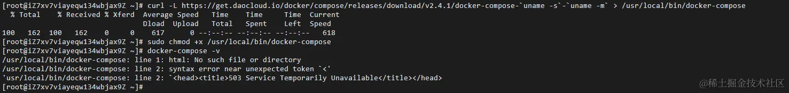

此时需要切换到官方github链接去安装（较慢）

```
sudo curl -L "https://github.com/docker/compose/releases/download/v2.2.2/docker-compose-$(uname -s)-$(uname -m)" -o /usr/local/bin/docker-compose

```

以下为下载安装过程（较慢）

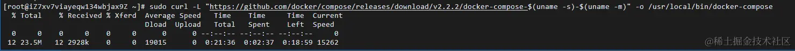

## 2.下载二进制文件进行安装 (本人使用)  

确定你的系统架构：

运行uname -s -m命令来确定你的系统类型和架构。例如，你可能会得到Linux x86_64这样的输出，这意味着你正在使用Linux系统，并且是64位架构。

访问Docker Compose的GitHub页面：

打开浏览器，访问Docker Compose的GitHub页面：Releases · docker/compose · GitHub

下载二进制文件：

在GitHub页面上，找到你想要安装的Docker Compose版本。注意要看是否为稳定版（Latest release）

点击该版本，进入该版本的详细页面。

在该页面上，找到适合你系统架构的二进制文件。例如，对于Linux 64位系统，你可能会看到一个名为docker-compose-Linux-x86_64的文件。（如果没有该文件则看其他版本，我的是v2.24.6）

将二进制文件移动到适当的位置：

将下载的二进制文件移动到你的系统路径中，以便你可以在任何位置运行它。通常，你可以将其移动到/usr/local/bin/目录下。

## 可视化操作

打开新文件管理


进入到 /usr/local/bin 目录中

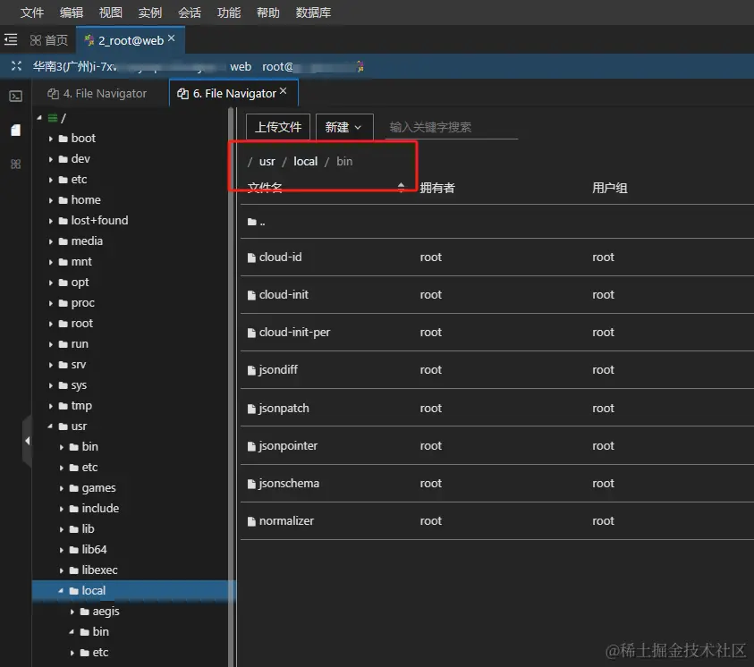

把下载好的二进制文件上传到该目录


等待上传完成


上传完成后 重命名为 docker-compose


设置可执行权限：

为Docker Compose二进制文件设置可执行权限。运行以下命令：将 /usr/local/bin/docker-compose 文件设置为可执行文件，这样可以通过命令行直接执行 docker-compose 命令，而不必指定脚本的路径。

```
sudo chmod +x /usr/local/bin/docker-compose

```

检查是否安装成功：

```
docker-compose -v

```

安装完成！

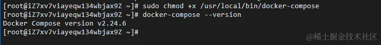

## Docker安装Nginx和Jenkins服务

安装Nginx和Jenkins

docker镜像拉取nginx和jenkins环境命令如下：

拉取最新版的 Nginx 镜像

这里我们拉取官方的最新版本的镜像：

```
docker pull nginx:latest

```


拉取jenkins

```
docker pull jenkins/jenkins:lts

```


安装完成后执行docker images可以清晰的看到当前docker下存在的镜像。

```
docker images

```


创建docker的相关目录，方便维护

> 这条命令 mkdir /docker 的意思是在根目录下创建一个名为 docker 的新目录。 mkdir 是“make directory”的缩写，用于创建新的目录。在这里， /docker 表示在根目录下创建一个名为 docker 的目录。这里假设一个项目中有两个端（admin 、h5端）

```
mkdir /docker           
mkdir /docker/compose    
mkdir /docker/jenkins_home   
mkdir /docker/nginx      
mkdir /docker/nginx/conf 
mkdir /docker/html       
mkdir /docker/html/admin   
mkdir /docker/html/h5  

```

/docker/compose是放置docker-compose.yml配置文件，jenkin_home是放置jenkins相关文件，/nginx/conf是放置nginx.conf配置文件,html是放置代码文件。


docker-compose.yml配置文件如下：(要新建相对应的文件)


```
version: '3'

networks:
  frontend:
    external: true

services:                                      # 容器
  docker_jenkins:
    user: root                                 # root权限
    restart: always                            # 重启方式
    image: jenkins/jenkins:lts                 # 使用的镜像
    container_name: jenkins                    # 容器名称
#    environment:
#      - TZ=Asia/Shanghai
#      - "JENKINS_OPTS=--prefix=/jenkins_home" ## 自定义 jenkins 访问前缀（上下文context）


    ports:                                     # 对外暴露的端口定义
      - 8080:8080
      

    volumes:                                   # 卷挂载路径
      - /docker/jenkins_home/:/var/jenkins_home     # 挂载到容器内的jenkins_home目录
      - /usr/local/bin/docker-compose:/usr/local/bin/docker-compose
  
  docker_nginx:                            # nginx-dev环境
    restart: always
    image: nginx
    container_name: nginx
    ports:
      - 80:80
    volumes:
      - /docker/nginx/conf/nginx.conf:/etc/nginx/nginx.conf
      - /docker/html:/usr/share/nginx/html
      - /docker/nginx/logs:/var/log/nginx

```

在Docker的上下文中，特别是当使用docker-compose.yml文件来定义和运行容器时，volumes键用于挂载宿主机上的目录或文件到容器内的目录或文件。

> 1./docker/nginx/conf/nginx.conf:/etc/nginx/nginx.conf

这表示将宿主机上的/docker/nginx/conf/nginx.conf文件挂载到容器内的/etc/nginx/nginx.conf文件。这样，当容器启动时，它会使用宿主机上这个路径的nginx.conf文件作为Nginx的配置文件。任何对容器内/etc/nginx/nginx.conf文件的修改都会反映到宿主机上的/docker/nginx/conf/nginx.conf文件，反之亦然（注意，这里假设是双向挂载，但Docker的默认行为可能会根据文件系统的不同而有所不同）。

> 2./docker/html:/usr/share/nginx/html

这表示将宿主机上的/docker/html目录挂载到容器内的/usr/share/nginx/html目录。这通常用于存放Nginx服务的静态网页文件。当容器启动时，它会从容器内的/usr/share/nginx/html目录（实际上是宿主机上的/docker/html目录）读取这些文件来提供Web服务。任何在容器内对/usr/share/nginx/html目录的修改都会反映到宿主机上的/docker/html目录，反之亦然。

> 3./docker/nginx/logs:/var/log/nginx

这表示将宿主机上的/docker/nginx/logs目录挂载到容器内的/var/log/nginx目录。Nginx的日志文件通常存放在/var/log/nginx目录下，通过这个挂载，你可以将容器的日志保存在宿主机上，方便查看和管理。任何在容器内对/var/log/nginx目录的修改（例如新的日志文件被创建或现有日志文件的内容被更新）都会反映到宿主机上的/docker/nginx/logs目录。

nginx.conf配置


root和alias的区别

* root与alias主要区别在于nginx如何解释location后面的uri，这会使两者分别以不同的方式将请求映射到服务器文件上。
* root的处理结果是：root路径＋location路径。alias的处理结果是：使用alias路径替换location路径
* alias是一个目录别名的定义，root则是最上层目录的定义。
* 一个重要的区别是alias后面必须要用“/”结束，否则会找不到文件的。而root则可有可无。
* alias只能位于location块中。（root可以不放在location中）

location /admin 这定义了当请求的URI以/admin开始时（例如，/admin/, /admin/page.html, /admin/some/path等）如何响应这些请求。

* #alias指令指定了一个目录，Nginx将从该目录提供文件以响应匹配的URI。
* #这里，/usr/share/nginx/html/h5/dist是Nginx服务器上实际存储文件的目录。
* #与root指令不同，alias指令会将请求的URI路径替换为alias指定的路径。
* #例如，对于请求/admin/page.html，Nginx将尝试从/usr/share/nginx/html/admin/dist/page.html提供文件，而不是从/usr/share/nginx/html/h5/dist/h5/page.html（如果使用root指令）。

```
# nginx.conf 
# main段配置信息
user  nginx;                                # 运行用户，默认即是nginx，可以不进行设置
worker_processes  2;                        # Nginx 进程数，一般设置为和 CPU 核数一样
error_log  /var/log/nginx/error.log warn;   # Nginx 的错误日志存放目录
pid        /var/run/nginx.pid;              # Nginx 服务启动时的 pid 存放位置
 
# events段配置信息 
events {
#    use epoll;     # 使用epoll的I/O模型(如果你不知道Nginx该使用哪种轮询方法，会自动选择一个最适合你操作系统的)
    worker_connections  1024;  # 每个进程允许最大并发数
}
 
 
http {
    include       /etc/nginx/mime.types;
    default_type  application/octet-stream;
    # 设置日志模式 默认即可
    log_format  main  '$remote_addr - $remote_user [$time_local] "$request" '
                      '$status $body_bytes_sent "$http_referer" '
                      '"$http_user_agent" "$http_x_forwarded_for"';
 
    access_log  /var/log/nginx/access.log  main; # Nginx访问日志存放位置

    sendfile            on;   # 开启高效传输模式
    tcp_nopush          on;   # 减少网络报文段的数量
    keepalive_timeout   65;   # 保持连接的时间，也叫超时时间，单位秒
    gzip  on;

    # server段配置信息
    server {
            #监听的端口
        listen  80;               # 配置监听的端口
        server_name  localhost;   # 配置的域名

        #location目录后加"/",只能匹配目录，不加“/”不仅可以匹配目录还对目录进行模糊匹配。而proxy_pass无论加不加“/”,代理跳转地址都直接拼接。
        #  http://localhost/jenkins_home/xxx -> http://localhost:8080/jenkins_home/xxx
        location /jenkins_home/ {  
        # 假设你的Jenkins服务可以通过宿主机上的8080端口访问  
        proxy_pass http://localhost:8080;  
        # 添加其他需要的Nginx指令，如proxy_set_header等  
        }  
               
               
        #假设一个项目中有 admin 端
        # location /admin   这定义了当请求的URI以/h5开始时（例如，/admin/, /admin/page.html, /admin/some/path等）如何响应这些请求。
        #alias指令指定了一个目录，Nginx将从该目录提供文件以响应匹配的URI。
        #这里，/usr/share/nginx/html/h5/dist是Nginx服务器上实际存储文件的目录。
        #与root指令不同，alias指令会将请求的URI路径替换为alias指定的路径。
        #例如，对于请求/admin/page.html，Nginx将尝试从/usr/share/nginx/html/admin/dist/page.html提供文件，
        #而不是从/usr/share/nginx/html/h5/dist/h5/page.html（如果使用root指令）。

        location /admin {
        #linux下HTML文件夹,就是你的前端项目文件夹
        # root是完整路径:相当于/usr/share/nginx/html + /admin + /dist/index.html  
        # alias是重定向：相当于 /usr/share/nginx/html/admin/dist + /index.html
        #   root  /usr/share/nginx/html; 
        #注意这里已经在docker做了挂载，所以要写映射目录，而不是硬盘目录（也就是docker下的目录）
        alias  /usr/share/nginx/html/admin/dist;

        #输入网址（server_name：port）后，默认的访问页面
        #这指定了当请求的是一个目录（如/h5/）而不是一个具体的文件时，Nginx应该提供哪个文件作为默认页面。
        #在这里，如果请求的是/h5/并且/usr/share/nginx/html/h5/dist/目录中存在index.html文件，那么Nginx将提供该文件作为响应。
        #使用root方式写法
        #index  dist/index.html;  

        #使用alias  写法
        index  index.html;  # 默认首页文件  
        #try_files指令用于尝试不同的URI路径来服务请求，并在所有指定路径都失败时提供一个回退。 这里可以自行写一个跟index.html文件同级的文件去回退
        # try_files $uri $uri/ /error.html;
        }

        #假设一个项目有 H5 端
        location /h5 {
            alias  /usr/share/nginx/html/h5/dist;
            index  index.html;  
        }
    }
}

```

## 环境启动

进入到 docker-compose 同级目录下运行 docker-compose （不然会报错）

```
cd /docker/compose

```


执行 docker-compose up -d 去运行 docker-compose

docker-compose up -d 

查看容器运行状态

docker ps -a

分别有了相对应的端口证明运行成功

注意：一定要开启安全组相对应端口（在开头有讲）,以及如果改动了nginx配置文件记得要执行 docker restart nginx 进行重启


## Nginx配置

验证nginx环境

在对应目录/docker/html/admin/dist、/docker/html/h5/dist各新建一个index.html

附上代码

```
<!DOCTYPE html>
<html lang="en">
  <head>
    <meta charset="UTF-8">
    <meta name="viewport" content="width=device-width, initial-scale=1.0">
    <title>Document</title>
  </head>
  <body>
    <h1>这是一个admin测试</h1>
  </body>
</html>

```

输入 `http://服务器ip地址/admin` 如果页面正常打开代表nginx配置成功


然后删除对应的dist文件夹，后续会自动生成

验证Jenkins

浏览器输入服务器地址:8080/


会提示要输入密码，密码位于docker/jenkins_home/secrets/initialAdminPassword，

## Jenkins配置

安装推荐插件即可，等待安装完成


创建相关的jenkins账号（也可使用admin登录）

1.设置中文

下载 local 插件

选择【Manage Jenkins】-> 【Plugins】-> 【Plugins】->


如已安装，执行重启即可,地址栏输入http://ip:端口/restart


2.安装Publish Over SSH、NodeJS

同样的方式这里不再具体操作，【Dashboard】——>【Manage Jenkins】——>【Plugins】——>【Available plugins】，搜索Publish Over SSH、NodeJS，安装后重启。

（1）Publish Over SSH配置远程服务器

Publish Over SSH用来连接远程服务器，接下来去设置连接远程服务器验证方式，本案例采用密码验证。


找到Publish Over SSH，点击新增


在新增后出来的面板中输入信息，之后点击高级


输入密码、服务器端口，并点击Test Configuration Success进行测试，显示successs则成功，之后先点击应用，再保存


（2）NodeJS配置

【Dashboard】——>【系统管理】——>【全局工具配置】——>【NodeJS 安装】

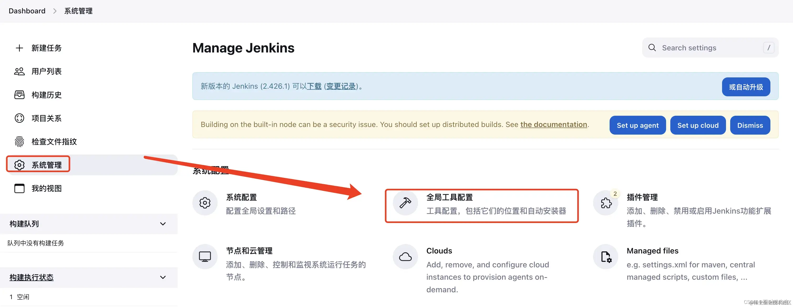

点击新增NodeJS


配置安装NodeJS的基本信息，自定义别名、选择安装版本(可以安装多个版本)，最后，先点击应用再保存。


3、添加凭据

添加凭据，也就是GitHub或者其他远程仓库的账号密码，方便之后使用。【系统管理】——>【凭证管理】

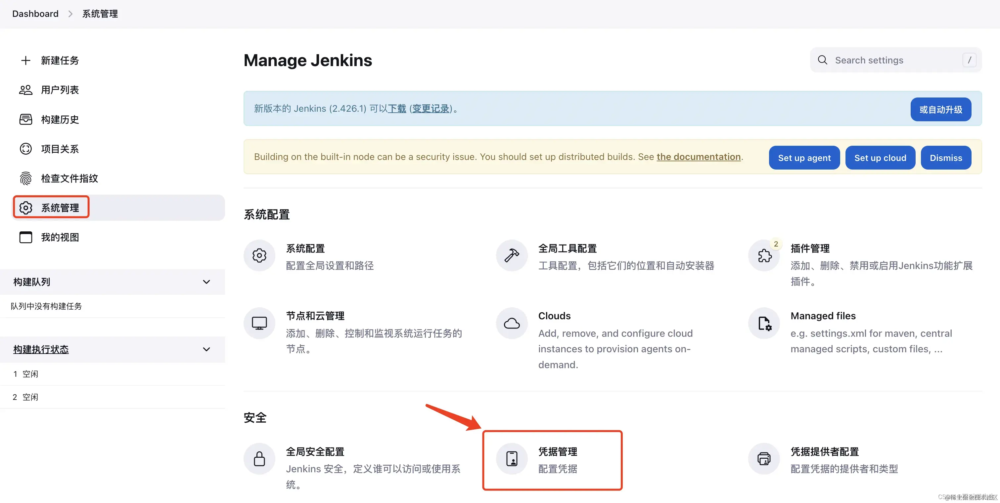

点击添加凭证


填写用户名、密码、描述


4、创建Job

第一次部署的Jenkins没用Job，创建一个，首页右边视图中，点击Create a job。


输入项目名称：测试项目，选择构建一个自由风格的软件项目，点击确定

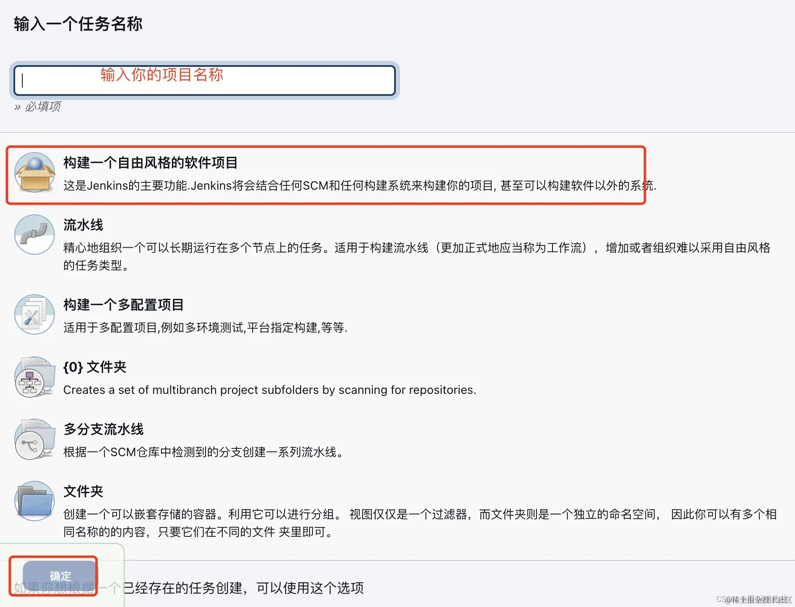

接下来需要配置项目的一些信息


配置完成后，先应用后保存，然后返回首页，打开项目，点击立即构建


查看控制台输出


可以看到构建过程中并没有出现error，并最终显示success，此时基础构建基本完成

5.更多选项配置（根据项目自定义）

（1）勾选参数化构建过程，并配置项目不同端的选项(有些项目可能分后端、手机端等)(勾选参数化构建过程选择选项参数)

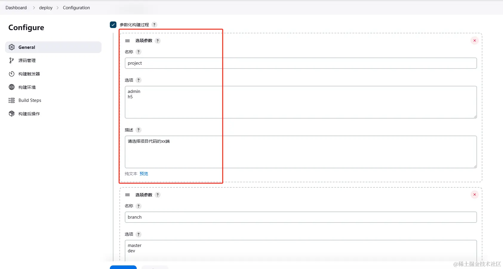

（2）代码分支选项，某个端下的代码分支，目前只做master分支，正式项目应该是dev、fixbug等分支


（3）代码环境选项，可指定某一环境进行打包构建(需要结合项目进行配置)


点击保存后可以看到有 Build with Paramerters 选项


6、构建环境

在 Jenkins 中将 Node.js 和 npm 的 bin 文件夹添加到 PATH 中，否则可能就会报错。

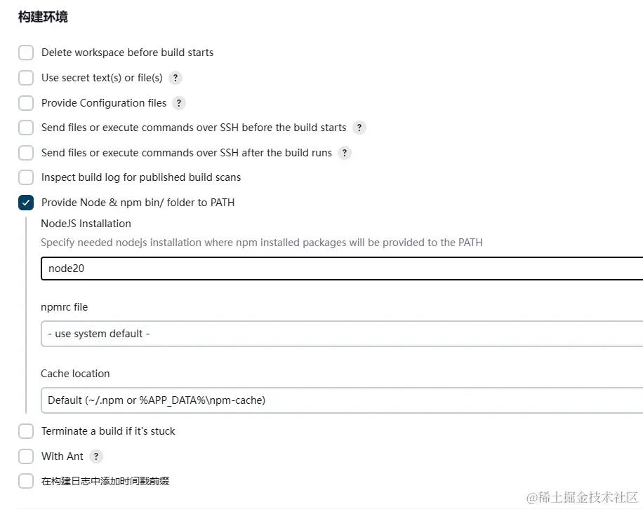

7、Build Steps

因为提交服务器代码是没有node_moudle，所以我们需要执行脚本去安装依赖！源码管理可以看到Build Steps模块，选择Execute NodeJS script


选择node版本，这个node版本是在上面我们已经配置过的，如果需要其他版本可通过上面操作新增NodeJs即可


配置完成之后，建议 立即构建 项目

8、shell 命令

在上图中选择增加构建步骤，在下拉框选中执行 shell


然后输入下面的指令

echo 是 Unix/Linux shell 中的一个命令，用于显示一行文本或变量的值。这个命令通常用于脚本、命令行或批处理文件中，以输出信息给用户或记录到日志文件中。同时可以打印变量

```
#!/bin/bash
node -v 
npm -v 
echo $PATH

```


之后去构建，可以看到我们打印的版本信息都打印出了


接下来我们脚本中执行安装node_module以及打包命令。

```
#!/bin/bash
node -v 
npm -v 
npm install
echo "依赖安装成功"
npm run build
echo "打包成功"
echo $PATH

```


然后先应用后保存，去 Build with Paramerters 执行 build。


并且，还可以再服务器中看到打包后的dist文件。(deploy是git项目)


## 9、自动部署到对应环境项目目录

上面打包到了Jenkins中的workspace中，但是我们设置的项目环境路径跟这个不同，比如project端项目目录是/docker/html/{project}端项目目录是/docker/html/project端项目目录是/docker/html/{project}/dist/，所以需要打包后，把dist文件内容推送到/docker/html/${project}/dist/目录下。修改一下上面的脚本，改为下面：

```
#!/bin/bash
node -v 
npm -v 
npm install
echo "依赖安装成功"
npm run build
echo "打包成功"
rm -rf dist.tar     # 每次构建删除已存在的dist压缩包
tar -zcvf dist.tar ./dist  #将dist文件压缩成dist.tar
echo $PATH

```

这个命令使用 tar 工具来创建一个 tar 归档文件（tar archive），并结合了 gzip 压缩。具体来说，这个命令做了以下几件事：

1. tar：这是 Unix/Linux 系统中用于归档文件的工具。归档文件是一个或多个文件的集合，通常被压缩以节省存储空间。
2. -z：这个选项告诉 tar 使用 gzip 进行压缩。因此，输出的文件（dist.tar）实际上是一个 gzip 压缩的 tar 归档文件，通常被命名为 .tar.gz 或 .tgz（尽管在这个命令中，输出文件的扩展名是 .tar）。
3. -c：这个选项告诉 tar 创建一个新的归档文件。
4. -v：这个选项是“verbose”的简写，意味着 tar 命令在执行过程中会显示正在归档或解归档的文件名。
5. -f dist.tar：这个选项后面的参数是归档文件的名称。-f 选项告诉 tar 接下来的参数是归档文件的名称，而不是要归档或解归档的文件/目录名。
6. ./dist：这是你想要归档的目录。在这个例子中，tar 会将 ./dist 目录下的所有文件和子目录都归档到 dist.tar 文件中（注意：这里虽然文件名是 dist.tar，但由于使用了 -z 选项，实际上它是一个 gzip 压缩的 tar 文件）。

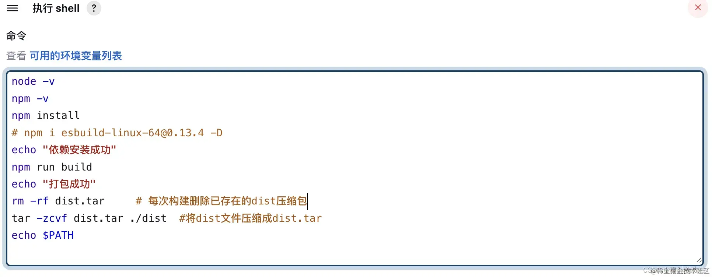

然后点击增加构建步骤，选择 Send files or execute commands over SSH ，Send files or execute commands over SSH命令允许你在构建过程中通过SSH连接到远程服务器执行命令或发送文件。


然后填写源文件、目标路径、执行脚本

```
cd /docker/html/${project}
rm  -rf   dist/
tar zxvf dist.tar
rm dist.tar

```


打包流程是：删除之前打包的tar压缩文件dist，把本次打包的dist文件压缩，然以压缩后的dist.tar为源文件，连接到远程服务器，放到/docker/html/admin目录下。然后删除dist目录，解压刚刚远道而来的dist.tar文件，之后删除压缩包。

* Source files：准备发送的文件，该文件是相对于这个项目的workspace目录。例如要发送/docker/jenkins_home/workspace/deploy-admin/dist.tar到目标目录，则设置Source files为dist.tar
* Remove prefix：目标文件前缀添加，例如要操作src下面的某个文件，就设置成src,本案例是跟目录，无需设置
* Remote directory：目标目录，本案例要复制到admin下的dist文件，/docker/html/admin
* Exec command：最后执行的命令，可在这里进行解压，删除，复制等操作

最后再次执行立即构建。打开你的服务器地址+项目地址。可以看到刚刚部署的项目啦。


温馨提示：如果部署成功且打包到相对应目录，可能会出现访问不到assets目录资源（404），需要特殊配置打包路径（根据实际项目改动）

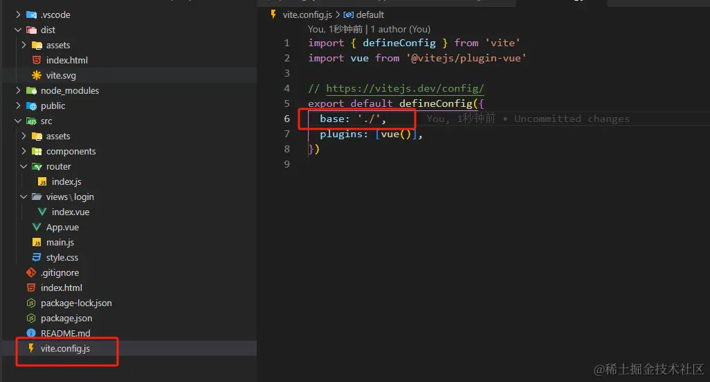

## 进阶：个性化配置

以上只是最基础的简单配置，对于单项目已足够，实际项目会出现一个项目多个端（admin、h5等），所以git代码地址也不仅仅是一个；也会出现多分支情况（dev、其他分支）；包括多接口环境(dev/prod/test等)；以及是否需要先提前编译好（而非直接部署/发布）;钉钉通知等个性化功能。

此时使用源码管理已不能单独拉取指定的git了（目前只学习到这种），所以需要进入服务器不同端的文件夹执行git命令拉取git代码等，以及不需要直接部署，Send files or execute commands over SSH 也不再需要，而是全部 通过shell命令 去操作。

参数化构建配置在上面保持不变，额外添加的参数配置如下，不做过多操作说明，依次添加即可：

### 是否构建（默认勾选）


### 是否部署（默认勾选）


## 是否需要钉钉通知（默认不勾选）


> 温馨提示：关于钉钉群聊通知机器人配置自行百度即可，这里不做过多说明（比较简单）

> 注意：这里不再需要Send files or execute commands over SSH，记得去掉构建后操作，后面通过shell命令执行拷贝操作即可

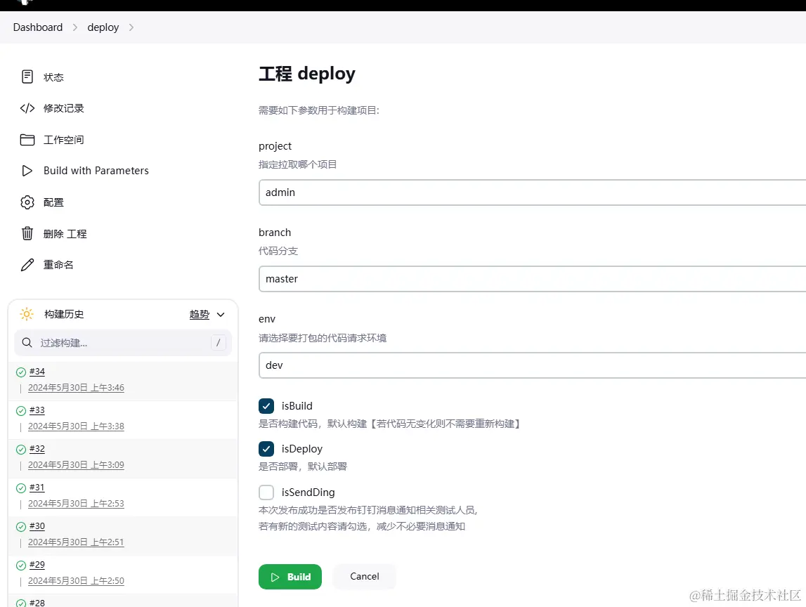

## jenkins配置 nginx 挂载卷

因 jenkins 跟 nginx 容器是相互独立，需要配置挂载卷，这样jenkins在打包后才能把dist文件拷贝到nginx相关的项目目录下,所以要对 docker-compose.yml 文件改写

```
version: '3'

networks:
  frontend:
    external: true


services:                                      # 容器
  docker_jenkins:
    user: root                                 # root权限
    restart: always                            # 重启方式
    image: jenkins/jenkins:latest                 # 使用的镜像
    container_name: jenkins                    # 容器名称
#    environment:
#      - TZ=Asia/Shanghai
#      - "JENKINS_OPTS=--prefix=/jenkins_home" ## 自定义 jenkins 访问前缀（上下文context）


    ports:                                     # 对外暴露的端口定义
      - 8080:8080

     
      

    volumes:                                   # 卷挂载路径
      - /docker/jenkins_home/:/var/jenkins_home     # 挂载到容器内的jenkins_home目录
      - /usr/local/bin/docker-compose:/usr/local/bin/docker-compose
      #将主机上存储的已知主机公钥列表文件挂载到运行的 Docker 容器中，供容器内部的 SSH 客户端使用。
      #这样做是为了避免每次启动容器时都重新建立主机与远程主机的连接，提高了安全性和便利性。
      - ~/.ssh/known_hosts:/root/.ssh/known_hosts:ro
      - /docker/html:/usr/share/nginx/html  # 挂载到 Nginx 容器内的某个路径

  
  docker_nginx:                            
    restart: always
    image: nginx
    container_name: nginx
    ports:
      - 80:80
    volumes:
      - /docker/nginx/conf/nginx.conf:/etc/nginx/nginx.conf
      - /docker/html:/usr/share/nginx/html
      - /docker/nginx/logs:/var/log/nginx
      

```

这里注意，也要对 SSH 公钥文件挂载到 docker容器，防止每次都需要验证

配置完保存后要对docker-compose进行重启。注意！不能直接使用 docker-compose restart ，这样可能会导致挂载卷不生效。'

```
 cd /docker/compose
 docker-compose down
 docker-compose up -d

```

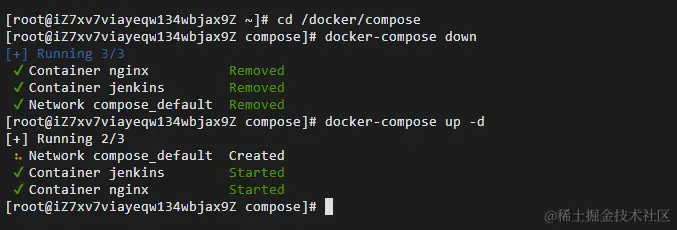

判断此时是否能正常访问到/usr/share/nginx/html相关目录，需要进入 jenkins 容器，输入以下代码

```
ls  /usr/share/nginx/html

```

可以看到nginx下的项目目录已存在


> 这里做一个自我理解(可能有误)：挂载卷的意义其实就是映射，真实目录(/docker下的)映射到主机(虚拟)容器（其他目录），通过操作真实目录下的目录或文件都会同步映射到主机(虚拟)目录，而反过来一样，所以在jenkins通过shell命令操作任何目录/文件，都会同步到真实目录中

## jenkins配置 git 的 SSH 公钥

因为是通过shell命令去执行git操作，所以需要在jenkins容器配置好SSH仓库公钥，回到服务器终端操作页面，执行以下指令获取jenkins容器id

docker ps -a

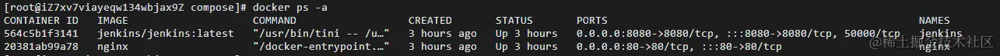

然后进入 jenkins 容器内部并打开一个交互式的 Bash shell

docker exec -it 564c5b1f3141 /bin/bash


* docker exec：这是Docker命令的一部分，用于在运行中的容器内部执行命令。
* -it：这是两个选项的组合。-i 表示交互式操作，-t 表示分配一个终端（TTY）。这两个选项一起表示要打开一个交互式的终端来执行命令。
* 564c5b1f3141：这是容器的ID，它是要在其中执行命令的目标容器的唯一标识符。
* /bin/bash：这是要在容器内部执行的实际命令。在这种情况下，它是要启动一个Bash shell。

然后执行gitee 相关的ssh配置公钥操作，这里不做过多操作解释，跟着gitee一直操作即可


配置完检测连接是否成功！


## shell命令配置

回到jenkins可视化页面中，对构建步骤shell部分进行改写

```
#!/bin/bash
echo $PATH
echo "当前node版本： $(node -v)"

# 项目字典
declare -A projectDic
projectDic=([admin]="XX项目后台端" [h5]="XX项目H5端")
# 当前服务器时间
starttime=`date +'%Y-%m-%d %H:%M:%S'`
# 构建
function build(){
# 判断分支文件夹是否存在
if [ -d deploy-${project} ];then
	  cd deploy-${project}
      echo "=============== $(project)项目文件夹存在 执行pull ==============="
      echo "git fetch && git checkout -f ${branch} && git pull origin ${branch}"
      git fetch
      git checkout -f ${branch}
      git pull origin ${branch}
     
    else
      echo "=============== $(project)项目文件夹不存在 执行clone ====================="
      echo "git clone -b ${branch} git@gitee.com:cpc0209/deploy-${project}.git"
      git clone -b ${branch} git@gitee.com:cpc0209/deploy-${project}.git 
      # cd到指定项目目录下操作
      cd deploy-${project}
     
    fi

    echo "=============== deploy-${project} pull/clone ok!start npm install... ====================="
    # 以特权用户的身份运行 npm
    npm install --unsafe-perm
    echo "=============== deploy-${project} install ok! start npm run build... ====================="
    # 如果是正式环境
    if [ "${env}" = "prod" ]; then
	npm run build
    else
    npm run build:${env} 
    fi
    echo "=============== deploy-${project} build:${env} success！ ====================="
}
    
# 部署到指定ngnix目录    
function deploy(){
	echo "=============== deploy-${project} deploy start... ====================="
    dist_path=$WORKSPACE/deploy-${project}/dist/
    #web项目路径
    web_path=/usr/share/nginx/html/${project}
    echo "web_path路径： $web_path"
    
    echo "即将从 $dist_path  拷贝"
    # 强制删除web项目路径
	  rm -rf ${web_dir}
    # 重新创建一个web项目路径
    mkdir -p ${web_dir}
    # 把dist文件夹拷贝到 web项目路径
    cp -r  $dist_path $web_path
    echo "copy success!"
    # 给web_path添加读取权限
    chmod +r ${web_path}/*
}   


# 项目自动化构建成功通知
function dingNotify() {
    endtime=`date +'%Y-%m-%d %H:%M:%S'`
    start_seconds=$(date --date="$starttime" +%s);
    end_seconds=$(date --date="$endtime" +%s);
	echo "=============================代码发布通知钉钉群================================"
    text="${env}环境: ${projectDic[$project]}(${branch}) 已部署成功，\n 构建开始时间：${starttime}， \n 构建结束时间：${endtime}， \n 构建用时： "$((end_seconds-start_seconds))"秒"
    echo "${text}"
    curl -XPOST 'https://oapi.dingtalk.com/https://oapi.dingtalk.com/这里换成你的钉钉机器人'  -H 'Content-Type: application/json' -d "{"msgtype": "text","text": {"content":"$text"},"at": {"isAtAll": false}}"
    echo "本次构建用时： "$((end_seconds-start_seconds))"秒"
	echo "=============================代码发布通知完成=================================="
}

# 项目自动化构建失败通知
function dingErrorNotify() {
	echo "=============================代码发布通知钉钉群================================"
    text="${env}环境: ${projectDic[$project]}(${branch}) 构建失败，\n 构建时间：$(date "+%Y-%m-%d %H:%M:%S")"
    echo "${text}"
    curl -XPOST 'https://oapi.dingtalk.com/这里换成你的钉钉机器人'  -H 'Content-Type: application/json' -d "{"msgtype": "text","text": {"content":"$text"},"at": {"isAtAll": false}}"
	echo "=============================代码发布通知完成=================================="
}

# 是否构建
if [ "$isBuild" == "true" ];then
    build
    if [ $? -eq 0 ]; then
        echo "[INFO]编译成功"
    else
        echo "[ERROR]编译失败"
        # 退出
        exit -1
    fi
    echo "=============== ${project} 编译成功，等待部署 ====================="
fi

#是否部署
if [ "$isDeploy" == "true" ];then
    deploy
    if [ $? -ne 0 ];then
    #部署失败则失败通知
       dingErrorNotify
       exit -1
    fi
    echo "=============== ${project} 部署完成 ====================="

    #是否钉钉通知
  	if [ "$isSendDing" == "true" ];then
    dingNotify
    fi
    
fi

```

以上代码要注意的点有：

`#!/bin/bash` 必须要写，原因自行百度即可。

部署成功后会有钉钉通知：


拓展：

同样可以通过本地ssh连接远程数据库ip，把本地dist文件发送到指定的目录下

```
    # 连接到远程主机，删除目录内容
    ssh root@$REMOTE_IP rm -rf /项目地址/

    # 连接到远程主机，创建目录
    ssh root@$REMOTE_IP mkdir -p /项目地址/

    # 将本地文件复制到远程主机
    scp -r  ./dist/* root@$REMOTE_IP:/项目地址/

```


