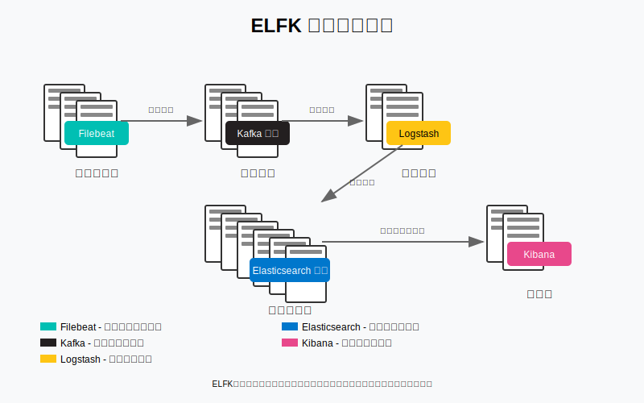

# ELFK生产集群搭建指南

## 1. ELFK架构概述

ELFK是一个强大的日志收集、处理、存储和可视化的解决方案，由以下组件组成：

- **Elasticsearch**：分布式搜索和分析引擎，用于存储和检索日志数据
- **Logstash**：数据处理管道，用于收集、转换和发送日志数据
- **Filebeat**：轻量级日志收集器，部署在各个服务器上收集日志文件
- **Kafka**：分布式消息队列，作为日志数据的缓冲层，提高系统的可靠性和扩展性
- **Kibana**：数据可视化平台，提供日志数据的搜索、分析和展示功能

在ELFK架构中，Filebeat收集日志并发送到Kafka，Logstash从Kafka消费数据并进行处理后存入Elasticsearch，最后通过Kibana进行可视化展示。



## 2. 环境准备

### 2.1 服务器规划

对于生产环境，建议至少准备以下服务器：

| 服务器角色 | 数量 | 配置建议 | 说明 |
| --- | --- | --- | --- |
| Elasticsearch主节点 | 3台 | 8核16G内存 | 负责集群管理 |
| Elasticsearch数据节点 | 3+台 | 16核32G内存，大容量SSD | 存储和检索数据 |
| Kafka集群 | 3+台 | 8核16G内存 | 消息队列 |
| Logstash服务器 | 2+台 | 8核16G内存 | 数据处理 |
| Kibana服务器 | 2台 | 4核8G内存 | 可视化界面 |

### 2.2 网络规划

- 所有服务器应该在同一内网环境
- 配置合适的防火墙规则，只开放必要的端口
- 建议使用专用网络接口用于集群内部通信

### 2.3 操作系统优化

```bash
# 修改系统限制，添加到/etc/sysctl.conf
vm.max_map_count=262144
net.core.somaxconn=32768
net.ipv4.tcp_max_syn_backlog=8192
net.ipv4.tcp_slow_start_after_idle=0
net.ipv4.tcp_tw_reuse=1
net.ipv4.ip_local_port_range=1024 65535

# 修改文件描述符限制，添加到/etc/security/limits.conf
* soft nofile 65536
* hard nofile 65536
* soft nproc 32768
* hard nproc 32768
```

## 3. Elasticsearch集群部署

### 3.1 安装Elasticsearch

我们使用Docker方式部署Elasticsearch集群。首先创建docker-compose.yml文件：

```yaml
version: '3'
services:
  es01:
    image: docker.elastic.co/elasticsearch/elasticsearch:7.17.0
    container_name: es01
    environment:
      - node.name=es01
      - cluster.name=es-cluster
      - discovery.seed_hosts=es02,es03
      - cluster.initial_master_nodes=es01,es02,es03
      - bootstrap.memory_lock=true
      - "ES_JAVA_OPTS=-Xms8g -Xmx8g"
    ulimits:
      memlock:
        soft: -1
        hard: -1
    volumes:
      - esdata01:/usr/share/elasticsearch/data
    ports:
      - 9200:9200
    networks:
      - elastic

  es02:
    image: docker.elastic.co/elasticsearch/elasticsearch:7.17.0
    container_name: es02
    environment:
      - node.name=es02
      - cluster.name=es-cluster
      - discovery.seed_hosts=es01,es03
      - cluster.initial_master_nodes=es01,es02,es03
      - bootstrap.memory_lock=true
      - "ES_JAVA_OPTS=-Xms8g -Xmx8g"
    ulimits:
      memlock:
        soft: -1
        hard: -1
    volumes:
      - esdata02:/usr/share/elasticsearch/data
    networks:
      - elastic
      
  es03:
    image: docker.elastic.co/elasticsearch/elasticsearch:7.17.0
    container_name: es03
    environment:
      - node.name=es03
      - cluster.name=es-cluster
      - discovery.seed_hosts=es01,es02
      - cluster.initial_master_nodes=es01,es02,es03
      - bootstrap.memory_lock=true
      - "ES_JAVA_OPTS=-Xms8g -Xmx8g"
    ulimits:
      memlock:
        soft: -1
        hard: -1
    volumes:
      - esdata03:/usr/share/elasticsearch/data
    networks:
      - elastic

volumes:
  esdata01:
  esdata02:
  esdata03:

networks:
  elastic:
    driver: bridge
```

启动Elasticsearch集群：

```bash
docker-compose up -d
```

### 3.2 配置Elasticsearch安全认证

```bash
# 进入容器
docker exec -it es01 bash

# 设置密码
./bin/elasticsearch-setup-passwords auto
```

记录下生成的密码，后续配置需要使用。

### 3.3 配置Elasticsearch集群

创建索引生命周期管理策略：

```bash
curl -X PUT "localhost:9200/_ilm/policy/logs-policy?pretty" -H 'Content-Type: application/json' -d'
{
  "policy": {
    "phases": {
      "hot": {
        "min_age": "0ms",
        "actions": {
          "rollover": {
            "max_age": "1d",
            "max_size": "50gb"
          },
          "set_priority": {
            "priority": 100
          }
        }
      },
      "warm": {
        "min_age": "3d",
        "actions": {
          "shrink": {
            "number_of_shards": 1
          },
          "forcemerge": {
            "max_num_segments": 1
          },
          "set_priority": {
            "priority": 50
          }
        }
      },
      "cold": {
        "min_age": "30d",
        "actions": {
          "set_priority": {
            "priority": 0
          }
        }
      },
      "delete": {
        "min_age": "90d",
        "actions": {
          "delete": {}
        }
      }
    }
  }
}'
```

创建索引模板：

```bash
curl -X PUT "localhost:9200/_template/logs-template?pretty" -H 'Content-Type: application/json' -d'
{
  "index_patterns": ["logs-*"],
  "settings": {
    "number_of_shards": 3,
    "number_of_replicas": 1,
    "index.lifecycle.name": "logs-policy",
    "index.lifecycle.rollover_alias": "logs"
  },
  "mappings": {
    "properties": {
      "@timestamp": { "type": "date" },
      "message": { "type": "text" },
      "level": { "type": "keyword" },
      "service": { "type": "keyword" },
      "host": { "type": "keyword" }
    }
  }
}'
```

## 4. Kafka集群部署

### 4.1 安装Kafka

创建docker-compose.yml文件：

```yaml
version: '3'
services:
  zookeeper-1:
    image: confluentinc/cp-zookeeper:7.0.1
    container_name: zookeeper-1
    environment:
      ZOOKEEPER_CLIENT_PORT: 2181
      ZOOKEEPER_TICK_TIME: 2000
      ZOOKEEPER_SERVER_ID: 1
      ZOOKEEPER_SERVERS: zookeeper-1:2888:3888;zookeeper-2:2888:3888;zookeeper-3:2888:3888
    ports:
      - "2181:2181"
    volumes:
      - zookeeper-1-data:/var/lib/zookeeper/data
      - zookeeper-1-log:/var/lib/zookeeper/log
    networks:
      - kafka-net

  zookeeper-2:
    image: confluentinc/cp-zookeeper:7.0.1
    container_name: zookeeper-2
    environment:
      ZOOKEEPER_CLIENT_PORT: 2181
      ZOOKEEPER_TICK_TIME: 2000
      ZOOKEEPER_SERVER_ID: 2
      ZOOKEEPER_SERVERS: zookeeper-1:2888:3888;zookeeper-2:2888:3888;zookeeper-3:2888:3888
    volumes:
      - zookeeper-2-data:/var/lib/zookeeper/data
      - zookeeper-2-log:/var/lib/zookeeper/log
    networks:
      - kafka-net

  zookeeper-3:
    image: confluentinc/cp-zookeeper:7.0.1
    container_name: zookeeper-3
    environment:
      ZOOKEEPER_CLIENT_PORT: 2181
      ZOOKEEPER_TICK_TIME: 2000
      ZOOKEEPER_SERVER_ID: 3
      ZOOKEEPER_SERVERS: zookeeper-1:2888:3888;zookeeper-2:2888:3888;zookeeper-3:2888:3888
    volumes:
      - zookeeper-3-data:/var/lib/zookeeper/data
      - zookeeper-3-log:/var/lib/zookeeper/log
    networks:
      - kafka-net

  kafka-1:
    image: confluentinc/cp-kafka:7.0.1
    container_name: kafka-1
    depends_on:
      - zookeeper-1
      - zookeeper-2
      - zookeeper-3
    ports:
      - "9092:9092"
    environment:
      KAFKA_BROKER_ID: 1
      KAFKA_ZOOKEEPER_CONNECT: zookeeper-1:2181,zookeeper-2:2181,zookeeper-3:2181
      KAFKA_ADVERTISED_LISTENERS: PLAINTEXT://kafka-1:29092,PLAINTEXT_HOST://localhost:9092
      KAFKA_LISTENER_SECURITY_PROTOCOL_MAP: PLAINTEXT:PLAINTEXT,PLAINTEXT_HOST:PLAINTEXT
      KAFKA_INTER_BROKER_LISTENER_NAME: PLAINTEXT
      KAFKA_OFFSETS_TOPIC_REPLICATION_FACTOR: 3
      KAFKA_AUTO_CREATE_TOPICS_ENABLE: "true"
    volumes:
      - kafka-1-data:/var/lib/kafka/data
    networks:
      - kafka-net

  kafka-2:
    image: confluentinc/cp-kafka:7.0.1
    container_name: kafka-2
    depends_on:
      - zookeeper-1
      - zookeeper-2
      - zookeeper-3
    ports:
      - "9093:9093"
    environment:
      KAFKA_BROKER_ID: 2
      KAFKA_ZOOKEEPER_CONNECT: zookeeper-1:2181,zookeeper-2:2181,zookeeper-3:2181
      KAFKA_ADVERTISED_LISTENERS: PLAINTEXT://kafka-2:29093,PLAINTEXT_HOST://localhost:9093
      KAFKA_LISTENER_SECURITY_PROTOCOL_MAP: PLAINTEXT:PLAINTEXT,PLAINTEXT_HOST:PLAINTEXT
      KAFKA_INTER_BROKER_LISTENER_NAME: PLAINTEXT
      KAFKA_OFFSETS_TOPIC_REPLICATION_FACTOR: 3
      KAFKA_AUTO_CREATE_TOPICS_ENABLE: "true"
    volumes:
      - kafka-2-data:/var/lib/kafka/data
    networks:
      - kafka-net

  kafka-3:
    image: confluentinc/cp-kafka:7.0.1
    container_name: kafka-3
    depends_on:
      - zookeeper-1
      - zookeeper-2
      - zookeeper-3
    ports:
      - "9094:9094"
    environment:
      KAFKA_BROKER_ID: 3
      KAFKA_ZOOKEEPER_CONNECT: zookeeper-1:2181,zookeeper-2:2181,zookeeper-3:2181
      KAFKA_ADVERTISED_LISTENERS: PLAINTEXT://kafka-3:29094,PLAINTEXT_HOST://localhost:9094
      KAFKA_LISTENER_SECURITY_PROTOCOL_MAP: PLAINTEXT:PLAINTEXT,PLAINTEXT_HOST:PLAINTEXT
      KAFKA_INTER_BROKER_LISTENER_NAME: PLAINTEXT
      KAFKA_OFFSETS_TOPIC_REPLICATION_FACTOR: 3
      KAFKA_AUTO_CREATE_TOPICS_ENABLE: "true"
    volumes:
      - kafka-3-data:/var/lib/kafka/data
    networks:
      - kafka-net

volumes:
  zookeeper-1-data:
  zookeeper-1-log:
  zookeeper-2-data:
  zookeeper-2-log:
  zookeeper-3-data:
  zookeeper-3-log:
  kafka-1-data:
  kafka-2-data:
  kafka-3-data:

networks:
  kafka-net:
    driver: bridge
```

启动Kafka集群：

```bash
docker-compose up -d
```

### 4.2 创建Kafka主题

```bash
# 进入Kafka容器
docker exec -it kafka-1 bash

# 创建日志主题，3个分区，3个副本
kafka-topics --create --topic app-logs --partitions 3 --replication-factor 3 --bootstrap-server kafka-1:29092

# 创建系统日志主题
kafka-topics --create --topic system-logs --partitions 3 --replication-factor 3 --bootstrap-server kafka-1:29092

# 查看主题列表
kafka-topics --list --bootstrap-server kafka-1:29092
```

## 5. Logstash部署

### 5.1 安装Logstash

创建Logstash配置文件 `logstash.conf`：

```conf
input {
  kafka {
    bootstrap_servers => "kafka-1:29092,kafka-2:29093,kafka-3:29094"
    topics => ["app-logs", "system-logs"]
    group_id => "logstash"
    auto_offset_reset => "latest"
    consumer_threads => 3
    decorate_events => true
  }
}

filter {
  if [kafka][topic] == "app-logs" {
    json {
      source => "message"
    }
    date {
      match => [ "timestamp", "ISO8601" ]
      target => "@timestamp"
    }
    mutate {
      remove_field => [ "timestamp" ]
    }
  } else if [kafka][topic] == "system-logs" {
    grok {
      match => { "message" => "%{SYSLOGTIMESTAMP:syslog_timestamp} %{SYSLOGHOST:syslog_hostname} %{DATA:syslog_program}(?:\[%{POSINT:syslog_pid}\])?: %{GREEDYDATA:syslog_message}" }
    }
    date {
      match => [ "syslog_timestamp", "MMM  d HH:mm:ss", "MMM dd HH:mm:ss" ]
      target => "@timestamp"
    }
  }
  
  # 添加处理节点信息
  mutate {
    add_field => { "logstash_node" => "${HOSTNAME}" }
  }
}

output {
  if [kafka][topic] == "app-logs" {
    elasticsearch {
      hosts => ["es01:9200", "es02:9200", "es03:9200"]
      user => "elastic"
      password => "${ELASTIC_PASSWORD}"
      index => "app-logs-%{+YYYY.MM.dd}"
      ilm_enabled => true
      ilm_rollover_alias => "app-logs"
      ilm_pattern => "{now/d}-000001"
      ilm_policy => "logs-policy"
    }
  } else if [kafka][topic] == "system-logs" {
    elasticsearch {
      hosts => ["es01:9200", "es02:9200", "es03:9200"]
      user => "elastic"
      password => "${ELASTIC_PASSWORD}"
      index => "system-logs-%{+YYYY.MM.dd}"
      ilm_enabled => true
      ilm_rollover_alias => "system-logs"
      ilm_pattern => "{now/d}-000001"
      ilm_policy => "logs-policy"
    }
  }
}
```

创建docker-compose.yml文件：

```yaml
version: '3'
services:
  logstash:
    image: docker.elastic.co/logstash/logstash:7.17.0
    container_name: logstash
    volumes:
      - ./logstash.conf:/usr/share/logstash/pipeline/logstash.conf:ro
      - ./logstash.yml:/usr/share/logstash/config/logstash.yml:ro
    environment:
      LS_JAVA_OPTS: "-Xmx1g -Xms1g"
      ELASTIC_PASSWORD: "your_elastic_password"
    networks:
      - elastic
      - kafka-net

networks:
  elastic:
    external: true
  kafka-net:
    external: true
```

创建logstash.yml配置文件：

```yaml
http.host: "0.0.0.0"
xpack.monitoring.elasticsearch.hosts: ["http://es01:9200", "http://es02:9200", "http://es03:9200"]
xpack.monitoring.elasticsearch.username: elastic
xpack.monitoring.elasticsearch.password: ${ELASTIC_PASSWORD}
xpack.monitoring.enabled: true
pipeline.workers: 4
pipeline.batch.size: 1000
pipeline.batch.delay: 50
queue.type: persisted
queue.max_bytes: 1gb
```

启动Logstash：

```bash
docker-compose up -d
```

## 6. Filebeat部署

### 6.1 创建Filebeat配置

创建filebeat.yml配置文件：

```yaml
filebeat.inputs:
- type: log
  enabled: true
  paths:
    - /var/log/app/*.log
  fields:
    log_type: app
  fields_under_root: true
  json.keys_under_root: true
  json.message_key: log
  json.add_error_key: true

- type: log
  enabled: true
  paths:
    - /var/log/system/*.log
  fields:
    log_type: system
  fields_under_root: true

processors:
- add_host_metadata: ~
- add_cloud_metadata: ~

output.kafka:
  hosts: ["kafka-1:29092", "kafka-2:29093", "kafka-3:29094"]
  topic: '%{[log_type]}-logs'
  partition.round_robin:
    reachable_only: false
  required_acks: 1
  compression: gzip
  max_message_bytes: 1000000

logging.level: info
logging.to_files: true
logging.files:
  path: /var/log/filebeat
  name: filebeat
  keepfiles: 7
  permissions: 0644
```

### 6.2 部署Filebeat到应用服务器

创建docker-compose.yml文件：

```yaml
version: '3'
services:
  filebeat:
    image: docker.elastic.co/beats/filebeat:7.17.0
    container_name: filebeat
    user: root
    volumes:
      - ./filebeat.yml:/usr/share/filebeat/filebeat.yml:ro
      - /var/log:/var/log:ro
      - /var/lib/docker/containers:/var/lib/docker/containers:ro
      - /var/run/docker.sock:/var/run/docker.sock:ro
    environment:
      - strict.perms=false
    networks:
      - kafka-net

networks:
  kafka-net:
    external: true
```

启动Filebeat：

```bash
docker-compose up -d
```

## 7. Kibana部署

### 7.1 安装Kibana

创建docker-compose.yml文件：

```yaml
version: '3'
services:
  kibana:
    image: docker.elastic.co/kibana/kibana:7.17.0
    container_name: kibana
    environment:
      ELASTICSEARCH_HOSTS: '"http://es01:9200","http://es02:9200","http://es03:9200"'
      ELASTICSEARCH_USERNAME: elastic
      ELASTICSEARCH_PASSWORD: "your_elastic_password"
    ports:
      - 5601:5601
    networks:
      - elastic

networks:
  elastic:
    external: true
```

启动Kibana：

```bash
docker-compose up -d
```

### 7.2 配置Kibana仪表板

1. 访问Kibana界面：`http://your-kibana-host:5601`
2. 创建索引模式：
   - 导航到 Management > Stack Management > Kibana > Index Patterns
   - 创建索引模式 `app-logs-*` 和 `system-logs-*`
   - 设置时间字段为 `@timestamp`
3. 创建可视化和仪表板：
   - 导航到 Dashboard
   - 创建新仪表板
   - 添加各种可视化组件，如日志计数、错误率、响应时间等

## 8. 系统监控与告警

### 8.1 设置Elasticsearch监控

```bash
curl -X PUT "localhost:9200/_cluster/settings" -H 'Content-Type: application/json' -d'
{
  "persistent": {
    "xpack.monitoring.collection.enabled": true
  }
}'
```

### 8.2 配置Kibana告警

1. 导航到 Management > Stack Management > Alerts and Insights > Rules
2. 创建新规则，例如：
   - 当错误日志数量在5分钟内超过100条时发送告警
   - 当集群健康状态变为黄色或红色时发送告警
   - 当磁盘使用率超过85%时发送告警

### 8.3 配置通知渠道

1. 导航到 Management > Stack Management > Alerts and Insights > Connectors
2. 添加通知渠道，如Email、Slack、WebHook等

## 9. 性能优化

### 9.1 Elasticsearch性能优化

```yaml
# 添加到elasticsearch.yml
indices.memory.index_buffer_size: 30%
indices.queries.cache.size: 10%
thread_pool.write.queue_size: 1000
thread_pool.search.queue_size: 1000
```

### 9.2 Kafka性能优化

```properties
# 添加到server.properties
num.io.threads=16
num.network.threads=8
socket.send.buffer.bytes=1048576
socket.receive.buffer.bytes=1048576
socket.request.max.bytes=104857600
log.flush.interval.messages=10000
log.flush.interval.ms=1000
log.retention.hours=168
log.segment.bytes=1073741824
log.cleaner.enable=true
```

### 9.3 Logstash性能优化

```yaml
# 添加到logstash.yml
pipeline.workers: 8
pipeline.batch.size: 2000
pipeline.batch.delay: 50
queue.type: persisted
queue.max_bytes: 2gb
```

## 10. 备份与恢复策略

### 10.1 Elasticsearch快照备份

```bash
# 注册快照仓库
curl -X PUT "localhost:9200/_snapshot/backup_repo" -H 'Content-Type: application/json' -d'
{
  "type": "fs",
  "settings": {
    "location": "/usr/share/elasticsearch/backup"
  }
}'

# 创建快照
curl -X PUT "localhost:9200/_snapshot/backup_repo/snapshot_1?wait_for_completion=true"
```

### 10.2 自动备份脚本

```bash
#!/bin/bash

DATE=$(date +%Y%m%d)
SNAPSHOT_NAME="snapshot_${DATE}"

# 创建快照
curl -X PUT "http://localhost:9200/_snapshot/backup_repo/${SNAPSHOT_NAME}?wait_for_completion=true" -H 'Content-Type: application/json' -d'
{
  "indices": "*",
  "ignore_unavailable": true,
  "include_global_state": true
}'

# 删除7天前的快照
OLD_DATE=$(date -d "7 days ago" +%Y%m%d)
OLD_SNAPSHOT="snapshot_${OLD_DATE}"
curl -X DELETE "http://localhost:9200/_snapshot/backup_repo/${OLD_SNAPSHOT}"
```

## 11. 故障排除

### 11.1 常见问题及解决方案

1. **Elasticsearch集群状态为黄色或红色**
   - 检查节点是否正常运行
   - 检查磁盘空间
   - 查看日志文件中的错误信息

2. **Kafka消息积压**
   - 增加Logstash实例数量
   - 优化Logstash配置，提高处理效率
   - 检查Elasticsearch写入性能

3. **Filebeat无法发送日志到Kafka**
   - 检查网络连接
   - 验证Kafka集群状态
   - 查看Filebeat日志

### 11.2 日志分析命令

```bash
# 查看Elasticsearch集群健康状态
curl -X GET "localhost:9200/_cluster/health?pretty"

# 查看Elasticsearch索引状态
curl -X GET "localhost:9200/_cat/indices?v"

# 查看Kafka消费组状态
kafka-consumer-groups --bootstrap-server kafka-1:29092 --describe --group logstash

# 查看Logstash处理延迟
curl -X GET "localhost:9600/_node/stats/pipeline?pretty"
```

## 12. 扩展与升级

### 12.1 扩展Elasticsearch集群

1. 准备新节点，安装Elasticsearch
2. 配置与现有集群相同的集群名称
3. 设置discovery.seed_hosts指向现有节点
4. 启动新节点，它将自动加入集群

### 12.2 升级ELFK组件

升级Elasticsearch：

1. 备份数据
2. 逐个节点升级，先升级从节点，最后升级主节点
3. 每次升级后验证集群健康状态

升级Kafka：

1. 逐个升级Kafka broker
2. 确保每个broker升级后正常工作再升级下一个

升级Logstash和Filebeat：

1. 升级配置文件以兼容新版本
2. 逐个升级实例

## 13. 安全加固

### 13.1 网络安全

1. 使用专用网络隔离ELFK集群
2. 配置防火墙，只允许必要的端口访问
3. 使用TLS加密集群内部通信

### 13.2 认证与授权

1. 启用Elasticsearch安全功能
2. 创建不同角色的用户，遵循最小权限原则
3. 使用API密钥进行服务间认证

### 13.3 数据安全

1. 启用传输和存储加密
2. 实施数据脱敏，保护敏感信息
3. 定期审计访问日志

## 14. 总结

本文详细介绍了如何搭建生产级ELFK集群，包括：

- Elasticsearch集群部署与配置
- Kafka集群部署与主题创建
- Logstash配置与优化
- Filebeat部署到应用服务器
- Kibana安装与仪表板配置
- 系统监控与告警设置
- 性能优化建议
- 备份与恢复策略
- 故障排除指南
- 扩展与升级方法
- 安全加固措施

通过遵循本指南，您可以构建一个高可用、高性能、安全可靠的ELFK日志系统，为应用程序提供强大的日志收集、处理、存储和分析能力。
