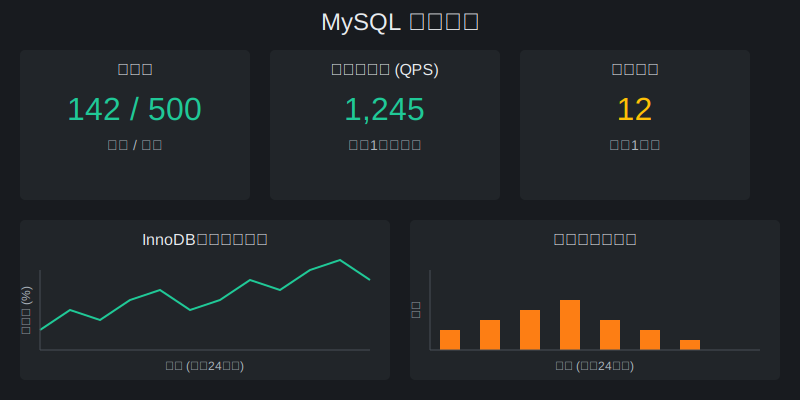
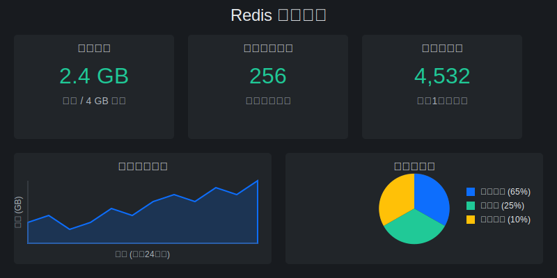
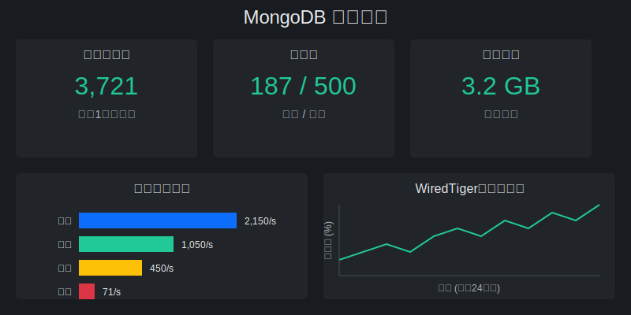

> 点击勘误[issues](https://github.com/webVueBlog/JavaPlusDoc/issues)，哪吒感谢大家的阅读


## Grafana监控MySQL、Redis和MongoDB

本文将介绍如何使用Grafana配置MySQL、Redis和MongoDB的监控面板，实现对这些关键数据库的实时监控和性能分析。

### 前提条件

在开始之前，请确保您已经按照[安装监控grafana](./grafana.md)文档完成了Grafana和Prometheus的基础安装。

### 1. MySQL监控配置

#### 1.1 安装MySQL Exporter

首先，我们需要安装MySQL Exporter，它能够收集MySQL的性能指标并暴露给Prometheus。

在docker-compose.yml文件中添加以下配置：

```yaml
mysql-exporter:
  image: prom/mysqld-exporter:latest
  container_name: "mysql-exporter"
  ports:
    - "9104:9104"
  environment:
    - DATA_SOURCE_NAME=用户名:密码@(MySQL主机地址:3306)/
  restart: always
```

#### 1.2 更新Prometheus配置

在prometheus.yml文件中添加MySQL监控配置：

```yaml
- job_name: 'mysql'
  scrape_interval: 5s
  static_configs:
    - targets: ['mysql-exporter:9104']
```

#### 1.3 导入MySQL监控面板

1. 登录Grafana界面（默认地址：http://your-server-ip:3000）
2. 点击左侧菜单的 "+" 按钮，选择 "Import"
3. 输入面板ID：7362（MySQL Overview）或 11323（MySQL InnoDB Metrics）
4. 在数据源下拉菜单中选择您的Prometheus数据源
5. 点击 "Import" 完成导入

#### 1.4 MySQL监控关键指标

- **连接数**：当前活动连接数和最大连接数
- **查询性能**：QPS（每秒查询数）、慢查询数
- **InnoDB指标**：缓冲池使用率、读写操作
- **表锁定**：锁等待次数和时间
- **网络流量**：接收和发送的字节数

### 2. Redis监控配置

#### 2.1 安装Redis Exporter

在docker-compose.yml文件中添加以下配置：

```yaml
redis-exporter:
  image: oliver006/redis_exporter:latest
  container_name: "redis-exporter"
  ports:
    - "9121:9121"
  environment:
    - REDIS_ADDR=redis://Redis主机地址:6379
    - REDIS_PASSWORD=您的Redis密码
  restart: always
```

#### 2.2 更新Prometheus配置

在prometheus.yml文件中添加Redis监控配置：

```yaml
- job_name: 'redis'
  scrape_interval: 5s
  static_configs:
    - targets: ['redis-exporter:9121']
```

#### 2.3 导入Redis监控面板

1. 登录Grafana界面
2. 点击左侧菜单的 "+" 按钮，选择 "Import"
3. 输入面板ID：763（Redis Dashboard for Prometheus Redis Exporter）
4. 在数据源下拉菜单中选择您的Prometheus数据源
5. 点击 "Import" 完成导入

#### 2.4 Redis监控关键指标

- **内存使用**：已用内存、内存碎片率
- **连接数**：客户端连接数、被拒绝的连接
- **命令执行**：每秒执行的命令数、命令延迟
- **键空间**：键总数、过期键数、被驱逐键数
- **持久化**：RDB保存状态、AOF重写状态

### 3. MongoDB监控配置

#### 3.1 安装MongoDB Exporter

在docker-compose.yml文件中添加以下配置：

```yaml
mongodb-exporter:
  image: percona/mongodb_exporter:latest
  container_name: "mongodb-exporter"
  ports:
    - "9216:9216"
  command:
    - '--mongodb.uri=mongodb://用户名:密码@MongoDB主机地址:27017'
  restart: always
```

#### 3.2 更新Prometheus配置

在prometheus.yml文件中添加MongoDB监控配置：

```yaml
- job_name: 'mongodb'
  scrape_interval: 5s
  static_configs:
    - targets: ['mongodb-exporter:9216']
```

#### 3.3 导入MongoDB监控面板

1. 登录Grafana界面
2. 点击左侧菜单的 "+" 按钮，选择 "Import"
3. 输入面板ID：7353（MongoDB Overview）
4. 在数据源下拉菜单中选择您的Prometheus数据源
5. 点击 "Import" 完成导入

#### 3.4 MongoDB监控关键指标

- **操作性能**：查询、插入、更新、删除操作的数量和延迟
- **连接数**：当前连接数、可用连接数
- **内存使用**：虚拟内存、常驻内存
- **WiredTiger缓存**：读/写操作、缓存使用率
- **复制集状态**：主从延迟、选举状态

### 4. 完整的docker-compose.yml示例

以下是包含所有三个数据库监控的完整docker-compose.yml示例：

```yaml
version: "3.7"
services:
 node-exporter:
   image: prom/node-exporter:latest
   container_name: "node-exporter0"
   ports:
     - "9100:9100"
   restart: always
 prometheus:
   image: prom/prometheus:latest
   container_name: "prometheus0"
   restart: always
   ports:
     - "9090:9090"
   volumes:
     - "./prometheus.yml:/etc/prometheus/prometheus.yml"
     - "./prometheus_data:/prometheus"
 grafana:
   image: grafana/grafana
   container_name: "grafana0"
   ports:
     - "3000:3000"
   restart: always
   volumes:
     - "./grafana_data:/var/lib/grafana"
 mysql-exporter:
   image: prom/mysqld-exporter:latest
   container_name: "mysql-exporter"
   ports:
     - "9104:9104"
   environment:
     - DATA_SOURCE_NAME=用户名:密码@(MySQL主机地址:3306)/
   restart: always
 redis-exporter:
   image: oliver006/redis_exporter:latest
   container_name: "redis-exporter"
   ports:
     - "9121:9121"
   environment:
     - REDIS_ADDR=redis://Redis主机地址:6379
     - REDIS_PASSWORD=您的Redis密码
   restart: always
 mongodb-exporter:
   image: percona/mongodb_exporter:latest
   container_name: "mongodb-exporter"
   ports:
     - "9216:9216"
   command:
     - '--mongodb.uri=mongodb://用户名:密码@MongoDB主机地址:27017'
   restart: always
```

### 5. 完整的prometheus.yml示例

```yaml
global:
  scrape_interval:     15s # 默认抓取周期
  external_labels:
    monitor: 'codelab-monitor'
scrape_configs:
  - job_name: 'node-exporter' #服务的名称
    scrape_interval: 5s
    metrics_path: /metrics  #获取指标的url
    static_configs:
      - targets: ['192.168.0.221:9100'] # 主机监控

  - job_name: 'electricity' #服务的名称
    scrape_interval: 5s
    metrics_path: /actuator/prometheus  #获取指标的url
    static_configs:
      - targets: ['192.168.0.130:28097'] # 应用监控
      
  - job_name: 'mysql'
    scrape_interval: 5s
    static_configs:
      - targets: ['mysql-exporter:9104']
      
  - job_name: 'redis'
    scrape_interval: 5s
    static_configs:
      - targets: ['redis-exporter:9121']
      
  - job_name: 'mongodb'
    scrape_interval: 5s
    static_configs:
      - targets: ['mongodb-exporter:9216']
```

### 6. 监控面板效果展示

#### MySQL监控面板



#### Redis监控面板



#### MongoDB监控面板



### 7. 告警配置

除了可视化监控外，Grafana还支持设置告警规则，当指标超过阈值时发送通知。以下是一些常用的告警配置示例：

#### MySQL告警示例

- 当连接数超过最大连接数的80%时告警
- 当慢查询数每分钟超过10次时告警
- 当InnoDB缓冲池使用率低于20%时告警

#### Redis告警示例

- 当内存使用率超过90%时告警
- 当被拒绝的连接数大于0时告警
- 当键被驱逐的速率超过每秒100个时告警

#### MongoDB告警示例

- 当连接数超过最大连接数的80%时告警
- 当查询延迟超过100ms时告警
- 当复制集延迟超过10秒时告警

### 8. 故障排查

如果您在配置过程中遇到问题，可以尝试以下故障排查步骤：

1. 检查各个Exporter的日志，确保它们能够正常连接到数据库
2. 访问Prometheus的targets页面（http://your-server-ip:9090/targets），确保所有目标都处于UP状态
3. 检查防火墙设置，确保Prometheus能够访问各个Exporter的端口
4. 验证数据库用户是否具有足够的权限来收集监控指标

### 9. 最佳实践

- 为敏感信息（如数据库密码）使用环境变量或Docker secrets
- 根据实际需求调整scrape_interval，频繁的抓取会增加数据库负载
- 为重要指标设置告警，并配置合适的通知渠道（如邮件、Slack、钉钉等）
- 定期清理Prometheus的历史数据，避免磁盘空间耗尽
- 为Grafana设置访问控制，防止未授权访问

通过以上配置，您可以全面监控MySQL、Redis和MongoDB的性能指标，及时发现潜在问题，保障系统的稳定运行。