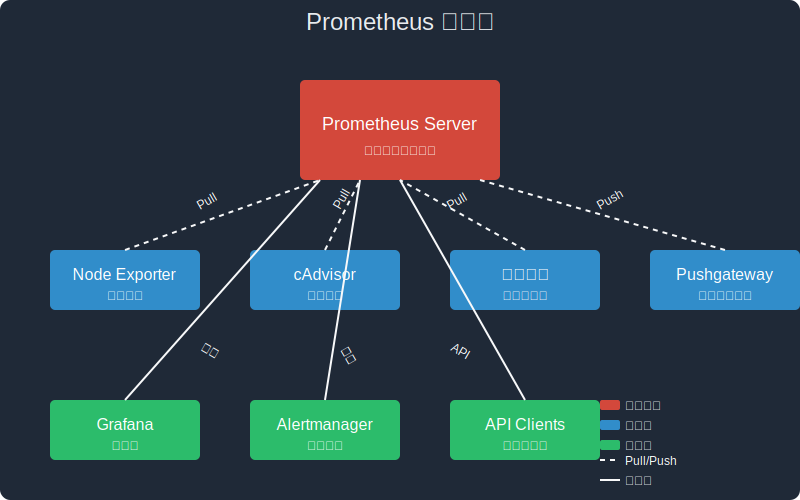

> 点击勘误[issues](https://github.com/webVueBlog/JavaPlusDoc/issues)，哪吒感谢大家的阅读


## Prometheus单机部署

本文将介绍如何在单机环境中部署Prometheus监控系统，实现对服务器和应用的全面监控。

### 1. Prometheus简介

#### 1.1 什么是Prometheus

Prometheus是一个开源的系统监控和告警工具包，最初由SoundCloud开发，现在已经成为Cloud Native Computing Foundation（CNCF）的第二个项目（Kubernetes之后）。Prometheus具有以下特点：

- **多维数据模型**：由指标名称和键值对标签组成的时间序列数据
- **强大的查询语言PromQL**：可以对收集的时间序列数据进行切片和切块
- **不依赖分布式存储**：单个服务器节点是自治的
- **基于HTTP的pull模式**：通过HTTP协议从目标处拉取指标数据
- **支持推送模式**：通过中间网关支持推送模式
- **通过服务发现或静态配置发现目标**
- **多种图形和仪表盘支持**：可与Grafana等工具集成

#### 1.2 Prometheus架构



Prometheus的核心组件包括：

- **Prometheus Server**：负责抓取和存储时间序列数据
- **Client Libraries**：用于检测应用程序代码
- **Pushgateway**：支持短期作业的指标推送
- **Exporters**：为第三方系统提供指标数据
- **Alertmanager**：处理告警
- **可视化工具**：如Grafana等

### 2. 环境准备

#### 2.1 系统要求

- 操作系统：Linux（推荐CentOS 7+/Ubuntu 18.04+）或Windows Server
- 内存：至少2GB RAM（建议4GB以上）
- CPU：至少2核
- 磁盘：根据数据保留策略，建议至少50GB可用空间
- Docker：18.09.0或更高版本
- Docker Compose：1.24.0或更高版本

#### 2.2 安装Docker和Docker Compose

如果您尚未安装Docker和Docker Compose，请参考[安装监控grafana](./grafana.md)文档中的相关章节进行安装。

### 3. 使用Docker Compose部署Prometheus

#### 3.1 创建项目目录

```bash
mkdir -p /home/docker/prometheus
mkdir -p /home/docker/prometheus/prometheus_data
mkdir -p /home/docker/prometheus/alertmanager_data
chmod 777 /home/docker/prometheus/prometheus_data
chmod 777 /home/docker/prometheus/alertmanager_data
cd /home/docker/prometheus
```

#### 3.2 创建Prometheus配置文件

创建`prometheus.yml`文件：

```bash
cat > /home/docker/prometheus/prometheus.yml << 'EOF'
global:
  scrape_interval: 15s  # 默认抓取间隔，15秒向目标抓取一次数据
  evaluation_interval: 15s  # 执行规则的频率，15秒执行一次规则
  scrape_timeout: 10s  # 抓取超时时间

  # 附加到所有时间序列或警报的外部标签
  external_labels:
    monitor: 'prometheus-standalone'

# Alertmanager配置
alerting:
  alertmanagers:
    - static_configs:
        - targets: ['alertmanager:9093']

# 告警规则文件列表
rule_files:
  - "rules/*.yml"

# 抓取配置
scrape_configs:
  # 监控Prometheus本身
  - job_name: 'prometheus'
    static_configs:
      - targets: ['localhost:9090']

  # 监控主机节点
  - job_name: 'node-exporter'
    static_configs:
      - targets: ['node-exporter:9100']

  # 监控Docker容器
  - job_name: 'cadvisor'
    static_configs:
      - targets: ['cadvisor:8080']

  # 监控Alertmanager
  - job_name: 'alertmanager'
    static_configs:
      - targets: ['alertmanager:9093']

  # 示例：监控Spring Boot应用
  # - job_name: 'spring-boot-app'
  #   metrics_path: '/actuator/prometheus'
  #   scrape_interval: 5s
  #   static_configs:
  #     - targets: ['host.docker.internal:8080']

  # 示例：监控MySQL
  # - job_name: 'mysql'
  #   static_configs:
  #     - targets: ['mysql-exporter:9104']

  # 示例：监控Redis
  # - job_name: 'redis'
  #   static_configs:
  #     - targets: ['redis-exporter:9121']
EOF
```

#### 3.3 创建告警规则目录和示例规则

```bash
mkdir -p /home/docker/prometheus/rules

cat > /home/docker/prometheus/rules/node_alerts.yml << 'EOF'
groups:
- name: node_alerts
  rules:
  - alert: HighCPULoad
    expr: 100 - (avg by(instance) (irate(node_cpu_seconds_total{mode="idle"}[5m])) * 100) > 80
    for: 5m
    labels:
      severity: warning
    annotations:
      summary: "High CPU load (instance {{ $labels.instance }})"
      description: "CPU load is > 80%\n  VALUE = {{ $value }}\n  LABELS: {{ $labels }}"

  - alert: HighMemoryLoad
    expr: (node_memory_MemTotal_bytes - node_memory_MemFree_bytes - node_memory_Buffers_bytes - node_memory_Cached_bytes) / node_memory_MemTotal_bytes * 100 > 80
    for: 5m
    labels:
      severity: warning
    annotations:
      summary: "High memory load (instance {{ $labels.instance }})"
      description: "Memory load is > 80%\n  VALUE = {{ $value }}\n  LABELS: {{ $labels }}"

  - alert: HighDiskUsage
    expr: (node_filesystem_size_bytes{fstype!="tmpfs"} - node_filesystem_free_bytes{fstype!="tmpfs"}) / node_filesystem_size_bytes{fstype!="tmpfs"} * 100 > 80
    for: 5m
    labels:
      severity: warning
    annotations:
      summary: "High disk usage (instance {{ $labels.instance }})"
      description: "Disk usage is > 80%\n  VALUE = {{ $value }}\n  LABELS: {{ $labels }}"
EOF
```

#### 3.4 创建Alertmanager配置文件

```bash
cat > /home/docker/prometheus/alertmanager.yml << 'EOF'
global:
  resolve_timeout: 5m

route:
  group_by: ['alertname']
  group_wait: 30s
  group_interval: 5m
  repeat_interval: 1h
  receiver: 'web.hook'
  routes:
  - match:
      severity: critical
    receiver: 'web.hook'
    continue: true

receivers:
- name: 'web.hook'
  webhook_configs:
  - url: 'http://127.0.0.1:5001/'
    send_resolved: true

# 示例：邮件告警配置
# - name: 'email'
#   email_configs:
#   - to: 'your-email@example.com'
#     from: 'alertmanager@example.com'
#     smarthost: 'smtp.example.com:587'
#     auth_username: 'alertmanager@example.com'
#     auth_password: 'password'
#     auth_identity: 'alertmanager@example.com'
#     auth_secret: 'password'

# 示例：企业微信告警配置
# - name: 'wechat'
#   wechat_configs:
#   - corp_id: 'your-corp-id'
#     api_url: 'https://qyapi.weixin.qq.com/cgi-bin/'
#     api_secret: 'your-api-secret'
#     to_party: 'your-party-id'
#     agent_id: 'your-agent-id'
#     message: '{{ template "wechat.default.message" . }}'

inhibit_rules:
  - source_match:
      severity: 'critical'
    target_match:
      severity: 'warning'
    equal: ['alertname', 'dev', 'instance']
EOF
```

#### 3.5 创建Docker Compose配置文件

```bash
cat > /home/docker/prometheus/docker-compose.yml << 'EOF'
version: '3.8'

services:
  prometheus:
    image: prom/prometheus:latest
    container_name: prometheus
    volumes:
      - ./prometheus.yml:/etc/prometheus/prometheus.yml
      - ./rules:/etc/prometheus/rules
      - ./prometheus_data:/prometheus
    command:
      - '--config.file=/etc/prometheus/prometheus.yml'
      - '--storage.tsdb.path=/prometheus'
      - '--storage.tsdb.retention.time=15d'
      - '--web.console.libraries=/etc/prometheus/console_libraries'
      - '--web.console.templates=/etc/prometheus/consoles'
      - '--web.enable-lifecycle'
    ports:
      - "9090:9090"
    restart: always
    networks:
      - monitoring

  alertmanager:
    image: prom/alertmanager:latest
    container_name: alertmanager
    volumes:
      - ./alertmanager.yml:/etc/alertmanager/alertmanager.yml
      - ./alertmanager_data:/alertmanager
    command:
      - '--config.file=/etc/alertmanager/alertmanager.yml'
      - '--storage.path=/alertmanager'
    ports:
      - "9093:9093"
    restart: always
    networks:
      - monitoring

  node-exporter:
    image: prom/node-exporter:latest
    container_name: node-exporter
    volumes:
      - /proc:/host/proc:ro
      - /sys:/host/sys:ro
      - /:/rootfs:ro
    command:
      - '--path.procfs=/host/proc'
      - '--path.sysfs=/host/sys'
      - '--collector.filesystem.ignored-mount-points=^/(sys|proc|dev|host|etc)($$|/)'
    ports:
      - "9100:9100"
    restart: always
    networks:
      - monitoring

  cadvisor:
    image: gcr.io/cadvisor/cadvisor:latest
    container_name: cadvisor
    volumes:
      - /:/rootfs:ro
      - /var/run:/var/run:rw
      - /sys:/sys:ro
      - /var/lib/docker/:/var/lib/docker:ro
    ports:
      - "8080:8080"
    restart: always
    networks:
      - monitoring

  grafana:
    image: grafana/grafana:latest
    container_name: grafana
    volumes:
      - ./grafana_data:/var/lib/grafana
    environment:
      - GF_SECURITY_ADMIN_PASSWORD=admin
      - GF_USERS_ALLOW_SIGN_UP=false
    ports:
      - "3000:3000"
    restart: always
    networks:
      - monitoring

networks:
  monitoring:
    driver: bridge

volumes:
  prometheus_data:
  alertmanager_data:
  grafana_data:
EOF
```

#### 3.6 启动服务

```bash
cd /home/docker/prometheus
docker-compose up -d
```

### 4. 访问Prometheus和Grafana

#### 4.1 访问Prometheus Web界面

在浏览器中访问：`http://your-server-ip:9090`


#### 4.2 访问Grafana

在浏览器中访问：`http://your-server-ip:3000`

默认用户名：`admin`
默认密码：`admin`

首次登录会要求修改密码。

### 5. 配置Grafana数据源和仪表板

#### 5.1 添加Prometheus数据源

1. 登录Grafana
2. 点击左侧菜单的「Configuration」（齿轮图标）
3. 选择「Data Sources」
4. 点击「Add data source」
5. 选择「Prometheus」
6. 在URL字段中输入：`http://prometheus:9090`
7. 点击「Save & Test」确保连接成功

#### 5.2 导入仪表板

Grafana提供了许多预配置的仪表板，您可以导入这些仪表板来监控不同的系统和应用。

1. 点击左侧菜单的「+」图标
2. 选择「Import」
3. 输入以下仪表板ID之一：
   - 1860：Node Exporter Full（主机监控）
   - 893：Docker and system monitoring（Docker监控）
   - 12900：Cadvisor Exporter（容器监控）
   - 9578：Prometheus 2.0 Overview（Prometheus自身监控）
4. 点击「Load」
5. 在「Prometheus」数据源下拉菜单中选择您刚才添加的Prometheus数据源
6. 点击「Import」

### 6. 监控自定义应用

#### 6.1 监控Spring Boot应用

1. 在Spring Boot应用中添加依赖：

```xml
<dependency>
    <groupId>org.springframework.boot</groupId>
    <artifactId>spring-boot-starter-actuator</artifactId>
</dependency>
<dependency>
    <groupId>io.micrometer</groupId>
    <artifactId>micrometer-registry-prometheus</artifactId>
</dependency>
```

2. 在`application.properties`中添加配置：

```properties
management.endpoints.web.exposure.include=prometheus,health,info
management.endpoint.prometheus.enabled=true
management.metrics.export.prometheus.enabled=true
```

3. 修改Prometheus配置文件，添加Spring Boot应用的监控配置：

```yaml
- job_name: 'spring-boot-app'
  metrics_path: '/actuator/prometheus'
  scrape_interval: 5s
  static_configs:
    - targets: ['host.docker.internal:8080']
```

4. 重新加载Prometheus配置：

```bash
curl -X POST http://localhost:9090/-/reload
```

#### 6.2 监控MySQL

1. 添加MySQL Exporter到docker-compose.yml：

```yaml
mysql-exporter:
  image: prom/mysqld-exporter:latest
  container_name: mysql-exporter
  environment:
    - DATA_SOURCE_NAME=user:password@(mysql:3306)/
  ports:
    - "9104:9104"
  restart: always
  networks:
    - monitoring
```

2. 修改Prometheus配置文件，添加MySQL监控配置：

```yaml
- job_name: 'mysql'
  static_configs:
    - targets: ['mysql-exporter:9104']
```

3. 重新加载配置

#### 6.3 监控Redis

1. 添加Redis Exporter到docker-compose.yml：

```yaml
redis-exporter:
  image: oliver006/redis_exporter:latest
  container_name: redis-exporter
  environment:
    - REDIS_ADDR=redis:6379
  ports:
    - "9121:9121"
  restart: always
  networks:
    - monitoring
```

2. 修改Prometheus配置文件，添加Redis监控配置：

```yaml
- job_name: 'redis'
  static_configs:
    - targets: ['redis-exporter:9121']
```

3. 重新加载配置

### 7. 配置告警通知

#### 7.1 配置邮件告警

修改alertmanager.yml文件，添加邮件告警配置：

```yaml
receivers:
- name: 'email'
  email_configs:
  - to: 'your-email@example.com'
    from: 'alertmanager@example.com'
    smarthost: 'smtp.example.com:587'
    auth_username: 'alertmanager@example.com'
    auth_password: 'password'
    auth_identity: 'alertmanager@example.com'
    auth_secret: 'password'
```

#### 7.2 配置企业微信告警

修改alertmanager.yml文件，添加企业微信告警配置：

```yaml
receivers:
- name: 'wechat'
  wechat_configs:
  - corp_id: 'your-corp-id'
    api_url: 'https://qyapi.weixin.qq.com/cgi-bin/'
    api_secret: 'your-api-secret'
    to_party: 'your-party-id'
    agent_id: 'your-agent-id'
    message: '{{ template "wechat.default.message" . }}'
```

#### 7.3 配置钉钉告警

1. 安装钉钉告警适配器：

```yaml
dingtalk-webhook:
  image: timonwong/prometheus-webhook-dingtalk:latest
  container_name: dingtalk-webhook
  ports:
    - "8060:8060"
  volumes:
    - ./dingtalk-config.yml:/etc/prometheus-webhook-dingtalk/config.yml
  restart: always
  networks:
    - monitoring
```

2. 创建钉钉配置文件：

```yaml
# dingtalk-config.yml
targets:
  webhook1:
    url: https://oapi.dingtalk.com/robot/send?access_token=xxxxxxxxxxxx
    secret: SEC000000000000000000000
```

3. 修改alertmanager.yml，添加钉钉告警配置：

```yaml
receivers:
- name: 'dingtalk'
  webhook_configs:
  - url: 'http://dingtalk-webhook:8060/dingtalk/webhook1/send'
    send_resolved: true
```

### 8. 性能优化

#### 8.1 Prometheus存储优化

修改Prometheus启动参数，优化存储性能：

```yaml
command:
  - '--config.file=/etc/prometheus/prometheus.yml'
  - '--storage.tsdb.path=/prometheus'
  - '--storage.tsdb.retention.time=15d'  # 数据保留时间
  - '--storage.tsdb.retention.size=10GB'  # 数据保留大小
  - '--storage.tsdb.wal-compression'  # 启用WAL压缩
  - '--web.enable-lifecycle'
```

#### 8.2 抓取频率优化

根据实际需求调整抓取频率，减少资源消耗：

```yaml
global:
  scrape_interval: 30s  # 默认抓取间隔调整为30秒

scrape_configs:
  - job_name: 'critical-service'  # 关键服务使用更频繁的抓取
    scrape_interval: 5s
    static_configs:
      - targets: ['critical-service:8080']
```

### 9. 安全加固

#### 9.1 启用基本认证

1. 创建密码文件：

```bash
htpasswd -c /home/docker/prometheus/web.htpasswd admin
```

2. 修改Prometheus配置：

```yaml
prometheus:
  image: prom/prometheus:latest
  container_name: prometheus
  volumes:
    - ./prometheus.yml:/etc/prometheus/prometheus.yml
    - ./web.htpasswd:/etc/prometheus/web.htpasswd
  command:
    - '--config.file=/etc/prometheus/prometheus.yml'
    - '--web.config.file=/etc/prometheus/web.yml'
```

3. 创建web.yml文件：

```yaml
basic_auth_users:
  admin: "$2y$10$..."  # 密码哈希值
```

#### 9.2 使用反向代理

使用Nginx作为反向代理，提供额外的安全层：

```nginx
server {
    listen 80;
    server_name prometheus.example.com;

    location / {
        proxy_pass http://localhost:9090;
        proxy_set_header Host $host;
        proxy_set_header X-Real-IP $remote_addr;
        auth_basic "Prometheus";
        auth_basic_user_file /etc/nginx/htpasswd;
    }
}
```

### 10. 故障排查

#### 10.1 检查Prometheus状态

```bash
# 查看Prometheus容器日志
docker logs prometheus

# 检查Prometheus目标状态
curl http://localhost:9090/api/v1/targets | jq .
```

#### 10.2 检查Alertmanager状态

```bash
# 查看Alertmanager容器日志
docker logs alertmanager

# 检查Alertmanager状态
curl http://localhost:9093/api/v1/status | jq .
```

#### 10.3 常见问题解决

1. **无法抓取目标**：检查网络连接、防火墙设置和目标服务是否正常运行
2. **数据存储问题**：检查磁盘空间和权限
3. **告警未触发**：检查告警规则和Alertmanager配置
4. **Grafana无法连接Prometheus**：检查网络和数据源配置

### 11. 备份和恢复

#### 11.1 备份Prometheus数据

```bash
# 停止Prometheus服务
docker-compose stop prometheus

# 备份数据目录
tar -czvf prometheus_backup_$(date +%Y%m%d).tar.gz /home/docker/prometheus/prometheus_data

# 重启Prometheus服务
docker-compose start prometheus
```

#### 11.2 恢复Prometheus数据

```bash
# 停止Prometheus服务
docker-compose stop prometheus

# 恢复数据目录
rm -rf /home/docker/prometheus/prometheus_data/*
tar -xzvf prometheus_backup_20230815.tar.gz -C /

# 重启Prometheus服务
docker-compose start prometheus
```

### 12. 总结

通过本文的指导，您已经成功部署了一个完整的Prometheus监控系统，包括：

- Prometheus服务器用于收集和存储指标
- Node Exporter用于监控主机
- cAdvisor用于监控容器
- Alertmanager用于处理告警
- Grafana用于可视化监控数据

您还学习了如何监控自定义应用、配置告警通知、优化性能和加强安全性。这个监控系统可以帮助您及时发现和解决潜在问题，保障系统的稳定运行。

随着业务的发展，您可以根据需要扩展监控系统，添加更多的Exporter来监控不同的服务和应用，或者升级到Prometheus的集群部署方案，以支持更大规模的监控需求。